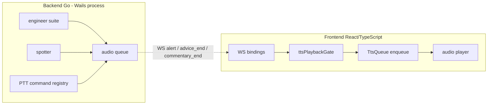

# Voice Contract — Vantare Ingeniero Go

> **Estado:** Especificación normativa (source of truth para tests y CI).
> **Última revisión:** 2026-06-27.
> **Adaptado de:** Vantare Ingeniero Python v0.7
> (`docs/voice-contract.md`).
>
> Si el código contradice este documento, el código está mal (salvo
> changelog explícito).

---

## 1. Pipeline (fronteras)



### Capas de decisión (orden fijo)

| # | Capa | Si falla → reason |
|---|------|-------------------|
| 1 | Mensaje vacío / texto interno | `empty_message`, `internal_radio_text` |
| 2 | Prioridad / categoría sin voz | `low_priority_or_no_voice_category` |
| 3 | Modo speak-only | `speak_only_blocks_proactive_engineer` |
| 4 | Toggles de servicio | `service_toggle_off` |
| 5 | Cola / cooldown / expiración | `queue_full`, `duplicate_cooldown`, `expired` |
| 6 | Modo radio PTT abierto | `ptt_listening_discard` |
| 7 | Grace period reconexión WS | `reconnect_grace` |
| 8 | Provider TTS | `tts_provider_error`, `tts_empty_blob`, `tts_timeout` |
| 9 | Frenada (braking zones mute) | `deferred_braking` (no bloqueo final) |

**Invariante I1:** Ningún bloqueo en capas 1-4 puede ser silencioso en modo
debug.

**Invariante I2:** `voice_response` y `advice` (PTT) **siempre** pasan capas
3 y 4, independientemente de `engineerEnabled`.

**Invariante I3:** `speakOnlyWhenSpokenTo` **nunca** bloquea categorías
spotter.

**Invariante I4:** Categorías `gaps`, `system`, `spotter_internals` **nunca**
generan TTS.

## 2. Configuración y defaults de release

| Campo | Default release | Alcance |
|-------|-----------------|---------|
| `speakOnlyWhenSpokenTo` | `true` | silencia ingeniero proactivo + `commentary_end`; no spotter |
| `engineerEnabled` | `false` | backend no emite triggers proactivos |
| `spotterEnabled` | `true` | spotter audible por defecto (después de cerrar prealpha) |
| `wakeWordEnabled` | `false` | sin escucha continua; solo PTT / gamepad |
| `brakingZonesMute` | `false` | si true, difiere IMMEDIATE/NORMAL en frenada |

**Invariante I5:** Cambiar un default requiere entrada en este doc + caso
en matriz §4 + test de migración.

## 3. Esquema de evento WS

### 3.1 `alert`

```json
{
  "event": "alert",
  "data": {
    "message": "string (required, non-empty for voice)",
    "category": "proximity | fuel | voice_response | pearl | engineer | gaps | ...",
    "severity": "INFO | WARNING | CRITICAL",
    "audio_priority": "1 | 2 | 3 | 4 | CRITICAL | HIGH",
    "service": "spotter | engineer (optional)",
    "fast_command": true,
    "expires_at": "optional ISO8601",
    "validation_key": "optional string"
  }
}
```

### 3.2 `advice_end` (PTT pregunta abierta)

```json
{
  "event": "advice_end",
  "data": { "full_text": "string" }
}
```

### 3.3 `commentary_end` (ingeniero proactivo batch — deshabilitado)

```json
{
  "event": "commentary_end",
  "data": { "full_text": "string" }
}
```

### 3.4 Emisiones backend prohibidas con defaults release

Con `engineerEnabled=false` **y** `speakOnlyWhenSpokenTo=true` **sin PTT**:

- `llm_pending`, `advice_start`, `advice_token`, `advice_end`,
  `commentary_end` → **no deben emitirse**.

## 4. Matriz de contrato (casos ejecutables)

Convención: `allowTts=true` significa que la puerta evalúa `allow: true` y
la cola aceptaría el mensaje (sin cola llena ni cooldown).

### 4.1 Alertas — config × categoría

| ID | speakOnly | spotter | engineer | category | priority | service | allowTts | reason si false |
|----|-----------|---------|----------|----------|----------|---------|----------|-----------------|
| VC-A01 | false | true | false | proximity | 2 | spotter | **true** | — |
| VC-A02 | false | false | false | proximity | 2 | spotter | **false** | service_toggle_off |
| VC-A03 | **true** | true | false | proximity | 2 | spotter | **true** | — (I3) |
| VC-A04 | **true** | true | false | engineer | CRITICAL | engineer | **false** | speak_only_blocks_proactive_engineer |
| VC-A05 | **true** | false | false | voice_response | 4 | engineer | **true** | — (I2) |
| VC-A06 | false | false | **true** | pearl | 2 | — | **true** | — |
| VC-A07 | false | false | false | pearl | 2 | — | **false** | service_toggle_off |
| VC-A08 | any | any | any | gaps | 1 | — | **false** | low_priority_or_no_voice_category |
| VC-A09 | any | any | any | system | CRITICAL | — | **false** | low_priority_or_no_voice_category |
| VC-A10 | any | true | any | proximity | 1 | — | **false** | low_priority_or_no_voice_category |
| VC-A11 | any | any | any | proximity | 2 | — | **false** (spotter off) | service_toggle_off |
| VC-A12 | any | any | any | "" | 4 | — | **false** | empty_message |
| VC-A13 | any | any | any | voice_response | 4 | — | **true** | — (I2, engineer off OK) |
| VC-A14 | false | true | false | fuel | 4 | — | **true** | — |
| VC-A15 | false | true | false | safety_car | 4 | — | **true** | — |
| VC-A16 | false | true | false | damage | 3 | — | **true** | — |
| VC-A17 | false | true | false | pit_limiter | 4 | — | **true** | — |
| VC-A18 | **true** | true | **true** | commentary | — | — | N/A alert | usar VC-C* |

### 4.2 Advice / PTT

| ID | speakOnly | engineer | event | full_text | allowTts | reason si false |
|----|-----------|----------|-------|-----------|----------|----------------|
| VC-P01 | true | false | advice_end | válido | **true** | — |
| VC-P02 | true | false | advice_end | "" | **false** | empty_message |
| VC-P03 | true | false | advice_end | texto internal radio* | **false** | internal_radio_text |
| VC-P04 | false | false | advice_end | "Respuesta válida" | **true** | — |
| VC-P05 | any | any | advice_end | válido + reconnect grace activo | **false** | reconnect_grace |
| VC-P06 | any | any | alert voice_response | "Afirmativo" | **true** | — |
| VC-P07 | any | any | alert voice_response | válido + mode LISTENING_PILOT | encola pero **no reproduce** | ptt_listening_discard |

\* Texto que cumple `isInternalRadioText()` — heurística Go equivalente a la
versión Python.

### 4.3 Commentary proactivo

| ID | speakOnly | engineer | event | allowTts | reason si false |
|----|-----------|----------|-------|----------|----------------|
| VC-C01 | false | true | commentary_end | **true** | — |
| VC-C02 | **true** | true | commentary_end | **false** | speak_only_blocks_commentary |
| VC-C03 | false | false | commentary_end | **false** | engineer_disabled |
| VC-C04 | **true** | false | commentary_end | **false** | engineer_disabled |

### 4.4 Cola TTS y runtime

| ID | Condición | allowEnqueue | Comportamiento esperado |
|----|-----------|--------------|-------------------------|
| VC-Q01 | Cola con 5 items NORMAL | IMMEDIATE alert | Desaloja 1 NORMAL, encola |
| VC-Q02 | Cola con 5 items, sin NORMAL | IMMEDIATE alert | Desaloja 1 IMMEDIATE o warn |
| VC-Q03 | Mismo texto < 45s cooldown | cualquiera | **false**, reason duplicate_cooldown |
| VC-Q04 | Texto ya en cola | cualquiera | **false**, reason duplicate_queued |
| VC-Q05 | `expires_at` pasado | cualquiera | Descartado en processTtsQueue |
| VC-Q06 | Cache hit + audioQueue idle | cualquiera | finishTtsItem vía onIdle |
| VC-Q07 | Cache hit + isTtsProcessing > 30s | cualquiera | Watchdog reset + log tts_stuck_processing |
| VC-Q08 | Provider TTS 500 | cualquiera | Log tts_provider_error; finishTtsItem |
| VC-Q09 | Provider TTS timeout 20s | cualquiera | Re-encolar item si abort no intencional |
| VC-Q10 | ENGINEER en curso + IMMEDIATE llega | — | No abort ENGINEER (I6) |
| VC-Q11 | IMMEDIATE en curso + ENGINEER llega | — | ENGINEER interrumpe (preemption) |

**Invariante I6:** IMMEDIATE **no** aborta síntesis ENGINEER en curso.

**Invariante I7:** ENGINEER **sí** puede interrumpir IMMEDIATE en curso.

### 4.5 Backend emisión (con config runtime)

| ID | engineer | speakOnly | Acción | ¿Emite WS? |
|----|----------|-----------|--------|------------|
| VC-B01 | false | true | Ciclo proactivo triggers | **No** alertas engineer/commentary |
| VC-B02 | false | true | PTT "¿fuel?" | **Sí** advice_end o voice_response |
| VC-B03 | true | true | Trigger fuel bajo | **No** (speak only backend) |
| VC-B04 | true | false | Trigger fuel bajo | **Sí** alert |
| VC-B05 | any | any | Spotter proximity | **Sí** alert (frontend filtra por toggle) |

### 4.6 Defaults release — smoke obligatorio

| ID | Escenario | Assert |
|----|-----------|--------|
| VC-R01 | Config release + WS 10s sin PTT | Sin `llm_pending`, `advice_*`, `commentary_end` |
| VC-R02 | Inject alert proximity + spotter ON | Cliente evalúa allowTts=true |
| VC-R03 | Mock PTT voice_response | fetch /tts llamado 1× |
| VC-R04 | Migración v1→v2 localStorage | speakOnly=true, wakeWord=false |

## 5. Categorías spotter (lista cerrada)

```go
var spotterVoiceCategories = map[string]bool{
    "proximity":     true,
    "pit_limiter":   true,
    "fuel":          true, // voz solo si engineerEnabled o fuel tier crítico
    "safety_car":    true,
    "damage":        true,
    "puncture":      true,
    "impact":        true,
}
```

Categoría `gaps` con `priority=1` por defecto no genera voz. Categoría
`limiter` legacy mapea a `pit_limiter` en tests.

## 6. Prioridad TTS

| Origen | Prioridad cola | Preemption |
|--------|----------------|------------|
| `voice_response`, `advice_end` | ENGINEER | Interrumpe IMMEDIATE/NORMAL |
| Spotter alert (priority ≥ 2) | IMMEDIATE | No interrumpe ENGINEER |
| `commentary_end`, pearls | NORMAL / clasificado | No interrumpe ENGINEER ni IMMEDIATE en curso |

## 7. Modo debug

Con `VANTARE_TTS_DEBUG=1` o toggle en Hub → pestaña Diagnóstico:

- Ring buffer últimos 50 eventos:
  `{ ts, source, allow, reason, category, config snapshot }`
- Export JSON para sesiones en pista
- Banner UI si `tts_provider_error` × 3 consecutivos

## 8. Edge cases documentados

### 8.1 Reconexión WebSocket

Tras `onopen`, grace de 10s (`TTS_RECONNECT_GRACE_MS`) bloquea
advice/commentary TTS (evita replay). No debe bloquear `voice_response`
PTT intencional post-reconnect si el piloto pulsa PTT **después** del
grace.

### 8.2 PTT durante LISTENING_PILOT

TTS puede encolarse pero `shouldDiscardTtsPlayback(LISTENING_PILOT)`
descarta reproducción hasta soltar PTT.

### 8.3 Texto con em-dash / caracteres especiales

Provider TTS no debe fallar por headers; sanitizar entrada.

### 8.4 Config race

`config_ack` puede llegar después de alertas; gates leen estado en
momento del evento (comportamiento actual — documentado, no bug).

### 8.5 Spotter OFF en qualifying

Backend puede emitir; frontend bloquea con `service_toggle_off` si spotter
disabled — coherente.

### 8.6 Perlas (`pearl`)

`audio_priority >= 2` → voz; requiere `engineerEnabled=true` en
frontend.

### 8.7 Multiclase / session / last_lap

Categoría `session` no está en `spotterVoiceCategories` → requiere
`engineerEnabled` para voz.

### 8.8 Offline / LMU cerrado

Smoke acepta 0 binary frames; contrato TTS sigue aplicando a eventos
inyectados en tests.

## 9. Mapeo tests ↔ casos

| Caso | Test file (objetivo) |
|------|----------------------|
| VC-A01–A18 | `internal/audio/voice_contract_test.go` |
| VC-P01–P07 | `internal/audio/voice_contract_ptt_test.go` |
| VC-C01–C04 | `internal/audio/voice_contract_test.go` |
| VC-Q01–Q11 | `internal/audio/queue_contract_test.go` |
| VC-B01–B05 | `internal/audio/backend_emission_test.go` |
| VC-R01–R04 | `scripts/release_smoke.go` + `frontend/__tests__/configMigration.voice.test.ts` |
| SPOTTER_AUDIO_ROWS | `internal/audio/fixtures/audio_trigger_matrix.go` |

## 10. PTT Engineer Facts-Only Contract

> Esta sección es la **regla 1** del plan maestro. Es no negociable.

- PTT engineer query handlers devuelven diccionarios `facts` deterministas
  por cada respuesta numérica.
- La LLM puede elegir tools y resumir intenciones mixtas action/query,
  pero **no debe introducir números ausentes de `facts`**.
- Si faltan campos de telemetría o estrategia, la respuesta es una frase
  corta "no tengo ese dato".
- Los query handlers **no** deben llamar a CrewChiefV4, overlays de
  telemetría externos, servicios Go/Suite, ni a un segundo proceso backend.

Implementación en Go: cada tool en
`internal/engineer/commands/` devuelve `ToolResult{Facts map[string]any,
Spoken string}`. La capa LLM (en beta, no prealpha) recibe `Facts` y debe
producir `Spoken` sin desviarse.

## 11. Runtime Service Toggles

- `spotterEnabled` controla proximity calls; independiente de engineer
  proactivo.
- `engineerEnabled` controla eventos proactivos del ingeniero:
  flags, penalties, fuel, tyres, weather, damage, timing calls.
- PTT voice responses siguen disponibles como interacción directa con el
  piloto aunque el ingeniero proactivo esté desactivado.
- QA in-game de flags/penalties debe hacerse con `engineerEnabled=true`.

## 12. Changelog

| Fecha | Cambio |
|-------|--------|
| 2026-06-27 | Creación inicial adaptado de Python v0.7 a runtime Go/Wails |
