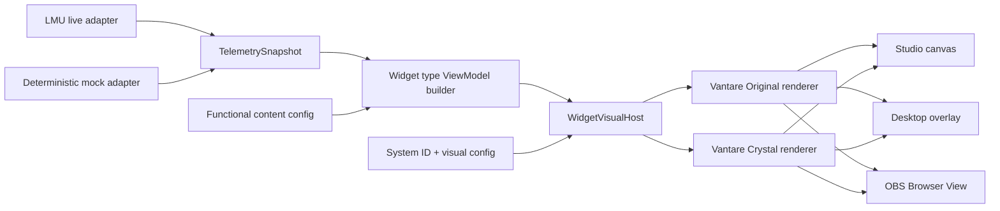

# Overlay Studio V3 Rebuild Master Implementation Plan

> **For agentic workers:** REQUIRED SUB-SKILL: Use superpowers:subagent-driven-development (recommended) or superpowers:executing-plans to implement this plan task-by-task. Steps use checkbox (`- [ ]`) syntax for tracking.

**Goal:** Rebuild Overlay Studio as a single production editor whose four core widgets (Delta, Standings, Relative and Pedals) render through the same versioned Original/Crystal pipeline in Studio, Desktop and OBS.

**Architecture:** Build a new Overlay Studio V3 subsystem beside the frozen legacy implementation, then switch production consumers only after contract, migration, parity and visual gates pass. A versioned profile document separates layout, behavior, functional content and visual configuration; pure widget ViewModels feed a shared `WidgetVisualHost`, while Studio adds only editing chrome around that host.

**Tech Stack:** React 19, TypeScript 6, Tailwind CSS 4, Vitest + Testing Library, Playwright library scripts, Wails v3 events, Go, JSON profile files.

---

## 1. Authority and scope

This plan suite is the implementation authority for Overlay Studio V3. It supersedes, for this rebuild only:

- the WidgetStudio/LayoutStudio responsibility rule in `vantare-v2/AGENTS.md`;
- `docs/superpowers/plans/2026-07-10-layout-studio-subnav-redesign.md`;
- plans that assume WidgetStudio still exists;
- documentation that treats `vantare-racing`, `broadcast-pro`, `endurance` and `vantare-crystal` as equivalent kinds of style.

Do not use the `vantare-core` skill as a source of truth. The user has explicitly declared it outdated.

The rebuild is complete when these four widgets work end to end:

1. Delta.
2. Standings.
3. Relative.
4. Pedals.

Additional widgets and multi-selection belong to the later expansion phase and must not enter this plan.

## 2. Locked product decisions

- Overlay Studio is one editor. WidgetStudio remains deleted.
- Entering Overlay Studio opens the active real profile directly. No production synthetic profile exists.
- If there is no active profile, show a guided create/select/recommended state.
- A dirty profile change, route change or window close offers Save, Discard and Cancel.
- Saving is explicit through the button or `Ctrl+S`; there is no profile autosave.
- Undo is `Ctrl+Z`; redo is `Ctrl+Shift+Z` on Windows.
- One global draft owns all edits. Inspector sections never keep independently saveable widget drafts.
- Reset section restores that section from the saved snapshot. Discard all restores the entire saved snapshot. Restore defaults is a separate command.
- Session layouts are `general`, `practice`, `qualifying`, `race` and `endurance`.
- A missing session layout starts as a copy of `general` and materializes only when changed or saved.
- Existing session documents do not inherit later changes from `general`.
- The canvas is logically 1920x1080.
- Backgrounds, grid, safe area, zoom, mock scenario and Mock/Live mode are editor-only and never dirty the profile.
- V3 ships Fit/percentage/buttons for zoom; wheel zoom and canvas pan are documented expansion behavior, not partially implemented.
- Placement is drag/resize only; the inspector has no numeric X/Y/W/H controls.
- Aspect ratio is locked by default and may be explicitly unlocked only when the widget capability allows it.
- One widget may remain partially outside the canvas, but at least 32x32 logical pixels must remain recoverable.
- Z-order is persisted and has front/back/raise/lower commands.
- Selection is single-widget in V3. Commands accept ID arrays internally so expansion can add multi-selection without replacing command contracts.
- Empty profiles are valid and save successfully.
- Browser View opens the real saved runtime; dirty drafts require Save or Cancel first.
- Mock and Live produce the same ViewModel. Losing LMU in Live shows a disconnected state and never silently selects Mock.
- Initial mock dimensions are Practice/Qualifying/Race plus Track/Pits; rain, safety car, damage, traffic and flags are documented expansion scenarios.
- The inspector has dynamic non-empty sections: Design, Appearance, Content, Behavior, Layout and Actions.
- Update frequency has safe presets plus an Advanced numeric input.
- Conditional visibility is shown only after the runtime consumes it.
- The catalog exposes only Delta, Standings, Relative and Pedals during V3.
- Free users may preview premium widgets/designs, but cannot add, apply, duplicate or save premium changes.
- A previously saved premium widget continues rendering after entitlement loss and is never deleted automatically.
- Saving while an overlay runs refreshes that overlay after the backend confirms a successful atomic save.
- Overlay Studio is the only editing surface. The former Desktop in-place edit hotkey opens/focuses Studio for the active profile; Desktop and OBS contain no independent drag/resize/save path.
- The work area follows `layout-studio-v10.html` at approximately 95% visual fidelity while retaining the real Vantare shell/topbar.
- Wide layout uses three panels; medium collapses the inspector; small uses drawers.
- UI copy ships in Spanish, English, Portuguese and Italian. Technical IDs remain untranslated.
- Unexpected-close recovery is a local temporary draft, not profile autosave and not visible to OBS.
- Legacy widget types outside the four-core scope are preserved semantically in `preservedWidgets`, shown as unavailable/read-only and never deleted by a V3 save. They are not rendered or editable until expansion migrates them.

## 3. Locked visual-system model

There are exactly two design systems in V3:

- `vantare-original`: the original Vantare visual language.
- `vantare-crystal`: the glassmorphism visual language.

A widget keeps its functional identity while its visual system may replace its complete DOM composition, shape, typography, spacing, material and animation. Visual systems are not token themes.

Official and user designs are templates layered on a compatible system:

```ts
export type WidgetDesignTemplate = {
  id: string;
  name: string;
  widgetType: CoreWidgetType;
  systemId: DesignSystemId;
  systemVersion: number;
  configVersion: number;
  visual: Record<string, unknown>;
  content?: Record<string, unknown>;
  includesContent: boolean;
  origin: "vantare" | "user";
  requiredFeature?: "overlays.basic" | "overlays.advanced";
  createdAt?: string;
  updatedAt?: string;
};
```

Applying a design copies its resolved visual values into `visual.baseSettings`, clears `visual.appearanceOverrides` and records optional provenance. Appearance controls own only the overrides. This makes Design and Appearance independently resettable. Application never creates a live reference and never changes widget ID, layout, behavior, session or z-order.

“Apply to all” affects compatible instances in the active session layout only. Cross-session application belongs to expansion so independent session documents remain predictable.

Legacy `glassmorphism-pro` migrates to `vantare-crystal`. Legacy `broadcast-pro`, `endurance` and `time-attack` migrate as named designs/configurations based on Original or Crystal, not as systems.

## 4. Target data flow



Rules enforced by tests:

- Renderers receive a ViewModel and visual settings; they do not read Wails, SSE, profile persistence, permissions, position or telemetry refs.
- `WidgetVisualHost` is the only system-selection point.
- Studio, Desktop and OBS use the same host and system renderers.
- Studio-only chrome never enters the runtime component tree.
- Unknown systems, unsupported widget/system pairs and invalid versions produce explicit diagnostics; no silent fallback is allowed.
- System manifests declare pure sequential migrations for every supported prior system/config version; missing migration steps are explicit errors covered by contract tests.

## 5. Target file map

New frontend production areas:

| Path | Responsibility |
|---|---|
| `vantare-v2/frontend/src/overlay/core/` | V3 document types, validation, registries, shared host and telemetry contracts |
| `vantare-v2/frontend/src/overlay/widget-types/` | Functional defaults, capabilities and pure ViewModel builders per widget type |
| `vantare-v2/frontend/src/overlay/design-systems/vantare-original/` | Original manifests, renderers, scoped styles and assets |
| `vantare-v2/frontend/src/overlay/design-systems/vantare-crystal/` | Crystal manifests, renderers, scoped styles and assets |
| `vantare-v2/frontend/src/overlay/design-systems/_template/` | Documented starter for future HTML-to-system ports |
| `vantare-v2/frontend/src/hub/overlay-studio/` | V3 editor shell, state, commands, canvas, inspector and catalog |
| `vantare-v2/frontend/src/overlay-harness/` | Deterministic parity and visual regression surface |

New or focused Go areas:

| Path | Responsibility |
|---|---|
| `vantare-v2/pkg/config/profile_v3.go` | Canonical V3 persisted structs |
| `vantare-v2/pkg/config/profile_v3_validate.go` | Structural and semantic validation |
| `vantare-v2/pkg/config/profile_v3_migrate.go` | Pure v0/v2 to v3 migration |
| `vantare-v2/internal/app/studio_profile_service.go` | Revision-aware atomic load/save API |
| `vantare-v2/internal/app/widget_design_service.go` | Versioned user design library |

Legacy folders stay frozen until the final retirement phase:

- `vantare-v2/frontend/src/hub/overlays/`;
- `vantare-v2/frontend/src/hub/preview/`;
- legacy renderers in `vantare-v2/frontend/src/overlay/widgets/`;
- `vantare-v2/frontend/src/lib/widget-variants.ts` and preset helpers.

Fixes required to keep a phase compiling may touch legacy integration seams, but no new V3 behavior may be implemented inside those folders.

## 6. Phase index and hard gates

Execute strictly in order. A phase may begin only when the previous review gate is green.

For 5.6 Luna, use the mandatory [Luna microcut execution index](./2026-07-10-overlay-studio-rebuild-luna-execution-index.md). It overrides broad parent commit boundaries but not their contracts or tests.

- [ ] **Phase 0 — Authority, baseline and characterization:** [00-baseline-and-contract-lock.md](./2026-07-10-overlay-studio-rebuild-00-baseline-and-contract-lock.md)
- [ ] **Phase 1 — V3 profile, migration and persistence:** [01-profile-v3-persistence.md](./2026-07-10-overlay-studio-rebuild-01-profile-v3-persistence.md)
- [ ] **Phase 2 — Widget platform, shared preview and Delta slice:** [02-widget-platform-delta.md](./2026-07-10-overlay-studio-rebuild-02-widget-platform-delta.md)
- [ ] **Phase 3 — Global draft, commands, history and sessions:** [03-editor-state-and-commands.md](./2026-07-10-overlay-studio-rebuild-03-editor-state-and-commands.md)
- [ ] **Phase 4 — V10 shell and canvas interaction:** [04-shell-and-canvas.md](./2026-07-10-overlay-studio-rebuild-04-shell-and-canvas.md)
- [ ] **Phase 5 — Inspector, catalog, designs and access:** [05-inspector-catalog-designs.md](./2026-07-10-overlay-studio-rebuild-05-inspector-catalog-designs.md)
- [ ] **Phase 6 — Standings, Relative and Pedals:** [06-core-widget-migration.md](./2026-07-10-overlay-studio-rebuild-06-core-widget-migration.md)
- [ ] **Phase 7 — Production integration and controlled cutover:** [07-production-cutover.md](./2026-07-10-overlay-studio-rebuild-07-production-cutover.md)
- [ ] **Phase 8 — Quality, authoring kit and legacy retirement:** [08-quality-authoring-retirement.md](./2026-07-10-overlay-studio-rebuild-08-quality-authoring-retirement.md)

## 6.1 Requirement traceability

| Requirement cluster | Owning tasks | Final evidence |
|---|---|---|
| Authority, rejected prototype and legacy baseline | 0.1–0.5 | ADR, baseline and consumer inventory |
| Profile V3, validation, empty layouts and conflict-safe atomic save | 1.1–1.6 | Go/TS golden contracts and storage tests |
| Legacy aliases, backups and unsupported-widget preservation | 0.3, 1.3–1.5 | migration golden, `.pre-v3.bak` and `preservedWidgets` round trip |
| User designs as copied/versioned templates | 1.7, 5.7 | copy-semantics, design service and provenance tests |
| Original/Crystal as complete extensible systems | 2.4–2.7, 6.3, 6.5, 6.7, 8.5 | registry contract, eight renderers, authoring kit |
| Pure ViewModels and one shared preview/runtime host | 2.1–2.7, 6.1–6.9, 7.3 | import-boundary, parity and visual tests |
| One global draft, explicit save, undo/redo and exact resets | 3.2–3.5, 5.3–5.4 | command/history/store/inspector tests |
| Dirty navigation and crash recovery | 3.6–3.7, 4.7 | recovery, Save/Discard/Cancel and beforeunload tests |
| Independent session layouts and copy-from workflow | 3.1–3.2, 7.3 | session resolver, command and runtime tests |
| V10 shell, direct active profile and no-profile guidance | 4.1, 7.9 | shell/route tests and wide visual snapshot |
| 1920x1080 canvas, zoom, backgrounds, safe area and responsive modes | 4.2–4.8 | geometry, interaction and browser viewport matrix |
| Single selection, drag/resize, layers and shared actions | 3.2, 4.2–4.5 | transactional command and pointer tests |
| Dynamic inspector with real consumers only | 5.1–5.4, 6.2–6.8 | capability/control consumer contracts |
| Catalog contains only four real core widgets | 5.6, 6.8 | derived catalog completeness test |
| Vantare/User segmentation and active-layout apply-to-all | 5.7 | design section and one-history-step tests |
| Premium preview with mutation/save enforcement | 5.5–5.7 | exhaustive access matrix and direct-dispatch bypass tests |
| Browser View uses saved state | 5.8, 7.4, 7.7 | orchestration and OBS endpoint tests |
| Mock/Live parity and disconnection states | 2.2–2.3, 4.6, 7.2 | deterministic snapshot and adapter lifecycle tests |
| Conditional visibility and rate-limited updateHz | 5.4, 7.2–7.3, 7.9, 8.3 | predicate and shared rate-bucket tests |
| Delta, Standings, Relative and Pedals complete | 2.3–2.7, 6.1–6.9 | content/ViewModel/render/inspector/visual matrix |
| Desktop/OBS cutover and refresh after successful save | 7.1–7.10 | Go lifecycle, runtime integration and manual smoke |
| Four languages, accessibility and performance | 8.1–8.4 | key parity, keyboard/browser and performance contracts |
| Legacy retirement and final architecture audit | 8.6–8.8 | zero-consumer audit and decision-to-evidence matrix |

## 7. Execution protocol for a small-context model

For every task:

1. Read only this master plan, the current phase file and the files listed by that task.
2. Run `git status --short` from `C:\Users\isaac\emdash\worktrees\vantare-v2\refactor`.
3. Stop if unrelated changes overlap any listed file.
4. Copy the task checklist into the working response and execute one checkbox at a time.
5. Write the failing test first and run the exact focused command.
6. Confirm the failure reason matches the expected missing behavior.
7. Implement only the code shown or described by the task contract.
8. Run the focused green command.
9. Run `git diff --check` and inspect `git diff -- <allowed files>`.
10. Commit only the task files with the prescribed message.
11. Report files, commands, results, unexecuted checks and manual verification in Spanish.
12. Clear conversational context before starting the next task if the model is near its context limit; the checked plan is the state carrier.

Never combine two tasks into one commit. Never advance after an unexplained failing test. Never repair unrelated failures in the same commit.

## 8. Per-task TDD and review gate

Every behavior-changing task follows this sequence:

```text
RED -> verify expected failure -> minimal GREEN -> focused refactor -> focused tests
-> type/build check when applicable -> diff review -> commit
```

At the end of every phase, run a separate review turn with this fixed brief:

```text
Review only the commits belonging to Overlay Studio V3 Phase N.
Check correctness, contract drift, migration safety, Studio/Desktop/OBS parity,
access bypasses, undo granularity, stale local state, performance and test quality.
Classify findings P0-P3 with exact files and lines. Do not edit code.
```

Then:

- [ ] Fix all P0/P1 findings in separate TDD commits.
- [ ] Fix P2 findings or record an explicit accepted-risk entry in the phase document.
- [ ] Rerun the phase matrix.
- [ ] Mark the phase gate green in this master file.
- [ ] Update `vantare-v2/docs/current-plan.md` with commits and evidence.

## 9. Global verification matrix

Focused commands appear in each task. These are the mandatory phase/full gates.

From the monorepo root:

```powershell
pnpm --dir vantare-v2/frontend test
pnpm --dir vantare-v2/frontend build
pnpm --dir vantare-v2/frontend lint
git diff --check
```

From `vantare-v2`:

```powershell
go test ./pkg/config/... ./internal/app/... ./internal/server/... ./internal/window/...
go test ./...
```

Visual harness once Phase 2 creates it:

```powershell
pnpm --dir vantare-v2/frontend visual:overlay-studio
```

Expected results: all commands exit 0. If lint exposes a pre-existing failure, record its exact output and prove that no modified file introduces a new lint error; do not weaken lint rules.

## 10. Cross-surface acceptance matrix

Each of the four widgets must pass every cell for Original and Crystal:

| Concern | Studio Mock | Studio Live | Desktop | OBS |
|---|---:|---:|---:|---:|
| Same ViewModel fields | required | required | required | required |
| Same renderer component | required | required | required | required |
| No editor chrome | n/a | n/a | required | required |
| Missing/stale/disconnected/error states | required | required | required | required |
| Conditional visibility | required | required | required | required |
| Layout and z-order | required | required | required | required |
| Profile v3 migration fixture | required | required | required | required |
| Visual snapshot | required | required | required | required |

## 11. Definition of done

Overlay Studio V3 is complete only when:

- [ ] Delta, Standings, Relative and Pedals support `vantare-original` and `vantare-crystal` with explicit compatibility manifests.
- [ ] Studio, Desktop and OBS use the same `WidgetVisualHost` and pure renderers.
- [ ] No core renderer subscribes to Wails/SSE or reads persistence directly.
- [ ] V0/V2 profiles migrate deterministically to V3 with backup and rollback tests.
- [ ] Unsupported legacy widget payloads survive migration and save in `preservedWidgets` without entering the V3 catalog/runtime.
- [ ] Empty profiles save.
- [ ] Session layouts, explicit Save, dirty guards, recovery, undo/redo and section reset pass tests.
- [ ] Mock/Live, disconnected and stale states pass tests.
- [ ] Canvas drag, resize, z-order, partial bounds, zoom, safe area and keyboard commands pass browser geometry checks.
- [ ] Inspector exposes no control without a real consumer.
- [ ] Free/premium gates cannot be bypassed through catalog, design, duplicate, apply-to-all or save paths.
- [ ] Browser View displays the saved runtime, not the unsaved draft.
- [ ] Spanish, English, Portuguese and Italian copy is complete.
- [ ] Wide, medium and small responsive modes pass manual and automated checks.
- [ ] The HTML porting template and Original/Crystal authoring guide are usable without reading legacy widgets.
- [ ] Legacy catalogs, duplicate widget maps, obsolete variants/presets and dead WidgetStudio artifacts have no consumers and are removed.
- [ ] Full frontend and Go gates pass.
- [ ] Final architecture review has no open P0/P1 findings.

## 12. Explicit expansion backlog

Do not implement these during V3:

- multi-widget selection and marquee selection;
- groups;
- alignment/distribution across multiple widgets;
- copy/paste across profiles;
- persistent history after closing Studio;
- arbitrary canvas resolutions;
- wheel zoom and canvas pan;
- rain, safety car, damage, traffic and flag mock scenarios;
- community marketplace authoring;
- no-code visual-system creation;
- additional widget types.

The V3 command API accepts `widgetIds: readonly string[]`, system manifests are open-ended and the document is versioned specifically so expansion can add these without another platform rewrite.
