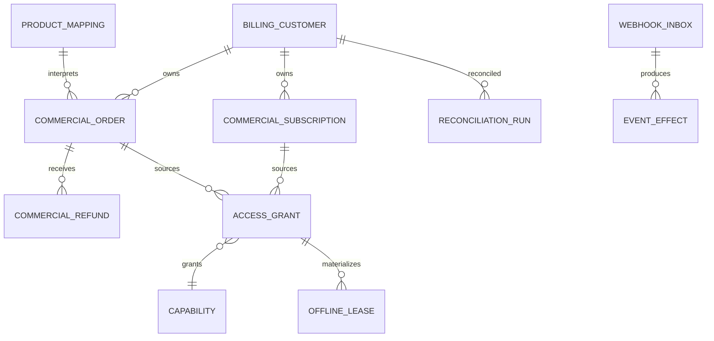
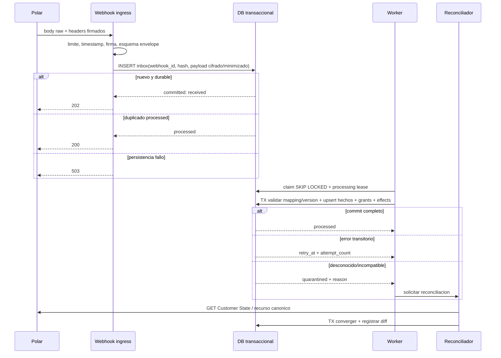
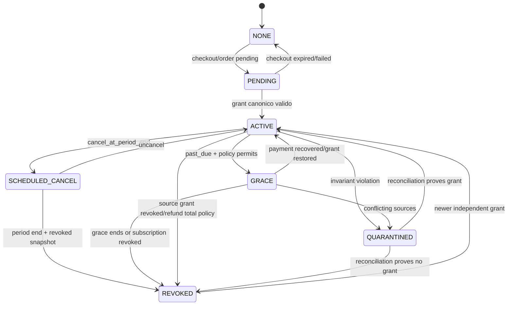

# ISA-7 — Arquitectura objetivo de billing con Polar

> **Estado:** propuesta documental; no implementada ni aprobada.
>
> **Gate:** el NO-GO para venta publica permanece vigente.
>
> **Alcance:** Polar, backend de billing, proyeccion local, API de licencia y cliente offline. Stripe se menciona solo como legado inerte y queda fuera de esta decision.

## 1. Metodo y lenguaje de certeza

Este documento usa tres etiquetas:

- **Hecho verificado:** comportamiento documentado por Polar/Standard Webhooks o presente en el commit local `2e542e5`.
- **Inferencia:** consecuencia tecnica derivada de esos hechos, con incertidumbre explicita.
- **Propuesta:** arquitectura objetivo todavia sujeta a aprobacion e implementacion posterior.

Las fuentes oficiales se consultaron el 2026-07-14. Una unica fuente primaria se marca con confianza media; cuando codigo y documentacion local corroboran un contrato, la confianza del estado local es alta. No se accedio al dashboard, API autenticada, datos productivos ni valores de secretos.

## 2. Decision propuesta en una frase

**Propuesta:** Polar es la autoridad comercial; Vantare conserva una proyeccion local durable, reconciliable y auditable que transforma productos, orders, subscriptions, refunds y grants de Polar en grants de capacidad propios. La autorizacion final y la politica de dispositivo/offline pertenecen a Vantare, no a Polar.

Esto evita dos extremos inseguros: autorizar directamente por el ultimo webhook recibido o duplicar en Vantare toda la contabilidad del Merchant of Record.

## 3. Autoridades y limites

| Dominio | Autoridad canonica | Copia local permitida | No debe decidir |
|---|---|---|---|
| Producto comercial, precio, moneda, impuesto | Polar | IDs, SKU, tipo, version de mapping | Capabilities de la app sin mapping aprobado |
| Pago y order | Polar | Estado, importes minimos, IDs, razon de billing | Device binding o cache offline |
| Subscription y periodo | Polar | Snapshot/version y estado proyectado | Acceso lifetime de otra order |
| Refund/dispute | Polar | Ledger y resultado reconciliado | Revocacion global por nombre de evento |
| Benefit/grant | Polar para beneficios Polar | Grant externo y su fuente | Agregacion entre multiples fuentes propias |
| Identidad de app | Supabase Auth hoy / proveedor de identidad futuro | UUID estable como `external_customer_id` | Email como clave de autorizacion |
| Capability `bundle` y futuras capacidades | Vantare | Catalogo versionado | Polar metadata no allowlisted |
| Dispositivo y offline | Vantare | Lease firmada y device registration | Polar |
| Auditoria tecnica | Vantare | Eventos, efectos, reconciliaciones, operador | Datos completos de tarjeta o payload indefinido |

Polar se presenta como Merchant of Record y asume cobro e impuestos de venta; Vantare sigue siendo responsable de su impuesto sobre ingresos y de la autorizacion dentro de la app. [Polar Merchant of Record](https://polar.sh/docs/merchant-of-record/introduction) (acceso 2026-07-14, confianza media).

## 4. Catalogo comercial real conocido

El repositorio define exactamente dos claves de checkout y un estado Free interno:

| SKU Vantare | Producto planeado | Tipo | Precio documentado | Capability | Evidencia y certeza |
|---|---|---|---|---|---|
| `launch_lifetime` | Vantare Launch Edition | one-time | 30 EUR | `bundle` sin expiracion comercial | Plan local; existencia de mapping de produccion documentada, pero precio/dashboard no reinspeccionado |
| `pro_monthly` | Vantare Pro Monthly | subscription mensual | 4,99 EUR/mes | `bundle` mientras exista grant valido | Plan local; checkout de produccion creado sin pago, precio/dashboard no reinspeccionado |
| `free` | Sin producto Polar | interno | 0 | capacidades Free | Decision local; no debe crearse order Polar |

Fuentes locales: `configs/polar-product-mapping.example.json`, `docs/superpowers/plans/2026-07-09-fase-2-polar-integration.md:22-26,118-123` y `docs/current-plan.md:62-81`. Por seguridad, este documento no replica IDs reales, emails smoke ni rutas temporales.

**Gap verificado:** sin lectura autenticada del dashboard no puede afirmarse que nombres, precios, tax behavior, beneficios, visibilidad o estado archivado actuales coincidan con el plan. Esta comprobacion es un gate humano/read-only posterior, no una invitacion a mutar el catalogo.

Polar modela one-time y recurring como productos; ciclo y tipo de pricing quedan fijados al crear el producto, los cambios de precio fijo solo afectan nuevas compras y los productos archivados dejan de venderse pero conservan acceso/renovacion de clientes existentes. [Polar Products](https://polar.sh/docs/features/products) (acceso 2026-07-14, confianza media). Por ello el mapping local debe identificar tambien la version comercial y no asumir que un mismo product ID representa para siempre el mismo precio.

## 5. Modelo objetivo de datos



**Propuesta:** separar hechos comerciales de autorizacion agregada.

- `commercial_orders`: una fila por order Polar, estado e importes necesarios, `billing_reason`, producto/precio y `modified_at` remoto.
- `commercial_subscriptions`: una fila por subscription, estado, periodo, cancelacion y version remota.
- `commercial_refunds`: una fila por refund, estado asincrono, importes, order y `revoke_benefits`.
- `access_grants`: una fila por fuente autorizativa (`order`, `subscription`, `benefit_grant`, soporte manual), capability y vigencia.
- `account_capabilities`: vista/materializacion agregada. Una fuente revocada no elimina otras fuentes validas.
- `webhook_inbox` y `event_effects`: recepcion durable e idempotencia por efecto.
- `reconciliation_runs`: resultado de comparar proyeccion con Customer State/API.

La tabla actual `user_entitlements UNIQUE(user_id, product_key)` no representa multiples fuentes para `bundle`; por eso un refund lifetime puede colisionar con una mensualidad valida. Este es un hecho del esquema local (`20260709120000_provider_agnostic_billing.sql:43-53`) y justifica separar grants antes de corregir refunds.

## 6. Contratos entre componentes

### 6.1 Cliente -> billing-checkout

Entrada minima: JWT, `checkout_key` allowlisted e `attempt_id` opaco creado por Vantare. El backend obtiene `user_id` del JWT, nunca del body. Respuesta: URL HTTPS, checkout ID, estado `open` y expiracion; nunca token Polar ni datos de otro customer.

El checkout objetivo reutiliza un intento `open` para `(user_id, checkout_key, attempt_id)`. No se encontro idempotency key documentada por Polar para crear sesiones; la deduplicacion debe ser local. `external_customer_id` reconcilia customer, no solicitudes. [Polar Checkout Session](https://polar.sh/docs/features/checkout/session) (acceso 2026-07-14, confianza media).

`confirmed` solo significa que el usuario pulso pagar; `succeeded` significa pago exitoso. Ningun redirect o `confirmed` concede acceso. [Polar Checkout API](https://polar.sh/docs/api-reference/checkouts/get-session) (acceso 2026-07-14, confianza media).

### 6.2 Polar -> webhook ingress

Entrada: body crudo, `webhook-id`, `webhook-timestamp`, `webhook-signature`. Salida:

- `2xx` cuando el evento quedo persistido durablemente o ya esta completamente procesado.
- `4xx` para firma/esquema invalido no reintentable.
- `5xx` solo cuando no fue posible persistir de forma durable.

Polar reintenta hasta diez veces con backoff, corta cada intento a los diez segundos, recomienda responder antes de dos segundos y deshabilita el endpoint tras diez entregas consecutivas no-2xx. Permite redelivery manual. [Polar Webhook Delivery](https://polar.sh/docs/integrate/webhooks/delivery) (acceso 2026-07-14, confianza media).

Standard Webhooks firma `message_id.timestamp.payload`; el ID permanece estable entre retries y el timestamp de entrega cambia. La especificacion exige verificar una tolerancia temporal y recomienda el ID como clave idempotente. [Standard Webhooks Specification](https://github.com/standard-webhooks/standard-webhooks/blob/main/spec/standard-webhooks.md) (acceso 2026-07-14, confianza media).

### 6.3 Backend -> Polar API

Solo servidor con Organization Access Token y scopes minimos. Operaciones objetivo read-only ordinarias: Customer State por external ID y lecturas puntuales de order/subscription/refund. Customer Session es la unica creacion rutinaria del portal; su URL/token es credencial efimera y no se registra.

### 6.4 Backend -> licencia local

Respuesta provider-neutral:

```json
{
  "account_id": "uuid",
  "state": "active|grace|free|blocked",
  "capabilities": ["bundle"],
  "lease_issued_at": "RFC3339",
  "lease_expires_at": "RFC3339",
  "device_binding": "opaque-hash",
  "policy_version": 1,
  "signature": "detached-signature"
}
```

No incluye customer email, billing address, order amounts ni IDs Polar: el cliente no los necesita para autorizar capacidades.

## 7. Pipeline durable de eventos



### 7.1 Claim, commit y fallo parcial

**Propuesta:** el ingress solo autentica y persiste. El worker obtiene un lease de procesamiento; todos los hechos comerciales, grants, efectos y cambio a `processed` se confirman en una unica transaccion. Si la transaccion falla, el evento no queda procesado. El diseño actual hace claim antes de los efectos (`billing-webhook/process.ts:193-209,542-568`) y no cumple esta invariante.

### 7.2 Retry y quarantine

- Errores transitorios: backoff acotado con jitter y `next_attempt_at`.
- Mapping desconocido, identidad no resuelta, schema incompatible o regresion imposible: `quarantined`, nunca `ignored` terminal.
- Un operador puede reintentar por ID despues de corregir la causa; la herramienta muestra metadata minima y diff, no secretos/payload completo.
- Limite de intentos humano-configurable. Agotar retries no borra ni marca procesado: crea alerta y mantiene evidencia.
- Poison messages no bloquean otros customers; serializacion por `customer_id`/resource ID evita carreras dentro del mismo agregado.

### 7.3 Idempotencia dual

| Nivel | Clave | Resultado |
|---|---|---|
| Evento | `provider + webhook_id` | Un envelope logico se recibe una vez, aunque tenga multiples deliveries |
| Body | hash del raw body verificado | Detecta mismo ID con cuerpo distinto; quarantine de seguridad |
| Recurso | `provider + resource_type + resource_id + modified_at/version` | Upsert monotono |
| Efecto | `event_id + effect_type + target_id + policy_version` | Email, grant, audit o refresh no se repite |
| Reconciliacion | `customer_id + remote_snapshot_version/hash` | Mismo snapshot no genera cambios |
| Checkout | `user_id + attempt_id` | Retry/doble clic reutiliza sesion abierta |

## 8. Orden, eventos antiguos e incompatibilidad

La documentacion de Polar describe secuencias, pero no promete orden global ni exactly-once. Retries y redelivery manual justifican diseñar para eventos duplicados y antiguos. [Polar Webhook Events](https://polar.sh/docs/integrate/webhooks/events) y [Polar Webhook Delivery](https://polar.sh/docs/integrate/webhooks/delivery) (acceso 2026-07-14, confianza media).

Reglas propuestas:

1. `data.modified_at` ordena snapshots del mismo recurso; `event.timestamp` desempata, nunca sustituye la version del recurso.
2. Un snapshot anterior se registra como `stale_noop`; no cambia estado.
3. Estados terminales no se reabren por evento anterior. Una reactivacion solo se acepta con snapshot mas nuevo y transicion Polar valida.
4. Eventos especificos y `subscription.updated` pueden representar el mismo snapshot; los efectos dependen de la version de recurso, no del nombre del evento.
5. ID/cuerpo incompatible, moneda/organizacion inesperada o mapping desconocido se pone en quarantine y dispara reconciliacion.
6. Nunca se inventa producto/capability desde metadata no allowlisted.

## 9. Tabla objetivo de eventos

| Evento | Hecho comercial que actualiza | Efecto autorizativo | Reconciliar |
|---|---|---|---|
| `checkout.created/updated/expired` | Intento y estado | Ninguno | Solo si estado imposible |
| `order.created` | Order pending + `billing_reason` | Ninguno | No por defecto |
| `order.updated` | Snapshot order | Solo si confirma cambio ya interpretable | Si refund/estado ambiguo |
| `order.paid` | Order paid | Crear/activar grant one-time si mapping y order validos | Si falta customer/product |
| `order.refunded` | Importes y estado partial/full | No por nombre; recalcular grants de esa order | Siempre para lifetime |
| `refund.created/updated` | Ledger refund asincrono | Solo cuando resultado y politica lo autorizan | En terminal/contradiccion |
| `subscription.created` | Subscription posiblemente incomplete | Ninguno por defecto | Si no llega active/pagada |
| `subscription.active` | Active/trialing recuperado | Activar grant de subscription | Opcional por snapshot |
| `subscription.updated` | Snapshot/version/periodo | Recalcular solo con transicion valida | En cambios sensibles |
| `subscription.canceled` | Cancel programada o terminada segun snapshot | Mantener hasta fin si sigue activa | Si flags contradictorios |
| `subscription.uncanceled` | Cancela la cancelacion programada | Restaurar continuidad, no duplicar grant | Si faltaba estado previo |
| `subscription.past_due` | Dunning recuperable | Aplicar politica de grace, no periodo nuevo automatico | Si grants no coinciden |
| `subscription.revoked` | Acceso de subscription termina | Revocar solo grant de esa subscription | Siempre |
| `benefit_grant.*` | Grant Polar | Proyectar fuente concreta | En revoke/orden dudoso |
| `customer.state_changed` | Snapshot agregado | Convergencia de grants/suscripciones | Es reconciliacion push |
| `customer.deleted` | Customer remoto borrado | Bloquear automatismo y revisar identidad | Siempre |
| `product.updated` | Version comercial | No cambiar capability sin mapping versionado | Si producto activo cambia |

El enum actual de endpoints Polar incluye esas familias, pero no un evento publico `dispute.*`. El refund contiene un objeto `dispute` opcional; por tanto, disputes deben descubrirse por `refund.*`, `order.*` y reconciliacion, sin inventar una garantia de webhook inexistente. [Polar Webhook Endpoint API](https://polar.sh/docs/api-reference/webhooks/endpoints/update) y [refund.created](https://polar.sh/docs/api-reference/webhooks/refund.created) (acceso 2026-07-14, confianza media).

## 10. Semantica comercial

### 10.1 One-time / lifetime

Polar describe one-time como pago unico y acceso permanente, pero una order puede ser parcialmente o totalmente reembolsada. [Polar Products](https://polar.sh/docs/features/products) y [Polar Refunds](https://polar.sh/docs/features/refunds) (acceso 2026-07-14, confianza media).

Propuesta: `order.paid` crea un grant ligado a esa order. Refund parcial no revoca automaticamente `bundle`; refund total `succeeded` solo revoca el grant de esa order si `revoke_benefits`/politica aprobada lo exige. Si existen otra order lifetime, una subscription activa o un grant manual, la capability agregada sigue activa.

### 10.2 Subscription y renovacion

Polar crea la subscription al completar checkout recurrente. En renovacion adelanta el ciclo, crea order `subscription_cycle` y cobra; si falla pasa a `past_due`. [Polar Subscriptions](https://polar.sh/docs/features/subscriptions/introduction), [Polar Orders](https://polar.sh/docs/features/orders) (acceso 2026-07-14, confianza media).

Propuesta: el nuevo `current_period_end` no amplia acceso por si solo. El grant se renueva al confirmar pago/order o mediante Customer State/grant vigente. `past_due` entra en grace solo por la politica Vantare aprobada y/o grant Polar vigente, con limite explicito.

### 10.3 Cancelacion, expiracion y recovery

Cancel-at-period-end mantiene la subscription activa y beneficios hasta `current_period_end`; uncancel es posible antes de terminar. Revoke es inmediato e irreversible. [Polar Manage Subscriptions](https://polar.sh/docs/features/subscriptions/manage) (acceso 2026-07-14, confianza media).

Polar documenta recovery con `past_due`; actualizar el metodo en portal provoca retry. La documentacion actual converge en `unpaid` y `subscription.revoked` al agotar retries, aunque documentos anteriores del repo citaban `canceled`. El receptor debe autorizar por snapshot/grant, no por esa etiqueta aislada. [Polar Failed Payments](https://polar.sh/docs/features/subscriptions/failed-payments), [subscription.revoked](https://polar.sh/docs/api-reference/webhooks/subscription.revoked) (acceso 2026-07-14, confianza media).

### 10.4 Refunds y disputes

Refund es asincrono (`pending`, `succeeded`, `failed`, `canceled`) y `order.refunded` sirve para parcial o total. Refund de una order de subscription devuelve dinero pero no termina la subscription; cancelar/revocar es una accion separada. Polar puede iniciar refunds dentro de 60 dias para prevenir chargebacks. [Polar Refunds](https://polar.sh/docs/features/refunds), [order.refunded](https://polar.sh/docs/api-reference/webhooks/order.refunded) (acceso 2026-07-14, confianza media).

Disputes cuestan y pueden provocar intervencion de Polar; el contrato publico observado no ofrece un evento `dispute.*`. **Propuesta:** marcar cualquier refund con objeto dispute, alertar, reconciliar order/customer y aplicar la misma regla de grant por fuente. La politica humana debe decidir si un chargeback confirmado revoca inmediatamente lifetime o entra en revision.

## 11. Maquina de estados de acceso

El estado comercial y el de acceso no deben compartir enum.



Invariantes:

1. `ACTIVE` requiere al menos un `access_grant` valido y trazable.
2. `REVOKED` de una fuente no revoca otras fuentes.
3. `PENDING`, checkout `confirmed` y subscription `created/incomplete` nunca conceden capability.
4. `SCHEDULED_CANCEL` conserva acceso solo hasta el fin canonico y puede volver a active con snapshot mas nuevo.
5. `GRACE` tiene inicio, fin y policy version; nunca usa automaticamente el nuevo periodo impagado.
6. `QUARANTINED` no inventa acceso. Si ya existia lease valida, se respeta solo hasta su expiracion; despues requiere reconciliacion/online.
7. `FREE` es la ausencia de grants premium, no una order Polar.

El estado de cuenta agregado se calcula sobre grants: `active` si alguno vale; `grace` si ninguno active pero existe uno en grace; `free/blocked` en caso contrario segun autenticacion/device policy.

## 12. Mapping simetrico y versionado

Contrato propuesto por entrada:

```json
{
  "schema_version": 2,
  "environment": "sandbox|production",
  "organization_id_hash": "non-secret-reference",
  "catalog_version": "2026-07-14.1",
  "checkout_key": "pro_monthly",
  "polar_product_id": "uuid",
  "allowed_price_ids": ["uuid"],
  "plan_sku": "pro_monthly",
  "billing_type": "subscription",
  "capabilities": ["bundle"],
  "lifetime": false,
  "currency_policy": ["eur"]
}
```

Validaciones de arranque/deploy:

- Cada `checkout_key` tiene exactamente una entrada directa y una inversa por product/price permitido.
- No se mezclan IDs sandbox/production ni organizaciones.
- `billing_type`, recurring interval y lifetime son coherentes con el snapshot Polar read-only.
- Una misma capability puede tener multiples fuentes; un product/price no puede mapear ambiguamente.
- Desconocido = quarantine + alerta + reconciliacion, nunca `202 ignored` ni entitlement generico.
- Cambiar capability exige nueva `catalog_version`, revision y backfill dry-run; metadata remota no lo cambia por si sola.

## 13. Portal y URLs

Polar siempre ofrece portal alojado con subscriptions, orders, invoices, benefits, cancelacion y actualizacion de metodo de pago. La sesion preautorizada contiene token, expiracion y `customer_portal_url`. [Polar Customer Portal](https://polar.sh/docs/features/customer-portal/introduction), [Create Customer Session](https://polar.sh/docs/api-reference/customer-portal/sessions/create) (acceso 2026-07-14, confianza media).

Propuesta:

- Resolver customer solo desde JWT/external ID server-side.
- Ignorar `returnUrl` arbitraria del cliente. Allowlist exacta de tuplas `(scheme, host, port, path-prefix)` configurada por entorno; preferir una URL fija.
- No aceptar wildcard, subdominio por sufijo, userinfo, redirect encadenado ni HTTP en produccion.
- No loggear respuesta, token ni URL completa; metricas solo por resultado/codigo.
- TTL y reutilizacion de Customer Session no estan documentados como contrato estable: generar on-demand y tratarla como bearer credential.

## 14. Politica offline objetivo

La cache JSON actual no tiene firma/MAC ni identidad/fingerprint persistidos (`internal/license/cache.go:12-17,46-113`). **Propuesta:** sustituir conceptualmente la cache autorizativa por una lease firmada por backend.

Campos firmados: account UUID, capabilities, grant snapshot hash, device binding opaco, `issued_at`, `expires_at`, `last_server_time`, policy/catalog version y nonce. El cliente incorpora solo la clave publica de verificacion; la clave privada nunca sale del backend. En Windows, almacenamiento adicional con DPAPI protege copia casual, pero la firma es la garantia de integridad.

Controles:

- Rechazar firma/version desconocida, account distinto o device binding distinto.
- Limite offline independiente del periodo comercial. Candidato conservador: 24h, pendiente de decision humana.
- Detectar reloj anterior a `issued_at`/ultimo tiempo server observado; no extender lease por rollback. Una correccion legitima de reloj pide validacion online y ofrece mensaje recuperable.
- Guardar el ultimo tiempo/nonce de forma protegida y nunca aceptar una lease mas antigua que la ya observada.
- Device reset autorizado invalida/rota binding en la siguiente validacion; tolerar reinstalacion mediante flujo de cuenta, no mediante huella rigida irreversible.
- Sin red y lease caducada: premium fail-closed con acceso Free, diagnostico claro y reintento; no borrar datos locales del usuario.

## 15. Reconciliacion

Customer State devuelve customer, subscriptions activas, granted benefits y meters en una llamada y emite `customer.state_changed` ante cambios. [Polar Customer State](https://polar.sh/docs/integrate/customer-state) (acceso 2026-07-14, confianza media).

**Propuesta:** reconciliacion en tres modos:

1. **Event-driven:** despues de revoke, refund, mapping desconocido, identidad dudosa o secuencia imposible.
2. **Periodica:** barrido incremental de customers activos y recientemente cambiados. Intervalo exacto pendiente de SLO/coste.
3. **On-demand:** herramienta de soporte por external customer/user ID con default `--dry-run`, diff y confirmacion separada para reparar.

Algoritmo: leer Customer State y recursos necesarios, normalizar a modelo provider-neutral, comparar por fuente, aplicar transaccion monotona, registrar before/after hash y emitir refresh idempotente. La reconciliacion nunca borra historial ni ejecuta refund/cancelacion remota.

## 16. Observabilidad, auditoria y reparacion

Metricas sin PII:

- webhook ingress por tipo/resultado/latencia/tamano;
- backlog por estado y edad maxima;
- retry/quarantine/dead-letter por razon;
- stale events y conflictos ID/hash;
- tiempo webhook -> entitlement y entitlement -> refresh;
- reconciliaciones ejecutadas, drift encontrado/reparado;
- mappings desconocidos por entorno;
- Customer Sessions y checkouts por resultado, no URL;
- leases emitidas/rechazadas/expiradas y causa;
- endpoint Polar habilitado verificado por runbook/manual API read-only.

Alertas propuestas: endpoint deshabilitado, backlog sobre SLO, evento quarantined, drift de acceso, firma fallando en rafaga, producto desconocido, refund/dispute, y lease issuance anomala.

Herramientas de reparacion:

- `billing inspect-event <id>`: metadata saneada, estado, intentos y efectos.
- `billing replay-event <id> --dry-run`: diff sin aplicar por defecto.
- `billing reconcile-user <uuid> --dry-run`: compara Polar/local.
- `billing list-quarantine`: razon y antiguedad.
- `billing verify-mapping`: compara mapping con catalogo read-only por entorno.

Toda mutacion local requiere operador autenticado, motivo/ticket, before/after y clave idempotente. Ninguna herramienta hace pagos, refunds o cancelaciones Polar por defecto.

## 17. Privacy, minimizacion y retencion

Polar procesa datos de customer y ofrece mecanismos GDPR; su politica distingue roles controller/processor segun actividad. [Polar Privacy Policy](https://polar.sh/legal/privacy-policy), [Polar DPA](https://polar.sh/legal/data-processing-addendum) (acceso 2026-07-14, confianza media).

Propuesta Vantare:

- Persistir UUIDs, estados, timestamps, currency/importes necesarios, product/order/subscription/refund IDs y hashes de snapshots.
- No duplicar tarjeta, payment method, billing address, tax ID, IP, invoice ni payload completo en tablas de autorizacion.
- Email solo en Auth/perfil donde ya es necesario; billing usa UUID/external ID.
- Raw webhook: evitar retencion indefinida. Si hace falta para replay, cifrado, acceso restringido, redaccion en UI y TTL aprobado; conservar hash/envelope/audit mas tiempo.
- Logs sin body, URL de portal, tokens, headers firmados ni valores de metadata libre.
- Peticiones de acceso/borrado deben preservar las obligaciones contables del MoR y anonimizar la proyeccion local cuando legalmente proceda. Retenciones exactas requieren decision legal/humana.

## 18. Sandbox y matriz de pruebas sin pago real

Fixtures deben ser anonimizados, versionados y validados contra schemas oficiales. No usar `scripts/smoke-webhook-deployed.ts` contra endpoints reales: genera POSTs firmados que mutan entitlements.

| Caso | Variacion obligatoria | Invariante |
|---|---|---|
| Firma | valida, invalida, body alterado, timestamp fuera, dos firmas | Solo valida entra inbox |
| Duplicate | simultaneo, secuencial, redelivery tras processed | Un evento/un efecto |
| Partial failure | despues de inbox, customer, order, grant | Retry converge atomicamente |
| Ordering | active/revoked inversos, canceled/uncanceled inversos | Snapshot viejo no revive |
| Checkout | doble clic, timeout tras crear, sesion expirada | Un intento reutilizable; sin access |
| First payment | created/incomplete/active/order.paid | No access prematuro |
| Renewal | order pending/paid y updated | Periodo solo se concede al confirmar |
| Dunning | past_due, recovery, retries exhausted | Grace exacta, revoke terminal |
| Cancel | at-period-end, uncancel, revoke inmediato | Acceso hasta limite correcto |
| Lifetime | dos orders validas, una refund | Otra fuente mantiene capability |
| Refund | partial/full, pending/succeeded/failed/canceled | Solo fuente correcta cambia |
| Dispute | refund con/sin objeto dispute | Alerta + reconciliacion |
| Mapping | unknown product/price/env/currency | Quarantine, cero grant |
| Reconciliation | evento perdido, DB adelantada/atrasada | Convergencia auditable |
| Offline | cache editada/copiada/vieja, reloj atras, device reset | Firma/binding/expiry mandan |
| Privacy | payload con PII/token-like | Logs y metricas redactados |

## 19. Matriz riesgo -> control -> test

| Riesgo | Control objetivo | Test de aceptacion |
|---|---|---|
| Evento perdido tras claim | Inbox + efectos en transaccion | Inyectar fallo en cada escritura y redeliver |
| Doble grant | Idempotencia evento/efecto | Dos workers sobre mismo ID |
| Evento antiguo revive acceso | Version monotona | revoked nuevo + active viejo |
| Producto desconocido concede bundle | Mapping simetrico fail-closed | ID no allowlisted |
| Refund parcial revoca lifetime | Ledger/grants por order | Partial conserva grant segun politica |
| Refund antiguo revoca compra nueva | Fuente independiente | Dos orders, refund de primera |
| Past_due regala periodo | Grace separada del `current_period_end` | Periodo adelantado impagado |
| Portal phishing | Allowlist exacta | Esquema/host/path/userinfo maliciosos |
| Cache local editada | Lease firmada/binding/anti-rollback | Modificar JSON y reloj |
| Webhook DoS | Body cap, ingreso rapido, cola | Payload grande y burst |
| Secreto/PII en logs | Redaccion estructurada | Snapshot de logs adversarial |
| Endpoint deshabilitado sin aviso | Health/runbook/alerta backlog | Simular 10 fallos localmente |
| Drift silencioso | Reconciliacion + metrica | Omitir evento y comparar Customer State fixture |

## 20. Despliegue gradual y rollback

1. **Schema oscuro:** añadir estructuras nuevas sin cambiar autorizacion. Rollback: dejar de escribir; no borrar.
2. **Shadow ingest:** inbox/worker calcula efectos sin aplicarlos. Comparar con sistema actual. Rollback: apagar worker.
3. **Dual projection:** escribir modelo viejo y nuevo con claves idempotentes; lectura sigue vieja. Rollback: detener nueva escritura.
4. **Shadow read:** comparar capabilities vieja/nueva y alertar drift. Rollback: desactivar comparador.
5. **Cohorte interna/sandbox:** nueva lectura para cuentas smoke, billing publico off. Rollback instantaneo a lectura vieja.
6. **Produccion controlada:** solo tras suites y gate monetario humano, porcentaje/cohorte pequeño. Rollback por feature flag; nunca downgrade destructivo.
7. **Estabilizacion:** reconciliar 100%, cerrar drift/SLO y conservar modelo anterior durante ventana aprobada.
8. **Retirada posterior:** solo otra decision/issue. Stripe y datos historicos no forman parte de este rollout.

## 21. Decisiones humanas pendientes

Solo quedan decisiones que la evidencia tecnica no puede resolver:

1. Confirmar catalogo real por entorno: precio/tax behavior/benefits/visibilidad de los dos productos.
2. Duracion maxima de lease offline y experiencia tras expirar; candidato tecnico conservador: 24h.
3. Politica de refund lifetime: total exitoso automatico vs revision; partial nunca debe revocar implicitamente todo.
4. Politica de dispute/chargeback: revocacion inmediata, grace o revision humana.
5. Configuracion de grace en Polar y si Vantare replica exactamente esa ventana o usa una menor.
6. Retencion de raw webhook, audit y datos financieros minimos con revision legal/privacy.
7. Numero de dispositivos y proceso legitimo de reset/reinstalacion.
8. SLOs: latencia de entitlement, backlog, reconciliacion y horario de soporte.

No es una decision pendiente elegir la fuente de verdad del pago: debe ser Polar. Tampoco es pendiente si un evento desconocido concede acceso: debe fallar cerrado y reconciliar.

## 22. Recomendacion

Adoptar la ADR propuesta como direccion, no como autorizacion de implementacion. Ejecutar ISA-68 (inbox) antes de ISA-69 (orden/reconciliacion); despues ISA-70/71/72/73, fixtures y observabilidad. El smoke monetario ISA-76 sigue bloqueado por todos esos controles y la retirada Stripe ISA-77 sigue bloqueada por el smoke y aprobacion manual.

## 23. Fuentes primarias

- [Polar Products](https://polar.sh/docs/features/products), [Checkout Session](https://polar.sh/docs/features/checkout/session), [Checkout API](https://polar.sh/docs/api-reference/checkouts/get-session).
- [Polar Webhook Events](https://polar.sh/docs/integrate/webhooks/events), [Webhook Delivery](https://polar.sh/docs/integrate/webhooks/delivery), [Webhook Endpoint API](https://polar.sh/docs/api-reference/webhooks/endpoints/update).
- [Standard Webhooks Specification](https://github.com/standard-webhooks/standard-webhooks/blob/main/spec/standard-webhooks.md).
- [Polar Subscriptions](https://polar.sh/docs/features/subscriptions/introduction), [Manage Subscriptions](https://polar.sh/docs/features/subscriptions/manage), [Failed Payments](https://polar.sh/docs/features/subscriptions/failed-payments).
- [Polar Orders](https://polar.sh/docs/features/orders), [Refunds](https://polar.sh/docs/features/refunds), [order.refunded](https://polar.sh/docs/api-reference/webhooks/order.refunded), [refund.created](https://polar.sh/docs/api-reference/webhooks/refund.created).
- [Polar Customer State](https://polar.sh/docs/integrate/customer-state), [Customer Portal](https://polar.sh/docs/features/customer-portal/introduction), [Customer Session API](https://polar.sh/docs/api-reference/customer-portal/sessions/create).
- [Polar Merchant of Record](https://polar.sh/docs/merchant-of-record/introduction), [Privacy Policy](https://polar.sh/legal/privacy-policy), [DPA](https://polar.sh/legal/data-processing-addendum).

Todas accedidas el 2026-07-14; fuentes primarias, confianza media salvo evidencia local citada.
