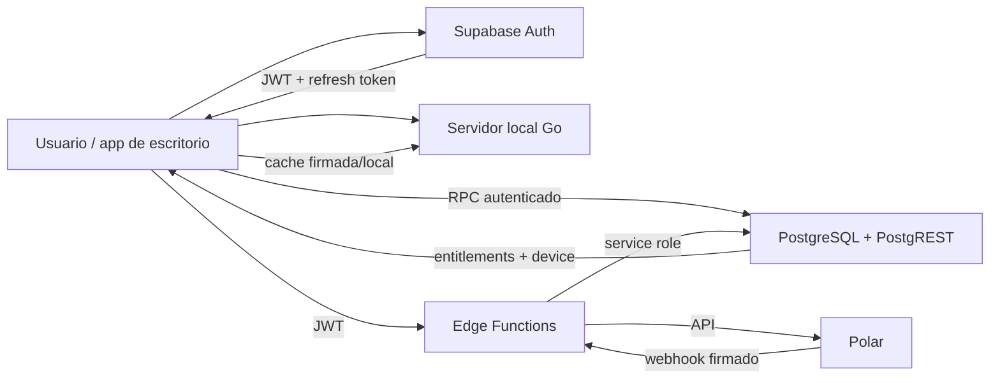
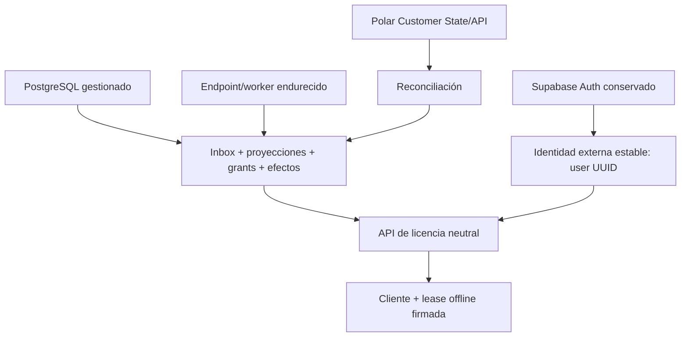

# ISA-7 — Auditoría arquitectónica de Supabase (2026-07-14)

Estado: investigación; no autoriza implementación, migración ni retirada
Rama: `vantareapp/isa-7-billing-relaunch-20260714`
Base original de la relanzada: `c49e14aab474ee132c0368e92918f78d66a162c8`
Decisión operativa vigente: **NO-GO para venta pública**

## 1. Resumen ejecutivo

La recomendación es **KEEP + HARDEN** Supabase a corto plazo y **REDUCE** únicamente las superficies legadas cuya falta de consumidores se demuestre. No hay evidencia suficiente para sustituirlo o eliminarlo ahora.

Supabase no es solo una base de datos en Vantare. Hoy reúne autenticación, emisión y refresco de sesiones, PostgreSQL, RLS, RPC, Edge Functions y configuración de despliegue. Billing depende de esas piezas, pero también existen responsabilidades compartidas de perfil e identidad. Retirar el proyecto completo antes de sustituir cada contrato aumentaría simultáneamente el riesgo de identidad, consistencia comercial y recuperación.

La arquitectura Polar propuesta no exige abandonar Supabase. PostgreSQL puede alojar de forma adecuada el inbox durable, las proyecciones comerciales, los grants, los efectos idempotentes y la reconciliación. El problema principal es el modelo y su operación actuales, no el motor gestionado.

Sí conviene preparar portabilidad: dominio neutral respecto al proveedor, fronteras API explícitas, esquema PostgreSQL exportable, worker durable y simulacros de recuperación. Esa preparación permite evaluar **REPLACE_GRADUALLY** más adelante si aparecen motivos objetivos de coste, cumplimiento u operabilidad. **REMOVE** no es una opción segura hoy.

## 2. Alcance, método y nivel de certeza

Se inspeccionaron solamente:

- migraciones, Edge Functions, configuración, tests y consumidores presentes en el repositorio;
- cliente React/TypeScript, servidor local Go, servicio de licencia y CLI administrativa;
- documentación oficial actual de Supabase sobre arquitectura, Auth, RLS, Functions, secretos, backups y migración.

No se accedió al panel remoto, datos, logs, secretos, backups ni configuración productiva. No se ejecutaron funciones desplegadas ni scripts de humo mutantes.

Las afirmaciones se etiquetan así:

- **Hecho verificado**: consta en código versionado o fuente oficial enlazada.
- **Inferencia**: conclusión razonable que requiere confirmar el estado remoto.
- **Propuesta**: diseño futuro, no autorización para implementarlo.

Supabase documenta que PostgreSQL es el núcleo del producto y que Auth, PostgREST, Realtime, Storage y Functions se integran alrededor de él. También indica que las tablas expuestas deben protegerse con RLS y que las claves de servicio omiten RLS. Fuentes: [arquitectura](https://supabase.com/docs/guides/getting-started/architecture), [base de datos](https://supabase.com/docs/guides/database/overview), [RLS](https://supabase.com/docs/guides/database/postgres/row-level-security), [secretos de Functions](https://supabase.com/docs/guides/functions/secrets).

## 3. Mapa de responsabilidades actual

**Hecho verificado:** la aplicación utiliza Auth directamente desde el frontend; checkout y portal exigen JWT; webhook valida la firma externa en la aplicación; las Edge Functions escriben con credenciales administrativas; la licencia consulta una RPC y conserva estado local.

## 4. Inventario del repositorio

### 4.1 Configuración y entornos

| Elemento | Responsabilidad | Datos / autoridad | Seguridad y retención | Tests / dependencia | Clasificación |
|---|---|---|---|---|---|
| `supabase/config.toml` | Vincular proyecto y configurar verificación JWT por función | Configuración de despliegue, no autoridad comercial | Checkout/portal con JWT; webhook sin JWT porque usa firma propia | Verificación estática; estado remoto no inspeccionado | KEEP + HARDEN |
| Variables cliente | URL, clave publicable, redirect OAuth, flag billing | Configuración pública del cliente | La clave anónima es publicable solo con RLS correcta | Tests unitarios de inicialización | KEEP + HARDEN |
| Variables de servidor/Functions | URL, anon, service role y configuración Polar | Acceso privilegiado y rutas | Los valores no se leyeron; service role omite RLS | Presencia remota no inspeccionada | SENSITIVE_UNINSPECTED |
| Configuración Polar | token, secreto webhook, mapping, entorno, URLs | Contrato comercial y rutas permitidas | No mostrar valores; validar allowlists y coherencia por entorno | Tests locales parciales | HARDEN |
| Separación test/producción | Aislar datos, claves y catálogo | Frontera de seguridad | Repo no demuestra proyectos remotos separados | Confirmación remota pendiente | SENSITIVE_UNINSPECTED |

Nombres de configuración inventariados de forma segura: `VITE_SUPABASE_URL`, `VITE_SUPABASE_ANON_KEY`, `VANTARE_SUPABASE_URL`, `VANTARE_SUPABASE_ANON_KEY`, `VITE_OAUTH_REDIRECT_URL`, `VITE_BILLING_ENABLED`, `SUPABASE_URL`, `SUPABASE_ANON_KEY`, `SUPABASE_SERVICE_ROLE_KEY`, `POLAR_ACCESS_TOKEN`, `POLAR_WEBHOOK_SECRET`, `POLAR_PRODUCT_MAP`, `POLAR_ENVIRONMENT`, `POLAR_API_BASE_URL`, `POLAR_DEBUG_ERRORS`, `CHECKOUT_SUCCESS_URL`, `CHECKOUT_CANCEL_URL` y `PORTAL_RETURN_URL`.

### 4.2 Auth e identidad

| Elemento | Responsabilidad | Productor / consumidores | Criticidad y autoridad | Hallazgo | Clasificación |
|---|---|---|---|---|---|
| `auth.users` | Identidad y credenciales | Supabase Auth; trigger, frontend y billing | Crítica; autoridad de identidad | Esquema remoto sensible no inspeccionado | KEEP / SENSITIVE_UNINSPECTED |
| `profiles` | Perfil visible y onboarding | Trigger y usuario; frontend/billing indirecto | Compartida, no debe ser autoridad comercial | Mezcla perfil, email duplicado y campos editables | SHARED_BLOCKED + HARDEN |
| Trigger `on_auth_user_created` | Crear profile y licencia legacy | Evento Auth; tablas públicas | Alta en onboarding | Sigue creando una licencia legacy gratis | HARDEN / MIGRATE_CANDIDATE |
| Cliente `supabase-auth.ts` | Login, signup, OAuth y sesión | Frontend | Crítica | Persiste y refresca sesión en almacenamiento web predeterminado | HARDEN / MIGRATE_CANDIDATE |
| Callback HTTP local | Transferir tokens del navegador externo a la app | Servidor Go y WebView | Crítica | Loopback, no-store, límite de cuerpo y rate limit; nonce generado pero no validado | HARDEN prioritario |

**Hecho verificado:** `profiles_update_own` permite al usuario actualizar su fila. Las migraciones posteriores añaden `email`, idioma, simulador y onboarding a esa misma fila sin restringir columnas. Por tanto, el email duplicado en `profiles` es editable por el propio usuario.

**Control requerido:** billing debe usar el UUID autenticado como vínculo, no confiar en `profiles.email`. Si se necesita email operativo, debe derivarse de la identidad validada o tratarse como dato de contacto no autoritativo.

**Hecho verificado:** el servidor local crea nonces de un solo uso y dispone de `Consume`, pero `handleAuthToken` no llama a `Consume` ni valida el nonce recibido. La documentación interna lo presenta como protección CSRF; la protección efectiva está incompleta. La escucha se restringe a loopback, pero cualquier origen capaz de alcanzar el puerto local puede intentar enviar un token. Esto debe corregirse y probarse antes de considerar robusto el login externo.

Supabase documenta que Auth emite y renueva JWT, que su esquema interno no se expone por la API y que los datos propios de usuario deben mantenerse en tablas públicas protegidas por RLS: [arquitectura de Auth](https://supabase.com/docs/guides/auth/architecture), [gestión de datos de usuario](https://supabase.com/docs/guides/auth/managing-user-data). El cliente de navegador persiste sesiones de forma predeterminada; en una app de escritorio debe evaluarse almacenamiento protegido por el sistema operativo: [sesiones de cliente](https://supabase.com/docs/guides/auth/server-side/advanced-guide).

### 4.3 Esquema legacy

| Recurso | Responsabilidad / datos | Productor y consumidores | Seguridad / retención | Evidencia de tests | Clasificación |
|---|---|---|---|---|---|
| `licenses` | Tier, HWID, expiración, activo y contadores | Trigger y función legacy | RLS de lectura propia; datos de dispositivo | `validate-license`; cliente nuevo no lo usa como fuente principal | MIGRATE_CANDIDATE |
| `subscriptions` | Plan/estado/expiración/proveedor legacy | Integración anterior | RLS; proveedor por defecto histórico | Sin prueba de uso activo actual | MIGRATE_CANDIDATE |
| `license_validations` | Auditoría de validaciones, IP, HWID | `validate-license` | PII/pseudónimos de alta sensibilidad; retención no definida | Sin suite dedicada | MIGRATE_CANDIDATE |
| `hwid_changes` | Historial de cambios de dispositivo | Flujo legacy | Sensible; retención no definida | Sin consumidor actual demostrado | MIGRATE_CANDIDATE |
| `rate_limits` | Ventanas y contadores legacy | Función legacy | Sin políticas cliente; escritura administrativa | Sin consumidor nuevo demostrado | MIGRATE_CANDIDATE |
| Índices legacy | Rendimiento | PostgreSQL | Coste operativo | Definidos en migración | Dependen de la tabla |

No se recomienda borrar ninguna tabla. Primero deben verificarse despliegues, consumidores, datos, obligaciones de retención, exportación y posibilidad de rollback.

### 4.4 Esquema billing/licensing actual

| Recurso | Responsabilidad / autoridad | Productor / consumidores | Seguridad y consistencia | Clasificación |
|---|---|---|---|---|
| `billing_customers` | Vínculo usuario ↔ customer del proveedor | Webhook/portal | Único por usuario/proveedor; service role | KEEP temporal + HARDEN |
| `billing_subscriptions` | Proyección de suscripción | Webhook | Proyección, no autoridad; estados poco restringidos | REPLACE_GRADUALLY por modelo objetivo |
| `user_entitlements` | Read model de acceso por producto | Webhook; RPC/licencia | Único por usuario/producto impide fuentes múltiples | REPLACE_GRADUALLY |
| `devices` | Binding y resets | RPC | Una fila por usuario; mutación desde consulta | KEEP temporal + HARDEN |
| `license_events` | Idempotencia y auditoría parcial | Webhooks legacy/Polar | No es inbox durable; contrato insuficiente | REPLACE_GRADUALLY |
| RPC `get_account_entitlements` | Leer entitlements y vincular primer dispositivo | Cliente de licencia | SECURITY DEFINER + `auth.uid()`; lectura con efecto | HARDEN / MIGRATE_CANDIDATE |
| RPC `reset_active_device` | Reset con ventana temporal | Cliente | SECURITY DEFINER + `auth.uid()` | KEEP temporal + HARDEN |

Hallazgos de consistencia:

1. **Fuente múltiple imposible.** La unicidad `(user_id, product_key)` colapsa compra lifetime y suscripción mensual en una fila; no conserva grants independientes.
2. **Agregación incorrecta.** La RPC usa el menor vencimiento entre filas. Con capacidades/fuentes múltiples puede acortar acceso que debería seguir vigente.
3. **`past_due` concede acceso.** La RPC devuelve estados `active`, `grace` y `past_due`; el cliente considera acceso activo si hay entitlements. Esto no implementa una política explícita de periodo pagado/gracia.
4. **Lectura con efecto.** `get_account_entitlements` crea o actualiza el binding del primer dispositivo. Reintentos y lecturas concurrentes pueden producir efectos operativos inesperados.
5. **Estados abiertos.** Las nuevas tablas carecen de restricciones exhaustivas para status, source, provider y product. El JSON de metadata tampoco tiene límites funcionales definidos.
6. **Privilegios de función.** Las RPC fijan `search_path` y comprueban `auth.uid()`, lo cual es positivo. Aun así, debe revocarse explícitamente `EXECUTE` de roles no requeridos y concederse solo a `authenticated`; PostgreSQL concede ejecución de funciones a `PUBLIC` por defecto.
7. **Inbox insuficiente.** `license_events` no registra de forma durable payload hash, versión, estado de claim, intentos, error, próxima ejecución, recurso afectado ni cada efecto aplicado.

El reemplazo documental de estas tablas está definido en el informe Polar: inbox inmutable, proyecciones comerciales, grants por fuente, efectos idempotentes y reconciliación. Puede residir en el mismo PostgreSQL gestionado.

### 4.5 RLS, grants, funciones y triggers

| Control | Estado versionado | Riesgo | Acción documental |
|---|---|---|---|
| RLS en tablas públicas | Habilitada en tablas inventariadas | Service role la omite; estado remoto puede divergir | Auditar remoto en solo lectura y probar por rol |
| Políticas de lectura propia | Presentes | No cubren errores de funciones SECURITY DEFINER | Tests negativos anon/usuario cruzado |
| Escritura de perfil propio | Presente | Permite modificar email duplicado | Política por columnas o API explícita |
| Escritura billing cliente | No concedida por políticas | Funciones administrativas tienen gran alcance | RPC/rol mínimo por operación |
| `SECURITY DEFINER` | Trigger y dos RPC | Ownership/grants/search path son críticos | Fijar owner, revocar PUBLIC/anon y testear |
| Trigger de alta | Crea profile + licencia legacy | Acopla Auth a modelo obsoleto | Separar después de backfill y paridad |
| Trigger `updated_at` | Profiles/subscriptions legacy | Normal | Conservar mientras existan tablas |

### 4.6 Edge Functions

| Función | Responsabilidad | Autenticación | Datos / efectos | Tests | Clasificación |
|---|---|---|---|---|---|
| `billing-checkout` | Crear sesión Polar desde SKU permitida | Gateway JWT + `auth.getUser` | Envía vínculo externo autenticado | Suite amplia de spoofing/config/error | KEEP temporal + HARDEN |
| `billing-portal` | Crear Customer Session del usuario | Gateway JWT + `auth.getUser` | Lee vínculo y crea URL sensible | Suite de spoofing/URL/error | KEEP temporal + HARDEN |
| `billing-webhook` | Verificar y procesar eventos Polar | Firma Standard Webhooks | Escribe customer/subscription/entitlement/event | Firma, duplicado y casos básicos | REPLACE_GRADUALLY |
| `_shared` | Auth, CORS, mapping, Polar, admin DB | Interna | Incluye acceso service role | Tests parciales | HARDEN |
| `validate-license` | Validación legacy | JWT usuario dentro de función | Service role; logs de HWID/IP; tablas legacy | No suite dedicada encontrada | REMOVE_CANDIDATE condicionado |
| `_deprecated/stripe-webhook` | Integración Stripe anterior | Config histórica | Efectos billing y notificación | Tests legacy | REMOVE_CANDIDATE bajo ISA-77 |
| scripts de humo | Inspección y pruebas desplegadas | Credenciales/entorno | Algunos son mutantes | No se ejecutaron | HARDEN / uso controlado |

**Hecho verificado:** checkout y portal usan `verify_jwt = true`; webhook usa `false` para permitir la llamada externa y verifica su propia firma. Es coherente con la guía de autenticación de Functions: [Auth en Edge Functions](https://supabase.com/docs/guides/functions/auth), [configuración por función](https://supabase.com/docs/guides/functions/function-configuration).

**Riesgo de blast radius:** las tres funciones activas construyen acceso administrativo. Una vulnerabilidad de lógica puede afectar cualquier tabla alcanzable, aunque RLS sea correcta. La arquitectura objetivo debe sustituir acceso general por funciones/RPC con permisos mínimos o un rol dedicado.

**Código legacy desplegable:** `validate-license` está marcado deprecado dentro del código, pero permanece en la raíz de Functions. Usa CORS abierto, service role y registra identificadores de dispositivo/IP. `_deprecated/stripe-webhook` está aislada por directorio/configuración, pero sigue versionada. El estado desplegado es desconocido. Ninguna debe borrarse hasta confirmar consumidores y despliegue; ninguna debe incluirse en un despliegue masivo accidental.

Supabase describe Functions como isolates Deno/V8 distribuidos y sin estado durable propio; la persistencia de un procesador fiable debe estar en base de datos/cola, no en memoria del isolate: [arquitectura de Functions](https://supabase.com/docs/guides/functions/architecture), [límites](https://supabase.com/docs/guides/functions/limits).

### 4.7 Consumidores fuera de Supabase

| Consumidor | Dependencia | Consecuencia de retirada | Sustituto previo obligatorio |
|---|---|---|---|
| Frontend React | Auth SDK, JWT, checkout/portal, sesión persistida | Login y compra dejan de funcionar | Adaptador Auth + proveedor/flujo equivalente |
| Servidor local Go | Callback OAuth y transferencia de sesión | Login externo deja de funcionar | Callback seguro del nuevo IdP |
| Servicio Go de licencia | RPC, device binding, cache | Acceso online/offline deja de resolverse | API de licencia compatible y migración de cache |
| Release CI | Inyección de URL/clave pública | Binario sin Auth/API | Configuración equivalente por entorno |
| CLI `vantare-admin` | Pretende usar service role | No aporta recuperación real: helpers REST no implementados | Herramienta auditable o retirar promesa |
| Polar | Endpoint webhook en Functions | Eventos no se procesan | Endpoint durable equivalente antes del cutover |

## 5. Recursos no encontrados localmente

No hay definiciones versionadas de vistas, Storage, Realtime, cron/pg_cron, Vault, pg_net ni extensiones operativas adicionales. Esto **no prueba que estén ausentes en remoto**.

Se clasifican como **SENSITIVE_UNINSPECTED**:

- drift de esquema, funciones y políticas;
- proveedores Auth, usuarios, plantillas y URLs de redirección;
- Functions realmente desplegadas y sus versiones;
- nombres/presencia de secretos remotos;
- backups, PITR, restauraciones y retención;
- cron/jobs, webhooks de base, colas o extensiones;
- buckets/objetos Storage y políticas;
- publicaciones Realtime;
- logs, alertas, restricciones de red y ramas/proyectos por entorno.

Su inspección requiere autorización separada de acceso remoto en solo lectura. No requiere leer valores de secretos ni filas de clientes.

## 6. Evaluación de opciones

### 6.1 Matriz comparativa

| Criterio | KEEP + HARDEN | REDUCE | REPLACE_GRADUALLY | REMOVE |
|---|---|---|---|---|
| Seguridad | Mejora rápida si se reduce service role y se endurece Auth/RLS | Reduce superficie legacy | Puede mejorar aislamiento, pero abre riesgos de migración | Riesgo máximo sin sustitutos probados |
| Consistencia | PostgreSQL permite transacciones del modelo objetivo | Neutral si solo se retira lo no usado | Dual-write/read exige reconciliación compleja | Corte abrupto rompe contratos |
| Coste | Mantiene coste gestionado; trabajo de hardening acotado | Puede reducir mantenimiento, no necesariamente factura | Coste temporal doble y más ingeniería | Hosting puede bajar factura directa pero sube operación |
| Complejidad | Menor | Media por prueba de no uso | Alta | Muy alta |
| Operabilidad | Se conserva servicio gestionado, backups según plan | Menos superficies | Hay que operar dos stacks | Equipo asume identidad, DB, backup, HA y runtime |
| Lock-in | Sigue en SDK/Functions/PostgREST; puede reducirse con adapters | Menor si se retira código específico | Disminuye gradualmente | Bajo solo después de una migración completa |
| Migración | No necesaria; sí evolución de esquema | Por recurso, reversible | Por fases y con paridad | Big bang no aceptable |
| Rollback | Migraciones compatibles + flags | Restaurar recurso/despliegue | Volver lecturas/escrituras al origen | Difícil tras cortar Auth/datos |
| Downtime | Evitable | Evitable con gates | Evitable salvo ventanas concretas | Probable |
| Efecto en Polar | Soporta inbox y grants objetivo | Positivo si elimina legado probado | Neutral si conserva contratos | Webhooks/licencias quedan sin destino |

### 6.2 Veredicto

1. **Ahora: KEEP + HARDEN.** Es la ruta con menor riesgo y permite implementar correctamente la arquitectura objetivo Polar.
2. **En paralelo: REDUCE con evidencia.** Marcar código/tablas legacy, bloquear despliegue accidental, confirmar consumidores y retirar solo mediante issues aprobadas.
3. **Preparar, no ejecutar: REPLACE_GRADUALLY.** Crear fronteras neutrales y capacidad de exportación/paridad.
4. **No recomendado: REMOVE.** Faltan inventario remoto, sustitutos, runbooks, pruebas de Auth y recuperación.

## 7. Matriz de disposición por recurso

| Disposición | Recursos | Condición |
|---|---|---|
| KEEP | Auth, PostgreSQL gestionado, RLS, profile mínimo, Functions activas durante transición | Mantener continuidad mientras se endurece |
| HARDEN | Callback OAuth/nonce, almacenamiento de sesión, grants/RLS, privilegios service role, constraints, inbox, backups, entornos, observabilidad | Antes de venta pública |
| MIGRATE_CANDIDATE | RPC de licencia, lógica de Functions a API/worker neutral, `user_entitlements`, `license_events`, acoplamiento directo del frontend | Solo con contratos y paridad |
| REMOVE_CANDIDATE | `validate-license`, tablas legacy sin consumidores, CLI incompleta | Solo tras prueba de no uso, exportación y aprobación |
| REMOVE_CANDIDATE separado | Stripe webhook/configuración histórica | Exclusivamente ISA-77; no depende de retirar Supabase |
| SHARED_BLOCKED | `profiles`, trigger Auth y proyecto Supabase completo | Soportan identidad/otras features; no retirar como “billing” |
| SENSITIVE_UNINSPECTED | estado remoto, secretos, Auth, datos, backups, logs, Storage/Realtime/cron | Requiere auditoría remota autorizada y mínima |

`REMOVE_CANDIDATE` es una recomendación de investigación, no permiso de borrado.

## 8. Qué sustituiría cada responsabilidad

| Responsabilidad Supabase | Sustituto posible | Contrato mínimo antes de migrar |
|---|---|---|
| Auth | IdP gestionado OIDC/OAuth o servicio propio endurecido | Usuarios, verificación, refresh/revocación, OAuth, recuperación, MFA futura, auditoría |
| PostgreSQL | PostgreSQL gestionado alternativo | Esquema, transacciones, backups/PITR, cifrado, métricas, RPO/RTO |
| PostgREST/RPC | API Go explícita | AuthZ por usuario, rate limits, versionado, errores, idempotencia |
| Edge Functions | API + worker Go o runtime equivalente | Endpoint webhook rápido, cola/inbox, retries, despliegue/rollback |
| Secretos | Secret manager gestionado | Rotación, acceso mínimo, auditoría, separación de entornos |
| Scheduler | Scheduler gestionado o job runner | Reconciliación, locks, retries, alertas |
| Backups | Programa de backup del nuevo DB | Restore probado, retención, exportación y borrado controlado |
| Observabilidad | Logs/métricas/trazas/alertas | Correlación por webhook/recurso sin PII ni secretos |

Storage y Realtime no necesitan sustituto según el código local actual; debe confirmarse el remoto.

Autoalojar Supabase no elimina el trabajo: Supabase indica que el operador asume aprovisionamiento, seguridad, actualizaciones, backups, monitorización y disponibilidad, y que algunas capacidades de plataforma no se incluyen: [self-hosting](https://supabase.com/docs/guides/self-hosting).

## 9. Plan documental de migración gradual

No ejecutar estas fases sin aprobación separada.

### Fase 0 — gates

- mantener NO-GO;
- aprobar arquitectura y RPO/RTO;
- autorizar inventario remoto de solo lectura;
- congelar eliminaciones y cambios incompatibles.

### Fase 1 — inventario y recuperación

- exportar roles, esquema y datos en entorno controlado;
- inventariar Auth, Functions, Storage, Realtime, cron, secretos por nombre y políticas;
- verificar backup/PITR y restaurar en staging aislado;
- medir conteos y hashes agregados sin exponer PII.

Supabase documenta backups, PITR y que una copia de base no incluye por sí sola los objetos de Storage: [backups](https://supabase.com/docs/guides/platform/backups). El borrado de proyecto/backups puede ser irreversible y queda fuera de este plan.

### Fase 2 — desacoplamiento

- introducir contratos de Auth y licencia independientes del SDK;
- mover dominio billing a tablas/servicios neutrales;
- aislar escrituras privilegiadas tras operaciones mínimas;
- conservar compatibilidad con el cliente publicado.

### Fase 3 — destino en staging

- aprovisionar sustitutos sin tráfico productivo;
- importar esquema/datos exportados;
- configurar identidad y redirects equivalentes;
- ejecutar fixtures sintéticas y reconciliación Polar sandbox.

Al migrar Auth entre proyectos, diferencias de claves JWT pueden invalidar sesiones y exigir reautenticación: [migración de usuarios Auth](https://supabase.com/docs/guides/troubleshooting/migrating-auth-users-between-projects), [claves de firma](https://supabase.com/docs/guides/auth/signing-keys).

### Fase 4 — dual-write controlado

- preferir outbox/event log sobre dos escrituras no atómicas;
- escribir origen y destino con claves de idempotencia;
- registrar fallos por efecto y reparar por worker;
- no habilitar checkout público.

### Fase 5 — shadow read y paridad

- responder desde Supabase y comparar destino en sombra;
- comparar identidad, customer links, grants, expiraciones y device binding;
- definir umbral de paridad 100 % para decisiones de acceso, no “aproximado”;
- investigar cada divergencia antes de avanzar.

### Fase 6 — cohortes y rollback

- cortar un grupo interno mediante flag;
- mantener escritura/reconciliación hacia origen;
- rollback inmediato al origen ante divergencia, error Auth o SLO incumplido;
- ampliar cohortes solo con validación manual de Isaac.

### Fase 7 — retirada y borrado

- detener dual-write solo tras ventana aprobada;
- archivar exportación y evidencias legales;
- revocar credenciales y retirar recursos por separado;
- cualquier borrado final exige aprobación específica, plan de recuperación y verificación posterior.

Supabase recomienda entornos separados y migraciones versionadas: [gestión de entornos](https://supabase.com/docs/guides/deployment/managing-environments). La restauración desde plataforma requiere tratar por separado configuración Auth, Functions y Storage: [restore/migración](https://supabase.com/docs/guides/self-hosting/restore-from-platform), [clonado de proyecto](https://supabase.com/docs/guides/platform/clone-project).

## 10. Controles y pruebas antes de venta pública

| Riesgo | Control | Test seguro |
|---|---|---|
| POST de token local sin nonce válido | Consumir nonce de un uso, TTL y rechazo por defecto | ausente, inválido, expirado, repetido y válido |
| Sesión persistida en almacenamiento web | Evaluar keychain/credential vault; minimizar tokens en eventos | reinicio, logout, renovación, robo simulado de storage |
| Usuario modifica email de `profiles` | Email no autoritativo; política por columna | usuario intenta alterar campos protegidos |
| Service role comprometida | Rol/RPC mínimo por operación | función no puede leer/escribir tablas ajenas |
| RLS incorrecta | Tests por anon, usuario A/B y service role controlada | matriz CRUD negativa por tabla |
| Grant lifetime pisado por monthly | Grants por fuente + agregado determinista | combinaciones lifetime/monthly/cancel/refund |
| `past_due` concede de más | Máquina de estados y periodo pagado explícito | reloj en límites, retries, revocation |
| RPC de lectura muta binding | Separar claim de device de lectura | concurrencia, replay, dos dispositivos |
| Webhook parcial | Inbox/efectos/retry/quarantine | fallo tras cada boundary transaccional |
| Drift remoto | CI de migrations + inventario read-only | diff esquema/config esperado vs remoto |
| Backup inútil | Restore drill aislado | RPO/RTO, conteos y paridad funcional |
| Legacy desplegado | Allowlist explícita de Functions | manifiesto de deploy no incluye deprecadas |
| Retención indefinida de IP/HWID | Política, minimización y borrado aprobado | job dry-run y reporte de edades |
| Cambio de proveedor Auth | Export/import + reauth comunicada | usuarios sintéticos y sesiones inválidas |

## 11. Privacidad y retención

Datos a minimizar:

- email duplicado en profile;
- IP y HWID completos en `license_validations` y logs;
- metadata de proveedores sin allowlist;
- payloads webhook completos después de su ventana operativa;
- tokens de acceso/refresh en memoria, eventos o almacenamiento web.

Propuesta:

- no registrar tokens, firmas, secretos ni URLs sensibles del portal;
- seudonimizar identificadores de dispositivo para diagnóstico;
- separar retención de inbox, auditoría y datos comerciales por obligación;
- cifrar backups y probar acceso/restauración;
- documentar borrado por cuenta sin destruir registros fiscales obligatorios;
- hacer configurable y aprobada cada ventana de retención.

La duración exacta es una decisión humana/legal pendiente, no un placeholder técnico.

## 12. Observabilidad y runbooks

Métricas mínimas:

- login/callback por resultado sin token;
- fallos de RLS/AuthZ y llamadas administrativas;
- lag y profundidad de inbox/quarantine;
- divergencias de reconciliación Polar;
- grants por estado/fuente y transiciones rechazadas;
- resets/bindings de dispositivo;
- drift de migraciones;
- edad del último backup y último restore exitoso.

Runbooks mínimos:

1. callback OAuth sospechoso o token expuesto;
2. rotación de clave/secret y revocación de sesiones;
3. endpoint webhook deshabilitado o backlog;
4. evento en quarantine y replay por ID;
5. divergencia Polar ↔ proyección local;
6. restauración de base y validación de Auth;
7. rollback de migration/Function;
8. aislamiento de función legacy desplegada accidentalmente.

La CLI administrativa actual no implementa las operaciones REST que anuncia; no cuenta como herramienta de reparación. Debe implementarse y auditarse o retirarse de la promesa operativa, sin incluir service role en el cliente final.

## 13. Dependencias con la arquitectura Polar

Supabase debe ser autoridad de identidad y almacenamiento operacional mientras se conserve. Polar sigue siendo autoridad comercial. La aplicación Vantare sigue siendo autoridad de capacidades, device policy y lease offline. Cambiar el alojamiento no cambia esas fronteras.

## 14. Decisiones humanas pendientes

Solo quedan decisiones que no se resuelven con el repositorio:

1. RPO, RTO y retención legal/operativa.
2. Si se autoriza una auditoría remota de solo lectura y quién la ejecuta.
3. Si los tokens de escritorio deben migrar a almacenamiento protegido del SO en el primer hardening.
4. Umbral objetivo de coste/compliance que abriría formalmente REPLACE_GRADUALLY.
5. Si la lógica futura vive en Edge Functions endurecidas o en API/worker Go; ambos pueden usar PostgreSQL.
6. Ventana para retirar recursos legacy, únicamente después de evidencia de no uso.

No hace falta decidir ahora un reemplazo total de Supabase para corregir billing.

## 15. Recomendación de microcortes

Orden propuesto, sin implementar en esta auditoría:

1. inventario remoto de solo lectura, backups y drift;
2. corregir callback OAuth/nonce y política de almacenamiento de sesión;
3. restringir grants/RLS/SECURITY DEFINER/service role;
4. introducir inbox durable y grants por fuente dentro de PostgreSQL;
5. reconciliación y herramientas de reparación;
6. bloquear despliegue de Functions legacy;
7. comprobar consumidores y clasificar datos legacy;
8. retirar recursos individuales solo con aprobación;
9. reevaluar portabilidad una vez estable el dominio.

Cada microcorte debe ser reversible, tener tests negativos y mantener el NO-GO hasta completar la validación manual indicada en ISA-7.

## 16. Conclusión

Supabase debe **conservarse y endurecerse**, no eliminarse. La reducción prudente del legado es compatible con esa decisión, pero necesita evidencia remota y de consumidores. La sustitución gradual es una opción estratégica que debe prepararse mediante contratos neutrales y recuperación probada, no mediante un cambio de proveedor prematuro.

La retirada de Stripe es un eje distinto. Su inventario queda como legado y su retirada continúa condicionada a ISA-77; no aporta evidencia a favor ni en contra de retirar Supabase.

Hasta que Auth, privilegios, inbox, grants, reconciliación, backups y smoke interno estén verificados, permanece **NO-GO para venta pública**.
