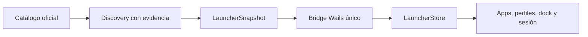

# Launcher v3: arquitectura y operación

## Flujo de estado



Go conserva la autoridad sobre catálogo, discovery, persistencia, procesos y ejecución. React recibe un snapshot agregado y despacha comandos por el bridge.

## Disponibilidad

Cada app mantiene cuatro hechos independientes:

- `catalogued`: existe en el catálogo oficial.
- `found`: se encontró evidencia en registro, ruta conocida, Steam o override.
- `installed`: existe un ejecutable válido o instalación Steam válida.
- `launchable`: la app tiene un método v3 válido y puede lanzarse.

`detected` se conserva únicamente para compatibilidad de settings antiguos.

## Iconos

La prioridad runtime es override local → asset oficial local → extracción del ejecutable → abreviatura. No se usa CDN ni URL remota. Los siete assets oficiales no se incorporan en este corte; el resolver tipado los deja explícitamente vacíos y la UI conserva el fallback seguro.

## Perfiles y ejecución

Los perfiles se separan en `vantareProfiles` y `userProfiles`. El modo básico evita duplicados, rutas y argumentos por paso. El modo avanzado habilita repetición y `argsOverride`; la ruta global permanece en la app.

Las políticas persistidas son `ask`, `reuse`/`restart`, `stop`/`continue`, `leave`/`close-started` y `ask`/`failed`/`all`, con `maxRetries` limitado a 3. Los argumentos se tokenizan sin shell y se rechazan NUL o comillas sin cerrar.

La identidad de proceso usa PID y ruta normalizada cuando están disponibles, con nombre de proceso como fallback. Close/restart exige identidad confirmada; nunca mata por nombre únicamente.

## Eventos vigentes

Estado: `launcher:snapshot` solicitado con `launcher:snapshot:get`.

Comandos: `launcher:apps:discover`, `launcher:app:add`, `launcher:app:remove`, `launcher:app:update`, `launcher:app:path:set`, `launcher:app:favorite`, `launcher:profile:save`, `launcher:profile:delete`, `launcher:profile:duplicate`, `launcher:profile:launch`, `launcher:profile:cancel`, `launcher:decision:resolve`, `launcher:app:close`, `launcher:app:restart`.

Los eventos agregados legacy de apps y perfiles ya no son emitidos por producción ni consumidos por la UI.

## Verificación

```powershell
go test ./internal/app/launcher/... ./cmd/vantare/...
go test -race ./internal/app/launcher/...
pnpm --dir frontend test
pnpm --dir frontend build
node frontend/scripts/launcher-v3-smoke.mjs
```

El smoke usa el mock Wails, verifica siete apps, perfiles, editor avanzado, ausencia de overflow móvil, consola y peticiones fallidas. Las capturas se guardan en el directorio temporal del sistema y nunca se versionan.

## Limitaciones de este corte

- Los logos oficiales requieren assets aprobados; sin ellos se usa abreviatura o extracción local.
- El trigger LMU y las recomendaciones de delay viven como primitivas de sesión y necesitan wiring de producción adicional para activarse desde ajustes.
- La suite global conserva fallos preexistentes fuera de Launcher en `internal/server` y lint de Calendar/telemetría.
