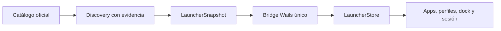

# Launcher v3: arquitectura y operación

## Flujo de estado


```mermaid
flowchart LR
  C[Catálogo oficial] --> D[Discovery con evidencia]
  D --> S[LauncherSnapshot]
  S --> B[Bridge Wails único]
  B --> T[LauncherStore]
  T --> U[Apps, perfiles, dock y sesión]
```

Go conserva la autoridad sobre catálogo, discovery, persistencia, procesos y ejecución. React recibe un snapshot agregado y despacha comandos por el bridge.

## Disponibilidad

Cada app mantiene cuatro hechos independientes:

- `catalogued`: existe en el catálogo oficial.
- `found`: se encontró evidencia en registro, ruta conocida, Steam o override.
- `installed`: existe un ejecutable válido o instalación Steam válida.
- `launchable`: se ha encontrado su ejecutable y el launcher puede comprobar el arranque. Una instalación Steam sin ruta verificable conserva `installed`, pero no `launchable`.

`detected` se conserva únicamente para compatibilidad de settings antiguos.

## Iconos

La prioridad runtime es override local → asset oficial local → extracción del ejecutable → abreviatura. No se usa CDN ni URL remota. La tabla [app-icons.ts](../frontend/src/hub/launcher/app-icons.ts) incorpora `MOTEC_BRAND_ICON` para MoTeC, porque el ejecutable i2 tiene otra marca. Las otras seis entradas quedan vacías deliberadamente y recurren al icono instalado o al fallback local.

## Perfiles y ejecución

Los perfiles se separan en `vantareProfiles` y `userProfiles`. El modo básico evita duplicados, rutas y argumentos por paso. El modo avanzado habilita repetición y `argsOverride`; la ruta global permanece en la app.

Las políticas persistidas son `ask`, `reuse`/`restart`, `stop`/`continue`, `leave`/`close-started` y `ask`/`failed`/`all`, con `maxRetries` limitado a 3 y editable en el modo avanzado. `failed` reintenta cada paso fallido; `all` vuelve a ejecutar la cadena completa desde el primer paso tras un fallo. En el aviso de resultado, «Repetir pasos fallidos» reanuda los fallidos y no ejecutados, mientras «Repetir todos los pasos» inicia de nuevo el perfil completo. Los argumentos se tokenizan sin shell y se rechazan NUL o comillas sin cerrar.

Solo un perfil puede estar marcado para iniciar con Windows. Al seleccionar otro, el Launcher desactiva el anterior y sincroniza ambos valores Run; si falla el registro, restaura la configuración previa. Los ajustes antiguos con varios perfiles marcados se reducen al primero al arrancar.

La identidad de proceso usa PID, ruta normalizada y hora de creación observados. Close/restart exige los tres datos; nunca mata por nombre o PID únicamente. Un proceso ya abierto fuera de Vantare puede reutilizarse, pero no adquiere autoridad de cierre. El enlace de Steam solo inicia la solicitud: la cadena espera a observar el ejecutable del juego antes de marcar el paso como completado.

## Eventos vigentes

Estado: `launcher:snapshot` solicitado con `launcher:snapshot:get`.

Comandos: `launcher:apps:discover`, `launcher:app:add`, `launcher:app:remove`, `launcher:app:update`, `launcher:app:path:set`, `launcher:app:favorite`, `launcher:profile:save`, `launcher:profile:delete`, `launcher:profile:duplicate`, `launcher:profile:launch`, `launcher:profile:retry:failed`, `launcher:profile:retry:all`, `launcher:profile:cancel`, `launcher:decision:resolve`, `launcher:app:close`, `launcher:app:restart`.

Los eventos agregados legacy de apps y perfiles ya no son emitidos por producción ni consumidos por la UI.

## Verificación

Desde `vantare-v2/`, preparar dependencias según [operaciones](operations.md). El build frontend debe existir antes de los tests Go que embeben sus assets.

```powershell
pnpm --dir frontend build
go test ./internal/app/launcher/... ./cmd/vantare/...
go test -race ./internal/app/launcher/...
pnpm --dir frontend test
```

El script visual es una receta del corte Launcher v3: necesita Chromium instalado (`pnpm --dir frontend exec playwright install chromium`) y un servidor ya abierto en `http://127.0.0.1:5173/#/hub`, o la variable `LAUNCHER_SMOKE_URL` con la URL del entorno de prueba. No inicia el servidor. Su fixture espera siete apps y dos perfiles; confirmar que el harness corresponde a ese contrato antes de interpretar el resultado como regresión de la app.

```powershell
node frontend/scripts/launcher-v3-smoke.mjs
```

El smoke usa el mock Wails, verifica siete apps, perfiles, editor avanzado, ausencia de overflow móvil, consola y peticiones fallidas. Las capturas se guardan en el directorio temporal del sistema y nunca se versionan.

## Limitaciones de este corte

- Los logos oficiales requieren assets aprobados; sin ellos se usa abreviatura o extracción local.
- El trigger LMU y las recomendaciones de delay viven como primitivas de sesión y necesitan wiring de producción adicional para activarse desde ajustes.
- Los fallos registrados en el corte inicial no eximen los checks actuales. Usar los gates de la PR/canal y registrar los fallos de la revisión concreta.
