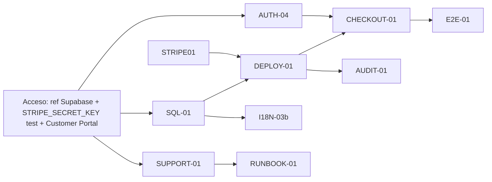

# Release 02 — Stage: Licencias, Auth y Pagos Reales (Beta Pública)

> **Tipo:** Documento de control / punto de referencia del stage (single source of truth).
> **Fecha:** 2026-07-06.
> **Owner:** orquestador (Isaac + agents).
> **Estado del stage:** 🟡 PLANIFICACIÓN — pendiente de acceso (ref Supabase + claves Stripe test).
> **No es un plan de ejecución:** cada problema se resuelve en su miniplan enlazado; la evidencia técnica vive en `docs/stripe-licensing-status-audit.md`.

---

## 0. Propósito de este documento

Este es el **ancla única** de la sección de monetización/licencias/auth para el lanzamiento de la beta pública. Reglas:

- Los problemas se resuelven en **miniplans** (archivos en `docs/superpowers/plans/` o secciones de este doc) que se enlazan aquí.
- La **evidencia detallada** (archivos, líneas, riesgos) vive en `docs/stripe-licensing-status-audit.md` — no se duplica aquí.
- El **estado** de cada miniplan se lleva en la tabla de la sección 3 y se actualiza al cerrar cada uno.
- Otros docs de arquitectura (`licensing-auth-architecture.md`, etc.) se referencian pero **están desactualizados** (dicen "design-only" y el código ya existe) — ver sección 7.

---

## 1. Objetivo del stage

Que la **beta pública** pueda, de extremo a extremo:

1. **Adquirir usuarios** — registro de nuevos usuarios y recuperación de password desde la app (`AUTH-04`).
2. **Cobrar** — checkout real de Stripe que derive en suscripción (`STRIPE-01` + `DEPLOY-01` + `CHECKOUT-01`).
3. **Entregar licencias** — un usuario pagado recibe sus entitlements reales y el gating lo desbloquea (`SQL-01` + `DEPLOY-01` + `E2E-01`).
4. **Operar sin panel admin propio** — soporte vía Stripe Dashboard + Supabase Studio + CLI local (`SUPPORT-01` + `RUNBOOK-01`).
5. **Auditar** — cada webhook deja traza y sincroniza Discord (`AUDIT-01`).
6. **Multilenguaje** — copy de auth/paywall traducida (`I18N-03b`).

**Fuera de alcance por decisión (sección 6 de la auditoría):** panel de administración web propio. Stripe Dashboard + Supabase Studio + CLI de soporte cubren la operación.

---

## 2. Estado actual (resumen; detalle en auditoría)

| Capacidad | Estado | Evidencia |
|---|---|---|
| Backend Go `internal/license` (Validate/cache/fingerprint/plan) | ✅ Implementado + testeado | `internal/license/*`; auditoría §2.1 |
| Wiring licencia en `main.go` | ✅ | auditoría §2.2 |
| UI gating (Login/Paywall/AccountSettings/Banner/Unconfigured) | ✅ | auditoría §2.3 |
| Login email+password / OAuth / logout / sesión | ✅ | auditoría §11.1 |
| Edge Function Stripe (código) | ✅ Código / ❌ No deployada | `supabase/functions/stripe-webhook/`; auditoría §2.5 |
| **Registro de usuarios (`signUp`)** | ❌ Faltante | auditoría §11.2 (caso C de `adversarial-review.md`, P1) |
| **Migración SQL (tablas+RLS+trigger+RPCs)** | ❌ Inexistente | `find . -name "*.sql"` vacío; auditoría §2.6 / `TD-043` |
| **Checkout real** | ❌ Botón solo muestra "próximamente" | auditoría §3 / `PaywallScreen.tsx:29-34` |
| **Productos/precios Stripe** | ❌ Placeholders | auditoría §3 |
| **Soporte operativo (CLI)** | ❌ Por crear | auditoría §6.2 |

---

## 3. Miniplans del stage (índice de estado)

**Leyenda:** 🔴 BLOQUEADO (falta acceso) · 🟡 EN_COLA · ⚪ PENDIENTE · 🟢 EN_PROGRESO · ✅ HECHO

| ID | Nombre | Depende de | Owner sugerido | Estado | Plan file | Evidencia |
|---|---|---|---|---|---|---|
| `AUTH-04` | Registro de usuarios + reset password | No depende de SQL-01 (signup crea `auth.users`; el trigger de `profiles` es post-signup y no bloquea) | frontend agent | ✅ HECHO | `docs/superpowers/plans/2026-07-06-auth-04-signup.md` | auditoría §11 |
| `SQL-01` | Migración SQL: tablas + RLS + trigger `profiles` + RPCs `get_account_entitlements`/`reset_active_device` | Acceso Supabase | sql agent | 🔴 BLOQUEADO | `docs/superpowers/plans/2026-07-06-sql-01-migration.md` | auditoría §3/#1, `TD-043` |
| `STRIPE-01` | Productos/precios en Stripe test + mapping `PRICE_ID_TO_PRODUCT_KEYS` | Acceso Stripe | dashboard (humano) | 🔴 BLOQUEADO | `docs/superpowers/plans/2026-07-06-stripe-01-products.md` | auditoría §3/#4 |
| `DEPLOY-01` | Deploy Edge Function + secretos + webhook Stripe | `SQL-01`, `STRIPE-01` | deploy agent | ⚪ PENDIENTE | `docs/superpowers/plans/2026-07-06-deploy-01-webhook.md` | auditoría §3/#3 |
| `CHECKOUT-01` | Checkout real en Paywall (externo, creado por EF) | `DEPLOY-01`, `STRIPE-01`, `AUTH-04` | frontend agent | ✅ HECHO | `docs/superpowers/plans/2026-07-06-checkout-01.md` | auditoría §3/#2, §12.1 |
| `E2E-01` | Flujo real en test mode (login→checkout→webhook→entitlement) | `CHECKOUT-01` | qa agent | ⚪ PENDIENTE | `docs/superpowers/plans/2026-07-06-e2e-01.md` | auditoría §7.5 |
| `SUPPORT-01` | CLI de soporte Go local (no distribuido) | `SQL-01` | go agent | ⚪ PENDIENTE | `docs/superpowers/plans/2026-07-06-support-01-cli.md` | auditoría §6.2, §7.6 |
| `RUNBOOK-01` | Runbook de soporte en operations-runbook | `SUPPORT-01` | docs | ⚪ PENDIENTE | `docs/superpowers/plans/2026-07-06-runbook-01.md` | auditoría §7.7 |
| `AUDIT-01` | `license_events` + Discord sync en la EF | `SQL-01`, `DEPLOY-01` | go/deno agent | ⚪ PENDIENTE | `docs/superpowers/plans/2026-07-06-audit-01.md` | auditoría §7.8 |
| `I18N-03b` | Traducir Auth/Paywall/Account | i18n infra (ya existe) | frontend agent | ✅ HECHO | `docs/superpowers/plans/2026-07-06-i18n-03b.md` | auditoría §3/#8, `current-plan` Nota I18N-03 |

> Los `Plan file` se crean al ejecutar cada miniplan. Mientras tanto, la columna "Evidencia" apunta a la sección de la auditoría que lo justifica.

---

## 4. Ruta crítica y orden de ejecución

**Fases de reloj (si el acceso llega pronto):**

- **F0 — Acceso (cuello humano):** tú das ref Supabase + `STRIPE_SECRET_KEY` test + habilitas Customer Portal. *0.5–1 día.*
- **F1 — Base paralela:** `SQL-01` · `STRIPE-01` · `SUPPORT-01` · `I18N-03b` · `RUNBOOK-01`. *0.5–1 día (5–7 agents a la vez; archivos distintos, cero colisión).*
- **F2 — Deploy + wiring:** `DEPLOY-01` · `AUTH-04` · `CHECKOUT-01`. *0.5 día.*
- **F3 — Cierre + verificación:** `E2E-01` · `AUDIT-01` · smoke manual OAuth en exe. *0.5–1 día.*

> **Nota de decisiones de signup/checkout (2026-07-06):** (A) signup abierto + confirmación por email; (B) retorno de Stripe al servidor local `127.0.0.1:39261/checkout/callback`; (C) Customer Portal con botón en Cuenta; (D) Discord = aviso al canal de soporte (no roles); (E) 1 PC por usuario; (F) rate-limit con `last_reset_at` sin contador; (G/H) precios beta creados, fila free fuera del mapping; (I) I18N-03b antes que CHECKOUT-01; (J) AUTH-04 paralelo a SQL-01.
| `docs/stripe-licensing-status-audit.md` | **Evidencia técnica** del stage | Única fuente de detalle; secciones 1–12 |
| `docs/licensing-auth-architecture.md` | Arquitectura auth/licencias | ⚠️ Desactualizado: dice "design-only" pero el código existe |
| `docs/stripe-integration-plan.md` | Plan de productos/precios/webhook | ⚠️ Desactualizado (íd.) |
| `docs/license-service-contract.md` | Contrato del `LicenseService` Go | ⚠️ Desactualizado (íd.) |
| `docs/supabase-schema-release.md` | Esquema SQL planeado | ⚠️ Desactualizado; el SQL aún no existe |
| `docs/stripe-webhook-deployment.md` | Deploy de la EF | Vigente como manual |
| `docs/technical-debt.md` (`TD-043`) | RPC sin migración SQL | Bloqueador padre de pagos reales |
| `docs/adversarial-review.md` (caso C) | Gap de registro marcado P1 | Origen conocido de `AUTH-04` |
| `docs/current-plan.md` | Plan vivo del repo | Tiene la nota de auditoría + puntero a este stage |
| `docs/release-beta-operations-runbook.md` | Runbook de operaciones | Destino de `RUNBOOK-01` |

> **Acción pendiente de documentación:** añadir a los 4 docs de arquitectura una nota "Estado real 2026-07-06: implementado; el único bloqueador de pagos reales es la migración SQL + checkout + deploy" para no confundir a otros workers (p. ej. el de Launcher). Se hace como tarea de limpieza al iniciar F1.

---

## 8. Registro de cambios del stage

| Fecha | Cambio | Autor |
|---|---|---|
| 2026-07-06 | Creación del doc ancla del stage; índice de 10 miniplans; ruta crítica; DoD; levantamiento de bloqueadores de acceso. | orquestador |
| 2026-07-06 | Redacción de los 10 planes de miniplan (AUTH-04, SQL-01, STRIPE-01, DEPLOY-01, CHECKOUT-01, E2E-01, SUPPORT-01, RUNBOOK-01, AUDIT-01, I18N-03b) siguiendo writing-plans + TDD. Archivos en `docs/superpowers/plans/2026-07-06-*.md`. | orquestador |

---

## 9. Cómo usamos este doc

1. Antes de resolver un problema, se crea (o enlaza) su miniplan en la tabla §3 y se pasa el estado a 🟢.
2. Al cerrar, se marcan los checks del DoD §6 y se pasa el miniplan a ✅, con commit selectivo (política `AGENTS.md`).
3. Los agents evitan archivos de otros workers sin commitear (Launcher/Calendar/i18n); el merge final lo hace Isaac.
4. Este doc nunca contiene código de ejecución; solo estado, dependencias y punteros.
