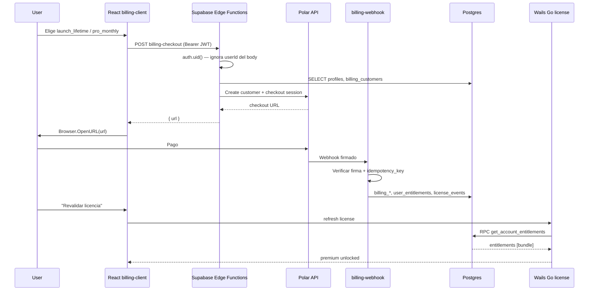

# Fase 2 — Integración Polar (checkout, webhooks, licensing)

> **Estado:** PLAN ACEPTADO — solo documentación. **No implementar** hasta orden explícita.
>
> **Prerequisito:** Fase 1.6 cerrada en proyecto Supabase oficial `ombjshwzqgeisazijduq`.
>
> **Ubicación:** `docs/superpowers/plans/2026-07-09-fase-2-polar-integration.md`

**Goal:** Integrar [Polar.sh](https://polar.sh) como proveedor principal de checkout, suscripciones, pagos one-time, customer portal y webhooks; actualizar `billing_customers`, `billing_subscriptions`, `user_entitlements` y `license_events`; desbloquear premium en la app desktop sin exponer secrets en cliente/Wails.

**Architecture:** Frontend (`billing-client.ts`) llama Edge Functions con JWT Supabase. Las EFs hablan con Polar API usando secrets server-side. Webhook Polar escribe en BD con service-role, idempotencia vía `license_events`. Go/Wails solo revalida vía RPC `get_account_entitlements` existente — sin cambios de contrato RPC en Fase 2.

**Tech Stack:** Polar API + Webhooks, Supabase Edge Functions (Deno), Postgres (schema Fase 1.6), React 19 + Wails + Go `internal/license`.

**Proyecto Supabase oficial:** `ombjshwzqgeisazijduq` (`https://ombjshwzqgeisazijduq.supabase.co`)

---

## Decisiones cerradas (encuesta 2026-07-09)

| Tema | Decisión |
|------|----------|
| Proveedor | Polar (Stripe eliminado del flujo funcional) |
| Modelo comercial v1 | Free interno + Launch Edition (30€ lifetime) + Pro Monthly (4.99€/mes) |
| Claves checkout (allowlist) | `launch_lifetime`, `pro_monthly` |
| `user_entitlements.product_key` | Siempre **`bundle`** (suite completa) — no extender Go/TS/access-policy en v1 |
| Diferenciación comercial | `metadata.plan_sku`, `billing_subscriptions`, `license_events.payload` |
| Mapping Polar → keys | Env JSON `POLAR_PRODUCT_MAP` (patrón `PRICE_ID_TO_PRODUCT_KEYS` de Stripe deprecated) |
| Lifetime immunity | Si existe entitlement lifetime activo, cancelación/revocación mensual **no** quita acceso |
| Desktop v1 | Sin deep links; `Browser.OpenURL` + botón "Revalidar licencia" + polling suave opcional |
| Secrets | Solo Supabase Edge Function secrets — nunca frontend/Wails/binario |

### Pendiente de confirmación humana

**Conflicto `pro_scope`:** en encuesta se eligió `overlays_only`, pero el mapping acordado concede `bundle` (suite). Para v1 se recomienda **`bundle`** en ambos planes pagos. Si el negocio quiere Pro Monthly solo overlays, habría que cambiar `product_key` a `overlays` y ajustar `classifyPlan` — fuera de alcance v1.

---

## 1. Resumen ejecutivo

Vantare es una app desktop (Wails + React) con licensing ya preparado en Fase 1.6: tablas provider-agnostic, RPCs con device binding, y `billing-client.ts` con `BILLING_ENABLED=false`. Fase 2 conecta Polar sin tocar el binario Go más allá de revalidación manual.

**Flujo resumido:**

1. Usuario autenticado en paywall elige plan → frontend llama `billing-checkout` con JWT + `productKey` allowlisted.
2. Edge Function crea/reutiliza customer Polar, abre checkout URL → `Browser.OpenURL`.
3. Usuario paga en Polar → webhook firma-verificado actualiza BD.
4. Usuario vuelve a app → pulsa "Revalidar" (o polling suave) → Go llama `get_account_entitlements` → `bundle` activo → premium desbloqueado.

**Riesgos principales:** secrets en cliente (gap actual en `billing-client`), webhook duplicado/desordenado, revocación incorrecta con lifetime+monthly, proyecto Supabase equivocado en CI.

**Alcance explícito NO incluido:** Founder/Supporter/Sponsor tiers, deep links, cambios WidgetStudio/LayoutStudio, borrar tablas legacy `licenses`/`subscriptions` (Fase 3).

---

## 2. Arquitectura recomendada



### Capas y responsabilidades

| Capa | Responsabilidad | Secrets |
|------|-----------------|---------|
| `billing-client.ts` | JWT en headers, allowlist de `productKey`, abrir URL | Solo `VITE_SUPABASE_URL`, `VITE_BILLING_ENABLED` |
| `billing-checkout` | Auth JWT, mapeo `productKey` → Polar price, metadata | `POLAR_ACCESS_TOKEN`, `POLAR_PRODUCT_MAP` |
| `billing-portal` | Auth JWT, lookup `billing_customers` por `auth.uid()` | `POLAR_ACCESS_TOKEN` |
| `billing-webhook` | Firma Polar, idempotencia, upsert entitlements | `POLAR_WEBHOOK_SECRET`, service role |
| Go `internal/license` | RPC PostgREST, device binding, classify plan | Anon key + JWT usuario (ya embebido) |
| Polar Dashboard | Productos, precios, portal, webhook endpoint | Humano |

### Flujo detallado: comprar → premium

1. **Comprar:** Paywall envía `productKey` ∈ `{launch_lifetime, pro_monthly}` + `Authorization: Bearer <access_token>`.
2. **Checkout EF:** Resuelve Polar `price_id` desde `POLAR_PRODUCT_MAP[productKey]`. Crea checkout con metadata `{ user_id, product_key, source: desktop, app: vantare }`.
3. **Volver a app:** Sin deep link v1. UI muestra mensaje "Completa el pago en el navegador" + botón revalidar.
4. **Webhook:** Polar envía evento → EF verifica firma sobre raw body → inserta `license_events` (idempotency) → upsert customer/subscription → upsert `user_entitlements`.
5. **Revalida:** `useLicense().refresh()` → Go POST RPC → entitlements incluyen `bundle` con status `active`.
6. **Premium:** `access-policy.ts` clasifica `suite` → features desbloqueadas.

---

## 3. Productos Polar recomendados

### Organización

- Crear/usar org **Vantare** en Polar.
- Empezar en **sandbox**; producción solo tras E2E sandbox (Fase 2G).

### Productos iniciales (solo 2)

| Producto Polar | Tipo | Precio objetivo | Slug sugerido | `productKey` checkout |
|----------------|------|-----------------|---------------|----------------------|
| Vantare Launch Edition | One-time | 30,00 EUR | `vantare-launch-edition` | `launch_lifetime` |
| Vantare Pro Monthly | Recurring monthly | 4,99 EUR/mes | `vantare-pro-monthly` | `pro_monthly` |

**Free:** no existe en Polar; es estado interno (sin fila en `user_entitlements` o solo free tier lógico).

### Metadata en Polar (recomendado)

En cada producto/price de Polar, metadata para auditoría humana:

```json
{
  "vantare_product_key": "launch_lifetime",
  "vantare_entitlement_key": "bundle",
  "vantare_plan_sku": "launch_lifetime",
  "vantare_app": "vantare",
  "vantare_source": "desktop"
}
```

(Pro monthly: `vantare_product_key: pro_monthly`, `vantare_plan_sku: pro_monthly`.)

### Customer portal

- Habilitar Polar Customer Portal para gestión de suscripción (cancel, update payment).
- One-time Launch Edition: portal limitado (historial/facturas si Polar lo expone).

### Webhook endpoint

- URL producción: `https://ombjshwzqgeisazijduq.supabase.co/functions/v1/billing-webhook`
- Sandbox: misma estructura con proyecto/ref de sandbox si se usa org sandbox separada.
- Eventos mínimos a suscribir (confirmar nombres exactos en docs Polar al implementar):
  - `checkout.completed` / order paid
  - `subscription.created`
  - `subscription.updated`
  - `subscription.active`
  - `subscription.canceled` / `subscription.revoked`
  - `order.refunded` (si disponible)

### Env vars de IDs Polar (server-only)

Tras crear productos en dashboard:

```
POLAR_ORGANIZATION_ID=...
POLAR_PRODUCT_LAUNCH_LIFETIME_ID=...
POLAR_PRICE_LAUNCH_LIFETIME_ID=...
POLAR_PRODUCT_PRO_MONTHLY_ID=...
POLAR_PRICE_PRO_MONTHLY_ID=...
```

Alternativa más simple: todo dentro de `POLAR_PRODUCT_MAP` (ver §4).

---

## 4. Mapping Polar → product_key

### Estrategia recomendada: env JSON `POLAR_PRODUCT_MAP`

**Por qué:** Mismo patrón probado en `_deprecated/stripe-webhook`, sin migración DB, rotación de price IDs sin deploy de lógica (solo `supabase secrets set`), no editable por cliente.

**Ubicación:** Supabase Edge Function secret (no commitear JSON con IDs reales; sí commitear `configs/polar-product-mapping.example.json` sin IDs).

### Esquema propuesto

```json
{
  "checkout_keys": {
    "launch_lifetime": {
      "polar_product_id": "prod_xxx",
      "polar_price_id": "price_xxx",
      "entitlement_product_key": "bundle",
      "plan_sku": "launch_lifetime",
      "billing_type": "one_time",
      "lifetime": true
    },
    "pro_monthly": {
      "polar_product_id": "prod_yyy",
      "polar_price_id": "price_yyy",
      "entitlement_product_key": "bundle",
      "plan_sku": "pro_monthly",
      "billing_type": "subscription",
      "lifetime": false
    }
  },
  "price_id_to_checkout_key": {
    "price_xxx": "launch_lifetime",
    "price_yyy": "pro_monthly"
  }
}
```

### Reglas de mapping

| Origen | Campo destino | Valor |
|--------|---------------|-------|
| Checkout `launch_lifetime` | `user_entitlements.product_key` | `bundle` |
| Checkout `pro_monthly` | `user_entitlements.product_key` | `bundle` |
| One-time pagado | `user_entitlements.expires_at` | `NULL` |
| Subscription activa | `user_entitlements.expires_at` | `current_period_end` |
| Diferenciación | `user_entitlements.metadata` | `{ plan_sku, lifetime, polar_* }` |

### Qué NO hacer

- No aceptar `polar_price_id` arbitrario desde cliente.
- No poner mapping en frontend ni en Go embebido.
- Tabla DB `product_catalog` — posponer a Fase 2+ si hay muchos tiers.

---

## 5. Edge Functions necesarias

| Función | Método | Auth | Ruta |
|---------|--------|------|------|
| `billing-checkout` | POST | JWT Supabase obligatorio | `/functions/v1/billing-checkout` |
| `billing-portal` | POST | JWT Supabase obligatorio | `/functions/v1/billing-portal` |
| `billing-webhook` | POST | Firma Polar (sin JWT usuario) | `/functions/v1/billing-webhook` |

Estructura de archivos propuesta (raíz monorepo `supabase/functions/`):

```
supabase/functions/
  billing-checkout/
    index.ts
    index.test.ts
    _utils/auth.ts
    _utils/polar.ts
    _utils/mapping.ts
  billing-portal/
    index.ts
    index.test.ts
  billing-webhook/
    index.ts
    index.test.ts
    _utils/handlers/
      checkout.ts
      subscription.ts
      order.ts
    _utils/idempotency.ts
    _utils/entitlements.ts
```

Reutilizar patrones de `supabase/functions/_deprecated/stripe-webhook/` como referencia (no copiar Stripe SDK).

---

## 6. billing-checkout (diseño)

### Input

```json
{ "productKey": "launch_lifetime" }
```

**Ignorar del cliente:** `userId`, `email`, `priceId`, `productId`, `providerCustomerId`.

### Auth

- Header `Authorization: Bearer <supabase_access_token>`.
- Crear cliente Supabase con anon key + header JWT → `auth.getUser()`.
- `user_id = user.id`; email de `user.email` o `profiles.email`.

### Lógica

1. Validar `productKey` ∈ keys de `POLAR_PRODUCT_MAP.checkout_keys`.
2. Verificar `profiles` existe (crear no — Fase 1.6 backfill ya corre).
3. Buscar `billing_customers` WHERE `user_id` AND `provider='polar'`.
4. Si no hay customer: `POST Polar /customers` con email + metadata `user_id`.
5. Upsert `billing_customers` (provider=`polar`).
6. Crear Polar checkout session:
   - `product_price_id` del mapping
   - `customer_id` si aplica
   - `success_url` / `return_url` desde env (página estática o deep link futuro)
   - metadata: `user_id`, `product_key`, `source=desktop`, `app=vantare`, `plan_sku`
7. Devolver `{ url, checkoutId? }`.

### Output éxito

```json
{ "url": "https://polar.sh/checkout/..." }
```

### Errores

| HTTP | Código | Causa |
|------|--------|-------|
| 401 | `unauthorized` | Sin JWT o inválido |
| 400 | `invalid_product_key` | Key no en allowlist |
| 404 | `profile_not_found` | Sin profile (bug signup) |
| 502 | `polar_error` | API Polar falló |
| 500 | `internal_error` | Error no esperado |

### Tests

- Sin JWT → 401
- `productKey` inválido → 400
- JWT válido + key válida → mock Polar → URL
- Body con `userId` falso → ignora, usa JWT
- Idempotencia customer: segundo checkout reutiliza mismo `billing_customers`

### Riesgos

- Rate limit Polar
- Email distinto entre Supabase y Polar (usar email Supabase como fuente de verdad en create customer)

---

## 7. billing-portal (diseño)

### Input

```json
{ "returnUrl": "optional" }
```

**Eliminar:** `providerCustomerId` del cliente (gap de seguridad actual en `billing-client.ts`).

### Auth

- JWT obligatorio → `auth.uid()`.

### Lógica

1. `SELECT provider_customer_id FROM billing_customers WHERE user_id = auth.uid() AND provider = 'polar'`.
2. Si no hay fila → `{ error: 'no_billing_customer' }` (409 o 404 controlado).
3. Crear sesión portal Polar para ese customer.
4. Devolver `{ url }`.

### Errores

| HTTP | Código | Causa |
|------|--------|-------|
| 401 | `unauthorized` | Sin JWT |
| 404 | `no_billing_customer` | Nunca compró / webhook pendiente |
| 502 | `polar_error` | API Polar |

### Tests

- Sin customer → error claro (no abrir URL vacía)
- Con customer → URL portal
- JWT de usuario A no abre portal de usuario B

---

## 8. billing-webhook (diseño)

### Auth

- Verificar firma Polar con raw body (`POLAR_WEBHOOK_SECRET`).
- `verify_jwt = false` en `supabase/config.toml` para esta función.
- Usar `SUPABASE_SERVICE_ROLE_KEY` para escrituras.

### Idempotencia

1. Calcular `idempotency_key = polar_event_id` (o `delivery_id` si Polar lo provee).
2. `INSERT license_events (event_type, idempotency_key, user_id, payload)`.
3. Unique index existente: `(event_type, idempotency_key)` → conflicto = skip procesamiento, return 200.

### Resolución de usuario

Orden de prioridad:

1. `metadata.user_id` en checkout/subscription/order
2. Lookup `billing_customers` por `provider_customer_id`
3. Si falla → log + `license_events` con `user_id=null`, alerta manual (no crear entitlement huérfano sin user)

### Eventos y acciones

| Evento Polar (confirmar nombre API) | billing_customers | billing_subscriptions | user_entitlements | license_events |
|-------------------------------------|-------------------|----------------------|-------------------|----------------|
| Checkout/order paid (one-time) | upsert | — | upsert `bundle` active, `expires_at=null`, metadata lifetime | `checkout.completed` |
| subscription.created | upsert | insert | upsert `bundle` active | `subscription.created` |
| subscription.updated (active) | touch | upsert status, period | upsert active, `expires_at=period_end` | `subscription.updated` |
| subscription.updated (past_due) | touch | upsert past_due | status `past_due` o `grace` | `subscription.past_due` |
| subscription.canceled (at period end) | touch | `cancel_at_period_end=true` | mantener active hasta `expires_at` | `subscription.cancel_scheduled` |
| subscription.revoked / deleted | touch | status canceled | expired/revoked **si no lifetime** | `subscription.revoked` |
| order.refunded | touch | — | revoked **si no lifetime** | `order.refunded` |
| Duplicado | — | — | skip | unique violation → 200 OK |
| Fuera de orden | — | upsert con `last_event_at` compare | aplicar regla "max(period_end)" / status priority | log `out_of_order` |

### Lifetime immunity (regla crítica)

Antes de revocar `bundle` por evento subscription/refund:

```sql
SELECT 1 FROM user_entitlements
WHERE user_id = $1 AND product_key = 'bundle'
  AND status = 'active'
  AND expires_at IS NULL
  AND (metadata->>'lifetime')::boolean IS TRUE
```

Si existe → no bajar a `revoked` por cancelación mensual; solo actualizar `billing_subscriptions`.

### Raw body

- Leer `req.text()` antes de JSON parse para verificación de firma.
- No usar middleware que consuma body dos veces.

---

## 9. Estados de entitlement

### Estados en `user_entitlements.status`

| Estado Vantare | Cuándo | Efecto en RPC `get_account_entitlements` |
|----------------|--------|------------------------------------------|
| `active` | Pagado, sub vigente, lifetime | Incluido en entitlements |
| `grace` | Polar past_due con gracia (si aplica) | Incluido (RPC ya filtra active/grace/past_due) |
| `past_due` | Pago fallido, aún en periodo | Incluido con warning en UI |
| `expired` | Periodo terminó sin renovación | Excluido → free |
| `revoked` | Refund, chargeback, revocación admin | Excluido → free |

### Mapeo Polar → Vantare

| Situación Polar | status | expires_at |
|-----------------|--------|------------|
| Lifetime pagado | `active` | `NULL` |
| Sub active | `active` | `current_period_end` |
| Sub past_due | `past_due` o `grace` | `current_period_end` |
| cancel_at_period_end | `active` hasta fin | `current_period_end` |
| Sub ended | `expired` | último period_end |
| Refund one-time | `revoked` | — |
| Sub revoked immediate | `revoked` | now |

### Go/frontend

- `classifyStatus` ya mapea `grace`, `expired`, `device-limit` → blocked.
- `classifyPlan`: `bundle` → `suite`.
- No cambiar contrato RPC en Fase 2.

---

## 10. license_events (audit log)

### Schema actual (suficiente para v1)

```sql
license_events (
  id, user_id, event_type, idempotency_key, payload, created_at
)
```

### Uso propuesto

| Campo | Valor |
|-------|-------|
| `event_type` | `checkout.completed`, `subscription.updated`, etc. |
| `idempotency_key` | Polar event/delivery ID |
| `payload` | `{ provider_event_id, product_key, plan_sku, polar_customer_id, polar_subscription_id, raw_type }` |
| `user_id` | Resuelto o NULL si orphan |

### Migración opcional (Fase 2B+, no implementar aún)

Si queries de soporte lo requieren:

```sql
ALTER TABLE license_events
  ADD COLUMN IF NOT EXISTS provider text DEFAULT 'polar',
  ADD COLUMN IF NOT EXISTS provider_event_id text,
  ADD COLUMN IF NOT EXISTS product_key text;

CREATE INDEX IF NOT EXISTS license_events_provider_event_idx
  ON license_events (provider, provider_event_id);
```

---

## 11. billing_customers / billing_subscriptions

### Schema actual — evaluación

**`billing_customers`:** suficiente para v1 (`user_id`, `provider`, `provider_customer_id`, `email`, `metadata`).

**`billing_subscriptions`:** suficiente para v1 (`status`, `current_period_*`, `cancel_at_period_end`, `provider_*_id`).

### Migración opcional recomendada (no implementar aún)

```sql
ALTER TABLE billing_subscriptions
  ADD COLUMN IF NOT EXISTS provider_checkout_id text,
  ADD COLUMN IF NOT EXISTS provider_order_id text,
  ADD COLUMN IF NOT EXISTS entitlement_id uuid REFERENCES user_entitlements(id),
  ADD COLUMN IF NOT EXISTS last_event_at timestamptz,
  ADD COLUMN IF NOT EXISTS normalized_status text;

ALTER TABLE billing_customers
  ADD COLUMN IF NOT EXISTS last_event_at timestamptz;
```

`normalized_status`: enum lógico (`active`, `past_due`, `canceled`, `revoked`) independiente del string crudo Polar.

---

## 12. Cambios frontend

### `billing-client.ts`

| Cambio | Detalle |
|--------|---------|
| JWT en checkout/portal | `getSession()` → `Authorization: Bearer` |
| Checkout input | Solo `{ productKey }` — quitar `email` del contrato público |
| Portal input | `{}` o `{ returnUrl? }` — quitar `providerCustomerId` |
| Errores | Mapear 401/404/409 a mensajes i18n |
| Doble click | Flag `inFlight` / disabled button mientras pending |

### `paywall-plans.ts`

Reemplazar matriz legacy (overlays/engineer/suite) por:

```ts
{ key: "free", ... }
{ key: "launch_lifetime", name: "Launch Edition", price: "30 EUR", ... }
{ key: "pro_monthly", name: "Pro", price: "4.99 EUR/mes", recommended: true, ... }
```

`free` no llama checkout.

### `PaywallScreen.tsx`

- Pasar solo `productKey` allowlisted.
- Tras `Browser.OpenURL`: mostrar panel "¿Ya pagaste?" + botón **Revalidar licencia** → `onRevalidate` / `useLicense().refresh()`.
- Polling suave opcional: 3-5 intentos cada 10s tras checkout, luego parar.
- Mantener `comingSoon` cuando `!BILLING_ENABLED`.

### `AccountSettings.tsx`

- Portal sin `providerCustomerId` del cliente.
- Si `no_billing_customer`: mensaje "Compra un plan primero" (no error silencioso).
- Botón "Revalidar licencia" visible siempre que hay sesión.

### i18n (es/en/pt/it)

Nuevas keys sugeridas:

- `paywall.revalidate`
- `paywall.waitingPayment`
- `account.noBillingCustomer`
- `account.revalidateLicense`
- `billing.checkoutFailed`
- `billing.portalFailed`

### Activación

- `VITE_BILLING_ENABLED=true` solo en build release tras Fase 2G PASS.
- Dev local: `.env.local` gitignored.

---

## 13. Cambios Wails / Go

### Go — cambios mínimos esperados

**Ningún cambio de contrato RPC** si webhook escribe `bundle` correctamente.

Opcional (no obligatorio v1):

- Exponer `license:refresh` event desde frontend (ya existe patrón `license:reset-device`).
- Log estructurado si RPC devuelve `billing_provider=polar`.

### Desktop UX

| Tema | Decisión v1 |
|------|-------------|
| Abrir checkout | `Browser.OpenURL` (ya en PaywallScreen) |
| Volver de Polar | Usuario alt-tab a Vantare manualmente |
| Deep link | **No** en v1 |
| Revalidar | Botón explícito + `useLicense().refresh()` |
| Polling | Opcional post-checkout, máx ~60s |

### success_url / return_url

Página estática simple (GitHub Pages o `vantare.app/thanks`):

- "Pago recibido. Vuelve a Vantare y pulsa Revalidar licencia."
- Sin lógica de secrets ni tokens en URL.

---

## 14. Variables de entorno

### Frontend-safe (build-time)

| Variable | Ejemplo | Notas |
|----------|---------|-------|
| `VITE_SUPABASE_URL` | `https://ombjshwzqgeisazijduq.supabase.co` | Ya existe |
| `VITE_SUPABASE_ANON_KEY` | `eyJ...` | Ya existe |
| `VITE_BILLING_ENABLED` | `false` → `true` en release | Gate principal |

### Server-only — Supabase Edge Function secrets

| Variable | Uso |
|----------|-----|
| `POLAR_ACCESS_TOKEN` | API Polar |
| `POLAR_WEBHOOK_SECRET` | Verificar webhooks |
| `POLAR_PRODUCT_MAP` | JSON mapping (§4) |
| `POLAR_ORGANIZATION_ID` | Opcional si API lo requiere |
| `SUPABASE_URL` | Auto en EF |
| `SUPABASE_SERVICE_ROLE_KEY` | Webhook writes |
| `SUPABASE_ANON_KEY` | Verificar JWT en checkout/portal |
| `CHECKOUT_SUCCESS_URL` | Redirect post-pago |
| `CHECKOUT_CANCEL_URL` | Redirect cancelación |
| `PORTAL_RETURN_URL` | Return portal |

### Local dev only (gitignored)

- Mismas vars en `supabase/.env` o `supabase secrets set` contra proyecto dev.
- Polar sandbox tokens.

### GitHub Secrets (CI/release)

| Secret | Uso |
|--------|-----|
| `VITE_SUPABASE_URL` | Build frontend — **debe ser ombjshwzqgeisazijduq** |
| `VITE_SUPABASE_ANON_KEY` | Build frontend |
| `VITE_BILLING_ENABLED` | `false` hasta release |
| No Polar secrets en GitHub | Solo Supabase CLI deploy con secrets en dashboard |

### Prohibido en

- `frontend/.env.local` commiteado
- `wails build` embed
- `cmd/vantare` Go embed
- Repo git

---

## 15. Plan de tests

### Unit — mapping (`_utils/mapping.test.ts`)

- `launch_lifetime` → price_id correcto
- `price_id` desconocido → error
- `entitlement_product_key` siempre `bundle`

### Edge Functions (`deno test`)

| Caso | Función |
|------|---------|
| 401 sin JWT | checkout, portal |
| 400 productKey inválido | checkout |
| Ignora userId spoof | checkout |
| 404 sin billing_customer | portal |
| Firma inválida | webhook → 401 |
| Evento duplicado | webhook → 200 sin doble entitlement |
| One-time → bundle active null expires | webhook |
| Sub cancel + lifetime exists | webhook → bundle sigue active |

### Frontend (Vitest)

- `billing-client`: adjunta Authorization header (mock fetch)
- Paywall: doble click deshabilitado
- Paywall: revalidar llama refresh
- AccountSettings: portal error sin customer

### Go

- `go test ./internal/license/...` — sin regresión decoder array/objeto

### Manual E2E sandbox

1. Usuario test en Supabase Auth
2. `VITE_BILLING_ENABLED=true` local
3. Checkout Launch Edition tarjeta test Polar
4. Webhook recibido → fila `user_entitlements`
5. Revalidar → paywall desaparece, suite activa
6. Pro Monthly: cancel at period end → acceso hasta fin
7. Con lifetime + monthly cancel → sigue activo

---

## 16. Plan de deploy

### Orden

1. `supabase link --project-ref ombjshwzqgeisazijduq`
2. `supabase secrets set POLAR_*` (sandbox primero)
3. `supabase functions deploy billing-checkout billing-portal billing-webhook`
4. Configurar webhook URL en Polar dashboard
5. Test sandbox E2E
6. Rotar a production Polar tokens
7. `VITE_BILLING_ENABLED=true` en release build
8. Tag + release notes

### CI checks antes de merge

- `go test ./internal/license/...`
- `pnpm --dir frontend test`
- `pnpm --dir frontend build`
- `deno test` en functions (si CI lo soporta)

### Verificación post-deploy

```bash
# Smoke webhook (Polar CLI o replay manual)
curl -X POST .../billing-webhook -H "polar-signature: ..." -d @fixture.json
```

---

## 17. Rollback

| Acción | Efecto |
|--------|--------|
| `VITE_BILLING_ENABLED=false` | Paywall vuelve a "coming soon" — inmediato |
| Desactivar productos en Polar | Nuevos checkouts imposibles |
| Dejar webhooks activos | No perder eventos; entitlements ya otorgados persisten |
| Revertir frontend | Sin afectar BD |
| **No** borrar `user_entitlements` | Revisión manual si rollback por bug |
| **No** revocar lifetime masivamente | Solo caso extremo con script auditado |

Datos históricos en `license_events` se conservan para soporte.

---

## 18. Plan por fases de implementación

### Fase 2A — Polar dashboard + secrets (humano) ✅ REPO

**Objetivo:** Org, 2 productos, precios, webhook URL, tokens sandbox.

**Completado en repo (2026-07-09):**

- `configs/polar-product-mapping.example.json`
- `docs/superpowers/plans/2026-07-09-fase-2a-polar-dashboard-setup.md` (docs API confirmadas, curls, checklist)

**Pendiente humano:** crear productos sandbox + OAT + `POLAR_PRODUCT_MAP` secret.

**Riesgos:** Price IDs incorrectos

**Tests:** Ninguno automático

**NO hacer:** Deploy EF, activar billing en app

---

### Fase 2B — Mapping + skeleton EF ✅ REPO

**Objetivo:** Estructura `billing-*` functions, auth helper, mapping loader, tests.

**Completado (2026-07-09):**

- `supabase/functions/_shared/{cors,auth,mapping,responses,polar,test-fixtures}.ts`
- `supabase/functions/billing-{checkout,portal,webhook}/index.ts` + `index.test.ts`
- `supabase/functions/deno.json`
- `supabase/config.toml` (`verify_jwt` checkout/portal=true, webhook=false)
- `deno test --allow-env` → **18 passed**

**Riesgos:** CORS, JWT verification

**NO hacer:** Llamadas Polar reales, deploy

---

### Fase 2C — billing-checkout

**Objetivo:** Checkout end-to-end sandbox.

**Archivos:** checkout EF + `_utils/polar.ts`

**Riesgos:** Customer duplicado en Polar

**Tests:** checkout auth + allowlist

**NO hacer:** Frontend enable

---

### Fase 2D — billing-webhook + entitlements

**Objetivo:** Webhook idempotente, escribe `user_entitlements`.

**Archivos:** webhook handlers, posible migración opcional license_events

**Riesgos:** Lifetime immunity, out-of-order events

**Tests:** idempotency, one-time, subscription lifecycle

**NO hacer:** Portal aún

---

### Fase 2E — billing-portal

**Objetivo:** Portal JWT-only.

**Archivos:** `billing-portal/index.ts`

**Riesgos:** Usuario sin customer

**Tests:** portal auth + no customer error

**NO hacer:** `BILLING_ENABLED=true` global

---

### Fase 2F — Frontend enable

**Objetivo:** JWT en billing-client, paywall matrix nueva, revalidar, i18n.

**Archivos:**

- `frontend/src/lib/billing-client.ts`
- `frontend/src/lib/billing-client.test.ts`
- `frontend/src/hub/auth/paywall-plans.ts`
- `frontend/src/hub/auth/PaywallScreen.tsx`
- `frontend/src/hub/settings/AccountSettings.tsx`
- i18n locales

**Riesgos:** Doble click, errores silenciosos

**Tests:** Vitest actualizados

**NO hacer:** Production deploy sin sandbox E2E

**Smoke GUI sandbox (2026-07-09): PASS** — Paywall checkout (`launch_lifetime`, `pro_monthly`) y portal Polar sandbox con `VITE_BILLING_ENABLED=true`; flag off muestra “Pago en línea próximamente” sin llamadas a Edge Functions. Usuario: `fase16.smoke.monthly@gmail.com`. Harness temporal eliminado tras validación.

---

### Fase 2G — UX post-pago + revalidación

**Objetivo:** Tras checkout Polar, el usuario puede volver a Vantare y pulsar “Ya he pagado, comprobar acceso” para revalidar vía `license:validate` → RPC `get_account_entitlements` (sin polling ni deep links).

**Frontend:** `entitlements-refresh.ts`, `PaywallScreen` post-checkout, `AccountSettings` “Actualizar estado de licencia”.

**Riesgos:** Latencia webhook Polar; `expires_at` no expuesto al wire UI (mensaje mensual aproximado vía `graceEndsAt` si aplica).

**Tests:** Vitest Paywall + AccountSettings + `entitlements-refresh.test.ts`

**Smoke GUI 2G:** ✅ PASS (2026-07-09) — usuario `fase2g.smoke.1783629293344@gmail.com`, checkout Polar sandbox + webhook `order.paid`, `wails3 dev`, Ajustes → “Actualizar estado de licencia” → “Acceso lifetime activo.” (`bundle`, `deviceOK`, `mock_runtime=false`). Spec técnico: `docs/superpowers/specs/2026-07-09-fase-2g-licensing-revalidation-spec.md`. Resumen: `docs/current-plan.md` nota FASE-2G-SMOKE.

**NO hacer:** Production tokens, polling agresivo, simular entitlements en frontend

---

### Fase 2H — Production readiness

**Objetivo:** Secrets prod, `VITE_BILLING_ENABLED=true` release, monitor webhooks.

**Riesgos:** GitHub Secrets apuntando a proyecto viejo

**Tests:** Smoke prod con compra real mínima (humano)

**NO hacer:** Borrar tablas legacy (Fase 3)

---

## 19. Checklist antes de implementación

- [ ] Confirmar `pro_monthly` concede `bundle` (no `overlays_only`)
- [ ] Fase 1.6 cerrada en `ombjshwzqgeisazijduq` (no `olhwhfaczmrmooeaoqqf`)
- [ ] GitHub Actions `VITE_SUPABASE_*` apuntan al proyecto correcto
- [ ] Cuenta Polar org creada
- [ ] Sandbox tokens generados
- [ ] `POLAR_PRODUCT_MAP` diseñado (example en repo)
- [ ] Página `success_url` publicada o URL temporal acordada
- [ ] Backup DB antes de primer deploy webhook (`supabase db dump`)
- [ ] Rollback plan leído por humano
- [x] `BILLING_ENABLED` sigue `false` hasta 2G PASS (2G PASS 2026-07-09; habilitar solo en release prod — Fase 2H)

---

## 20. Preguntas que necesitan decisión humana

1. **Pro Monthly scope:** ¿`bundle` (suite) o solo `overlays`? Plan asume `bundle`.
2. **Grace period:** ¿Cuántos días `past_due` antes de `expired`? Polar + política Vantare.
3. **success_url:** ¿Dominio final (`vantare.app/thanks`) o GitHub Pages temporal?
4. **Sandbox:** ¿Mismo proyecto Supabase con Polar sandbox o proyecto Supabase separado?
5. **Founder tiers históricos:** ¿Migración manual a `user_entitlements` o quedan fuera de Polar?
6. **Refund Launch Edition:** ¿Revocación automática o revisión manual?
7. **IVA/taxes:** ¿Precios Polar con tax inclusive 30€ / 4.99€?
8. **Multi-device:** ¿Launch lifetime mismo device binding que monthly? (Hoy: sí, sin cambio Fase 2.)

---

## 21. Gap crítico en código actual (Fase 1.6)

[`billing-client.ts`](../../frontend/src/lib/billing-client.ts) hoy:

- No envía `Authorization: Bearer JWT`
- Checkout envía `email` del cliente (debe ignorarse en EF)
- Portal acepta `providerCustomerId` del cliente (**inseguro**)

**Fase 2F debe corregir esto antes de `VITE_BILLING_ENABLED=true`.**

---

## 22. Referencias en repo

| Recurso | Ruta |
|---------|------|
| Schema billing | `supabase/migrations/20260709120000_provider_agnostic_billing.sql` |
| Stripe deprecated (patrón) | `supabase/functions/_deprecated/stripe-webhook/` |
| Webhook stub | `supabase/functions/billing-webhook/README.md` |
| Billing client | `frontend/src/lib/billing-client.ts` |
| Paywall | `frontend/src/hub/auth/PaywallScreen.tsx` |
| Account | `frontend/src/hub/settings/AccountSettings.tsx` |
| Plan classification | `frontend/src/lib/plan.ts` |
| Go license | `internal/license/` |
| Fase 1.6 plan | `docs/superpowers/plans/2026-07-09-fase-1-6-billing-licensing-pre-polar.md` |

---

## Lo que NO tocar en Fase 2

- `validate-license` legacy (Fase 3)
- Tablas `licenses`, `subscriptions` (Fase 3)
- WidgetStudio / LayoutStudio / calendario / launcher
- Secrets Polar en Wails embed / Go binary
- `db reset` / `DROP TABLE`
- Proyecto Supabase `olhwhfaczmrmooeaoqqf` para app/CI

---

**Plan complete. Esperando orden explícita para Fase 2A.**