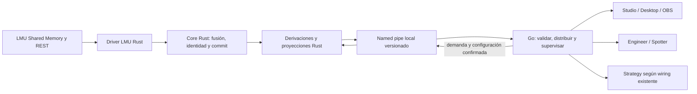

# ISA-1403 — Plan de migración del runtime live de telemetría a Rust

Fecha: 2026-09-27. Versión del plan: 1.4. Estado: diseño confirmado por Isaac;
implementación parcial hasta el corte 118. Alcance de corpus revisado el 2026-09-29.
**Paridad, integración live y gates pendientes.**

- Tarea operativa: [VAN-778](https://app.notion.com/p/3e9e51695c6581e38939fb943b184748), proyecto Telemetry Core. [GitHub #1403](https://github.com/isaacalbala12/Vantare-Simracing-Suite/issues/1403) es el puente técnico de CI.
- Rama documental: `vantareapp/isa-1403-rust-telemetry`.
- Base verificada del worktree: `origin/nightly@355e9cfee2fec3c27341fa96ec4e6a9297fab730`.
- Base actual tras rebase del 2026-09-29: `origin/nightly@c4c7a5ceb60995db191078aca03085a1e56a063e`; la línea anterior conserva la base original histórica.
- Worktree: `C:/Users/isaac/.codex/worktrees/isa-1403-rust-telemetry/Vantare-Overlays`.
- Decisión arquitectónica: [ADR 0097](../../adr/0097-rust-telemetry-child-process.md).
- Continuidad única: [handoff Telemetry Core](../../vantare-program/handoffs/telemetry-core.md).
- Entrega aislada: [PR draft #1415](https://github.com/isaacalbala12/Vantare-Simracing-Suite/pull/1415), sin autorización de merge ni gate final acreditado.

Este documento guía tareas coherentes y verificables. El ejecutable Rust
principal solo activa LMU mediante un pipe candidato explícito; no se
selecciona en Wails, retira Go ni promociona una rama.
Cada tarea ejecutable puede agrupar varios cortes técnicos
coherentes y registra su base exacta, dueño, archivos previstos, pruebas y
evidencia antes de editar. Los identificadores `Rxx` son el mapa técnico del
plan; no imponen una tarea por paso ni representan tareas ya creadas.

## 1. Resultado y alcance confirmado

Un proceso hijo Rust Windows amd64 será el único propietario productivo de
adquisición LMU Shared Memory/REST, fusión por campo, identidad, estado canónico,
derivaciones y proyecciones. Go conserva el host Wails, los servicios de producto,
supervisión del hijo y entrega a consumidores. La salida observable debe
conservar sus datos, calidad, orden, cadencias y contratos.

| Decisión confirmada | Aplicación en este plan |
| --- | --- |
| Proceso hijo local Rust | Un ejecutable distribuido con Vantare; sin servicio Windows instalado ni producto independiente. |
| LMU como único driver productivo | No portar SimX. Un driver pequeño disponible solo para pruebas Rust demuestra neutralidad del Core y degradación por capabilities. |
| Replay Rust para paridad | Harness explícito, con reloj controlado y corpus real sanitizado. No es una fuente live ni una nueva pantalla de producto. |
| Recording aún no conectado fuera | No portar ni activar el sink SQLite, MCAP, consentimiento o UI de grabación. No borrar sus contratos ni datos. |
| Analysis histórico fuera | No migrar importación, DuckDB, SessionCatalog ni proyecciones históricas de Strategy. |
| IPC por named pipes | Local, acceso restringido, versión explícita; comparar JSON y un candidato binario antes de elegir. |
| Estado y hechos diferentes | Estado completo latest-wins; facts ordenados con cursor, retención limitada y resync explícito. |
| Fallo del hijo | Desconectado visible y reinicios acotados. El rollback Go es exclusivo y temporal; nunca dos adquisiciones LMU. |
| Gate de rendimiento | Al menos 50% menos CPU en un escenario temporal real de **al menos 46 coches** frente a Go equivalente; p99 no peor y RSS agregado como máximo 110% de su base. |
| Validación física | LMU/Wails/OBS verifica funcionalidad. No sustituye el benchmark controlado ni demuestra por sí sola ahorro de CPU. |
| Crates autorizadas en Q4=C | Isaac autoriza usarlas sin límite numérico cuando faciliten este port; documentar necesidad, alternativa, licencia, seguridad, tamaño y versión de cada una. Una ampliación del alcance conserva su gate propio. |

La migración conserva Engineer/Spotter, Strategy y widgets como productos.
Rust produce sus entradas y proyecciones; no absorbe prioridades de radio,
voz, cálculo del plan estratégico, editor, permisos, cuenta o persistencia.
La retirada final afecta a la implementación Go del camino migrado. Los DTO,
validadores de frontera y adaptadores Go necesarios siguen siendo código vivo.

## 2. Evidencia de partida y lecturas obligatorias

Las rutas de esta tabla existen en la base indicada. Son evidencia de wiring,
no un inventario de archivos que se puedan borrar automáticamente.

| Frontera actual | Fuente que debe leer el worker | Consecuencia |
| --- | --- | --- |
| Composición live | [main.go](../../../cmd/vantare/main.go), `NewTelemetryCoreRuntime` alrededor de la línea 2330 | Conecta Engineer, política de rendimiento y el flag Strategy; no conecta un recorder SQLite. |
| Adquisición y selección | [telemetry_simulators.go](../../../internal/app/telemetry_simulators.go), [driver LMU](../../../internal/telemetry/drivers/lmu/driver.go) | LMU por defecto; adquisición SHM nominal de 60 Hz y REST complementario. Los tiempos reales, estados y límites se inventarían en R01. |
| Aplicación aceptada | [runtimeBatchSink.WriteBatch](../../../internal/app/telemetry_core_runtime.go), [engine.go](../../../internal/telemetry/engine/engine.go) | Preparar reducer/coordinator/derive antes del commit; proyecciones y consumidores después. |
| Derivaciones | [pipeline.go](../../../internal/telemetry/derive/pipeline.go) y sus tests | Session remaining, gaps, delta, controls history y fuel, con versiones de algoritmo independientes. |
| Overlay | [overlayv2](../../../internal/telemetry/projection/overlayv2), [Publisher](../../../internal/app/telemetrytransport/publisher.go) | Overlay V2, radar incluido; demanda y cadencia antes de proyectar/serializar. No revivir Overlay V1. |
| Engineer | [adapter.go](../../../internal/telemetry/projection/engineer/adapter.go), [engineer_port.go](../../../internal/app/engineer_port.go) | La entrada viva es `ObservationSnapshotV1`, facts y status; portar solo un `SnapshotV1` genérico sería insuficiente. |
| Strategy | `StrategyPublicTransport` en [runtime](../../../internal/app/telemetry_core_runtime.go) y [proyección live](../../../internal/telemetry/projection/strategy) | Condicionado y OFF por defecto. Mantener ese comportamiento; no presentar un nuevo consumidor live como parte de la migración. |
| Recording y replay | [sink SQLite ISA-102](../../telemetry-core/recording-sink-sqlite-isa-102.md), [replay](../../../internal/telemetry/recording/replay) | Infraestructura existente no equivale a wiring productivo. Sus dependencias históricas se conservan. |
| Prueba de otro simulador | [telemetry_simx_proof_test.go](../../../internal/app/telemetry_simx_proof_test.go) | Reemplazar la garantía arquitectónica con el driver Rust de prueba antes de retirar SimX Go sin consumidores. |
| Contrato frontend | [Taskfile](../../../Taskfile.yml), [generador](../../../tools/telemetry-contract-gen), [TS generado](../../../frontend/src/generated/telemetry.ts) | La definición wire Go y su generador siguen siendo autoridad del contrato externo durante este port. CI verifica conformidad Rust. |

Leer también [contrato de producto](../../vantare-program/product-contract.md),
[mapa de módulos](../../vantare-program/project-map.md),
[ADR 0004](../../adr/0004-telemetry-core-modular-observation-architecture.md),
[ADR 0008](../../adr/0008-telemetry-engine-commit-boundary-and-overlay-frame-v2.md),
[capabilities Engineer](../../adr/0005-engineer-projection-capability-contract.md),
[autoridad LMU](../../telemetry-core/lmu-authority-matrix.md),
[proyecciones](../../telemetry-core/runtime-projections.md),
[ADR 0094](../../adr/0094-desktop-overlay-persistent-pull.md),
[ADR 0095](../../adr/0095-overlay-incremental-sections.md) y
[canales](../../branch-channels.md). Los estados fechados de ADR antiguos no
certifican el estado remoto actual; manda el código de la base y su evidencia.

[ISA-1379](https://github.com/isaacalbala12/Vantare-Simracing-Suite/issues/1379)
es investigación previa de un tramo del mapper. No acredita este port ni el 50%.
Su lección metodológica se conserva: comparar también Go con el mismo algoritmo
para no atribuir al lenguaje una mejora de estructuras de datos.

### Seguimiento y roadmap vigentes

La tarea [VAN-778](https://app.notion.com/p/3e9e51695c6581e38939fb943b184748)
y su proyecto Telemetry Core son la autoridad operativa según el AGENTS actual
del repositorio. GitHub #1403 conserva el puente técnico de rama, código y CI.
El roadmap público se mantiene por el flujo Notion/Supabase descrito en
[roadmap-maintenance.md](../../roadmap-maintenance.md); este port aún no acredita
la mejora del 50% ni una entrega comercial. El antiguo `docs/roadmap/plan.md`
no existe en esta base y no se reconstruye.

## 3. Arquitectura a construir



### Propiedad, módulos y transición

Usar inicialmente un paquete Cargo con biblioteca y ejecutable bajo
`vantare-v2/rust/telemetry/`, con módulos de dominio, driver, engine, derive,
projection, IPC y adaptador Windows. No se necesita un framework de plugins ni
un workspace con una crate por tipo. Las rutas nuevas de este plan son
propuestas de implementación, no archivos ya existentes.

El dominio no importa Wails, UI, procesos Windows, HTTP ni LMU concreto. Un
puerto pequeño de driver se justifica por LMU y el driver de prueba. Parsers
trabajan con bytes y longitudes comprobadas; `unsafe` queda encerrado en los
adaptadores de Win32, con invariantes revisadas. Las tareas secuenciales no
necesitan otro thread. I/O cancelable y escritura IPC quedan fuera del commit.

La propiedad de buffers no cruza procesos: Rust conserva su estado; Go posee
los mensajes recibidos. Retención y copias se miden. No serializar punteros,
layouts de structs Rust ni `Instant`/la parte monotónica privada de `time.Time`.

Durante el desarrollo Go sigue siendo el backend normal. Los cortes Rust
incompletos funcionan solo en harness. Cuando la paridad completa lo permita,
una build candidata aislada podrá seleccionar Rust explícitamente para la
validación física. La selección temporal `go|rust` se resuelve al arrancar,
antes de abrir LMU; no es una opción comercial ni un fallback silencioso.

La exclusión se demuestra con un lease de adquisición compartido por ambos
backends y limitado a la instancia/sesión pertinente. Un reinicio o cambio a Go
espera la salida del hijo anterior y la liberación del lease. Si no puede
demostrarse, permanece desconectado. Un pipe roto no prueba que el proceso ya
haya muerto. El comparador usa replay sobre los mismos datos; no abre dos readers
live para observar a la vez.

### Contratos que atraviesan el IPC

| Mensaje lógico | Contenido y reglas |
| --- | --- |
| Handshake | Versión de protocolo, versión del binario/contrato, identidad de instancia y capacidades. Fallar cerrado ante versión incompatible o binario equivocado. |
| Configuración y demanda | Consumidores activos, nivel/cadencias efectivos, preferencias necesarias y revisión. ACK de aplicación en frontera de batch; reconnect reenvía el último estado completo. No introducir un segundo regulador de cadencias. |
| Snapshot por producto | Proyección completa tipada con epoch, secuencia canónica y versión de producto. Una publicación es atómica; omisión, `null`, colección vacía y cero conservan sus significados. |
| Facts | Epoch y secuencia propios, relación con el commit canónico y high-water mark. Orden y deduplicación explícitos. No coalescer como snapshots. |
| ACK/resync | ACK solo tras validar/retener y aceptar el consumidor; replay de facts dentro de una ventana limitada. Si falta historia, `ResyncRequired` con rango y nuevo snapshot/cursores; no inventar facts ni hacer pasar una pérdida por éxito. |
| Status y salud | Estado de fuente separado de salud del proceso/IPC, heartbeat y contadores sin payloads. Un heartbeat con frames congelados nunca mantiene el origen como fresh. |
| Stop | Cancelación, cierre de SHM/REST/pipe y salida comprobada dentro del límite. |

Usar un pipe dúplex con colas lógicas separadas como diseño inicial sencillo:
un snapshot pendiente por producto, una escritura en curso de tamaño máximo,
cola de control limitada y ventana acotada de facts. La prioridad de control y
el límite de cada escritura deben permitir heartbeat/stop/resync a tiempo. La
adquisición nunca espera a que Go o una ventana consuman; el writer puede
reemplazar el snapshot pendiente, no bytes de un mensaje ya enviado. Si las
pruebas muestran bloqueo entre canales, R06 debe justificar la separación
física antes de ampliarla.

R04 fija una tabla versionada con límites **numéricos** de tamaño, profundidad,
heartbeat, deadline, retención, reinicios y cierre. Partir de los límites
existentes donde aplican (p. ej. Engineer cap-1 para observaciones, 64 facts y
250 ms por callback); no confundir el tamaño de Overlay con el del mensaje
Engineer o del IPC combinado. Cada límite tiene un test de frontera y un
contador de rechazo. No conectar R19 con esa tabla incompleta.

El framing incluye longitud y tipo antes del payload, con validación previa a
reservar memoria y límites de nesting/arrays. Soportar lectura/escritura parcial,
EOF a mitad de frame, versión desconocida, mensaje duplicado y datos corruptos.
Las versiones IPC, canonical y de cada producto son independientes. No hace
falta un protocolo público de extensiones arbitrarias.

La autoridad de tipos externos sigue en Go y `telemetry:contract:check`. El
modelo interno Rust tiene tipos propios y pruebas de conformidad; no se mantiene
otro catálogo manual de semántica. JSON debe conservar rangos enteros, enums,
calidad y campos omitidos. El candidato binario usa la misma tabla de campos y
versiones; no se acepta por ser más pequeño si el decode/rehidratación Go cuesta
más. El formato externo hacia Wails/OBS/TypeScript permanece compatible.

### Tiempo, fallos y seguridad

Rust conserva UTC de recepción y tiempos de fuente, y calcula la frescura con
reloj monotónico. El harness inyecta el mismo reloj lógico a Go y Rust. Para
latencia entre procesos Windows se propone QPC con frecuencia y sesión de
arranque verificadas, no restar relojes privados de cada lenguaje. Suspensión,
reanudación y cambios del reloj civil invalidan la continuidad necesaria para
publicar fresh hasta recibir datos nuevos. [Referencia oficial de QPC](https://learn.microsoft.com/en-us/windows/win32/sysinfo/acquiring-high-resolution-time-stamps).

Go envejece la salud del transporte y publica desconectado cuando pierde el
hijo; no reconstruye valores canónicos ni convierte datos antiguos en fresh.
Reinicio crea una identidad de proceso/stream nueva, vacía colas y exige
bootstrap completo. El ID de sesión LMU no se reutiliza como epoch del IPC.
Timeout, crash, bloqueo de lectura y saturación tienen pruebas distintas.
Errores de consumidor degradan ese consumidor; rechazo precommit no avanza
estado/cursores; error interno terminal conduce a desconexión y recuperación
acotada. Agotado el presupuesto de reinicios queda un error estable y visible.

Go crea un nombre de pipe impredecible por ejecución y verifica el peer hijo.
DACL explícita restringida a la sesión de inicio de sesión pertinente, rechazo
de clientes remotos, derechos mínimos, primera instancia exclusiva y handles
no heredables salvo los estrictamente necesarios. El nombre no se trata como
credencial. La ACL por defecto de named pipes permite accesos que no queremos
para telemetría; se prueba el descriptor real. [Seguridad de named pipes](https://learn.microsoft.com/en-us/windows/win32/ipc/named-pipe-security-and-access-rights),
[opciones de CreateNamedPipe](https://learn.microsoft.com/en-us/windows/win32/api/winbase/nf-winbase-createnamedpipea).

Lanzar el ejecutable de ruta absoluta verificada junto a la app, sin buscarlo en
PATH, sin shell visible y sin heredar secretos del host. Asociarlo a un Job
Object con cierre del hijo cuando muere el host; probar también fallo al asociar
el job. Inicio, cancelación y cierre deben liberar procesos y handles. No
elevar permisos, instalar servicios o cambiar Defender. [Job Objects de Windows](https://learn.microsoft.com/en-us/windows/win32/procthread/job-objects).

## 4. Paridad y gate medible

### Corpus y verdad de los datos

El archivo [lmu-fixture.bin](../../../testdata/lmu-fixture.bin) existe, su SHA-256
verificado es `959c51421529c6157371678d8db9bcbbdc8ab3780bd5557828f2bc0d2225e5ff`
y los [tests del mapper](../../../internal/telemetry/drivers/lmu/batch_mapper_test.go)
esperan 44 vehículos. Es un snapshot útil para parsers, **no una secuencia temporal
que cubra todo el gate**. R02 requiere un corpus temporal real de al menos 46.

Isaac retiró el requisito de escenarios separados de 44 y 104 vehículos el
2026-09-29: **un escenario real de al menos 46 coches basta para la aceptación**.
El [corpus temporal LMU47 de 60 s](../../../testdata/rust-port/README.md)
contiene 3600 lecturas SHM y 239 REST con tiempos de petición reales, hashes
por evento y auditoría obligatoria en Go/CI Windows. Cumple el umbral de tamaño
y cadencia de entrada R02, pero aún no sustituye el banco G0/G1/R ni la
paridad de todas las salidas. No se ha acreditado una captura real de 104
vehículos en este worktree, pero ya no bloquea por su tamaño.
[BenchmarkEngineApply104](../../../internal/telemetry/engine/benchmark_test.go)
construye un `benchmarkBatch`; aumentar filas, repetir coches o renombrar ese
lote no satisface el gate.

Cada corpus requiere manifiesto con procedencia LMU, build/layout, SHA del
capturador, fecha/zona, SHM/REST y tiempos relativos, duración, frecuencia,
vehículos realmente observados, estados cubiertos, SHA-256 de cada archivo y
procedimiento de sanitización. Revisar nombres, IDs de cuenta y rutas; los IDs
necesarios para correlación se seudonimizan establemente. No versionar raw sin
auditoría. [Reglas de fixtures reales](../../../internal/telemetry/testdata/live-session/README.md).

Capturar desde el owner existente o con ese runtime detenido y un capturador
exclusivo. Conservar el orden/intercalado real entre SHM y REST; el harness no
rellena huecos con valores fabricados. Una ausencia se registra como tal.
El driver pequeño de prueba y las entradas adversariales sirven para tests de
contrato, nunca como evidencia LMU ni como corpus del gate CPU.

### Oráculo y comparación

El oráculo Go se fija a SHA y configuración antes de implementar Rust. Produce
salidas por etapa y por producto sobre el mismo corpus. Conservar digests y un
diff de primer desacuerdo: ID del frame/campo, valor, presencia, calidad,
procedencia, unidad, epoch y cursor. El manifest distingue:

1. Igualdad exacta para identidades, versiones, enums, flags, enteros, tiempo
   lógico, orden de facts y presencia/null/ausencia.
2. Valores flotantes comparados inicialmente sin tolerancia semántica. Si una
   operación equivalente requiere tolerancia, justificar por campo/unidad y
   magnitud antes de aceptarla; nunca cambiar umbrales de clasificaciones,
   ordenaciones, Spotter o consumo para esconder una divergencia.
3. Igualdad de bytes solo donde el contrato la exige (p. ej. replay de una
   entrega retenida); para JSON comparar estructura tipada normalizada y luego
   comprobar que el consumidor actual acepta exactamente la semántica.

No regenerar goldens desde Rust para dar por resuelta una diferencia con Go.
Un bug previo reproducido se registra como issue aparte; su corrección no se
mezcla silenciosamente con el port.

### Tres brazos y un escenario real obligatorio

| Brazo | Trabajo contado |
| --- | --- |
| G0: Go actual | Ruta completa del SHA base, con consumidores y política fijados. |
| G1: Go equivalente | Mismas estructuras/algoritmos relevantes que Rust, conservando la misma salida. Cambios solo para control experimental, sin activar una feature ajena. |
| R: Rust + Go | Adquisición/parse/fusión/Core/derive/projection Rust, encoding, escritura/lectura IPC, decode/validación y entrega Go hasta la misma frontera que G0/G1. Contar ambos procesos. |

Medir en el mismo corpus temporal real de al menos 46 coches los tres brazos;
no combinar escenarios para ocultar un fallo. Los límites de capacidad del
parser y del transporte siguen cubriendo hasta 104 vehículos por contrato.
El baseline de aceptación es **G1 equivalente**; G0 es comparación obligatoria
para mostrar el efecto frente al producto actual y separar algoritmo/lenguaje.
Registrar también cualquier regresión de R frente a G0 para revisión.

El banco reproduce los bytes reales a velocidad de captura con el mismo
adaptador de adquisición y el resto del camino productivo. Cuando requiera un
productor de SHM/REST de prueba, usa canales aislados, corpus inmutable y los
lectores/parsers productivos; mide y separa el coste del productor común. No
saltarse el mapper, poner el parse fuera del temporizador o medir únicamente
`Apply`. Precarga y verificación del corpus son setup común, fuera de la
medición en los tres brazos. Un replay sin I/O real es diagnóstico adicional,
no prueba del gate completo.

Fijar máquina, versión Windows, toolchains, modo release, flags, perfil de
rendimiento, frecuencias SHM/REST, suscripciones, layouts y fronteras de salida.
El perfil debe incluir Overlay V2 y Engineer activos; Strategy conserva su
configuración real y se verifica además con el flag explícito habilitado.
Go realiza el mismo transporte externo en cada brazo. Comparar sin reducir
datos, Hz, validación, calidad ni número de consumidores. Contabilizar frames
leídos/aceptados/rechazados, snapshots coalescidos y facts para detectar ahorro
por pérdida de trabajo.

Primero ejecutar A/A para comprobar ruido y resolución del banco. Después al
menos cinco bloques intercalados G0/G1/R sobre el corpus de aceptación, con orden alternado,
calentamiento común y ventanas de igual duración; fijar esos parámetros en
R03 antes de ver resultados Rust. No ejecutar builds, tests u otros bancos en
paralelo. Conservar todas las corridas, incluyendo las invalidadas y su causa.

| Métrica de aceptación por corpus | Cálculo y criterio |
| --- | --- |
| CPU del subsistema | Tiempo CPU kernel+usuario de todos los procesos incluidos / duración común; también expresar ms CPU por segundo y porcentaje con número de procesadores lógicos explícito. Mediana de ratios pareados `CPU_R / CPU_G1 <= 0,50`. No sumar porcentajes con denominadores distintos. |
| Latencia p99 | Desde muestra disponible en adquisición hasta salida equivalente validada/aceptada en Go; incluye esperas, IPC y cola. Comparar p99 por corrida y mediana de ratios pareados `p99_R / p99_G1 <= 1,00`; publicar distribución y máximos. No medir solo mensajes supervivientes ocultando drops o antigüedad. |
| Memoria residente | Suma simultánea de working set/RSS de Rust y receptor Go frente al proceso Go equivalente, misma fase de calentamiento/medición. Mediana de ratios de pico por corrida `RSS_R / RSS_G1 <= 1,10`; publicar también media, pico absoluto MiB, memoria privada y handles. |
| Paridad | Cero discrepancias no explicadas, mismos hechos y ausencia de pérdidas silenciosas. Una corrida con salida incompleta es inválida, aunque sea rápida. |

Publicar dispersión y ruido A/A junto a cada ratio. Un resultado en el umbral
con incertidumbre que impide decidir queda **inconcluso**, no se redondea a
PASS. Repetir solo para resolver esa incertidumbre o tras corregir un defecto
concreto del banco. R03 documenta el criterio estadístico y la regla de parada;
si el gate falla, se perfila y propone un corte acotado, sin un bucle indefinido
de optimización ni cambio unilateral del umbral.

El benchmark de codecs de R06 es preliminar. La decisión final usa todo R en
R21/R24: JSON y binario sobre las mismas proyecciones y el corpus aceptado, CPU de
ambos extremos, p99, RSS, bytes, complejidad, dependencias y diagnóstico. Si no
hay mejora repetible del binario, preferir JSON por sencillez. Si ninguno cumple
el gate, no se activa Rust por asumir que el lenguaje debería ahorrar.

## 5. Cortes de ejecución y dependencias

Cada issue ejecutable agrupa cortes con un objetivo coherente, diff pequeño y
revisable, archivos previstos, tests y evidencia. No hay un límite numérico
rígido de archivos ni obligación de crear una issue por Rxx o subcorte. Dividir
la entrega si el alcance se amplía o el diff deja de ser revisable. Las rutas
con `*` designan familias que se deben acotar, no autorización para editarlas
enteras. Cada salida requiere review del diff y pruebas reales; el resumen de
un worker no basta.

### F0 — Inventario y medición Go

| Corte | Dependencia | Entrega, archivos previstos y aceptación | Verificación de salida |
| --- | --- | --- | --- |
| R01 Inventario congelado | Plan revisado | `docs/telemetry-core/rust-port-inventory.md` y manifiesto de base/configuración. Tabla símbolo→owner futuro→consumidor→test, contratos/cadencias/límites, y resolución del destino de roadmap antes del PR. Registrar repositorio, rama, SHA y discrepancias de base. | Revisión contra wiring/callers reales; rutas comprobadas; mapa completo del camino live y lista protegida Analysis/recording. |
| R02 Corpus temporal | R01 | `testdata/rust-port/lmu47-high-rate-60s.tar.gz`, manifiesto interno y herramientas de captura sanitizada. La captura LMU 1.4.2.0 de 47 coches tiene 3600 SHM y 239 REST en 60 s con tiempos reales, hash por archivo y sanitización. Falta demostrar que los estados cubiertos bastan para toda la matriz de recuperación. | Auditoría Go de orden/reloj/hashes/parser y test obligatorio del archivo comprimido en Windows pasan; replay G0/G1/R y estados de fallo siguen pendientes. |
| R03 Oráculo y banco Go | R01; R02 para medir | El replay funcional Go del corpus LMU47 y `tools/telemetry-port-parity/compare_high_rate.py` contrastan 3839 eventos completos, con orden y tiempos originales. Falta el banco G0/G1/R bajo `scripts/bench/`: registrar receptores, CPU/p99/RSS, A/A, método estadístico y duración fijados. | Paridad funcional completa en pista estable pasó localmente; el banco debe rechazar salida omitida/digest incorrecto/corrida incompleta y publicar G0 con crudos. |

**Checkpoint F0:** contratos de salida congelados y banco capaz de detectar
diferencias. El corpus real de 47 coches habilita paridad diagnóstica; los
gates de selección final y cierre permanecen pendientes por duración, paridad
completa e integración.

### F1 — Ejecutable mínimo y frontera Windows

| Corte | Dependencia | Entrega, archivos previstos y aceptación | Verificación de salida |
| --- | --- | --- | --- |
| R04 Esqueleto y contrato IPC | R01 | `rust/telemetry/Cargo.toml`, `Cargo.lock`, toolchain fijada, entrada/lib mínima y contrato IPC documentado; separar manifiestos del protocolo si crecen. Sin LMU. Tabla numérica de límites, errores y compatibilidad; registrar necesidad, alternativa, licencia, seguridad, tamaño y versión de las crates elegidas bajo la autorización Q4=C, sin nueva aprobación individual. | Build Windows amd64 reproducible con `--locked`, pruebas de versiones/framing y salida limpia; no contiene datos de simulador inventados. |
| R05 Pipe seguro y supervisor | R04 | `internal/app/telemetryprocess/` y adaptador Windows Rust, en cortes separados por lenguaje. Lanzar hijo controlado, verificar peer, DACL, lease, Job Object, shutdown y límite de reinicios. Aún harness. | Tests Windows de ACL/cliente inválido, doble arranque, host/hijo muerto, timeout, asociación fallida del job y cero procesos/handles propios tras cierre. |
| R06 Conformidad y codecs | R03–R05 | `rust/telemetry/src/ipc/`, corpus wire Go y tests Go del receptor. Roundtrip de los contratos reales, benchmark JSON/binario preliminar y pruebas de colas sin adquisición live. | Framing parcial/corrupto, límites, entero/float/null, versiones, slow-reader y fuzzing del decoder; contadores demuestran boundedness y orden/resync. Informe comparativo, codec final aún pendiente. |

**Checkpoint F1:** IPC no bloquea el futuro commit, no permite otro owner y
puede cerrarse aun con un peer bloqueado. Los límites no quedan como TODO.

### F2 — Driver LMU y Core neutral

| Corte | Dependencia | Entrega, archivos previstos y aceptación | Verificación de salida |
| --- | --- | --- | --- |
| R07 Dominio y puerto de driver | R03–R04 | Módulos `domain/`, catálogo mínimo usado y `driver.rs`; empezar por tipos/IDs/calidad y ampliar con cada corte. Driver solo de tests bajo `tests/support/`. Declarar presencia, procedencia, capacidades, epoch e identidad sin LMU en Core. | Conformidad de tipos contra Go, tests de ausencia/cero/invalid y arquitectura. Driver de prueba alcanza una proyección mínima con capacidades degradadas, sin registrarse en binario productivo. |
| R08 SHM LMU | R02, R07 | `src/lmu/{layout,reader,parser}.rs` y tests de fixtures. Portar layouts y compatibilidad comprobados, snapshots consistentes, límites y cierre de mapping. | Mismos campos/errores Go en capturas; truncado, IDs duplicados, 0/104/límite excedido, offsets, versión desconocida, fuzzing de parsers y contadores sin payload. Windows con mapping privado del harness. |
| R09 REST y fusión | R08 | `src/lmu/{rest,fusion}.rs` y tests. Endpoints, cadencias, timeouts/cancelación y autoridad por campo iguales al baseline; no crear rivales desde REST. | Replay de intercalado SHM/REST; fresh/stale/missing/invalid/0/false, conflicto, REST caído, SHM congelado y salida de menú. |
| R10 Mapping e identidad | R09 | `src/lmu/mapper.rs`, tipos de batch y tests. Slots, gracia, generation, player/vehicle/team/driver/stint y cursores equivalentes. | Diffs de batches contra Go; desaparición/reaparición, reordenación, cambio de piloto/player, sesión y retry. Rechazo posterior no deja cursor del mapper adelantado. |
| R11 Reducer | R10 | `src/core/reducer.rs` y tests. Validación, estado owned y candidate/commit; sin I/O ni productos. | Replay Go/Rust de estado observado, duplicate/out-of-order, mutación de entrada/salida y fallo precommit. |
| R12 Sesión y facts | R11 | `src/core/session.rs`, `facts.rs` y tests. Coordinar identidades, secuencia de facts y retención con límites, sin confundir reconnect con sesión nueva. | Oráculo de facts; overflow, slot churn, cambio sesión/stint, wrap/rechazo de cursores, resync y sin duplicación al reintentar. |

**Checkpoint F2:** bytes reales→batch→estado/facts equivalentes. El driver de
prueba pasa por el mismo puerto; no portar SimX ni introducir un registry de plugins.

### F3 — Derivaciones, commit y proyecciones

R13 y R15 son familias de subcortes técnicos. Cada fila tiene módulo, prueba y
manifest de paridad propios; una issue puede agrupar varias filas coherentes
manteniendo una revisión clara de cada resultado.

| Subcorte | Dependencia | Entrega prevista | Criterio de salida y prueba |
| --- | --- | --- | --- |
| R13a Session remaining | R12 | `derive/session_remaining.rs` + test | Calidad/unidades y límites temporales iguales a Go con reloj lógico. |
| R13b Controls history | R13a | `derive/controls.rs` + test | Misma ventana y muestras con CapturedAt, ausencia/0 y reset; boundedness y ownership. |
| R13c Relative gaps | R13b | `derive/gaps.rs` + test | Tráfico multiclass, vueltas, progreso y clasificación; exactitud semántica contra Go. |
| R13d Delta | R13c | `derive/delta.rs` + test | Referencia explícita, trazas reales y continuidad por sesión/stint; ningún valor inventado. |
| R13e Fuel | R13d | `derive/fuel.rs` + test | Consumo por vuelta, histories, pits/refuel y calidad/ventanas exactas. |
| R14 Commit integrado | R13e | `engine.rs`, `derive/mod.rs` y tests | Prepare/validate/reduce/derive/facts/commit atómico, incluidos cursores/estado del mapper cuando corresponda; error en cada etapa seguido de retry no diverge. Comparar con `TestApplyIsAllOrNothing` y `TestApplyRetryDoesNotDivergeCursors`. |
| R15a Session/player/capabilities | R14 | `projection/overlay/session_player.rs` + tests | Primer camino completo bytes reales→Rust→IPC→receptor Go→Overlay V2. Tipos y campos reales, cero reconstrucción de dominio en Go. |
| R15b Controles/history | R15a | `projection/overlay/controls.rs` + test | Misma ventana/timestamps, cadencia y calidad para Pedals/Input Telemetry. |
| R15c Fuel/damage/weather | R15b | Builders y tests bajo `projection/overlay/`, con evidencia por builder | Golden y ausencia/invalid exactos; separar la entrega si el alcance o diff lo requiere. |
| R15d Delta | R15c | `projection/overlay/delta.rs` + test | Misma referencia, modo y semántica del widget actual. |
| R15e Standings/relative | R15d | Builders y tests con evidencia por resultado | Orden, clases, gaps, selección, corpus real ≥46 y cambios sin identidad nueva; revisar cada builder como subcorte técnico. |
| R15f Espacio/spotter/radar | R15e | Builders espaciales y tests en cortes acotados | Geometría, orientación, frescura, límites y capacidades coinciden con Go y ADR de producto; incluir pruebas ISA-1388. |
| R15g Scheduler y cachés | R15f | `projection/overlay/cadence.rs` y tests | Demanda/dirty/valores que envejecen; conservar tabla efectiva y secciones, sin omitir cambios por coalescing ni reapertura. |
| R16 Engineer | R14; R06 | `projection/engineer/`, adaptador receptor Go y tests en cortes por snapshot/facts/status | `ObservationSnapshotV1`, facts y status reales, capabilities y boundary; oráculo/replay de Engineer y prueba de consumidor lento. La lógica de radio/Spotter de producto permanece en Go. |
| R17 Strategy | R14; R06 | `projection/strategy.rs` + tests | Contrato live equivalente; cero trabajo sin destino y paridad con transporte explícito habilitado. Analysis/Strategy históricos continúan sus tests sin migración. |

**Checkpoint F3:** todas las salidas live del inventario tienen paridad, no solo
un frame visual. El oráculo Go no es una dependencia productiva del ejecutable Rust.

### F4 — Camino completo, recuperación y decisión de formato

| Corte | Dependencia | Entrega, archivos previstos y aceptación | Verificación de salida |
| --- | --- | --- | --- |
| R18 Ensamblado con replay | R15g–R17 | El replay LMU47 produce 3839 Overlay/Engineer/Strategy/facts con paridad Go y cruza el pipe Windows, receptor y Publisher reales: 3839 entregas por producto y un fact pasaron localmente. Faltan bootstrap/reconnect de otros estados, cadencia temporal y medición de adquisición productiva y ruta completa. | Paridad de pista estable y entrega por pipe pasaron; CPU preliminar de 60 s con encode/decode y entrega Go, recuperación y otros estados siguen pendientes. |
| R19 Composición de candidato | R05, R18 | Fachada de backend en `internal/app/`, selección temporal en `cmd/vantare/main.go` y tests de lifecycle. Rust explícito en build aislada; Go por defecto hasta gates. | Un solo owner, start/stop idempotentes, cambio de política/demanda confirmado, apertura/cierre Studio/Desktop/OBS, Strategy OFF conserva ausencia de trabajo. |
| R20 Fallos y observabilidad | R19 | Supervisor/IPC y tests de fallo; métricas sanitizadas de proceso, colas, edad, rechazos, restart y resync. Agrupar por objetivo verificable y separar fronteras si el diff deja de ser revisable. | Matriz de §6, incluyendo crash durante entrega de facts, peer colgado, cola llena, suspensión, Stop concurrente y replay tras nueva instancia; ninguna pérdida silenciosa ni estado fresh congelado. |
| R21 Formato y Go equivalente | R18, R20; R02 completo | Comparar JSON/binario en la ruta completa y construir G1 documentando cada diferencia algorítmica de G0. Elegir un codec de producción y registrar decisión/evidencia en ADR; retirar prototipo no elegido del producto. | Mismo corpus real ≥46 y mismos productos/frecuencias; paridad G0/G1/R; CPU/p99/RSS de ambos extremos. Selección justificada, sin promesa del gate final. |

**Checkpoint F4:** candidato listo para empaquetar y probar físicamente. La
elección de codec es una salida medible, no una preferencia de lenguaje.

### F5 — Build, distribución y aceptación

| Corte | Dependencia | Entrega, archivos previstos y aceptación | Verificación de salida |
| --- | --- | --- | --- |
| R22 Build Windows | R21 | Toolchain fijada y `build/windows/Taskfile.yml` + tarea Rust correspondiente. Target `x86_64-pc-windows-msvc`, lockfile, release y recursos/versiones. Sin instalar toolchain en el PC del usuario final. | Build limpio Windows amd64; logs de versiones y hash; `cargo test` debug/release, fmt/clippy, Go y contrato TS. Comprobar requisitos runtime en Windows 10/11 según soporte del producto. |
| R23a Packaging | R22 | Scripts existentes de instalador/portable/checksums y manifest de helper, acotados en la issue. Host+hijo salen del mismo build y se actualizan/revierten juntos. | Instalación, portable, actualizar y volver a build anterior en entorno aislado sin Rust instalado; falta/corrupción/versión incorrecta del hijo falla explícita. Sin publicar release. |
| R23b CI | R22 | `.github/workflows/branch-channel-gates.yml` y gate Rust/paridad Windows asociado. Checks de contrato, tests, build y artifact completeness en SHA exacto. | Ejecutar el workflow real sobre PR draft cuando exista; ninguna omisión/Skip de corpus requerido cuenta como éxito. No cambiar rulesets, secretos, permisos ni activar promociones. |
| R24 Funcionalidad física y soak | R20, R23a | Informe en `docs/telemetry-core/evidence/isa-1403/`, manifiesto de binarios/logs sanitizados y checklist §6. | Sesión LMU/Wails/OBS con menú/garaje/pista/tráfico/boxes/sesión/reconnect/cierre; replay soak de dos horas lógicas y sesión física con duración registrada. Consumidores y canales verificados; prueba física pendiente hasta realizarla. |
| R25 Gate de CPU final | R21–R24; corpus real ≥46 completo | Crudos G0/G1/R, hashes, configuración, método y resumen reproducible de §4 sobre el candidato empaquetado. | Los tres límites pasan en el corpus aceptado, paridad intacta y evidencia repetida. Revisión del banco independiente. Si un gate falla, mantener Go como opción productiva. |

El target MSVC dispone de herramientas host y exige Windows 10 o posterior;
registrar la versión concreta elegida de Rust y Build Tools en R22.
[Plataforma oficial Rust Windows MSVC](https://doc.rust-lang.org/rustc/platform-support/windows-msvc.html).
El ejecutable versiona `Cargo.lock` y usa resolución fijada. En **Q4=C Isaac
autorizó crates sin límite numérico cuando faciliten este port**; no se vuelve
a pedir aprobación por cada crate dentro de ese alcance.
[Cargo.toml y Cargo.lock](https://doc.rust-lang.org/cargo/guide/cargo-toml-vs-cargo-lock.html).

R04 elige las bibliotecas de pipes, concurrencia, serialización o HTTP necesarias
con un registro por crate: necesidad, alternativa más simple o existente,
licencia, evaluación de seguridad, impacto en tamaño y versión fijada. La
autorización no elimina esa evaluación técnica. Si una dependencia amplía el
alcance del producto, aplica el gate de alcance antes de incorporarla.

### F6 — Retirada y cierre

| Corte | Dependencia | Entrega, archivos previstos y aceptación | Verificación de salida |
| --- | --- | --- | --- |
| R26 Retirada por consumidores | R25 y aceptación del candidato | Cortes por Go acquisition/mapper, Core/derive, builders, SimX y selector temporal, agrupables en issues coherentes. Inventariar imports/callers y conservar DTO/transporte e infraestructura histórica con consumidores. No borrar directorios de golpe. | Cero callers productivos de lo retirado; tests de arquitectura Rust/Go; driver neutral de prueba reemplaza la garantía SimX. Go de referencia vive en SHA/artefacto de harness, no como segundo engine del producto. |
| R27 Verificación tras retirada | R26 | Informe sobre SHA/binario final; actualizar doc de operación y rollback. Go ya no adquiere ni calcula el camino live; Rust único owner y dependencias históricas preservadas. | Suites completas/generador/build/packaging/CI; repetir gates de paridad y CPU/RSS/p99 afectados por la retirada, y smoke físico del binario final. Nada se certifica solo con la build anterior. |
| R28 Entrega para canal | R27 | Plan/checklist, handoff, issue y roadmap reconciliado reflejan estado exacto; PRs draft/review sin hallazgos bloqueantes. | Revisar diff y evidencia, conservar rollback comprobado y enumerar SHA/base/PR/CI. Pedir autorización específica de Isaac antes de Nightly; Testers/Master/release siguen sus propios gates. |

**Cierre del port:** R27 aprobado, Go productivo de telemetría retirado, paridad
y gates demostrados en el candidato final, packaging completo y prueba física
real. R28 diferencia entrega en rama de integración/publicación. La issue puede
seguir abierta si falta evidencia, aunque el código compile.

## 6. Matriz de verificación y evidencias

| Riesgo o flujo | Evidencia obligatoria | Referencia actual a preservar |
| --- | --- | --- |
| Estado parcial al fallar | Fallo inyectado antes de cada commit, retry idéntico y comparación de cursores/estado/facts | [engine tests](../../../internal/telemetry/engine/engine_test.go), [ownership](../../../internal/telemetry/engine/commit_s32_ownership_test.go) |
| Semántica LMU | Fuentes en conflicto, tiempo congelado, REST lento/caído, SHM missing/versionado, arrays corruptos, cero/false válidos | [tests LMU](../../../internal/telemetry/drivers/lmu), autoridad y capabilities |
| Ventana o Engineer lentos | Estado cap-1, facts retenidos o resync visible, Core progresa, métricas limitadas | [consumer tests](../../../internal/app/telemetry_core_runtime_consumer_test.go), [Engineer](../../../internal/app/telemetry_core_engineer_test.go) |
| Hijo/proceso colgado | Kill/crash antes/después de handshake y en escritura, deadline, presupuesto agotado, Job Object y cierre | [lifecycle harness](../../../cmd/vantare/telemetry_lifecycle_harness_test.go) + tests Windows nuevos |
| Salud falsa | Frames sin avanzar aunque heartbeat llegue, envejecimiento, reconexión y suspensión/reanudación | [watchdog tests](../../../internal/app/telemetry_core_runtime_watchdog_test.go), [frozen remnant](../../../internal/telemetry/drivers/lmu/frozen_remnant_test.go) |
| Pérdida de facts | Duplicados, huecos, ACK perdido, overflow y crash entre recepción/ACK/consumo; resync reinicia contexto explícitamente | [fact cursor/resync](../../../internal/telemetry/projection/engineer/fact_cursor_test.go) y puerto Engineer |
| Diferencias visuales | Mismos frames en renderer actual, goldens/contrato y luego Windows físico; Radar con orientación comprobada | [radar](../../../internal/telemetry/projection/overlayv2/builder_radar_test.go), tests frontend existentes |
| Memoria/handles | Boundedness con churn de sesiones/slots/ventanas y reconexión; conteo inicio/fin y tendencia de RSS | [soak](../../../internal/app/telemetry_core_hardening_test.go) + harness Rust |
| Frontera local insegura | Peer incorrecto, pipe preexistente, cliente de otra sesión, remoto rechazado, longitudes desbordadas | DACL/flags efectivos y pruebas de protocolo Windows |
| Distribución incompleta | Instalador y portable contienen hijo correcto; actualización/rollback de la pareja, sin procesos residuales | `build/windows/` y flujo actual de checksums |

Checklist de la sesión física del candidato:

- LMU cerrado/menú: estado honesto sin valores de pista fabricados.
- Garaje, outlap y vueltas: instrumentos, Delta/Fuel, Standings/Relative,
  mapa/Radar y calidad coinciden con el escenario; anotar los casos realmente vistos.
- Tráfico a ambos lados y paso por boxes: Spotter/Engineer, radio y facts sin
  duplicados ni avisos de un contexto anterior; no convertir un replay de audio
  en prueba física de geometría.
- Desktop, OBS y reapertura de Studio: snapshot inicial completo, mismas
  proyecciones, fluidez y cadencias; OBS desconectado no bloquea el juego/Core.
- Cerrar/reabrir LMU y matar el hijo: stale/desconectado, reinicio acotado y
  recuperación con bootstrap; Go no empieza a leer mientras el hijo vive.
- Cerrar Vantare y volver a abrir: sin helper, reader o pipe residual.

Registrar fecha, Windows, LMU, SHA y hashes de ambos binarios, perfil,
consumidores, duración, acciones realizadas, métricas y limitaciones. Un caso
no observado (p. ej. driver swap) queda pendiente o se cubre con una captura
real específica; no marcar toda la matriz por haber abierto la app.

### Comandos de gate previstos

Ejecutar desde `vantare-v2/` en cada corte según archivos afectados. Son
**comandos de la implementación futura**, no resultados ejecutados por este plan.

```powershell
pnpm --dir frontend build
go test ./...
go test -race ./internal/telemetry/... ./internal/app/...
task telemetry:contract:check
cargo fmt --manifest-path rust/telemetry/Cargo.toml --all -- --check
cargo clippy --manifest-path rust/telemetry/Cargo.toml --all-targets --locked -- -D warnings
cargo test --manifest-path rust/telemetry/Cargo.toml --locked
cargo test --manifest-path rust/telemetry/Cargo.toml --release --locked
cargo build --manifest-path rust/telemetry/Cargo.toml --release --locked --target x86_64-pc-windows-msvc
task windows:build ARCH=amd64
git diff --check
```

El build frontend precede a Go cuando falta `frontend/dist` embebido. Si cambia
contrato/frontend ejecutar además `pnpm --dir frontend test`, `typecheck` y
`lint`; `tsc --noEmit -p tsconfig.json` no valida este repo. `-race` exige un
toolchain compatible; si no lo hay, registrar la omisión y obtener ese gate
en CI compatible, sin llamarlo PASS. Añadir en R03/R06 los comandos exactos de
paridad/banco que se creen y exigir exit code fallido ante datos ausentes.

Los fallos previos se reproducen también en la base y se identifican por
separado; no se relajan tests ni se declaran suites completas verdes con fallos.

## 7. Rollback y límites de autonomía

| Momento | Vuelta atrás verificable |
| --- | --- |
| Cortes de harness | Mantener backend Go; descartar el cambio en la rama del corte sin tocar datos o checkouts ajenos. |
| Candidato dual durante validación | Cerrar el hijo, esperar su salida y confirmar lease libre; reiniciar con Go explícito. Invalidar stream/colas y dar bootstrap completo. La selección no conmuta sola tras error. |
| Rust único después de R26 | Volver a la pareja host/helper y SHA anteriores verificados. El nuevo binario no contiene un engine Go oculto de fallback. |
| Tras integración autorizada | PR de revert a su mismo canal, con gates; nunca force-push ni salto a Testers/Master. |

Detener el corte y registrar la causa ante conflicto de cambios ajenos, base
distinta, dependencia que amplíe el alcance sin cubrir su gate, cambio de contrato
no cubierto, verificación imposible o fallo de gate sin explicación. Las crates
que facilitan el port dentro del alcance ya están autorizadas por Q4=C. La arquitectura aquí confirmada
permite planificar y ejecutar sus cortes cuando se autoricen; no autoriza
rediseñar otros productos o ampliar el port a histórico/recording.

Riesgos abiertos: corpus temporal 44/104 aún por acreditar, coste fijo del IPC y
del segundo proceso, diferencias de precisión/orden temporal, complejidad de
Windows lifecycle, packaging de dos binarios y acoplamientos Go compartidos con
histórico. R02, R06, R10/R14, R05/R20, R23 y R26 aportan respectivamente la
evidencia que los cierra. Ninguno se resuelve con una promesa de rendimiento.

## 8. Estado de esta entrega documental

- Se crea este plan y la ADR 0097; se actualiza el handoff vivo.
- Base y árbol inicial limpios verificados; inventario dirigido de código y
  tests, issue #1403/antecedente #1379 y documentación oficial consultados.
- Sin código, tests, configuración de build, workflow ni dependencia modificados.
- Pruebas de producto, benchmarks y sesión LMU/Wails/OBS no ejecutados: todavía
  no existe implementación Rust de este plan.
- Issue #1403 abierta y sincronizada con el alcance confirmado y las correcciones
  de revisión. Identifica la revisión documental completada y el enlace de rama
  como previsto, todavía sin commit/push.
- Checks documentales: diff sin errores de whitespace, 51 enlaces locales
  existentes y fences/codificación comprobados. Revisión del orquestador
  completada: autorización Q4=C y agrupación de cortes técnicos en issues
  coherentes.
- Sin commit, push, PR, CI nuevo, merge, promoción o release de esta entrega.

Al aceptar cada corte, añadir su evidencia al handoff y a la issue que lo agrupa, sin convertir
este plan en otro historial. Conservar las casillas de cierre pendientes hasta
que exista el artefacto verificable correspondiente.

## 9. Inicio de ejecución (2026-09-27)

- R01: [inventario inicial](../../telemetry-core/rust-port-inventory.md) contrastado
  con la base y consumidores live. Sigue parcial por la discrepancia de destino
  del roadmap antes del primer PR; R02 debe acreditar corpus temporal real.
- R04: `rust/telemetry/` contiene ejecutable inerte, toolchain fijada, lockfile
  sin crates externas y [framing IPC v1](../../telemetry-core/rust-ipc-v1.md).
  La tabla de límites/compatibilidad y conformidad Go no estaban completas; no
  conectar el pipe ni declarar R04 terminado.
- Verificación Rust local: `cargo fmt --check`, `cargo test --locked` (5 tests),
  `cargo clippy --locked --all-targets -- -D warnings` y
  `cargo run --locked -- --version` pasan. No hay gate de rendimiento medido.
- La [issue #1403](https://github.com/isaacalbala12/Vantare-Simracing-Suite/issues/1403)
  registra el inicio. Go sigue siendo la única ruta productiva.

## 10. Continuación del framing (2026-09-27)

Se añadió el receptor Go de framing bajo `internal/app/telemetryprocess/`.
Rust y Go validan los mismos bytes wire fijos para los nueve tipos, rechazan
versiones y tipos desconocidos, tramas incompletas, bytes sobrantes en decoder
de buffer y payloads mayores de 8 MiB. Se probó el borde exacto y el I/O
parcial. `go test -p 1 -count=1 ./...`, `cargo test --locked --release`,
`cargo fmt --check` y Clippy pasaron. El receptor no abre un pipe ni inicia
el hijo. La tabla de lifecycle y payload sigue pendiente, por lo que R04
continúa parcial. No hay corpus temporal real 44/104 ni prueba del gate CPU.

## 11. Harness Windows Go/Rust (2026-09-28)

El corte R05 avanza en el mismo worktree: Go reserva un named pipe local con
DACL de sesión, nombre aleatorio, rechazo remoto, primera instancia única y
comprobación del PID cliente. Arranca el hijo suspendido, lo asocia a un Job
Object con cierre en cascada y solo entonces lo reanuda; el entorno del hijo
es vacío. Rust implementa un modo de harness sin LMU que envía nonce y versión
en Handshake y espera Stop. La prueba conjunta con el binario Rust `release`
verificó handshake, Stop y salida 0. Tests Windows cubren timeout de conexión,
instancia duplicada, PID incorrecto, fallo de asociación y terminación sin
proceso residual. No es todavía un supervisor conectado a Wails; faltan las
colas, payloads reales, deadlines de I/O, configuración y reinicios. R04/R05
siguen parciales y no se activa el backend Rust productivo.

## 12. Primer corte R03/R08: oráculo y admisión LMU (2026-09-28)

Se fijó un checkpoint del parser Go sobre el snapshot real LMU 1.3 de 44
coches: SHA de entrada `959c51421529c6157371678d8db9bcbbdc8ab3780bd5557828f2bc0d2225e5ff`
y SHA de la observación JSON completa con reloj fijo
`2c61c6948e4dd1ecea4f4ae93bbc5eee1d40a4ad4bc4260ec88535cf379393c2`.
El test Go falla si cambia la salida fijada. Rust admite la estructura LMU 1.3
solo con evidencia de build verificada por el llamador, valida tamaño, recuento,
texto de sesión, filas scoring/telemetry biyectivas y jugador único. Ambos
lados prueban la fixture de 44 y rechazos por truncado, 105 vehículos, ID de
telemetría duplicado, texto sin terminador y jugador duplicado. Esta admisión
no porta aún los campos canónicos, REST, adquisición ni proyecciones; el
snapshot aislado tampoco cumple R02 ni acredita el umbral CPU. R03/R08 siguen
parciales.

## 13. Lector SHM Rust acotado (2026-09-28)

R08 añade un owner Windows de `LMU_Data` en solo lectura. Abre el mapping por
nombre, solicita exactamente `ObjectOutSize`, copia a un buffer del tamaño
esperado y repite la copia como máximo tres veces hasta obtener dos snapshots
idénticos. Un mapping más pequeño falla al mapear; un buffer de destino de
tamaño incorrecto y una lectura siempre cambiante se rechazan. `Drop` libera
vista y handle. La prueba usa mappings privados, sin abrir una segunda vista
productiva de LMU. Sigue pendiente la evidencia de lectura física con LMU,
cancelación del driver, conexión con el parser y el pipeline completo.

Las firmas y el comportamiento de mapping se contrastaron con la documentación
de Microsoft para [OpenFileMapping](https://learn.microsoft.com/en-us/windows/win32/api/memoryapi/nf-memoryapi-openfilemappingw),
[MapViewOfFile](https://learn.microsoft.com/en-us/windows/win32/api/memoryapi/nf-memoryapi-mapviewoffile) y
[CreateFileMapping](https://learn.microsoft.com/en-us/windows/win32/api/memoryapi/nf-memoryapi-createfilemappingw).

## 14. Calidad y escalares de sesión Rust (2026-09-28)

R07/R08 avanzan con `Field<T>` interno: ausente carece de valor, mientras cero,
`false` e inválido conservan presencia y procedencia, como el contrato Go.
La admisión LMU 1.3 publica recuento/jugador y track, longitud, tipo, reloj
de origen, fin, vueltas máximas y lluvia con la calidad que aplica el parser
Go. Las fixtures reales estáticas de pista (44) y menú (0) y casos de cuenta
atrás, vueltas ilimitadas, lluvia NaN y overflow de duración pasan en Rust.
El parser Rust aún no produce todas las filas/observaciones canónicas ni
conecta los consumidores. La máquina local tiene instalado LMU `1.4.2.0`
(FileVersion y ProductVersion del ejecutable), sin proceso LMU activo en esta
verificación. La build instalada no está en la allowlist actual; no se usa
para acreditar el corpus ni se añade sin captura y revisión de layout.

## 15. Filas scoring LMU 1.3 en Rust (2026-09-28)

R08 ya extrae las filas scoring válidas en orden de origen, con identidad de
slot, nombres sanitizados del fixture, clase, posición, vueltas, sector,
distancia, tiempo de progreso, tiempos de vuelta, box, penalizaciones y gaps.
Conserva los sentinels negativos como ausencias, cero/false observados y
normaliza el patrón sin evidencia de progreso (todos los tiempos cero con
distancias distintas) igual que Go. La fixture real de 44 valida el jugador,
ceros legítimos y tiempos de vuelta ausentes. Todavía faltan los campos
espaciales, fast telemetry del jugador, damage, REST, fusion, identidad
canónica y todos los productos; esta estructura no sale aún del harness.

## 16. Campos rápidos y espaciales LMU 1.3 en Rust (2026-09-28)

R08 ya correlaciona por ID la fila de telemetría del jugador con scoring y
extrae vuelta, marcha, RPM, velocidad, pedales, combustible, delta, desgaste
de neumáticos y daño. También valida posición, velocidad local y orientación
de cada coche, prefiriendo los valores rápidos del jugador cuando son frescos
y usando scoring cuando no lo son. Los casos adversariales preservan la
diferencia entre ausente e inválido. Rust release (18 tests), formato y Clippy
pasan sobre las fixtures estáticas existentes. Todavía no hay comparación
campo por campo automatizada frente a Go, corpus temporal 44/104 SHM+REST,
REST/fusión, salida canónica, integración productiva ni medición del objetivo
de CPU. R08 sigue parcial y Go sigue siendo el único backend productivo.

## 17. Primer corte de decodificación REST Rust (2026-09-28)

R09 inicia con decodificación acotada (4 MiB) de `standings` y `sessionInfo`.
Valida tipos del documento antes de publicar, conserva cero/false frente a
ausente e inválido, mantiene el número de coche como string y descarta slots
duplicados. Los sensores de temperatura y humedad se validan por separado;
el amarillo global solo se afirma para 2–5. Tipos temporales prueban TTL
monotónico, preservan inválido/ausente y descartan identidades caducadas; aún
no los conecta un poller HTTP. No hay fusión ni salida canónica. Los cuerpos de prueba reproducen
casos de los tests Go; no son captura live ni acreditan R02.

Se incorpora `serde_json 1.0.151` bloqueado en `Cargo.lock` bajo la
autorización Q4=C ya registrada para crates justificadas. Es necesario para
validar JSON REST con un parser mantenido y límites de entrada; Rust std no
ofrece parser JSON. Un parser propio sería más código y más superficie de
errores. Dependencias runtime: `serde_core`, `itoa`, `memchr` y `zmij`, con
licencias MIT/Apache-2.0, Unlicense/MIT o MIT según `cargo metadata` local.
Riesgos: asignaciones de `Value`, actualización de supply chain y equivalencia
de casos límite; se miden y revisan antes del gate CPU y del backend candidato.
Rust release (23 tests), formato y Clippy pasan en este corte.

## 18. Transporte REST loopback aislado (2026-09-28)

R09 añade un cliente HTTP bloqueante solo para `127.0.0.1`, puerto LMU
`6397` (inyectable en tests), dos rutas fijas, sin proxy ni seguimiento de
redirecciones, con deadline total de 750 ms y lectura acotada a 4 MiB + 1.
Clasifica estados HTTP/timeout/errores sin publicar cuerpos fallidos. Los
tests locales comprueban rutas, 404, rechazo de redirect, límite de cuerpo y
timeout de un servidor bloqueado; Rust release (27/27), formato y Clippy pasan.
Todavía no existe loop de polling con cancelación, cache/TTL conectada, ni
consumo de datos por el proceso hijo; el cliente no es backend productivo.

`ureq 3.4.2` (sin features por defecto/TLS) se añade bajo Q4=C. Se eligió
para HTTP/1.1 loopback con conexión reutilizable, timeouts y manejo de
respuestas; Rust std no incluye HTTP. Implementarlo a mano o mediante FFI
WinHTTP aumentaría el código de protocolo/unsafe. El árbol runtime bloqueado
añade `ureq-proto`, `http`, `httparse`, `bytes`, `base64`, `log`,
`percent-encoding` y `utf8-zero`; `cargo metadata` local reporta licencias
MIT o MIT/Apache-2.0. Riesgos pendientes: dependencia adicional, tamaño,
latencia de cierre del I/O bloqueante y paridad de cancelación. Antes de
conectar el runtime, el cierre debe probar su límite y la comparación CPU/RSS
debe incluir el coste del cliente; no se atribuye aquí la mejora del 50%.

## 19. Poll REST aislado y cache transaccional (2026-09-28)

R09 une transporte y decodificación en un `poll_once` secuencial con reloj
monotónico inyectado y comprobación de cancelación antes y entre endpoints.
Cada endpoint reemplaza sus campos solo tras decodificación completa; una
respuesta malformada cambia salud y deja envejecer los valores anteriores.
El TTL conserva calidad inválida/ausente, marca stale los valores frescos y
descarta números de coche al caducar desde el inicio de su solicitud.
Tests locales verifican ambos endpoints, cancelación intermedia y un poll
malformado tras uno válido. Rust release 30/30, formato y Clippy pasan.
El I/O bloqueante en curso termina por el deadline de 750 ms; todavía no hay
loop de cadencia/backoff, cancelación inmediata del socket ni salida del
cache hacia fusión/core/IPC. Este poll aislado no certifica la paridad live.

## 20. Primer join REST/SHM de identidad (2026-09-28)

La fusión Rust inicial solo añade car number a filas ya admitidas por SHM.
Requiere slot inequívoco, etiqueta de vehículo coincidente, poll REST dentro
de 2 s y solicitud iniciada después del floor de sesión que recibe del
orquestador. Nunca crea filas; cada nueva unión borra primero números antiguos.
Dos tests usan la fixture SHM real de 44 con REST de prueba y verifican
coincidencia, slot inexistente, sesión nueva, nombre distinto y TTL. Un estado
aislado eleva el floor al cambiar la firma fresca pista/tipo o ante reset del
reloj de fuente; todavía debe conectarse al driver. Son tests de contrato de
join, no corpus temporal real de REST ni aceptación R02. Faltan arbitraje de
todos los campos equivalentes, diagnósticos de conflicto, salida canónica y
paridad de replay. Rust release 33/33, formato y Clippy pasan.

## 21. Arbitraje inicial de escalares SHM/REST (2026-09-28)

Rust resuelve campos equivalentes por calidad fresh, stale e inválida, con
SHM como fuente preferida dentro de cada nivel; registra fuente, fallback y
conflicto. Solo clona el valor elegido. El reloj de fuente compara tiempos
proyectados al instante de fusión con tolerancia de 500 ms. La proyección de
sesión cubre reloj, pista, tipo, recuento y presencia del jugador. La del
jugador cubre posición, vueltas y paradas, y exige una fila de jugador SHM
antes de considerar REST; en menú permanece ausente. Los tests comprueban
prioridad, degradación, conflicto y menú sobre la fixture SHM estática y REST
de prueba. Falta publicar una observación canónica completa, decisiones de
todos los campos, campos de clima, envejecimiento integral de filas y replay
temporal 44/104. El gate CPU sigue sin medición.
Rust release 37/37, formato, Clippy y build Windows release pasan.

## 22. Clima REST ligado a sesión (2026-09-28)

La proyección de clima Rust conserva la lluvia nativa SHM y añade ambiente,
pista, humedad y bandera amarilla de REST con calidad independiente. El floor
de sesión retira todos los campos REST de una solicitud anterior al cambio de
sesión, incluso dentro del TTL; invalidez de un sensor no contamina a los
demás. Una prueba con la fixture SHM estática y cuerpo REST de prueba cubre
inválido, cero, amarillo, floor y stale. Aún no está conectada al loop del
driver ni a los productos; la congelación de reloj de fuente y paridad live
siguen pendientes.
Rust release 38/38, formato, Clippy y build pasan.

## 23. Diagnóstico de coste del parser estático (2026-09-28)

Se añade `cargo bench --locked --bench parse_lmu` sin dependencias nuevas.
Cronometra solo admisión Rust de la fixture SHM real estática de 44 coches,
con 10 000 iteraciones de calentamiento y 100 000 medidas. En esta máquina
Windows/AMD Ryzen 7 3700X, tres corridas posteriores dieron 15 255,1;
15 319,4; 15 231,7 ns/op (mediana 15 255,1). El benchmark Go existente
`BenchmarkParseTrackFixture` con 100 000 iteraciones y `-cpu=1` dio
28 875; 34 855; 32 451 ns/op (mediana 32 451), 155 allocs/op. La razón
de medianas de tiempo de pared es 0,470, pero las salidas del parser no son
todavía equivalentes: Go construye `Observation` completa y Rust devuelve
`AdmittedGrid` parcial. Tampoco incluye SHM estable/REST/fusión/core/IPC,
consumidores, CPU de ambos procesos, RSS ni corpus temporal real 44/104.
**No constituye un PASS del objetivo CPU 50%.** Solo orienta el trabajo de
paridad y optimización; el gate R20 exige ruta productiva comparable.

## 24. Identidad y cursor Rust iniciales (2026-09-28)

R10 incorpora el seguimiento de slot con gracia de 30 frames por defecto,
fingerprint de piloto/clase y generation. Un mapper de identidad de larga
vida prepara una copia candidata y solo avanza sesión, frame, generaciones y
cursor cuando su llamante hace commit tras aceptar el batch. Rechaza sesión,
recuento y jugador incoherentes sin alterar estado. Diferencia reset de reloj
(sesión y epoch nuevos) de wrap de 24 h (solo epoch), y protege el contador de
overflow. Tests comprueban reapertura, cambio de fingerprint, rechazo/retry,
cambio de pista, reset y wrap sobre la fixture SHM estática real de 44.
Todavía no construye el `core.Batch` completo ni conecta sink/reducer; no
demuestra replay temporal, identidad de pilotos/teams/stints ni paridad de
productos. R10 sigue parcial.
Rust release 42/42, formato, Clippy y build pasan.

## 25. Frontera candidate/commit del reducer Rust (2026-09-28)

R11 inicia con un reducer puro que recibe un batch owned de identidades y
grid LMU, valida cursor inicial, secuencia/epoch, sesión/evento, recuento,
alineación y duplicados de IDs antes de preparar candidato. Un candidato
rechazado no avanza estado; commit solo acepta candidatos del mismo reducer.
El estado publicado queda owned e inmutable a través de `current`. Pruebas
reproducen rechazo precommit, duplicate/out-of-order, huecos y candidato de
otro reducer. Esta estructura aún transporta `AdmittedGrid` parcial, no el
`ObservedState` canónico completo de Go; carece de productos y salida IPC.
Por tanto R11 sigue parcial y no acredita paridad de reducer end-to-end.
Rust release 45/45, formato, Clippy y build pasan.

## 26. Núcleo neutral y adaptación LMU transaccional (2026-09-28)

El reducer R11 ya recibe `Batch<T>` propio del núcleo, sin depender del
formato LMU. El adaptador LMU prepara juntos la identidad y el batch owned;
solo hace commit de la identidad después de que el reducer acepta el batch.
Revalida el candidato en commit para impedir que una preparación antigua
sobrescriba un estado más reciente. La fixture real estática de 44 prueba
commit, rechazo/retry y candidato de otro pipeline. Rust release 48/48,
formato, Clippy y build pasan. El payload sigue limitado a `VehicleFields`
parcial, el evento es todavía una identidad local fija y faltan observación
canónica completa, loop de adquisición, productos e IPC productivo. No hay
paridad de reducer Go/Rust ni gate CPU 50% acreditados.

## 27. Retención ordenada de facts Rust inicial (2026-09-28)

R12 empieza por un historial neutral acotado a 256 facts, con cursor de stream
y secuencia independiente del snapshot. La inserción por lote rechaza exceso
sin adelantar el high-water mark. Tras expulsión, un cursor que pide datos
perdidos recibe `ResyncRequired` con primer y siguiente número; un stream
ajeno o cursor futuro se rechaza. Dos pruebas cubren orden, replay, expulsión,
resync y rechazo transaccional. Rust release 50/50, formato y Clippy pasan.
Todavía no genera los ocho tipos de `SessionFact`, no coordina identidad o
stint, no se conecta al reducer/IPC ni demuestra paridad de facts Go.

## 28. Primera derivación pura: tiempo restante (2026-09-28)

R13a porta `session.remaining` v1 como función Rust sin I/O: duración de
fuente en nanosegundos y fin de sesión en segundos, salida en segundos con
procedencia `Derived`. Exige entradas `Observed` de la misma calidad fresh o
stale; diferencia missing, invalid y cero, y rechaza orden inverso o valores
no finitos. Dos tests Rust reproducen la matriz de casos del test Go y añaden
procedencia incorrecta y tiempo negativo. Rust release 52/52, formato y
Clippy pasan; el test Go de referencia también pasa. Sigue aislada: faltan
ObservedState canónico, engine atómico y proyecciones. R13a no equivale a
paridad end-to-end ni al gate CPU.

## 29. Tiempo restante en commit LMU candidato (2026-09-28)

El pipeline LMU prepara `session.remaining` a partir del reloj fusionado y
del fin SHM, y publica ese campo solo tras aceptar el mismo candidato de
identidad y reducer. Un candidato antiguo rechazado conserva tanto el batch
como el último tiempo restante. La prueba usa la fixture SHM real estática
de 44 y cambia el fin de sesión del candidato rechazado. Rust release 53/53,
formato y Clippy pasan. Esta integración es interna al candidato: no hay
ObservedState completo, engine, IPC ni consumidor; R13a/R14 siguen parciales.

## 30. Estado observado owned de sesión y vehículos (2026-09-28)

R11 amplía el batch neutral Rust con los campos de `ObservedState` de Go:
tiempos, pista, tipo, recuento, presencia, clima, flag y longitud, además de
un `VehicleState` con todos los campos observados de la fila y los campos
rápidos del jugador. El adaptador LMU mueve la fila admitida al estado owned
sin copiarla; los campos rápidos de rivales quedan `Missing`. El flag de
sesión solo publica `Yellow` ante evidencia positiva. Dos tests nuevos usan
la fixture SHM real estática de 44 para verificar el mapping y la ausencia
de campos rápidos de rivales. Rust debug/release 55/55, formato, Clippy y
build release pasan. La forma del estado ya cubre los campos Go, pero no
demuestra todavía paridad de valores temporal o de identidad: siguen
pendientes team/driver/stint, diagnósticos de fusión, facts, derivaciones,
proyecciones, IPC productivo y corpus real 44/104. El gate CPU sigue abierto.

## 31. Coordinación de sesión y facts Rust integrada (2026-09-28)

R12 incorpora `SessionCoordinator` neutral: prepara y confirma hechos de
inicio/fin de sesión, cambio de piloto, vueltas, entrada/salida de boxes y
pérdida/recuperación de conexión. Mantiene secuencia propia, stint por
vehículo, high-water de vueltas y hasta 512 identidades con expulsión
determinista de ausentes. Los errores de cursor, capacidad, secuencia y
candidato obsoleto no adelantan estado. El pipeline LMU prepara coordinador,
reducer, mapper y derivación antes de publicar; un rechazo posterior permite
reintentar el mismo cursor. Los facts se retienen en una ventana de 256 con
stream explícito, orden y `ResyncRequired` cuando se solicita una parte
perdida. Tests Rust cubren el orden de hechos contra la matriz Go, reconexión,
cierre, overflow, retry, retención y fixture SHM real estática de 44; Rust
debug/release 65/65, formato, Clippy y build release pasan. Go core/engine/LMU
de referencia pasan. Aún faltan paridad byte a byte/temporal de facts sobre
corpus real, exponer stint en el snapshot canónico, coordinación de salida
IPC con ACK y las derivaciones/proyecciones restantes. No certifica R12/R14
completos ni el gate CPU del 50%.

## 32. Historial de controles Rust candidato (2026-09-28)

R13b incorpora `controls.history` al candidato LMU: toma solo pedales frescos
del vehículo jugador, guarda cursor y hora UTC recibida, transporta calidad
individual de velocidad/RPM/marcha, conserva muestras ante ausencias o pedales
stale/invalid y reinicia en cambio de epoch. El límite canónico es 120
muestras; cada candidato posee su propia ventana y se publica solo tras el
commit del lote. Tests Rust sobre la fixture SHM de 44 validan 121 commits,
evicción, cero presente, campo de movimiento ausente y rechazo invalid sin
alterar la historia. Rust 67/67 en debug; Clippy pasa. Este corte todavía no
conecta el historial con la proyección Overlay ni demuestra el gate CPU.

## 33. Stint del vehículo en el lote canónico Rust (2026-09-28)

El candidato LMU ahora prepara el coordinador de sesión antes del reducer y
anota cada vehículo con el stint calculado; el commit confirma ambos estados.
La fixture SHM de 44 demuestra que los 44 stints aparecen en el lote preparado
y publicado, y que un cambio de piloto conserva el VehicleID mientras avanza
el stint y emite DriverChanged. Rust debug/release 68/68 y Clippy pasan.
Continúan pendientes TeamID/DriverID explícitos en el tipo canónico, paridad
temporal Go/Rust y las salidas productivas; no se acredita aún el gate CPU.

## 34. DriverID y TeamID explícitos en el lote Rust (2026-09-28)

Cada vehículo Rust expone `driver_id` y `team_id` además de VehicleID y
StintID. El mapper LMU toma DriverID del nombre usable, conserva vacío cuando
está ausente o inválido y deja TeamID vacío como el mapper Go actual. El
coordinador usa estos IDs canónicos para detectar DriverChanged y avanzar el
stint. Tests Rust validan identidades de los 44 vehículos y cambio de piloto;
debug 68/68, formato y Clippy pasan. Sigue pendiente comparar secuencias
temporales completas y proyecciones externas contra Go.

## 35. Distancias relativas Rust candidatas (2026-09-28)

R13c añade la derivación neutral de gaps de tiempo y vueltas. Reproduce la
distancia de progreso relativa al jugador, el ajuste circular con el tiempo
estimado de vuelta y la independencia entre calidad temporal y clasificación.
Las pruebas Rust recorren los cinco casos de cruce de meta del oráculo Go,
ausencia de jugador, calidad mixta, distancia inválida y publicación atómica
en la fixture SHM de 44. Rust debug/release 71/71, Clippy y build release
pasan. Falta comparar snapshots temporales completos con el oráculo Go y
proyectar los gaps a Overlay/Engineer; el 50% CPU sigue sin acreditar.

## 36. Consumo de combustible Rust candidato (2026-09-28)

R13e adelanta el tracker neutral de consumo por vuelta porque el stint canónico
ya está disponible. Sólo registra vueltas cerradas con lecturas fresh/observed,
sin boxes ni repostaje; conserva una media de las últimas tres (configurable
hasta diez) y un historial separado de 64. Un candidato clona su estado y
no publica hasta el commit LMU. Tests Rust cubren ventana, límite, ownership,
boxes, refuel, salto de vuelta, ausencia del jugador y reset de stint; la
fixture SHM de 44 prueba preparación/publicación inicial. Rust release 75/75,
formato, Clippy y build release pasan. R13d delta y la paridad temporal siguen
pendientes, por lo que R13e tampoco queda certificado como salida de producto.

## 37. Delta de vuelta Rust y oráculo temporal Go (2026-09-28)

R13d incorpora el tracker neutral de delta del jugador: referencia de mejor
vuelta completa, interpolación por distancia, delta nativo observado, vuelta
previa, historial acotado y tolerancia al orden de reset de distancia/número
de vuelta de LMU. Se prepara como candidato y se confirma con el lote. El
oráculo estático `rust/telemetry/testdata/delta-go-oracle-v1.json` se obtuvo
del tracker Go sobre la traza sanitizada LMU 1.4 de 1.846 muestras (SHA-256
`d8f01beee1380d771e5e29de5dfa9e5de72517e1bf447bc14881ee44df7fe938`).
El oráculo tiene SHA-256
`b54aa64b726b59f84608596420dd0629a53185c67f1b404e558f951af848d9c0`.
Un test Go verifica que el oráculo sigue coincidiendo con su tracker; un test
Rust compara cada muestra en frescura, presencia/valor de delta, referencia,
ventana pública, mejor sesión, vuelta previa y mejor personal. Tests Rust
debug/release 81/81, formato, Clippy y build release pasan; `go test ./...`
pasa. Esta prueba cubre la derivación sobre una traza real, no un replay
temporal SHM+REST de 44/104 ni la salida productiva. Continúan pendientes
proyecciones/IPC, 104 real, sesión física y gate CPU causal del 50%.

## 38. Motor integrado LMU Rust candidato (2026-09-28)

R14 incorpora `engine.rs` como punto de entrada puro del frame LMU. Admite
el build verificado, prepara una copia del suelo de sesión, une números de
coche sólo a vehículos SHM equivalentes, fusiona sesión/clima/jugador y
prepara el pipeline canónico. El commit publica el lote y confirma el suelo
de sesión; un fallo de admisión o un candidato obsoleto no avanza cursor.
La fixture SHM real estática de 44 prueba el recorrido integrado, el rechazo
del build LMU 1.4.2.0, el fallback REST de vueltas del jugador sin crear
rivales y el rechazo de candidato viejo. Rust debug/release 84/84, formato,
Clippy y build release pasan. Todavía no hay fuente temporal SHM+REST real
44/104 ni ruta IPC/productiva, por lo que el port y el gate CPU 50% siguen
abiertos. El siguiente corte debe proyectar el lote al contrato de producto
y conectar el protocolo de proceso conservando la propiedad del candidato.

## 39. Proyección inicial de sesión y piloto Rust (2026-09-28)

R15a parcial añade proyecciones puras para los slices Session y Player de
Overlay V2. Cada valor conserva ausencia, cero presente, stale e invalid;
la fase emplea los nombres canónicos, la bandera sólo afirma amarillo con
evidencia y steering permanece missing. El piloto usa el marcador canónico
sin aceptar uno invalid; lapNumber sólo se publica con jugador fresh. Las
conversiones de velocidad conservan m/s, km/h y mph del builder Go. Tests
Rust sobre fixture real estática 44 y valores invalid/missing; debug/release
86/86, formato, Clippy y build release pasan. No se declara R15a completo:
faltan capabilities, serialización Overlay V2, mensaje IPC, receptor Go y
paridad extremo a extremo. Los demás productos y el gate CPU siguen abiertos.

## 40. Oráculo estático de proyección Go/Rust (2026-09-28)

Un test Go reproduce parser, fusión, mapper, reducer y derivación sobre el
fixture LMU 1.3 real estático de 44 y fija los slices Session/Player de
Overlay V2 en un oráculo JSON, ampliado en la sección 41.
Rust compara todas sus celdas, incluidas calidad, cero omitido en wire,
ausencia, identidad y valores. `go test ./...`, Rust release 87/87, Clippy,
formato y build release pasan. Es una muestra estática: no certifica paridad
temporal 44/104, R15a completo, IPC, runtime físico ni el 50% CPU.

## 41. Clima y controles Overlay Rust (2026-09-28)

El oráculo Go/Rust estático de 44 cubrió Session, Player, Weather y
Controls en `rust/telemetry/testdata/overlay-core-slices-go-v1.json`,
ampliado después con Damage.
Rust proyecta ambiente/pista/lluvia/humedad con la calidad de cada fuente,
mantiene viento/dirección/presión missing y publica controles en arrays
alineados: timestamp Unix ms absoluto, pedales cuantizados por mil y calidad
individual para velocidad/RPM/marcha. Una prueba adicional cubre redondeo,
instante anterior a epoch, stale/invalid/missing y supresión de series
invalid. Rust release 88/88, formato, Clippy, build release y `go test ./...`
pasan. La captura es una muestra única real de 44; no demuestra continuidad
temporal real, 104, salida IPC, R15b/R15c completos ni el gate CPU.

## 42. Daño y desgaste Overlay Rust (2026-09-28)

La proyección Rust de Damage selecciona sólo al piloto canónico usable.
Transporta ocho dents, calentamiento, desprendimiento, número de ruedas
desprendidas y desgaste de cuatro neumáticos con calidad independiente.
Damage invalid conserva calidad invalid sin inventar payload; tyreWear puede
estar ausente aun si Damage existe. El oráculo Go/Rust sobre la captura real
estática de 44 amplió el JSON a Damage; el corte siguiente añadió Fuel.
Rust release 88/88, Clippy, formato, build release y `go test ./...` pasan.
Faltan las demás secciones, paridad temporal real 44/104, IPC productivo,
sesión física y 50% CPU.

## 43. Combustible Overlay Rust y fidelidad decimal (2026-09-28)

`projection/fuel.rs` lee el Fuel observado del piloto y el consumo medido
por el tracker Rust. Conserva la prioridad Go: vueltas permitidas por el
depósito cuando existe PerLap usable y, en otro caso, vueltas restantes de
sesión; requiredFuel usa PerLap por SessionLaps, nunca EstimatedLaps. La
presentación convierte litros a galones US una vez y alinea el historial
por vuelta. El oráculo real estático de 44 incluyó Fuel y después Delta.
El test detectó que el parseo decimal por defecto de `serde_json` perdía un
ULP frente al valor binario Go `99.58657327772369`; se activó la feature
`float_roundtrip` de la misma crate fijada para preservar el valor exacto.
No se añadió una dependencia. El coste de esa feature se contará en el gate
CPU del runtime completo; sigue sin medición causal. Rust release 90/90,
formato, Clippy, build release y `go test ./...` pasan. R15c y el port
completo siguen abiertos por la paridad temporal, IPC, productos restantes,
sesión física y gate del 50%.

## 44. Referencias e historial Delta Overlay Rust (2026-09-28)

`projection/delta.rs` resuelve las tres referencias personal-best,
session-best y previous-lap de forma independiente, con fallback común
priorizado y autoridad native/derived explícita. Conserva petición y
referencia efectiva, calidad, disponibilidad, serie acotada de 120 muestras
y tiempos Unix ms absolutos. El oráculo Go/Rust estático real de 44 incluyó
Delta y después Standings;
esa captura no tiene referencia usable, así que una prueba separada cubre
referencias presentes, fallback, autoridad y ausencia sin afirmar que sea
evidencia de pista. Rust release 91/91, Clippy, formato, build release y
`go test ./...` pasan. R15d aún requiere ruta completa, paridad temporal
real, 104, IPC y widgets vivos; el gate CPU y sesión física siguen abiertos.

## 45. Clasificación Overlay Rust de 44 coches (2026-09-28)

`projection/standings.rs` ordena establemente por posición usable y
conserva ausencia/calidad por campo. Agrupa clases por identificador
normalizado, calcula posición y referencia del líder de clase, y distingue
cruce de meta de vuelta completa antes de comparar gaps nativos. Emite el
wire compacto V2 con calidad base y overrides, incluyendo timing, pit,
distancia espacial, nombres y números de coche. Las 44 filas del fixture
SHM real coinciden con `BuildStandings` Go en el oráculo JSON (SHA-256
`a4592203d56b7432705d79292e4e727e00cf756f07e3ed71d6a2154341aa130c`).
Una prueba sobre una copia del lote real cubre cruce de meta, vuelta
completa y distancia ausente. Rust release 92/92, Clippy, formato, build
release y `go test ./...` pasan. No hay corpus real 104 ni comparación
temporal, Relative, IPC o prueba física; el gate CPU sigue abierto.

## 46. Ventana relativa Overlay Rust (2026-09-28)

`projection/relative.rs` selecciona vecinos por el arco físico más corto,
con empate de media vuelta delante, empate de posición por ID, límites 8/8
y filtro de clase antes del límite. La ausencia de longitud válida conserva
solo el piloto; la ausencia del piloto deja la ventana vacía. El gap temporal
derivado solo informa el campo visible: no elimina vecinos, y un signo
incoherente queda invalid. El oráculo Go/Rust de la captura real estática de
44 coincide para Relative y RelativeSameClass (SHA-256 JSON
`99705484494795a817a749bee22ed6e1d58bf82325ffda5db728524846e6392c`).
Dos pruebas adicionales sobre copias del lote real cubren arcos, clase,
ausencia y signo temporal. Rust release 94/94, Clippy, formato, build release
y `go test ./...` pasan. Go sigue productivo. Siguen abiertos 104 y paridad
temporal reales, IPC, demás proyecciones, sesión física y gate CPU del 50%.

## 47. Spotter y Radar espacial Overlay Rust (2026-09-28)

`projection/spatial.rs` comparte rotación X/Z y umbrales de solapamiento para
Spotter y Radar. Conserva la distinción entre carretera libre y posición del
piloto no disponible; silencia Spotter en pit o a menos de 10 m/s observados.
Radar exige pose fresca, filtra pit, altura y radio, ordena por distancia y
limita a 16. La marca de doblado exige progreso real de al menos una vuelta,
no el mero cruce de meta. El oráculo Go/Rust sobre la captura real estática
de 44 coincide en Spotter y Radar (SHA-256 JSON
`11c209efc4823994df587d06f878497de1543606b88fd98a3f5d26276265834e`).
Esa captura no contiene rivales cercanos; una prueba con posiciones mutadas
en una copia del lote real cubre solapamiento, dirección, doblado y ausencia.
Rust release 95/95, Clippy, formato y build release pasan; `go test ./...`
pasa. Go sigue productivo. Faltan corpus temporal real 44/104, IPC, demás
productos, prueba física y gate CPU del 50%.

## 48. Disponibilidad de capacidades Overlay Rust (2026-09-28)

`projection/capabilities.rs` calcula la calidad observada de las diez
capacidades declaradas por LMU shared-memory/REST desde el lote, sesión,
gaps y delta Rust. Conserva la prioridad fresh > stale > invalid > missing,
incluida la selección de Fuel y Damage del piloto. El oráculo Go/Rust de la
captura real estática de 44 coincide en el mapa `available` (SHA-256 JSON
`b3f533192600b288fd4e83ed1c6be74d2b724745add8402adb2fede218c85369`).
Rust release 96/96, Clippy, formato, build release y `go test ./...` pasan.
El `CapabilitiesV2` completo aún requiere los descriptor capabilities,
modes y política efectiva provenientes de la composición Go por IPC. Go
sigue productivo; faltan también corpus real temporal 44/104, resto de
productos, sesión física y gate CPU del 50%.

## 49. Scheduler de secciones Overlay Rust (2026-09-28)

`projection/cadence.rs` porta las once secciones y sus tiers, overrides,
dirty ceiling, invalidación de seguridad para Session/Spotter, cambio de
política en el siguiente tick y recuperación tras reloj regresivo. Un
oráculo Go de 240 ticks fija exactamente la máscara de decisión en Rust
(SHA-256 `3f6ba5cb96fe8072a16d851c60eb8800d5c4ca20a6fa098e6ad6bf913996862f`).
Rust release 99/99, Clippy, formato, build release y `go test ./...` pasan.
R15g sigue parcial: faltan memoización de secciones, dirty signals reales,
frame completo, demanda y publicación IPC. Go sigue productivo; quedan
corpus temporal real 44/104, Engineer/Strategy, sesión física y gate CPU.

## 50. Objeto completo de capacidades Overlay Rust (2026-09-28)

`projection/capabilities.rs` ensambla `CapabilitiesV2`: deduplica y ordena
las capacidades declaradas por el driver, restringe `available` a ellas,
republica modos resueltos por la composición y normaliza la política de
rendimiento con las mismas reglas Go. Rechaza `sourceHz` no finito antes de
serializar. El oráculo Go/Rust de la captura real estática de 44 coincide en
el objeto completo (SHA-256 JSON
`a7b87727504d09043b4882f6b1d7d360d366951243f854040a3696300c4c9af0`).
Una prueba aparte cubre descriptor REST limitado, deduplicación y tasa
inválida. Rust release 100/100, Clippy, formato, build release y
`go test ./...` pasan. La composición todavía no envía estos parámetros
por IPC; Go sigue productivo. Faltan frame completo, resto de productos,
corpus temporal real 44/104, sesión física y gate CPU del 50%.

## 51. Ensamblado del update Overlay V2 completo (2026-09-28)

`projection/frame.rs` envuelve secciones Rust en `UpdateV2/FrameV2` con
contrato/algoritmo 2, cursor, máscara de once secciones, sesión, instante,
unidades, estado y revisión. Rechaza secciones ausentes, estado desconocido
y bits de máscara ajenos. El bootstrap usa Relative inmediata también como
RelativeSettled, igual que el `ProjectV2` de referencia; el proyector con
historia deberá reemplazarla antes del runtime productivo. La salida
completa Go/Rust coincide sobre la captura real estática de 44 (SHA-256 JSON
`984892c24c24af57a66e4179c77844534d16006e640809bb440df39a7d324f2a`).
Rust release 101/101, Clippy, formato, build release y `go test ./...`
pasan. Las secciones aún se ensamblan en el test, no en una ruta IPC
productiva; faltan memoización, Engineer/Strategy, corpus temporal real
44/104, sesión física y gate CPU del 50%.

## 52. Builder Rust reutilizable de secciones Overlay (2026-09-28)

`projection/frame.rs::build_sections` construye desde un candidato Rust
las secciones completas de Overlay V2 con source y preferencias explícitas.
Ya no depende del ensamblado de valores del test. El oráculo Go/Rust incluye
dos updates completos del mismo snapshot real estático de 44: unidades por
defecto y preferencias alternativas km/h, galones US, Fahrenheit/psi en
metadata y previous-lap (SHA-256 JSON
`7f520f9a465aad91771352874489c65d286eedea9faa2a1b7d032cb78b2bed7d`).
Rust release 101/101, Clippy, formato, build release y `go test ./...`
pasan. El builder todavía no tiene caché ni salida IPC; su uso productivo
y el gate causal CPU requieren la ruta completa y corpus real temporal
44/104. Go sigue productivo; Engineer/Strategy y sesión física pendientes.

## 53. Primer Snapshot IPC Overlay Rust→Go (2026-09-28)

Rust serializa el update Overlay V2 completo en un `KindSnapshot` de framing
v1 con sobre JSON de producto; Go lo decodifica estrictamente a `UpdateV2`.
Un frame binario de 24 353 bytes generado por Rust desde la captura real
estática de 44 coincide en Go con el oráculo de producto (SHA-256
`15d1328fb1f8a5774ea8986f234a222b8bc25f8b9ea42a257c3adb1389dcb82f`).
Rust release 103/103, Clippy, formato, build release y `go test ./...`
pasan. R06 sigue parcial: faltan configuración, ACK, facts, colas, plazos,
codec comparado y receptor conectado a Wails. Go sigue como único owner
productivo; faltan corpus temporal real 44/104, Engineer/Strategy, sesión
física y gate CPU del 50%.

## 54. Configuración y ACK IPC cruzados (2026-09-28)

Go codifica Configuration v1 completa y Rust la deserializa con esquema
cerrado y límites de 64 KiB; Rust codifica ACK con revisión/cursor y Go lo
decodifica bajo 256 bytes. Fijados frames cruzados Go→Rust (660 bytes,
SHA-256 `b5278d342721972e751ba6ce32099f5c96edf9573843d2742c0817819b76bd32`)
y Rust→Go (46 bytes, SHA-256
`4f18830ddc9ccfd0be5d56406ee49efb824e335777edc0c413253ddeefefeff2`).
`serde 1.0.229` queda directa con derive para el contrato cerrado: ya era
transitiva, licencia MIT/Apache-2.0, alternativa manual más frágil; tamaño
release actual 150 528 bytes, coste causal pendiente de R21. Rust release
105/105, Clippy, formato, build release y `go test ./...` pasan. **ACK aún
no se emite ni aplica en la frontera de batch**; faltan lifecycle, demanda
productiva, facts, Engineer/Strategy, corpus temporal real 44/104, sesión
física y gate CPU del 50%. Go sigue productivo.

## 55. Strategy V1: payload de observación Go/Rust (2026-09-28)

`projection/strategy.rs` proyecta sesión, progreso, pit y combustible desde
el candidato Rust, con presencia, procedencia y frescura intactas. No
inventa energía virtual, neumáticos ni clima. El oráculo Go de la captura
real estática de 44 incluye ahora `strategy` y el payload Rust coincide
(SHA-256 del JSON completo
`f0aada0af73369906f7e5d361b9253efb901bb5e292d81d6b5e7e07c929afbd6`).
Hay una prueba adicional para vehículo ausente y campo inválido.
Rust release 107/107, Clippy, formato, build release y `go test ./...`
pasan. R17 sigue parcial: faltan metadata/IPC, demanda real y replay
temporal; Engineer, supervisor, corpus temporal 44/104, sesión física y
gate CPU del 50% siguen pendientes. Go sigue productivo.

## 56. Engineer V1: observación del grid completo Go/Rust (2026-09-28)

`projection/engineer.rs` porta el payload de observación Engineer V1:
sesión, 44 vehículos en orden canónico, jugador, controles, clasificación,
pit, combustible, gaps y geometría con presencia/procedencia/frescura.
El oráculo Go/Rust del JSON completo de la captura real estática de 44
coincide (SHA-256
`6eb534d00df3f2c86e9be7671e47c4ddee7ccee63c0d5a0ebc062b53f4a9fb87`).
Una prueba adicional preserva jugador ausente y calidad inválida.
Rust release 109/109, Clippy, formato, build release y `go test ./...`
pasan. R16 sigue parcial: metadata, facts, status, adaptador receptor, IPC,
backpressure y consumo real pendientes. R17 también requiere metadata/IPC
y demanda. Corpus temporal real 44/104, sesión física y gate CPU del 50%
pendientes. Go sigue productivo.

## 57. Snapshots IPC Engineer/Strategy Rust→Go (2026-09-28)

Rust envuelve ambos payloads en `KindSnapshot` con producto, versiones
canónica/proyección v1, cursor y `capturedAt`. Go decodifica a los tipos de
producto y rechaza producto, campos extra, versiones, cursor o fecha
inválidos. Los frames cruzados de la captura estática real de 44 son
Engineer 150 575 bytes (SHA-256
`06e67d8a97edafe1a674070c320bb91543df0d86cc281d076318f92da0859e23`)
y Strategy 1 525 bytes (SHA-256
`f170c22604450d2247f790b07458f3ad861254846f0dd9089cd80ccdad85aea8`).
Rust release 110/110, Clippy, formato, build release y `go test ./...`
pasan. Los frames son prototipos JSON: la copia del payload y 150 KiB de
Engineer exigen medición y posible codec distinto en R21. Sin publicación,
demanda, facts, status ni ACK productivos. Go sigue como owner.

## 58. Medición y representación tipada Engineer (2026-09-28)

La primera implementación `serde_json::Value` costaba 2.97–3.51 ms por
proyección del grid real estático de 44. El benchmark Go equivalente de
`ProjectV1` registró 79.6–84.1 µs y proyección+JSON 475.5–545.2 µs en
cinco repeticiones (`GOMAXPROCS=1`, Ryzen 7 3700X). Se sustituyó la ruta
Engineer por `EngineerView` tipado, que toma prestados los strings y
serializa campos directamente; conserva el oráculo y Go decodifica el
frame Rust completo. En cinco repeticiones del mismo lote estático Rust
midió 10.7–31.4 µs para proyección, 182.1–186.6 µs para proyección+JSON
y 184.6–200.8 µs con metadata+framing IPC. El frame tipado mide 150 575
bytes, SHA-256
`06e67d8a97edafe1a674070c320bb91543df0d86cc281d076318f92da0859e23`.
Es **diagnóstico de una captura estática**, sin adquisición, Go decode,
temporalidad, 104 coches, múltiples productos, colas ni CPU de proceso.
No acredita el gate final de ≥50%; R21/R25 exigirán ruta completa y
corpus reales. Rust release 110/110, Clippy, formato y build pasan; Go
cross-frame focal pasa. Go sigue productivo.

## 59. Primer Fact IPC Engineer Rust→Go (2026-09-28)

Rust proyecta los ocho `FactKind` a Engineer V1, convierte el instante UTC
de nanosegundos Unix a RFC3339 y emite `KindFact` con dos cursores:
metadata canónica y secuencia propia del fact. Go decodifica con esquema
cerrado y rechaza kind, producto, versión, cursor o fecha inválidos.
El ejemplo de vuelta completada Rust coincide exactamente con
`engineer.ProjectFactV1` de Go; frame de 254 bytes SHA-256
`51dd2476d3d1d4f32bca6c4ad52274d156b769d70314632e87f0e302270e22bc`.
`time 0.3.55` con solo `formatting` aporta conversión UTC/RFC3339
verificada en la [documentación oficial de time](https://docs.rs/time/0.3.55/time/struct.OffsetDateTime.html);
añade cinco paquetes transitivos, todos MIT/Apache-2.0. Sustituye un
calendario manual propio y queda fijado en `Cargo.lock`. Rust release
111/111, Clippy, formato, build y prueba Go focal pasan. **No hay ACK,
retención IPC ni resync productivos**; Go sigue como owner.

## 60. Ensamblado transaccional Rust con demanda (2026-09-28)

`assembly.rs` reúne la configuración revisionada Go, el candidato LMU,
proyecciones Overlay/Engineer/Strategy y frames IPC. Proyecta y codifica
antes de `Engine.commit`; solo tras el commit instala la configuración y
devuelve `ConfigurationAck` seguido de salidas. Un batch inválido deja la
revisión pendiente y permite retry. La prueba de replay sobre captura
real estática de 44 comprueba ACK único, Overlay+Engineer+fact con la
configuración inicial y solo Strategy tras cambiar demanda. Rechaza
revisión igual o anterior. Rust release 112/112, Clippy, formato, build
release y `go test ./...` pasan.

Es un ensamblador puro: aún no tiene lector live, pipe productivo,
writer acotado, FactAck/resync, cache/cadencia de Overlay, políticas de
fallo ni Go publisher conectado. Por ello R18/R19 y el gate CPU siguen
pendientes; Go continúa como único owner productivo.

## 61. Replay cruzado por named pipe Windows (2026-09-28)

El binario `vantare-telemetry-replay`, compilable solo con la feature
`replay-harness`, ejercita `Assembler` con la captura auditada estática
de 44. Go crea el pipe de sesión, lanza el hijo bajo Job Object, verifica
handshake/nonce/PID, envía Configuration y decodifica un ACK, Overlay,
Engineer y facts. El test `TestRustReplayPipeDeliversDemandedProductsAndFact`
pasó físicamente en Windows; el hijo salió tras Stop. Las dos pruebas del
handshake del binario de producto también pasaron con release real.
`go test ./...`, Rust release 112/112, Clippy de todos los targets/features,
formato y build release pasaron.

El helper no forma parte del ejecutable productivo ni lee `LMU_Data`;
inyecta un único archivo auditado. R18 sigue parcial: faltan corpus
temporal 44/104, replay de cambio de demanda/reconnect/facts, salida a
consumidores reales, writer/ACK/resync. R19/R21/R25 y LMU físico
pendientes. Go sigue productivo.

## 62. Admisión estructural de LMU 1.4.0.0 y 1.4.1.3 (2026-09-28)

El parser Rust admite exactamente las builds 1.3.0.0, 1.4.0.0 y
1.4.1.3. Para las dos builds 1.4 se verifican las capturas sanitizadas
reales de menú y pista ya pinneadas por Go. La captura de 1.4.1.3
contiene 18 vehículos y jugador presente; su menú contiene cero y
jugador ausente. Los tests rechazan builds vecinas y 1.4.2.0. Rust
release 114/114, Clippy todos los targets/features, formato y `go test
./...` pasan.

Esta admisión comprueba el layout de Shared Memory con evidencia de
build suministrada por el llamador. Go pinnea también las capturas REST
para las builds 1.4; Rust aún no verifica un manifiesto equivalente de
evidencia al iniciar el runtime. La versión 1.4.2.0 instalada no tiene capturas
pinneadas y permanece cerrada. Go sigue como owner; R19/R25 pendientes.

## 63. Diagnóstico físico inicial de LMU 1.4.2.0 (2026-09-28)

La instalación local y el proceso abierto informan `FileVersion` y
`ProductVersion` 1.4.2.0. Se añadió la build solo al conjunto exacto de
candidatos de diagnóstico de Go: no entró en `supportedLMUVersions` ni
en la admisión productiva Rust. El harness existente capturó en el menú
un frame de Shared Memory sanitizado con cero vehículos/jugador ausente,
SHA-256 `0567b69abf96ecf4c63594293e29151bd802d6e52f30b5d5ccfb68c36e8aa4e0`,
y REST vacío concordante, SHA-256
`d135d375a4bd23f9b2f891177e5542551aa27cbbce9ff5d296ed61469524e4bc`.
Los archivos están en `C:\tmp\vantare-lmu-1420-diagnostic`, fuera del
repositorio; no se pinnean como soporte porque falta la captura de pista.
El lector Rust abrió `LMU_Data` real, obtuvo un snapshot estable del
menú y confirmó que 1.4.2.0 sigue rechazado. Computer Use no expone
el juego como app nativa en este host; la transición a pista aún no
está verificada. Quedan pendientes captura de pista 1.4.2.0 y corpus
temporal 44/104 SHM+REST.

## 64. Cambio de demanda por pipe real Go/Rust (2026-09-28)

El replay Windows ejecuta dos lotes consecutivos en el mismo hijo y
pipe. Go configura primero Overlay+Engineer, recibe ACK de revisión 7,
ambos snapshots de 44 y un fact. Después envía revisión 8 con solo
Strategy; Rust confirma cursor `(epoch=1, sequence=2)` y Go decodifica
únicamente Strategy antes de Stop/salida limpia. El test cruzado
`TestRustReplayPipeDeliversDemandedProductsAndFact` pasó con el binario
release `replay-harness` real. Demuestra cambio de demanda y ACK en
frontera de lote bajo IPC Windows; sigue usando la misma captura
auditada estática, sin poll LMU, backpressure ni consumidores finales.

## 65. Lote completo Rust sobre pistas pinneadas 1.4 (2026-09-28)

El motor Rust prepara y confirma lotes canónicos de las capturas
reales sanitizadas de pista 1.4.0.0 (38 vehículos) y 1.4.1.3 (18).
El ensamblador, con la configuración Go auditada, emite ACK y los
snapshots completos Overlay y Engineer para ambos grids; los tests
comprueban producto y cardinalidad. Esto amplía el gate desde admisión
de bytes hasta candidato, proyección y codificación para 1.4.
No demuestra REST live, secuencia temporal ni publicación real. Go
sigue siendo el único owner productivo.

## 66. FactAck de retención Go→Rust por pipe (2026-09-28)

El sobre IPC de cada fact incluye ahora `stream`, distinto del cursor
canónico y de la secuencia del fact. Go decodifica ese stream y emite
`KindFactAck {stream,sequence}` solo tras retener el fact. Rust valida
el esquema cerrado y su `FactLog` descarta únicamente los facts
confirmados: rechaza stream ajeno y secuencia futura, acepta ACK
duplicado/anterior sin retroceder. El replay Windows probó la secuencia
completa fact→retención Go→ACK→poda Rust antes del cambio de demanda.
El frame Go de ACK mide 34 bytes, SHA-256
`51c63a1a3611792f1294426f86ef7e4899cbe60c5d3a8cb23487aad3a765fd0f`;
el nuevo fact Rust lleva SHA-256
`36e11bd1f14e1e55fcaedf843eca93a575099bd6a371c46394597dfb4734311a`.
Es contrato y replay de test: falta retención productiva Go, reconexión,
overflow/resync y cola del writer. Go sigue como owner.

## 67. Ventana acotada de replay exacto de facts (2026-09-28)

`FactDeliveryLog` conserva hasta 64 frames IPC exactos ya emitidos,
incluida su metadata original. Antes del commit canónico valida la
secuencia y el tamaño del lote; después registra los bytes codificados.
ACK poda el prefijo, un cursor anterior a la ventana devuelve
`ResyncRequired {first,next}`, y una fase sin demanda Engineer retira
su intervalo para impedir replay de facts que nadie solicitó. El
replay Windows envía un duplicado byte a byte del primer fact; Go lo
detecta, retiene una sola copia y devuelve ACK. El test cruzado pasa.
Faltan mensaje IPC `ResyncRequired`, solicitud de replay en reconexión,
deduplicador/retentor Go productivo y writer acotado. Go sigue owner.

## 68. Retención Go y límite de Fact (2026-09-28)

`FactRetainer` Go conserva hasta 64 facts pendientes por hijo, junto
con 64 payloads recientes para detectar duplicados byte a byte. Solo
devuelve FactAck tras almacenar un fact nuevo; para un duplicado
idéntico devuelve el ACK del último cursor, sin duplicar la entrega.
Rechaza stream cambiado, secuencia con hueco, mismo cursor con bytes
distintos, duplicado fuera de ventana y cola llena; todos sin ACK.
`Drain` transfiere los facts ordenados al consumidor futuro. Rust y Go
limitan cada payload Fact a 4 KiB antes de codificar o aceptar, de
modo que la ventana wire está acotada. El replay Windows usa el
retentor real Go y confirma un único fact tras el duplicado; pasa.
El constructor exige stream y cursor inicial de suscripción: un
primer fact posterior a ese cursor se rechaza como hueco. El replay
provee el cursor de su fixture; la composición productiva aún debe
obtenerlo de una frontera de configuración/bootstrap verificada.
Faltan conexión a Engineer productivo, política de consumidor lento,
ResyncRequired wire y supervisor live. Go sigue owner.

## 69. Frontera ResyncRequired Rust→Go (2026-09-28)

Cuando el cursor del receptor queda detrás de los 64 facts retenidos,
`Assembler` produce `KindResyncRequired` con `stream`, `first` y `next`.
Go decodifica el esquema cerrado y rechaza kind, rango, campos extra o
payload de más de 128 bytes. El frame de oráculo mide 41 bytes,
SHA-256 `45112bfa9c976c3043adda11852c304f2dd9c089bd8113231c469ed3eb1c13f8`.
Una prueba de ensamblado confirma que, al retirar demanda Engineer,
un cursor anterior recibe el mensaje y no un replay engañoso. Las
pruebas de ambos lenguajes y el replay por pipe existente pasan.
Faltan solicitud de replay/reconnect, bootstrap tras resync y ruta
productiva de publicación/consumo. Go sigue owner.

## 70. Banco Rust de ensamblado 44 y serialización Overlay (2026-09-28)

`cargo bench --locked --bench assembly_44` mide cinco tandas de 500
lotes por demanda sobre la captura real sanitizada y estática de 44.
Incluye parseo, candidato, proyección y IPC en Rust, pero excluye
adquisición LMU/REST, entrega Go y CPU de proceso. El primer banco dio
Overlay solo 2,2–2,5 ms/lote. Tras eliminar copias del árbol JSON en
`wrap_full` y serializar el update por referencia, dio 1,2–1,5 ms/lote
en dos ejecuciones posteriores; la variación de máquina impide tratar
esa diferencia entre ejecuciones como gate definitivo. En la misma
ejecución, el subbanco pareado codificó exactamente los mismos bytes:
46–57 µs/lote por referencia frente a 327–375 µs/lote copiando el
árbol. Es una mejora concreta de esa etapa, no el objetivo global de
CPU ≥50% frente a Go. Faltan captura temporal real 44/104 SHM+REST,
medición CPU/p99/RSS comparable y el runtime productivo Rust.

## 71. Línea base Fact en ConfigurationAck (2026-09-28)

Rust añade `factStream` y `factSequence` al ACK de configuración. El
cursor es el high-water del motor antes de confirmar el lote nuevo:
revisión 7 entrega `(15,0)` antes de su primer Fact, revisión 8 entrega
`(15,1)` tras el Fact previo. Go exige ambos campos, admite secuencia
cero y crea el retentor desde el primer ACK recibido, sin cursor fijo
de fixture. El replay real de pipe Windows verifica ACK, retención,
FactAck y cambio de demanda; pasa. El oráculo wire Rust mide 79 bytes,
SHA-256 `ee637a9d799f77548edb31ef77d399a72ef9e68888247b3791b9b69ec39f5d71`.
Reconfiguración con facts pendientes, replay solicitado y bootstrap
tras resync siguen pendientes; Go permanece owner productivo.

## 72. Replay solicitado Go→Rust por pipe Windows (2026-09-28)

El protocolo incorpora `KindFactReplayRequest=10`, JSON cerrado
`{stream,sequence}` de hasta 128 bytes; secuencia cero es válida, stream
cero y esquema ajeno fallan. En el replay Windows, Go recibe ACK y el
primer Fact, pide explícitamente los frames posteriores al baseline del
ACK, Rust devuelve los bytes exactos retenidos y Go deduplica antes de
enviar FactAck. La prueba con el hijo release y el pipe real pasa; Rust
release 123/123 y Go focal pasan. Sigue faltando el dispatcher productivo,
reconexión, respuesta ResyncRequired ante pérdida de ventana en pipe y
bootstrap de consumidor. Go aún es el owner de telemetría productiva.

## 73. ResyncRequired tras replay tardío en pipe (2026-09-28)

El mismo replay Windows solicita un cursor `(stream=15,sequence=0)`
después de retirar demanda Engineer y confirmar el lote Strategy. Rust
ya ha descartado ese intervalo y responde `KindResyncRequired` con
`(stream=15,first=2,next=2)`. Go decodifica estrictamente el límite y
solo después intercambia Stop; la prueba de hijo release y pipe real
pasa. Es señal de pérdida comprobada, no recuperación: aún faltan
bootstrap del consumidor, continuidad en reconexión y dispatcher live.

## 74. Entrada de replay validada en Assembler (2026-09-28)

`Assembler::replay_fact_request_frame` valida el kind, esquema, tamaño y
cursor IPC antes de consultar la ventana de facts; devuelve frames
exactos o `ResyncRequired`. El helper Windows usa esa misma entrada en
ambos recorridos y el test Rust rechaza un kind ajeno. Rust release
123/123, Clippy y pipe Go/Rust pasan. La entrada aún no está conectada
al loop productivo ni soluciona bootstrap/reconexión.

## 75. Evidencia de versión Windows leída por Rust (2026-09-28)

`lmu/version.rs` consulta `VS_FIXEDFILEINFO` del ejecutable con la API
Windows y extrae FileVersion y ProductVersion. Ambos deben coincidir con
una build exacta admitida por el mismo predicado del parser: 1.3.0.0,
1.4.0.0 o 1.4.1.3. Rechaza 1.4.2.0, versiones vecinas y pares
contradictorios. La prueba opt-in leyó el ejecutable LMU instalado y
confirmó FileVersion=ProductVersion=1.4.2.0, aún sin admisión. Rust
release 125/125, Clippy y Go completo pasan. El lector recibe una ruta:
todavía falta enlazarla de forma verificable al proceso que produce
`LMU_Data` y al manifiesto REST. No habilita adquisición productiva.

## 76. Evidencia de build del proceso LMU en ejecución (2026-09-28)

Rust enumera procesos Windows por nombre exacto, rechaza más de un LMU,
abre el PID con derecho mínimo de consulta, obtiene la ruta desde el
handle del proceso y lee FileVersion/ProductVersion de ese ejecutable.
No toma una instalación encontrada en disco como si fuera el productor
activo. Handles de snapshot/proceso se cierran por RAII. La prueba opt-in
en este host identificó el LMU activo y confirmó 1.4.2.0 en ambos
campos, todavía no admitida; Rust release 127/127, formato y Clippy
pasan. El registro operativo vigente es [VAN-778](https://app.notion.com/p/3e9e51695c6581e38939fb943b184748),
con GitHub #1403 como puente técnico.

Falta vincular durante todo el loop el PID a `LMU_Data` y su frescura,
verificar el manifiesto REST de la build y completar adquisición,
supervisión y consumidores productivos. Este corte es diagnóstico y no
activa el backend Rust.

## 77. Handle LMU retenido junto al mapping (2026-09-28)

`RunningSource` conserva el handle del proceso y una única vista de
`LMU_Data` durante la lectura. Abre ambos recursos en ese orden y consulta
la señal de salida del proceso antes y después de copiar dos snapshots
idénticos. Si el productor se cierra, rechaza la lectura sin reutilizar un
PID reciclado. La prueba Windows verifica la transición vivo→cerrado con
un proceso hijo controlado; la prueba opt-in leyó `LMU_Data` del LMU real
1.4.2.0 con el handle retenido. La primera ejecución de la prueba detectó
que `PROCESS_QUERY_LIMITED_INFORMATION` no daba derecho a esperar el
handle; se añadió el derecho mínimo `SYNCHRONIZE` y pasó. Rust release
129/129, formato y Clippy pasan.

Esto protege el ciclo de vida de la lectura, pero Windows no acredita por
sí solo que el nombre global `LMU_Data` pertenezca a ese PID. Falta la
evidencia REST de build y la validación temporal de pista; 1.4.2.0 sigue
sin admitirse. No hay loop, dispatcher, receptor ni gate global del 50%.
Go conserva la propiedad productiva.

## 78. Eliminar copia completa al envolver Overlay (2026-09-28)

El banco estático real de 44 coches aisló `frame::build_sections`,
`wrap_full` y la codificación. Antes del cambio, Overlay solo costó
aproximadamente 1,34–1,50 ms/lote en las tandas cercanas; después de
construir el `UpdateV2` moviendo `frame` y `source` al mapa exterior,
0,91–0,96 ms/lote. En el mismo perfil diagnóstico posterior,
`build_sections` costó 0,66–0,69 ms, codificar el update ya construido
0,07 ms y clonar+envolver se redujo a 0,28–0,30 ms, dominado por el
clon deliberado del propio banco. La salida del ensamblador pasó 129/129
pruebas Rust, Clippy/formato y el replay Windows Go↔Rust de Configuration,
ACK, Overlay, Engineer, Fact y Stop.

Es una mejora local de la ruta Overlay sobre un único frame real estático,
no una comparación de CPU de proceso ni el gate ≥50%. El coste principal
restante del banco es la proyección de secciones; antes de otra optimización
se necesita corpus temporal 44/104 y el loop productivo.

## 79. Gate de frescura del reloj LMU en Rust (2026-09-28)

El driver Go entra en stale a los 500 ms sin avance del reloj de origen
y no vuelve a fresh hasta dos segundos de avances sostenidos. Rust porta
esa máquina de estados pura, con tests de los límites exactos, reinicio
de recuperación por otra parada, reloj congelado, rebobinado del reloj
monótono y la cadencia irregular auditada con 54 coches IA. Rust release
132/132, Clippy, formato y build release pasan.

El gate todavía no se conecta a las calidades de todos los campos del
frame ni al loop Rust. Por ello un snapshot congelado no puede publicarse
productivamente desde este corte; Go sigue owner. La siguiente frontera
es aplicar la marca stale antes del commit y probarla con frames temporales
reales sin degradar Missing/Invalid.

## 80. Propagación transaccional de stale (2026-09-28)

La admisión Rust ahora marca stale en todos los campos presentes de
sesión, grid, vehículo y telemetría rápida cuando el reloj LMU queda
detenido, sin cambiar valores, procedencia, Missing ni Invalid. El
`Engine` clona el gate al preparar un candidato y solo confirma su
estado al confirmar el lote. Una prueba sobre el frame real de 44 recorre
todos los campos y otra demuestra stale en origen/velocidad tras 500 ms,
además de que descartar el candidato stale no contamina el siguiente
candidato fresco. Rust release 135/135, Clippy, formato, replay de pipe
Windows Go↔Rust y `go test ./...` pasan.

Faltan el loop de adquisición, la supresión del remanente congelado
post-sesión según REST, recuperación física y corpus temporal real 44/104.
No hay publicación Rust productiva ni gate global de CPU; Go sigue owner.

## 81. Contrato IPC de salud y cierre (2026-09-28)

`Status` v1 queda como JSON cerrado de hasta 256 bytes con heartbeat
positivo, estado limitado a los ocho estados de fuente y edad monotónica
obligatoria (`null` sin fuente observada). Rust lo codifica y valida; Go
lo decodifica y un tracker por instancia exige secuencia desde 1 sin
huecos, duplicados ni retrocesos. `Stop` exige payload vacío en ambos lenguajes y el harness
Rust usa ese validador. Los tests comprueban wire común, valores y
campos ausentes/extra, tamaño, secuencia, estado desconocido y Stop
no vacío. Rust release 136/136, Clippy, formato, build, Go completo
y ambos pipes Windows pasan. El contrato vive en
`docs/telemetry-core/rust-ipc-v1.md`.

No hay emisor/receptor Status productivo, watchdog ni plazos bajo carga;
R04/R05 siguen incompletos. Go sigue owner y faltan el loop live,
corpus temporal 44/104 y gates globales.

## 82. Clasificación interna del reloj SHM (2026-09-28)

`Engine` obtiene `Continuous`/`Reset`/`Wrap` del reloj de origen del
frame admitido y del último reloj confirmado por su gate. El llamador
de `Assembler::apply` ya no inventa un `ClockChange`; mapper reutiliza
el mismo clasificador para su fallback sobre la sesión fusionada. El
candidato descartado no altera el reloj previo ni la identidad. Pruebas
del borde de 24 h/1 min y de rebobinado en el frame real 44 acreditan
esa continuidad; Rust release 138/138, Clippy, formato, build y pipe
Go↔Rust pasan. Go productivo continúa como owner.

El loop live todavía debe aportar los relojes monotónico y UTC, lectura
SHM estable, REST y transporte acotado. Corpus temporal real 44/104,
supresión del remanente post-sesión y gate CPU siguen pendientes.

## 83. Poller REST Rust independiente de SHM (2026-09-28)

`lmu/rest/poller.rs` ejecuta los dos endpoints loopback en un worker
con deadline existente de 750 ms por petición, cadencia inicial de
250 ms, backoff limitado a 2 s y cancelación entre peticiones.
Guarda solo el último resultado completo en un slot reemplazable;
la adquisición lo toma sin esperar a HTTP y envejece la cache cada
tick con TTL de 2 s. El cierre despierta el worker y espera su salida.
`Assembler` expone solo la cache REST de su `Engine` para integrar ese
resultado sin otro owner canónico. Un test usa servidor local y frame
SHM real estático de 44 hasta el batch ensamblado; otro mantiene
colgado el primer endpoint y verifica cierre dentro de 2 s sin lanzar
la segunda petición. Rust release 140/140, Clippy, formato, build y
replay de pipe Windows pasan. No son capturas REST reales ni prueba temporal
de 44/104. Falta el loop de adquisición, supresión de remanente,
writer/receptor y gate CPU; Go sigue owner.

## 84. Paso de adquisición LMU/REST al ensamblador (2026-09-28)

`lmu/acquisition.rs` retiene el proceso LMU, una vista SHM y dos
buffers reutilizables; rechaza builds no fijados antes de arrancar
REST. Cada `tick` toma el último resultado REST sin I/O de red, lee
SHM de forma estable con el proceso vivo, toma tiempos monotónico y
UTC y entrega los bytes al `Assembler` transaccional. Un fallo de
lectura no confirma batch ni cursor. Test con frame real estático de
44 y configuración Go comprueba ACK y batch; test opt-in contra LMU
activo 1.4.2.0 confirma que la adquisición no se abre para ese build.
La prueba física es diagnóstica de menú, no valida pista ni vincula
el mapping global inequívocamente al PID. Rust release 142/142,
Clippy, formato, build y replay de pipe Windows pasan.

Este paso no ejecuta aún la cadencia de 60 Hz ni entrega frames por
pipe; falta writer/receptor/supervisor con backpressure y Stop,
remanente congelado, corpus temporal 44/104 y gate de CPU.

## 85. Receptor Go validado por pipe Rust (2026-09-28)

`telemetryprocess.Receiver` acepta mensajes de una instancia verificada:
configuración y ACK con revisión/cursor, snapshots demandados y ordenados
por producto, facts retenidos con ACK y supresión de duplicados, Status,
ResyncRequired y Stop terminal. Rechaza mensajes anteriores al ACK,
producto no demandado, cursor duplicado, baseline de facts regresivo y
mensajes posteriores a Stop. El test Windows ejecuta el helper Rust de
replay por named pipe y pasa sus frames por este receptor, incluido el
cambio Overlay/Engineer a Strategy y el resync. Pruebas adversariales con
goldens Rust y `go test ./...` pasan.

El receptor aún no está conectado al runtime de Wails. El proceso Rust
principal continúa inerte; faltan loop 60 Hz, writer/reader con límites,
supervisor, consumidores reales, captura temporal 44/104 y gate CPU.

## 86. Límites de framing por tipo antes de reservar (2026-09-28)

Go y Rust aplican desde la cabecera el máximo de cada mensaje de control:
Handshake 81 B, Configuration 64 KiB, ACK 256 B, Fact 4 KiB,
FactAck/Resync/Replay 128 B, Status 256 B y Stop vacío. También rechazan
la codificación sobredimensionada; Snapshot conserva el techo provisional
de 8 MiB. Pruebas de borde por tipo, 143/143 Rust release, Clippy,
formato, build release, `go test ./...` y ambos pipes Windows pasan.

No cierra R04/R05: falta medir Snapshot con 104 coches reales, los plazos
de lectura/escritura, cola acotada, heartbeat y presupuesto de reinicio.
El loop live y la sustitución productiva de Go siguen pendientes.

## 87. Cadencia monotónica del tick SHM (2026-09-28)

`TickCadence` usa el mismo intervalo nominal de Go (`time.Second/60`)
desde un origen monotónico. Si una iteración llega tarde, habilita una sola
lectura y salta los slots vencidos: no publica ráfagas de muestras antiguas.
`Acquisition::tick_if_due` usa esa agenda y deja intacta la adquisición
cuando aún no vence. Un test con tiempos controlados comprueba los bordes
de 60 Hz y la pausa de cinco slots. Rust release 144/144 y Clippy pasan.

Todavía no hay loop del proceso hijo ni writer/pipe productivo; la agenda
es un componente listo para ese loop. Go conserva la propiedad live.

## 88. Cola Rust acotada para el writer futuro (2026-09-28)

`WriterQueue` recibe cada salida de `Assembler` atómicamente: conserva
hasta ocho lotes con control/facts en orden y hasta 64 facts, y sustituye
el lote pendiente de solo snapshots (hasta tres productos). El total
pendiente no excede 16 MiB; al rebasar capacidad rechaza el lote completo
con error explícito. `Acquisition::tick_into_queue_if_due` conecta la agenda
y el batch al handoff sin ocultar saturación. Pruebas cubren orden,
coalescing, límites de bytes/facts/lotes y entrada del frame real estático
de 44 coches. Rust release 149/149, Clippy y formato pasan.

El writer de pipe todavía no consume esta cola; overflow exige que el
owner cierre/resincronice. Faltan plazos de escritura, supervisor, corpus
temporal real 44/104 y gate de CPU. Go sigue como owner productivo.

## 89. Diagnóstico temporal físico LMU 1.4.2.0 (2026-09-28)

En una práctica offline real se observaron primero 18 vehículos con un
Hypercar WEC 2026 y después **43**, no 44, con parrilla Hypercar/LMP2 WEC
2024 en Circuit de la Sarthe. Los dos pares SHM+REST estáticos se capturaron
con el lector opt-in sanitizado; tras finalizar una sesión, el lector de menú
rechazó el remanente SHM congelado en vez de declararlo una sesión válida.

`TestCaptureLMUTemporalOptIn` añade captura acotada con un solo sanitizador
para mantener aliases estables, ocho pares SHM+REST correlacionados, reloj
SHM estrictamente creciente, jugador presente y recuento estable. El corpus
diagnóstico externo `C:\tmp\isa-1403-lmu-1420-43-temporal` tiene 8 muestras,
17 archivos, 16 hashes concordantes, reloj 230000..235400 ms y 43 vehículos;
la comprobación del REST no encontró el nombre real del usuario. Los bytes
crudos no se persisten. `go test ./...` pasa.

Esta evidencia **no** cubre R02: la meta exige secuencias reales de 44 y
104 vehículos y el gate de CPU de ambos procesos. La build 1.4.2.0 sigue
siendo candidata de diagnóstico y no figura en la allowlist productiva Go
ni Rust. El principal Rust continúa sin loop live ni conexión Wails.

## 90. Despacho cerrado de control del host en Rust (2026-09-28)

`Acquisition::handle_control_frame` despacha solo Configuration, FactAck y
FactReplayRequest desde un frame IPC validado. El replay de facts o
ResyncRequired se deposita en la cola acotada como un lote ordenado; un
overflow se devuelve al owner como error explícito. El test usa un fact
derivado de la captura real estática de 44: replay desde cursor cero,
ACK y resync al pedir un cursor ya podado. Stop y cualquier otro tipo se
rechazan en esta frontera; el loop exterior gestionará Stop. Rust release
150/150, Clippy y formato pasan.

Este componente no lee el pipe todavía ni habilita LMU 1.4.2.0. R05 y R19
siguen abiertos, así como el corpus 44/104 y el gate de CPU total.

## 91. Transporte Win32 con plazo probado en harness (2026-09-28)

El cliente Rust usa `FILE_FLAG_OVERLAPPED` para abrir el named pipe local;
cada `ReadFile`/`WriteFile` tiene evento propio. En timeout llama
`CancelIoEx` y espera `GetOverlappedResult` antes de liberar buffer,
OVERLAPPED o evento. El harness principal limita Handshake y Stop a 2 s.
Las pruebas Windows Go↔Rust comprueban el intercambio normal y que el hijo
sale por sí mismo sin Stop mientras el servidor conserva el pipe abierto.
Rust release 150/150, Clippy, formato y build release pasan.

La nueva dependencia `windows-sys 0.61.2` es solo Windows y expone APIs
tipadas del sistema que `std::fs::File` no ofrece con cancelación segura
de una operación overlapped. Alternativa: FFI Win32 manual con mayor riesgo
de layout/ABI y errores de lifetime. Licencia MIT OR Apache-2.0, versión
fijada en lockfile; añade `windows-link 0.2.1` al build. Su coste de tamaño
y CPU se medirá en R21/R22. Esto aún no conecta el reader/writer de
producción ni el loop live; R05/R19, corpus 44/104 y gate CPU siguen abiertos.

## 92. Loop candidato Rust por pipe aislado (2026-09-28)

El ejecutable acepta `--candidate-pipe` solo con nonce/nombre vinculados al
pipe reservado por Go. Tras Handshake exige Configuration completa y válida
antes de abrir LMU; `Acquisition` rechaza build no admitida. Para builds
admitidas, el loop consulta controles disponibles, aplica Configuration,
FactAck y replay, toma ticks SHM nominales de 60 Hz, deposita batches en la
cola acotada y escribe con plazo. Stop se devuelve solo después del cierre
del poller REST. La ruta no tiene selector ni consumidores Wails y no se
activa al arrancar normalmente.

El lector `PeekNamedPipe` valida versión, tipo y límite por mensaje desde
los ocho bytes de cabecera antes de reservar el payload. Si un timeout de
cancelación coincide con una transferencia completa, conserva el número de
bytes para no corromper el framing. Pruebas cruzadas Windows confirman el
rechazo de una cabecera Configuration de 64 KiB+1 sin enviar cuerpo y la
salida del candidato al recibir configuración con LMU físico 1.4.2.0 aún
no admitido. El harness Handshake/Stop y timeout sigue pasando. Rust release
150/150, Clippy y build release pasan.

Es un loop candidato **sin prueba live en una build admitida**, sin Status,
watchdog, presupuesto de reinicio ni consumidores. El writer es síncrono;
una escritura lenta detiene ticks y vence a los 2 s. No cumple R05/R19 ni
los gates de paridad, corpus 44/104 y CPU; Go sigue owner productivo.

## 93. Heartbeat candidato basado en progreso SHM (2026-09-28)

`FreshnessGate` expone edad monotónica desde el último avance del reloj de
origen y estado stale con el umbral de 500 ms y la histéresis existente.
El candidato emite `Status` cada 250 ms con secuencia consecutiva:
`connecting` antes de un batch confirmado, `live` con edad de fuente si
progresa, `stale` si el reloj se congela o continúa en recuperación. El
test de fuente usa la captura real estática de 44 y comprueba edad cero y
stale a 500 ms; otro protege el borde de progresión/recuperación. Rust
release 151/151, Clippy, formato y build pasan.

Status todavía no se ha observado desde un loop live con build admitida;
no mide degradación REST, ni existe watchdog/reinicio conectado en Go.
Este corte no cierra R05/R19 ni el gate de paridad o CPU.

## 94. Admisión exacta LMU 1.4.2.0 y prueba física del candidato (2026-09-28)

Se fijaron en `testdata/` las capturas sanitizadas de menú fresco y pista
WEC 2024 de **43** vehículos con SHM y REST. Go verifica los cuatro SHA-256,
el parser y el esquema REST; Rust admite exclusivamente la pareja
FileVersion/ProductVersion `1.4.2.0` y rechaza builds vecinas. El frame real
de menú no contiene sesión válida: la adquisición Rust lo reconoce solo
tras validarlo estructuralmente, no crea batch ni hace caer el proceso.
Así `Status` permanece `connecting` antes de una sesión y un estado previo
puede envejecer a `stale` al salir de pista.

La prueba opt-in Go↔Rust con LMU físico 1.4.2.0 confirmó en menú dos
heartbeats consecutivos sin ACK ni snapshots y Stop limpio. En una práctica
real de 43 coches confirmó ACK, dos Status `live`, 29 lotes Overlay y
29 Engineer con 43 vehículos cada uno, FactACK si aparece un Fact y Stop
limpio. La adquisición Rust directa también pasó en el proceso real.
Rust release 154/154, Clippy, formato, build y `go test ./...` pasan.

La prueba no demuestra las parrillas temporales exigidas de 44/104,
paridad de todos los productos, coste de CPU de ambos procesos ni ejecución
Wails/OBS. El hijo candidato sigue sin supervisor, watchdog o activación de
consumidores Go; Go continúa como dueño productivo. R05/R19 y el gate de
migración permanecen abiertos.

## 95. Supervisor Go aislado del candidato Rust (2026-09-28)

`internal/app/telemetryprocess/RunCandidate` crea por intento un pipe local
con nonce y DACL, Job Object, handshake verificado y receptor de instancia.
Valida los Status secuenciales, entrega ACK de Fact y aplica al transporte
un watchdog de un segundo desde el último Status, aunque lleguen snapshots.
El callback `disconnected` debe retirar cualquier estado publicado antes de
otro hijo. Tres fallos en 60 s agotan el presupuesto; hay esperas acotadas
de 250 y 500 ms y un error estable. La cancelación manda Stop, espera la
respuesta y confirma salida del proceso en dos segundos.

La prueba física opt-in con LMU 1.4.2.0 y 43 coches recibió dos Status,
ACK, ~30 Overlay y ~30 Engineer y cerró limpio. Otro test comprueba los tres
arranques fallidos. El supervisor aún no lo selecciona Wails; faltan pruebas
de fallo de hijo vivo, heartbeat perdido, consumidor lento, suspensión,
resync y publicación de estado degradado antes de R05/R19. Go sigue owner;
44/104, paridad completa y gate CPU total siguen abiertos.

## 96. Fallo de consumidor y watchdog con hijo físico (2026-09-28)

Dos pruebas opt-in ejercitan el supervisor Go contra el candidato Rust y la
práctica real LMU 1.4.2.0 de 43 coches. Al rechazar el primer Overlay, cada
instancia termina; el callback de desconexión precede el siguiente ACK, los
tres Fact streams son distintos y el tercer fallo agota el presupuesto.
`ErrCandidateRestartLimit` conserva como causa el error del consumidor.
Si un callback retiene la entrega más de un segundo mientras el hijo sigue
vivo, el watchdog retorna `ErrCandidateHeartbeatTimeout` y el Job Object
cierra el proceso. No se usaron frames sintéticos como evidencia física.

Siguen pendientes crash externo, peer colgado, suspensión/reanudación,
saturación de cola, resync tras reinicio, consumidores Wails, corpus real
temporal 44/104 y gate de CPU/paridad. Go continúa como dueño productivo.

## 97. Cambio de demanda Strategy en LMU físico (2026-09-28)

El test opt-in del pipe candidato usa LMU 1.4.2.0 con 43 coches. Después
de recibir ACK, Status y snapshots Overlay/Engineer, envía una Configuration
con revisión mayor que solicita exclusivamente Strategy. `Receiver` valida
el segundo ACK, y Strategy llega con identidad del jugador y pista observada;
ningún Overlay/Engineer vuelve a aceptarse después del ACK. El mismo proceso
cierra con Stop y código cero.

El supervisor Go aislado `RunCandidateWithUpdates` acepta revisiones por
canal, espera el ACK anterior antes de aplicar la más reciente y conserva
esa demanda para un reinicio. Una segunda prueba física recibe el ACK de
Strategy-only y el producto por el supervisor, y cierra el proceso tras
cancelación. Falta conectar el lifecycle de consumidores Wails y comprobar
cambios muy rápidos/política inválida. Estos tests no acreditan paridad de
Strategy frente a Go, corpus 44/104 ni gate de CPU. Go sigue productivo.

## 98. ELMS 2025 real y ráfagas de política (2026-09-29)

LMU 1.4.2.0 entró en práctica ELMS 2025 en Le Mans con **47** coches. El
capturador produjo ocho pares SHM+REST sanitizados y correlacionados, con
reloj SHM 140000..145400 ms y 47 vehículos estables; el manifiesto externo
`C:\tmp\isa-1403-lmu-1420-47-elms2025-temporal\manifest.json` tiene SHA-256
`2a736015aaed721264fa4407cd9158f8dc3c0802bd9b5c485ff9fbe59a959f93`
y los 16 digests de payload coinciden. Es diagnóstico de 47, no el corpus
exigido de 44 o 104.

El candidato Rust recibió sobre la pista real ACK, dos Status `live`, entre
29 y 30 Overlay/Engineer con **47** filas, reconfiguración Strategy y Stop
limpio. Cinco repeticiones de los cinco tests físicos pasaron. Una primera
repetición expuso `ERROR_IO_INCOMPLETE` al consultar la conexión overlapped
tras señal del evento; el servidor conserva la operación y reintenta dentro
del plazo de dos segundos. El supervisor ahora drena una ráfaga de revisiones
antes de enviarlas: la prueba física x5 vio ACK inicial y final, sin ACK de la
revisión intermedia ni productos retirados después del ACK final. Tests
focales y `go test ./...` pasan tras el último ajuste.

No hay evidencia aún de paridad temporal Go/Rust, CPU total ≤ 0,50 en 44 y
104, p99/RSS, integración Wails/OBS ni retirada de Go. El candidato sigue
aislado.

## 99. Auditoría temporal Go y replay Rust de 47 coches (2026-09-29)

`TestRustPortTemporalCorpusAuditOptIn` verifica en el corpus externo ELMS
2025 los 16 SHA-256, ocho muestras, build exacta, nombres e índices,
cronología de captura y reloj SHM, 47 filas y jugador en el parser Go,
además del estado live y conteo del REST sanitizado. El test Rust
`external_real_temporal_shm_reaches_all_rust_products` recorre los mismos
ocho SHM reales: el parser admite 47 filas y reloj creciente, el ensamblador
confirma ocho commits y produce Overlay, Engineer y Strategy con el conteo
esperado. La auditoría Go debe ejecutarse antes del replay Rust para validar
los hashes; Rust no verifica por sí mismo los digests ni consume el REST
sanitizado en este test.

Ambos tests pasan con `LMU_TEMPORAL_CORPUS` apuntando al directorio externo y
`LMU_TEMPORAL_EXPECTED_VEHICLES=47`; ambos fallan si se exige falsamente 44.
La suite completa Go, 154 tests Rust más el replay temporal, Clippy y formato
Rust pasan. `cargo test --all-targets` se interrumpió después de los tests al
entrar en benchmarks de larga duración; la suite se repitió con `--lib --test
temporal_corpus` y pasó. Estas pruebas todavía no comparan todos los campos
ni las salidas Go/Rust entre sí; el REST Rust, la paridad completa, los corpus
44/104 y el gate CPU total siguen pendientes. Go continúa productivo.

## 100. Alcance de corpus aceptado por Isaac (2026-09-29)

Isaac sustituyó el requisito de dos escenarios separados de 44 y 104 coches
por **un escenario temporal real de al menos 46 coches**. LMU mostró 46 en la
selección ELMS 2026 y SHM+REST publicaron 47 al incluir al jugador. La
secuencia real ELMS 2025 de 47 coches ya auditada satisface el tamaño mínimo;
el gate sigue pendiente por paridad de todos los campos y productos, duración
y medición completa G0/G1/R, CPU ≤ 0,50, p99 y RSS. El soporte técnico hasta
104 vehículos permanece como límite del parser/IPC, no como corpus obligatorio
de rendimiento. Las referencias a 44/104 en los cortes históricos §6–99
conservan el estado de sus fechas y no rigen la aceptación tras esta decisión.

## 101. Rust Overlay alcanza el Publisher de producto (2026-09-29)

Una prueba física opt-in conecta el candidato Rust al `Receiver` Go y entrega
dos snapshots Overlay V2 reales de 47 coches al `PublisherRegistry` existente,
con un consumidor registrado. Cinco repeticiones pasaron sin desconexión;
los dos payloads por corrida sumaron entre 62.689 y 62.798 bytes, dentro del
límite de 72 KiB de Overlay V2. Engineer también produjo al menos dos
snapshots por corrida. `go test ./...` pasó. Esta ruta aún es de prueba:
Wails/OBS no seleccionan el hijo Rust. Falta adaptar la identidad completa
de Engineer y entregar sus facts al servicio antes de activar R19.

## 102. Entrega de facts del candidato al host (2026-09-29)

El supervisor expone en `ReceivedV1.Facts` cada fact nuevo retenido por el
receptor, después de enviar el ACK al hijo y antes de invocar el consumidor.
Los duplicados no vuelven a salir. La prueba opt-in física contra LMU 1.4.2.0
con 47 coches recibió exactamente un `session.started` de secuencia 1 por
instancia en cinco repeticiones, además de dos publicaciones Overlay V2 y dos
snapshots Engineer por repetición. `go test ./...` pasó. Todavía no existe
entrega al `EngineerProjectionConsumer` productivo ni garantía de replay de
facts tras fallo del callback o reinicio del hijo; la activación requiere
resolver ese límite junto con identidad, status y resync.

## 103. Identidad Engineer por el pipe candidato (2026-09-29)

Rust adjunta al sobre Engineer live la identidad confirmada del batch:
evento, sesión, vehículo jugador, equipo y conductor. Go la conserva en el
evento recibido, comprueba que los campos obligatorios están presentes y que
el vehículo coincide con `snapshot.player.id`. Los fixtures históricos sin
identidad siguen siendo legibles para replay, pero no autorizan la entrega al
servicio Engineer. La prueba física x5 con LMU 1.4.2.0 y 47 coches pasó la
validación de identidad completa junto a Overlay y el fact `session.started`.
`go test ./...`, 154 tests Rust, build release, Clippy y formato pasan tras
actualizar el banco de diagnóstico. Falta adaptar el DTO al contrato de
`EngineerProjectionConsumer`, entregar status/facts con recuperación y medir
el gate de rendimiento de la ruta final.

## 104. Snapshot Rust convertido al contrato Engineer (2026-09-29)

`AdaptSnapshotV1` reutiliza el adaptador Engineer existente para convertir un
snapshot IPC validado y su identidad confirmada en `ObservationSnapshotV1`.
`ReceivedV1.EngineerObservation` impide que un replay sin identidad entre al
servicio. Un test compara la observación adaptada con la proyección Go
productiva y otro comprueba cinco veces, con LMU 1.4.2.0 y 47 coches, que los
snapshots Rust atraviesan esta frontera con 47 vehículos y contexto completo.
`go test ./...` pasó después de satisfacer el control arquitectónico de
llamadores productivos. El servicio Engineer aún no consume estos eventos en
Wails; faltan status, facts recuperables y selección exclusiva del hijo Rust.

## 105. Identidad estable en las ocho muestras reales (2026-09-29)

El replay Rust del corpus externo de 47 coches comprueba en cada una de las
ocho muestras que Engineer conserva el evento/sesión esperados, que el
vehículo de la identidad coincide con `snapshot.player.id` y que el conductor
no está vacío. El audit Go de los 16 hashes SHM+REST y el test temporal Rust
pasaron con el corpus real externo. La secuencia sigue siendo corta y no
equivale a paridad completa ni al banco final de CPU/p99/RSS.
Ambos tests opt-in exigen ahora que el conteo esperado esté entre 46 y 104;
una captura menor no puede usarse como evidencia de este alcance.

## 106. Primera revisión CI y ratchet Staticcheck (2026-09-29)

La PR draft #1415 ejecutó promoción de rama correctamente, pero su primer
`quality-check (ratchet)` falló con 11 hallazgos nuevos de Staticcheck. Se
corrigieron los errores de texto del supervisor Windows y se documentaron dos
usos deliberados de la proyección Go de referencia en el test de paridad,
sin cambiar el oráculo. La rama se rebasó limpiamente sobre el Nightly actual
`c4c7a5ce`; `go test ./...`, 154 tests Rust más replay temporal y Clippy
pasaron tras el rebase. Staticcheck local fijado a `2026.2.1` ya no señala
esos archivos en Windows ni Linux. El CI de la nueva punta debe repetirse
antes de afirmar el gate verde; la PR sigue draft y el port incompleto.

## 107. EngineerService recibe el candidato físico (2026-09-29)

Una prueba opt-in conectó el hijo Rust, supervisor, status live, conversión
de `ObservationSnapshotV1` y facts al `EngineerService` real, con LMU 1.4.2.0
y 47 coches en pista. Cinco ejecuciones aceptaron al menos dos observaciones
y un fact, y el servicio terminó conectado a `telemetry-core` sin error.
`go test ./...` pasó. La prueba llama al servicio desde el callback del
candidato; todavía no representa la selección/lifecycle de Wails ni el
puerto asíncrono productivo, y no demuestra las condiciones de CPU/p99/RSS.

## 108. ACK de Fact después del consumidor (2026-09-29)

El supervisor entrega primero los facts retenidos al callback de producto y
envía `FactACK` al hijo únicamente si el callback devuelve éxito. Una prueba
con el frame de fact Rust cubre rechazo y aceptación: el rechazo no confirma;
la aceptación confirma después de observar el fact. `go test ./...` pasa.
No había LMU activo para repetir la prueba física en este corte. Este orden
cierra la pérdida por ACK prematuro dentro de la misma instancia, pero no
proporciona aún replay durable entre reinicios del hijo o del host; Rust
permanece sin selección productiva.

## 109. Core y tres productos Go sobre el corpus real (2026-09-29)

La auditoría opt-in de los ocho pares SHM+REST reales con 47 coches ahora
recorre en Go fusión SHM, mapper, reducer, derivaciones y los productos Overlay,
Engineer y Strategy en secuencia. Comprueba ocho commits, cursores, grid,
jugador y reloj proyectado. Rust comprueba en las mismas ocho muestras el
reloj de Engineer/Strategy y que ambos productos conservan el mismo jugador.
El reloj LMU de dos muestras cae justo antes del milisegundo entero; las
comparaciones usan el tiempo observado y no convierten `141599` ms en
`141.599` s exactos. Auditoría Go, replay Rust, 154 tests Rust, `go test ./...`,
Clippy y formato pasan. Este corte aún no compara todos los campos Go/Rust
ni procesa los cuerpos REST completos en la ruta de producto temporal; no
constituye el gate de paridad o rendimiento.

## 110. Rust entra en el gate Windows de CI (2026-09-29)

El workflow bloqueante `Validate Vantare blocking gates` instala Rust
`1.95.0` con Clippy y rustfmt en Windows y ejecuta formato, 154 tests de
biblioteca, Clippy con warnings denegados y build release con `Cargo.lock`.
La misma secuencia pasó localmente con esa toolchain. El CI remoto del SHA
que introduce el cambio debe terminar antes de considerar acreditado el gate.
El corpus temporal externo no está en CI, y este corte no empaqueta aún el
ejecutable Rust junto a Wails.

## 111. Corpus temporal físico de 60 segundos (2026-09-29)

Tras iniciar una única instancia de LMU 1.4.2.0 mediante Computer Use, la
práctica ELMS 2026 mostró 46 rivales configurados y 47 vehículos con el
jugador. Cinco repeticiones físicas del hijo Rust → supervisor →
`EngineerService` pasaron con status live, 14 observaciones y un fact por
corrida; Overlay y el cambio a Strategy pasaron otras cinco veces.

El capturador sanitizado admite ahora entre 8 y 240 muestras sin escribir
capturas crudas. Produjo 80 pares SHM+REST de 47 vehículos, con reloj de
origen `131599..191599` ms, en un directorio externo no versionado. SHA-256
del manifest: `061f8cc8c690dc2c529258b67a1e96efc9e3ef68e4dd9fa2e1a3d22a05869e15`.
La auditoría Go verificó los 160 hashes y recorrió Core y los tres productos;
el replay Rust recorrió las 80 muestras y los tres productos. Ambos pasaron.
Esta secuencia ya cubre un minuto y el tamaño mínimo, pero aún faltan la
comparación de todos los campos y REST productivo, cinco bloques G0/G1/R,
CPU/p99/RSS y Wails/OBS. La PR sigue draft.

El ratchet de calidad del SHA `bcece5e3` mostró `NEW=0` en todos sus
analizadores, pero marcó `REVIEW_REQUIRED` porque este PR modifica el workflow
bloqueante. Es una revisión externa de política pendiente, no un hallazgo de
código nuevo. El gate de producto Windows del mismo SHA terminó `SUCCESS`,
incluidos los pasos Rust nuevos, al igual que la validación de canal y
GitGuardian. La revisión de política sigue pendiente.

## 112. Paridad completa de payload Engineer y Strategy en 80 muestras (2026-09-29)

Los tests temporales pueden exportar opcionalmente los payloads Engineer y
Strategy de cada muestra a un directorio externo. El comparador
`scripts/telemetry-core/compare_temporal_products.py` confronta los JSON
estructuralmente, con tipos estrictos y sin tolerancias numéricas. Solo se
excluye la metadata del sobre IPC (`capturedAt`, epoch, secuencia y versiones),
porque los dos runners diagnósticos inyectan relojes de recepción distintos;
los payloads conservan todos sus valores, calidades, presencias y vehículos.
Con el corpus real de 80 muestras/47 coches y manifest SHA-256
`061f8cc8c690dc2c529258b67a1e96efc9e3ef68e4dd9fa2e1a3d22a05869e15`,
el resultado fue **cero diferencias** en Engineer y Strategy. Los JSON
derivados de comparación permanecen fuera del repositorio. Faltan Overlay,
metadata temporal común, REST en el replay y facts completos para cerrar la
paridad general; CPU/p99/RSS y Wails/OBS siguen pendientes.

## 113. Paridad temporal completa de los tres payloads de producto (2026-09-29)

El replay real LMU 1.4.2.0 de 80 muestras y 47 coches usa ahora la misma
política de capacidades, unidades, cadencia y reloj de captura en Go y Rust.
El ensamblador Rust conserva por sección el último frame publicado y replica
la ventana estable `relativeSettled` durante siete segundos; una candidatura
rechazada no avanza ese estado. El comparador JSON estricto encuentra **cero
diferencias** en los payloads completos de Overlay V2, Engineer V1 y Strategy
V1, incluidos `sectionMask`, cursores, calidades, orden y los campos temporales
de Overlay. La prueba unitaria del cache cubre primera emisión completa,
reutilización de secciones lentas y rechazo sin avance; el replay externo y
las 155 pruebas Rust pasaron.

Esta paridad se limita al mismo corpus SHM real y a la configuración de prueba.
El cache Rust aún construye todas las secciones antes de decidir cuáles
publicar: su rendimiento debe medirse y optimizarse antes del gate del 50%.
REST se audita por hash y correlación, pero todavía no alimenta los dos
runtimes en el replay; faltan facts temporales, durabilidad, integración
productiva Wails/OBS y medición G0/G1/R de CPU total, p99 y RSS.

## 114. Menos copias en el cache candidato Overlay (2026-09-29)

El cache Rust deja de clonar el frame completo y las secciones originales
en cada candidatura. Compara huellas FNV por sección, mueve el frame ya
codificado al cache candidato y conserva el frame comprometido por `Arc`
hasta que `Engine::commit` acepta el nuevo. El estado rechazado sigue sin
avanzar. La paridad JSON exacta de Overlay, Engineer y Strategy sobre las
80 muestras LMU47 se repitió con **cero diferencias**; 155 pruebas Rust,
Clippy, formato y build release pasaron.

`assembly_44` es solo diagnóstico estático, sin adquisición, IPC Go ni
consumidores: su mediana `overlay-only` cayó de 2007,6 a 1111,2 µs/op en
dos corridas locales no intercaladas. Esta comparación orienta el trabajo,
pero no prueba una mejora causal del 50% ni el gate de CPU total. Rust aún
construye todas las secciones antes de regularlas; el siguiente paso es
evitar ese trabajo y medir G0/G1/R con 47 coches, cinco bloques y p99/RSS.

## 115. Facts temporales y replay IPC real (2026-09-29)

La auditoría Go ejecuta ahora `TelemetryEngine` con coordinador de sesión,
derivación y proyecciones sobre las 80 muestras SHM reales. El reloj de los
facts usa la hora observada de cada captura en ambos runners. Los ocho facts
emitidos coinciden exactamente en secuencia, tipo, identidad, tiempo y
metadata con Rust; el comparador también conserva cero diferencias en
Overlay, Engineer y Strategy. Los 160 hashes SHM+REST se verifican antes del
replay. REST sigue siendo una prueba de correlación, no entrada al motor en
este banco temporal.

Un nuevo modo del binario de replay de pruebas envía las 80 muestras por el
pipe Windows real. El receptor Go validó las 80 salidas de cada producto,
adaptó Engineer, publicó Overlay, retuvo y confirmó los ocho facts en orden y
cerró el hijo limpiamente, cinco repeticiones. `go test ./...`, 155 tests Rust,
replay Rust, Clippy con `replay-harness`, formato y build release pasaron. Es
evidencia de la ruta IPC candidata; aún faltan REST productivo reproducible,
Wails/OBS, replay tras crash, packaging y el banco CPU/p99/RSS.

## 116. Evitar una copia transitoria de Relative (2026-09-29)

El camino cacheado de Overlay deja de copiar `relative` para inicializar
`relativeSettled`: el `Settler` siempre lo rellena tras seleccionar la cadencia.
El wrapper de referencia conserva su comportamiento. Una regresión comprueba
que el ensamblador publica `relativeSettled` como array tanto al arrancar como
al reutilizar secciones. Pasaron 155 tests Rust, Clippy estricto, formato y
la comparación estricta de 80 muestras reales/47 coches: cero diferencias
en Overlay, Engineer, Strategy y ocho facts.

El microbenchmark estático indica unos 14–16 µs para esa copia aislada; el
ensamblado `overlay-only` de esta corrida tuvo mediana 1025,2 µs frente a
1111,2 µs en la corrida previa, sin intercalación ni control de carga. Es
diagnóstico, no una atribución causal ni el gate del 50% de CPU total. Quedan
integración productiva, REST temporal, recuperación, packaging y banco G0/G1/R
con el corpus real aceptado de al menos 46 coches.

## 117. Modos de capacidades resueltos en Rust (2026-09-29)

La política IPC puede indicar `resolveModesFromEvidence`. En ese modo,
Rust cruza la declaración del driver con calidad de geometría, distancia,
posiciones, gaps y referencias delta del batch comprometido; degrada modos
cuando desaparece evidencia, sin pedir a Go que inspeccione el estado.
La opción ausente conserva los frames v1 anteriores. Una prueba Rust cubre
geometría ausente, alternativa de distancia obsoleta, orden ausente y gaps
ausentes. La auditoría Go del corpus ahora tiene un modo opt-in que llama al
resolvedor de capacidades productivo con la evidencia del mismo estado final.

En las 80 muestras reales/47 coches, ese modo dinámico produjo cero diferencias
en los tres productos y ocho facts. La primera comparación detectó que el
oráculo fijo anterior declaraba `gaps=reconstructed`, mientras la declaración
LMU productiva es `official`; se corrigió **solo la configuración del nuevo
banco dinámico** para usar la declaración real. En esta secuencia no variaron
los modos, por lo que faltan transiciones físicas y corpus con degradación.
Pasaron `go test ./...`, 156 tests Rust, Clippy estricto, formato y build
release. Esto prepara la composición productiva; Rust aún no está seleccionado
desde Wails, y no hay gate CPU/p99/RSS.

## 118. Frontera de composición compartida (2026-09-29)

La raíz Wails depende ahora de una interfaz local y pequeña para ciclo de vida,
estado, política de rendimiento y transports Overlay/Strategy. El runtime Go
actual la satisface sin adaptar su ruta LMU. Esta es la frontera para seleccionar
un único runtime Rust explícito en R19; todavía no hay selección ni nuevo owner.
El replay de status acepta solo el método StrategyHub. La suite Go completa
protege la composición actual. La siguiente entrega conecta el proceso hijo y
sus productos por esta interfaz, con pruebas de exclusión de dos lectores.

## 119. Candidato Rust conectado a la aplicación (2026-09-29)

La raíz de Vantare selecciona por argumento un único runtime de telemetría:
Go sigue siendo el valor por defecto y `-telemetry-rust-candidate` exige una
ruta absoluta al hijo Rust. La selección ocurre antes de construir el lector
Go y falla explícitamente si falta el binario solicitado. El runtime Rust
alimenta los publishers de Overlay, Engineer y Strategy, el estado de fuente,
la política de rendimiento y la demanda que cambia al abrir consumidores.
No hay un segundo lector LMU en la ruta seleccionada.

Con LMU 1.4.2.0 en pista y 47 vehículos, tres repeticiones de los tests físicos
de Overlay tardío, Engineer y Strategy pasaron. También arrancó la aplicación
integrada con el hijo Rust, y el arranque Engineer pasó de detectando a live sin
rechazos de observaciones. `go test ./...` y `git diff --check` pasaron. La
app de prueba estaba oculta; esto no demuestra aún interacción visual Wails u
OBS. R19 continúa parcial hasta probar apertura/cierre de las tres superficies
en una app visible. R20 debe demostrar reinicio, secuencias y recuperación de
facts; R23 empaquetado; R25 CPU total ≤50% de Go con p99/RSS. No se habilita
Rust por defecto ni se retira Go con este corte.

## 120. Cursores tras reinicio del hijo (2026-09-29)

El receptor IPC valida cada instancia con sus cursores Rust originales. Tras
una desconexión, el adaptador del producto declara un límite de facts si ya
había aceptado alguno y traduce la nueva época del hijo a una época posterior
a la última publicada. Overlay, Engineer, Strategy y facts comparten la misma
traducción; el ACK al hijo conserva el cursor Rust. Una regresión reproduce
dos snapshots Strategy separados por un reinicio con época Rust 1 en ambos y
demuestra dos publicaciones aceptadas. Otras pruebas cubren todos los
productos, reinicio antes del primer producto y límite de facts.

`go test ./internal/app` focal pasó. La CI del SHA anterior detectó cuatro
avisos Staticcheck nuevos de capitalización; este corte los corrige y debe
repetir el ratchet remoto. R20 sigue parcial: faltan crash real durante facts,
replay/resync de nueva instancia, colas, suspensión, Stop concurrente y
observabilidad acotada. No atribuir a esta prueba un recovery físico completo.

## 121. Reinicio físico por rechazo de fact (2026-09-29)

Un test opt-in de la fachada real provoca que Engineer rechace el primer fact
que llega desde LMU con 47 vehículos. El supervisor no confirma ese fact,
descarta el hijo, marca un intento de reconexión y vuelve a entregar Strategy
desde una nueva instancia. Tres repeticiones pasaron en pista. El primer
intento del test esperaba observar dos snapshots Strategy, pero el fact puede
llegar antes del primero; se ajustó a comprobar rechazo, reconexión y una
publicación Strategy posterior, que son los hechos garantizados por el orden
del proceso. Falta provocar crash después de un fact ya aceptado, demostrar
resync/retención y cubrir el resto de R20. No hay gate de rendimiento final.

## 122. Diagnóstico del coste IPC y demanda sin reinicios (2026-09-29)

La app Wails visible arrancó con Rust y llegó a estado live ante LMU, pero
mostró la pantalla de acceso. Sin sesión autenticada no se acreditan Studio,
Desktop ni OBS; se cerró la app de prueba y su hijo. Un perfil de CPU de
15 segundos con LMU real atribuyó 3,77 de 6,01 segundos de CPU del receptor
Go al decode Engineer JSON, que recorría el payload varias veces. El hijo Rust
usó ~0,6 segundos de CPU en la misma ventana; el coste dominante estaba en
Go. La prueba comparable con el runtime Go y un consumidor Engineer de prueba
usó 1,70 segundos de CPU y entregó 959 observaciones en 15 segundos.

El receptor ahora decodifica Engineer/Strategy en una sola pasada estricta y
selecciona el producto por un prefijo acotado antes del payload grande; los
mensajes de orden histórico usan el parser general. No se rebaja la validación
final. Tres ventanas diagnósticas Rust de 15 segundos, sin intercalar ni fijar
G1, midieron host+hijo aproximadamente 6,91 s antes, 5,55 s tras un decode y
4,13 s tras la selección acotada. Una ventana Go app sin hijo dio 0,73 s;
los perfiles y ventanas no son el banco de aceptación y no prueban causalidad
ni equivalencia completa de productos. Al contrario, muestran que Rust aún
queda lejos del objetivo de CPU ≤0,50 y debe optimizar el formato/decoding.

El mismo ensayo físico de demanda Overlay reveló dos reinicios que el test
antiguo no rechazaba: con Engineer apagado, Rust suprimía facts y avanzaba su
contador, mientras Go exigía un contador inmóvil en la ACK de reconfiguración.
Una regresión falló antes del arreglo. El receptor acepta el nuevo baseline
solo si Engineer estaba apagado y no retrocede; mantiene el rechazo de saltos
cuando Engineer estaba demandado. La prueba LMU47 de Overlay tardío y cambio
de política pasa tres veces ahora con **cero reinicios**; Engineer/Strategy y
la recuperación por rechazo de fact pasan también. `go test ./...`, vet focal,
Staticcheck focal sin avisos nuevos y `git diff --check` pasaron. R21/R25
siguen abiertos; ninguna medición se presenta como gate final.

## 123. Crash físico tras fact aceptado (2026-09-29)

Un test opt-in espera un fact Engineer realmente aceptado y un snapshot
Strategy con LMU 1.4.2.0 en pista y 47 vehículos. Identifica exclusivamente
el hijo de su propio proceso de test, verifica su ruta absoluta y lo termina.
El supervisor observa el cierre inesperado, declara a Engineer un límite de
facts con la última secuencia aceptada y lanza un nuevo hijo. Strategy vuelve
a publicar y el siguiente fact llega con una época superior a la anterior.
Cinco repeticiones físicas pasaron; el test cierra el runtime y no deja un
segundo lector LMU. Es una prueba del camino de crash y resync explícito,
**no de replay durable de los facts del proceso terminado**. Siguen pendientes
peer colgado, cola llena, suspensión, Stop concurrente y banco R21/R25.

## 124. Stop concurrente durante conexión del hijo (2026-09-29)

Un test Windows con el ejecutable Rust real espera a ver el proceso hijo
propiedad del test y llama a Stop desde ocho goroutines. Antes del arreglo,
la cancelación durante `acceptChild` llegaba como error de cierre; el test
falló. El supervisor ahora trata la cancelación del contexto como cierre
normal también antes del handshake. Veinte repeticiones pasaron sin error,
sin hijo residual y con estado `stopped`; `go test ./...`, vet focal y
`git diff --check` pasaron. Esto cubre la concurrencia de Stop y la
cancelación en conexión, no el peer colgado ni suspensión/reanudación.
Go continúa por defecto y R21/R25 siguen sin acreditar.

## 125. Demanda equivalente y coste del codec Overlay (2026-09-29)

Un probe Windows opt-in usa LMU 1.4.2.0 en pista con 47 vehículos, el mismo
perfil y Overlay, Engineer y Strategy activos en ambos runtimes. Mide CPU del
proceso Go y, para R, también del hijo Rust; rechaza productos ausentes o
restarts. En ventanas diagnósticas de 15 s sin pprof, Go entregó 958
snapshots por producto y consumió 3,19 y 2,66 s de CPU. Antes de este corte,
R entregó ~900 por producto y consumió 10,88 y 10,97 s. Tras las mejoras de
decode, R entregó 900 y consumió 10,06 s en una ventana. Las cadencias difieren
y las ventanas no forman un banco intercalado; **no son G0/G1/R ni acreditan
CPU, p99 o RSS**. El perfil de R atribuyó ~5,29 de 7,76 s muestreados del
host a `encoding/json.Decoder.Decode`, sobre todo Overlay y Engineer.

El decoder de filas Overlay evita el mapa y la recodificación para el formato
compacto, manteniendo la normalización de claves legacy, incluidas escapadas.
El decoder del sobre Overlay hace una sola pasada estricta; una regresión
conserva el rechazo de campos anidados desconocidos. En cinco repeticiones
del fixture Rust, la mediana de decode bajó de ~2,05 a ~0,96 ms/frame;
asignaciones 7458→2331 y bytes/op ~681 kB→317 kB. Esto es solo el codec
del fixture, no CPU total. El replay LMU47 de 80 muestras por producto y ocho
facts pasó tres veces; `go test ./...`, vet focal y diff check pasaron.
Staticcheck focal conserva avisos heredados fuera de los archivos modificados.
R21 exige formato más eficiente y banco equivalente antes del gate del 50 %;
Go sigue productivo por defecto, sin merge.

## 126. Coste individual de los tres decoders IPC (2026-09-29)

El banco diagnóstico `BenchmarkDecodeObservationSnapshotRustFixture` mide los
frames Rust estáticos de 44 vehículos con el mismo decoder estricto usado por
el receptor Go. Tres repeticiones de 2 s por caso en Ryzen 7 3700X/Windows
amd64 dieron Engineer 2,73–2,75 ms/frame, ~777 kB/op y 3125 allocs/op;
Strategy 28,1–28,4 µs/frame, ~4,1 kB/op y 58 allocs/op. El banco previo de
Overlay repitió 0,962–0,975 ms/frame, ~317 kB/op y 2331 allocs/op.
Estas cifras aíslan decode, sin adquirir ni publicar; no acreditan el gate
G0/G1/R. Engineer domina el coste del codec y es el primer producto que R21
debe comparar en JSON/binario preservando el payload tipado completo y las
frecuencias equivalentes. Aún no se ha elegido codec ni reducido el CPU total.

## 127. Prototipo binario Engineer VTE1 cruzado Rust/Go (2026-09-29)

Un candidato binario versionado y sin dependencias nuevas serializa el
`EngineerView` completo en Rust y lo decodifica al mismo `SnapshotV1` Go.
El frame real estático de 44 coches, con identidad de la captura, tiene
17 193 bytes frente a 150 575 del JSON; un test compara todos los campos
mediante igualdad profunda y rechaza truncamiento, bytes extra, magic,
versión y capability desconocida. El corpus de aceptación sigue siendo el
temporal real ≥46: este fixture solo prueba el contrato cruzado inicial.

Cinco muestras del microbanco Rust dieron ~17–18 µs para proyección+body
binario frente a ~184–191 µs para proyección+JSON; tres muestras Go dieron
~64–66 µs para decode binario frente a ~2,68–2,74 ms para el JSON estricto.
No incluye la ruta completa, ni p99/RSS, ni demuestra 50 % menos CPU.
El ensamblador live usa JSON por defecto; R21 debe probar VTE1
en LMU47 x80, por pipe y en G0/G1/R antes de decidir el codec en ADR 0097.
`cargo test --locked` (158 tests), Clippy y formato pasaron; suite Go global
y diff check pasaron. Go continúa por defecto y PR #1415 sigue draft.

## 128. VTE1 sobre corpus LMU47, pipe y candidato físico (2026-09-29)

El banco Rust emite pares JSON/VTE1 para las 80 muestras reales de 47 coches;
Go auditó antes los 160 hashes SHM+REST y comparó por igualdad profunda
los 80 snapshots Engineer y sus identidades, sin diferencias. El replay
Windows del mismo corpus pasó tres veces con VTE1 por pipe, Receiver,
adaptador Engineer, Publisher Overlay, Strategy y ocho facts con ACK; JSON
por defecto también pasó después. El receptor admite VTE1 con validación
estricta; el helper live solo lo emite con selección diagnóstica explícita.

LMU 1.4.2.0 en pista con 47 coches y tres productos demandados dio dos
ventanas R binario de 6,77 y 5,95 s CPU total/15 s (900 entregas por
producto). Go comparable dio 2,89 s/15 s (958 entregas por producto).
Estas ventanas no son intercaladas, difieren en cadencia y carecen de G1,
p99 y RSS. El perfil de R binario ubica ~1,92 de 3,50 s muestreados en
`DecodeOverlaySnapshot` Go y ~0,41 s en publicación Overlay; el hijo Rust
gastó ~2,1 s CPU/15 s. VTE1 mejora el diagnóstico frente al JSON anterior
pero **no acredita** CPU ≤50 % de Go ni selección final. R21 debe atacar
Overlay y completar G0/G1/R; R20, REST completo, packaging, Wails/OBS y
retirada Go siguen pendientes.

## 129. Perfil por etapas sobre LMU47 y watchdog físico (2026-09-29)

Un perfil opt-in del test Rust recorre los 80 SHM reales de 47 coches con
`release` y la misma configuración de Overlay, Engineer y Strategy. El
camino desglosado reproduce exactamente el frame Overlay del ensamblador en
cada muestra. Cinco repeticiones dieron medianas de ~144 ms para el
ensamblador completo; preparación ~11,1 ms, construcción de secciones
Overlay ~37,7 ms, cache/proyección ~15,9 ms, codificación Overlay ~5,9 ms,
construcción Engineer ~2,1 ms, codificación Engineer JSON ~25,8 ms o VTE1
~1,67 ms, Strategy ~4,69 ms y commit ~14,4 ms. Son tiempos acumulados de
80 muestras, no CPU del proceso ni una descomposición aditiva exacta del
ensamblador. La ruta principal del test sigue usando JSON por defecto.
El perfil indica que construir todas las secciones Overlay antes de aplicar
la cadencia y reconstruir el cache merece el siguiente experimento medible.

Con LMU 1.4.2.0 todavía activo, el test físico de consumidor lento mantuvo
una entrega más de 1 s; el supervisor devolvió
`ErrCandidateHeartbeatTimeout` y no quedó un proceso Rust huérfano. Esto
acredita ese caso del watchdog, no peer colgado, suspensión ni cola llena.
El CI del PR en `cd67ce74` terminó el ratchet en `REVIEW_REQUIRED`: NEW=0
en los controles y política modificada en el workflow Rust. No se debilitó
el gate ni se ha fusionado el PR.

## 130. Peer Rust colgado después de Configuración (2026-09-29)

El ejecutable `replay-harness`, excluido del binario productivo, tiene un
modo adversarial que valida pipe y nonce, envía Handshake, recibe
Configuration y deja de responder. Cinco ejecuciones Windows de
`TestCandidateWatchdogClosesHungPeerOptIn` pasaron: el supervisor devuelve
`ErrCandidateHeartbeatTimeout` en ~1,02–1,09 s, cierra su job de proceso y
no queda el helper en la lista de procesos. Este caso completa la prueba del
peer colgado tras configuración; faltan todavía cola llena en el recorrido
completo, suspensión/reanudación y replay durable de facts tras crash.

## 131. Compilación cruzada del stub no Windows (2026-09-29)

La revisión de `main.rs` detectó que el stub no Windows conservaba dos
argumentos tras añadir el selector binario al candidato, que llama con tres.
Se corrigió la firma y se limitó el import IPC a Windows. Tras instalar
el target estándar `x86_64-unknown-linux-gnu` localmente, `cargo check
--locked --target x86_64-unknown-linux-gnu --all-targets` y Clippy para el
mismo target con `-D warnings` pasan. Es una comprobación de compilación,
no ejecución Linux ni soporte de adquisición LMU fuera de Windows.

## 132. Perfil del decoder Overlay y microoptimización Go (2026-09-29)

Sobre el mismo fixture Rust estático, tres muestras baseline midieron
0,972–0,999 ms/frame, ~317 kB y 2331 asignaciones. La API experimental
`GOEXPERIMENT=jsonv2` dio 0,714–0,718 ms, ~264 kB y 1020 asignaciones;
el test del oráculo pasó, pero no se habilitó esa API experimental. Un perfil
CPU ubicó 1,62 de 4,21 s muestreados acumulados en el unmarshal de filas
standings. Sustituir la tabla de punteros construida por calidad por un
switch en el decodificador Go conservó las pruebas y dio 0,924–0,951
ms/frame, ~288 kB y 2155 asignaciones. `go test ./...` pasó. El efecto es
pequeño frente al coste del pipeline completo; no acredita R21 ni el 50 %.

## 133. REST físico con 47 vehículos hasta el batch Rust (2026-09-29)

Con LMU 1.4.2.0 abierto en práctica, dos tests opt-in Rust usaron el cliente
HTTP loopback productivo. `standings` tenía 47 filas y se decodificó completo;
`sessionInfo` declaró 47 vehículos. El segundo test abrió el proceso y el
mapping LMU, esperó al poller REST y confirmó que la temperatura ambiental
REST apareció en un batch canónico Rust con al menos 46 vehículos y en el
snapshot Overlay V2 emitido con el mismo valor. Ambos
pasaron. No se persistieron cuerpos REST con nombres de pilotos. La suite
Rust release de 160 tests, Clippy estricto, formato, build release y replay
temporal SHM LMU47 x80 pasaron. Esto prueba adquisición/fusión física puntual,
no paridad temporal REST: el corpus actual conserva solo solapamiento
sanitizado, sin cuerpos completos de ambos endpoints ni cambios de estado.

## 134. Corpus temporal de entradas REST y paridad Go/Rust (2026-09-29)

El capturador diagnóstico opt-in conserva ahora, junto a cada SHM, las
entradas de ambos endpoints REST que consumen los decodificadores. Solo
escribe claves permitidas y remapea slot/vehicleName con el mismo alias SHM;
trackName y session se normalizan sin persistir texto libre. Un valor textual
real de `yellowFlagState` se reemplaza por el literal fijo `invalid`: Go y
Rust lo interpretan como falta de señal global. Los 80 pares reales de LMU
1.4.2.0 contienen 47 coches y abarcan 60,4 s de reloj de origen; manifest
SHA-256 `c5b1f197a399288951a7237577e817696c22cbd0e9430268d30b062f69cc52b4`.
Go auditó 80 hashes REST nuevos, 47 filas por muestra, IDs sanitizados y
ambos decoders. Una auditoría independiente confirmó solo claves permitidas
y alias en 3760 filas. Los replays Go y Rust respetaron el orden de captura
SHM(i) → REST(i) → SHM(i+1), con tiempo lógico acotado entre muestras; el
artefacto aún no conserva timestamps individuales de cada request REST.
El comparador estricto falló primero en las 80 temperaturas
ambientales enteras (`31` Go, `31.0` Rust); al usar la codificación integral
existente `wire_float` para números meteorológicos Rust, dio **cero
diferencias** en Overlay, Engineer, Strategy y facts de las 80 muestras.
La temperatura REST se publicó fresh en 79 frames; el primero quedó missing
al no tener todavía un poll anterior.
`go test ./...`, 160 tests Rust release, Clippy, formato, build release y
compilación cruzada del test Go Linux pasaron. La evidencia es reproducible
con los artefactos externos sanitizados, pero no prueba estados REST de error,
cambio de sesión, Wails/OBS, empaquetado ni el gate total G0/G1/R de
CPU/p99/RSS. Go permanece productivo y PR #1415 sigue draft.

## 135. Perfil físico del receptor Rust con LMU47 (2026-09-29)

Con LMU 1.4.2.0 en pista y los tres productos activos, el probe físico dio
2,703125 s CPU/15 s para Go (958 entregas/producto) y 6,390625 s para
Rust+Go con Engineer VTE1 (900 entregas/producto). Es diagnóstico con
cadencias distintas, no el banco G0/G1/R. Un perfil posterior del host
Rust conservado fuera del repo en
`C:/tmp/isa-1403-rust-host-3221c01c.pprof` (SHA-256
`ada0941b7ad6f3a2aef102160ca284beeb6ce49c74cd5e5346efc2f5f9b6fa87`)
acumuló 3,72 s de muestras durante 15,43 s: 1,94 s en decode Overlay,
1,07 s de ellos en filas Standings y 0,33 s en Publisher. La corrida
perfilada consumió 5,671875 s CPU total y entregó 900/900/899 productos.
R21 debe atacar el coste demostrado del codec Overlay y de las secciones
Rust, fijar cadencias equivalentes y construir G1 antes de evaluar el
umbral de CPU, p99 y RSS. Ninguno de esos gates está acreditado.

## 136. RSS y latencia física diagnóstica; cache de standings descartado (2026-09-29)

El probe Windows de tres productos mide ahora el pico de RSS agregado y el
p99 desde el instante capturado hasta el consumidor Engineer, además de CPU
de ambos procesos y recuentos. Computer Use observó LMU 1.4.2.0 en práctica
en Circuit de la Sarthe; OBS estaba abierto, sin demostrar aún el widget.
En dos pares de ventanas consecutivas LMU47 de 15 s, Go consumió
2,40625/2,859375 s CPU, 32.264.192/31.870.976 B RSS pico y p99 Engineer
2,5707/2,6274 ms (958 entregas/producto); Rust+Go VTE1 consumió
6,15625/6,6875 s CPU, 38.486.016/38.281.216 B y p99 6,7414/6,9757 ms
(900 entregas/producto). El probe tiene sobrecoste de medición, las cadencias
no coinciden y no usa el corpus inmutable: **no** es G0/G1/R ni un ratio de
aceptación. `go test ./...` pasó.

La inspección del driver muestra una diferencia de trabajo: Go entrega al
Core cada observación REST tras `pollREST`, además de los ticks SHM; Rust
mantiene un slot REST latest-only y solo lo incorpora al siguiente SHM. El
poll nominal de 250 ms podría explicar aproximadamente 60 entregas más en
15 s, pero el probe no separa todavía las fuentes. No ajustar artificialmente
el contador: portar los eventos REST con orden y backpressure explícitos,
extender el corpus con timestamps de requests y repetir la paridad y el
banco equivalente.

Un experimento para evitar construir Standings antes de su cadencia pasó
la paridad estricta LMU47 x80, pero copiar el `Value` cacheado fue más caro:
medianas de cinco repeticiones, secciones ~38,7→49,8 ms/80 muestras y
ensamblado ~141,5→150,3 ms. El cambio se retiró. R21 necesita eliminar
trabajo sin trasladarlo a clones equivalentes y medir el camino completo.

## 137. Polls REST retenidos y saturación explícita (2026-09-29)

El poller Rust dejó de sobrescribir el último poll REST: conserva hasta 16
reportes completos en orden FIFO. El exceso fija un error de adquisición que
el supervisor debe tratar como fallo de instancia y resincronizar; no se
descarta un reporte en silencio. Una prueba comprueba orden y desbordamiento;
161 tests Rust release, formato, Clippy estricto y diff check pasaron. Este
corte solo conserva los polls pendientes: todavía faltan su publicación como
eventos canónicos separados, paridad de cadencia con Go, timestamps reales
por request y el banco G0/G1/R sobre el escenario real ≥46 (captura de 47).

## 138. Evento REST canónico y replay doble (2026-09-29)

Rust consume cada poll retenido y confirma un lote canónico propio usando el
último SHM válido y su sello de recepción original; el loop escribe ese lote
antes del próximo tick SHM. Los harnesses Go y Rust reprodujeron 80 pares
LMU47 como SHM(i) → REST(i): 80 salidas SHM y 80 REST coincidieron sin
normalización ni tolerancia en Overlay, Engineer, Strategy y facts. El corpus
no conserva timestamps de requests y usa +1 ns para situar REST entre dos
capturas; todavía falta demostrar el intercalado real de 60/4 Hz.

El poller físico devolvió 20 respuestas fresh en 5 s; la adquisición Rust
directa produjo 299 SHM y 20 REST independientes en 5 s con 47 coches. En
el supervisor live, tres productos tuvieron 908 entregas cada uno en 15 s,
5,4375 s CPU total, 38.322.176 B RSS pico y p99 Engineer 5,8664 ms.
La entrega final sigue por debajo de las 958/15 s Go observadas antes; no
se afirma equivalencia de cadencia ni el gate G0/G1/R. Los polls REST en
menú aún se suprimen: el frame de cero coches no pasa el Core (`InvalidSession`).
R09/R20/R21 deben resolver esa transición y medir timestamps reales antes
de evaluar el 50 %. Pasaron suite Go, 164 tests Rust release, Clippy,
formato, build y dos comparaciones estrictas del corpus real.

## 139. Decoder numérico y coste físico restante (2026-09-29)

El decoder Go de tiempos compactos Standings parsea los escalares validados
directamente. Cinco pasadas del fixture Rust bajaron de 2155 a 2023
asignaciones y de ~287,7 a ~268,7 kB por frame; la mediana fue ~933→903 µs,
con dispersión. Preasignar el mapa de calidad resultó peor y se retiró.
`go test ./...` pasó. Una pareja live LMU47 con tres consumidores dio Go
2,015625 s CPU/15 s, RSS 31.764.480 B, p99 2,5232 ms y 958 entregas;
Rust+Go VTE1 dio 5,4375 s, RSS 37.924.864 B, p99 5,7002 ms y 908.
No es el banco G0/G1/R ni demuestra mejora física del decoder: las
cadencias y las ventanas siguen distintas. R21 debe reducir trabajo de
producto/IPC y conservar equivalencia estricta antes del gate final.

## 140. Perfil del receptor live con el umbral ≥46 (2026-09-29)

El umbral de aceptación permanece en **un escenario temporal real de al menos
46 coches**; LMU 1.4.2.0 mostró 47 en las dos ventanas siguientes. El probe
físico perfilado de 15 s produjo Go 1,921875 s CPU y 958 entregas/producto,
frente a Rust+Go VTE1 4,9375 s CPU (3,4375 host + 1,5 hijo) y 908 entregas.
El p99 Engineer fue 2,2138 ms Go y 5,4153 ms Rust+Go. El perfil del host
Rust acumuló 3,35 s de muestras: 1,67 s en `DecodeOverlaySnapshot`, 1,09 s
de ellos en filas Standings y 0,29 s en publicación Overlay. Se conserva fuera
del repo en `C:/tmp/isa-1403-rust-host-1a6b4f9e.pprof` (SHA-256
`85528441e24879f933bb26b2dc9a6c2b79d8aa991639d7d74200faf1e756454e`).
El perfil Go emparejado está en `C:/tmp/isa-1403-go-host-1a6b4f9e.pprof`
(SHA-256 `bb6b58f7b855a10e41b3db2486e3fadaee7d6ab35fc8e2b07ae95721ad7b8dae`).
Perfilado, ventanas live y cadencias desiguales impiden usar esos números como
G0/G1/R o comparar RSS. R21 debe reducir primero el coste demostrado del
codec Overlay sin perder validación, registrar emisión frente a entrega y
repetir en un corpus temporal equivalente.

## 141. Continuidad de los eventos entregados (2026-09-29)

El probe Windows opt-in registra ahora `sequenceSpan` y `sequenceGaps` del
producto Engineer. En ventanas físicas LMU47 de 15 s, Rust+Go VTE1 entregó
908 eventos, avanzó 908 secuencias y tuvo cero huecos; Go entregó 958,
avanzó 958 y también tuvo cero huecos. Los costes CPU fueron 5,515625 s y
2,9375 s respectivamente. Las secuencias continuas descartan que el receptor
perdiera eventos **ya confirmados por el Core** en esas ventanas, pero no
identifican cuántos ticks SHM o polls REST ocurrieron antes del commit. R21
debe contabilizar cada fuente y ensayar el mismo calendario real ≥46 coches
en G0/G1/R; los resultados live no certifican el gate.

## 142. Entorno mínimo del hijo y REST físico restablecido (2026-09-29)

El heartbeat IPC acotado admite contadores acumulados `shmTicks`,
`restReports`, `restBatches`, `restHttpFresh` y estado REST cerrado; Go valida
campos completos, límites y cursores monotónicos. En LMU 1.4.2.0 con 47
coches, el hijo supervisado mostró 889 ticks SHM pero solo 8 reportes REST
en 15 s, todos no fresh, estado `offline`. La adquisición directa Rust
seguía produciendo 299 SHM y 19 REST en 5 s. Reproducción aislada: el mismo
test REST con entorno vacío obtuvo 3 reportes/5 s; añadiendo solo
`SystemRoot` obtuvo 19/5 s. El supervisor pasa ahora exclusivamente la ruta
`SystemRoot` devuelta por Windows y el test de Job Object comprueba ausencia
de otras variables heredadas.

Tras el cambio, Rust+Go VTE1 y Go entregaron ambos 958 eventos de cada uno
de los tres productos en ventanas consecutivas de 15 s, sin huecos de cursor;
el hijo Rust registró 59 reportes REST y los 59 HTTP completos, estado `live`.
Los contadores del heartbeat pueden diferir unos ticks del intervalo de
producto por su muestreo cada 250 ms. Rust+Go consumió 5,875 s CPU y p99
Engineer 5,9782 ms; Go 2,546875 s y 2,2391 ms. Esto elimina la diferencia
de cadencia observada, pero no constituye G0/G1/R ni satisface el gate.
Pasaron 164 tests Rust release, formato, Clippy, build, `go test ./...`,
vet focal y el probe físico. R21 debe reducir coste del codec Overlay y
medir el trabajo equivalente con el corpus real ≥46.
