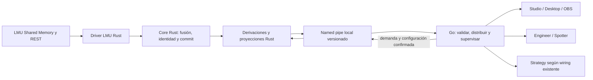

# ISA-1403 — Plan de migración del runtime live de telemetría a Rust

Fecha: 2026-09-27. Versión del plan: 1.2. Estado: diseño confirmado por Isaac;
revisión documental completada e implementación inicial R01/R04 en curso.
**Paridad, integración live y gates pendientes.**

- Issue coordinadora: [GitHub #1403](https://github.com/isaacalbala12/Vantare-Simracing-Suite/issues/1403), proyecto Telemetry Core, label `area:telemetria-core`.
- Rama documental: `vantareapp/isa-1403-rust-telemetry`.
- Base verificada del worktree: `origin/nightly@355e9cfee2fec3c27341fa96ec4e6a9297fab730`.
- Worktree: `C:/Users/isaac/.codex/worktrees/isa-1403-rust-telemetry/Vantare-Overlays`.
- Decisión arquitectónica: [ADR 0097](../../adr/0097-rust-telemetry-child-process.md).
- Continuidad única: [handoff Telemetry Core](../../vantare-program/handoffs/telemetry-core.md).

Este documento guía issues coherentes y verificables. El esqueleto Rust inicial
permanece inerte: no activa LMU, retira Go, instala crates externas ni
promociona una rama. Cada issue ejecutable puede agrupar varios cortes técnicos
coherentes y registra su base exacta, dueño, archivos previstos, pruebas y
evidencia antes de editar. Los identificadores `Rxx` son el mapa técnico del
plan; no imponen una issue por paso ni representan issues ya creadas.

## 1. Resultado y alcance confirmado

Un proceso hijo Rust Windows amd64 será el único propietario productivo de
adquisición LMU Shared Memory/REST, fusión por campo, identidad, estado canónico,
derivaciones y proyecciones. Go conserva el host Wails, los servicios de producto,
supervisión del hijo y entrega a consumidores. La salida observable debe
conservar sus datos, calidad, orden, cadencias y contratos.

| Decisión confirmada | Aplicación en este plan |
| --- | --- |
| Proceso hijo local Rust | Un ejecutable distribuido con Vantare; sin servicio Windows instalado ni producto independiente. |
| LMU como único driver productivo | No portar SimX. Un driver pequeño disponible solo para pruebas Rust demuestra neutralidad del Core y degradación por capabilities. |
| Replay Rust para paridad | Harness explícito, con reloj controlado y corpus real sanitizado. No es una fuente live ni una nueva pantalla de producto. |
| Recording aún no conectado fuera | No portar ni activar el sink SQLite, MCAP, consentimiento o UI de grabación. No borrar sus contratos ni datos. |
| Analysis histórico fuera | No migrar importación, DuckDB, SessionCatalog ni proyecciones históricas de Strategy. |
| IPC por named pipes | Local, acceso restringido, versión explícita; comparar JSON y un candidato binario antes de elegir. |
| Estado y hechos diferentes | Estado completo latest-wins; facts ordenados con cursor, retención limitada y resync explícito. |
| Fallo del hijo | Desconectado visible y reinicios acotados. El rollback Go es exclusivo y temporal; nunca dos adquisiciones LMU. |
| Gate de rendimiento | Al menos 50% menos CPU en **cada** escenario real de 44 y 104 coches frente a Go equivalente; p99 no peor y RSS agregado como máximo 110% de su base. |
| Validación física | LMU/Wails/OBS verifica funcionalidad. No sustituye el benchmark controlado ni demuestra por sí sola ahorro de CPU. |
| Crates autorizadas en Q4=C | Isaac autoriza usarlas sin límite numérico cuando faciliten este port; documentar necesidad, alternativa, licencia, seguridad, tamaño y versión de cada una. Una ampliación del alcance conserva su gate propio. |

La migración conserva Engineer/Spotter, Strategy y widgets como productos.
Rust produce sus entradas y proyecciones; no absorbe prioridades de radio,
voz, cálculo del plan estratégico, editor, permisos, cuenta o persistencia.
La retirada final afecta a la implementación Go del camino migrado. Los DTO,
validadores de frontera y adaptadores Go necesarios siguen siendo código vivo.

## 2. Evidencia de partida y lecturas obligatorias

Las rutas de esta tabla existen en la base indicada. Son evidencia de wiring,
no un inventario de archivos que se puedan borrar automáticamente.

| Frontera actual | Fuente que debe leer el worker | Consecuencia |
| --- | --- | --- |
| Composición live | [main.go](../../../cmd/vantare/main.go), `NewTelemetryCoreRuntime` alrededor de la línea 2330 | Conecta Engineer, política de rendimiento y el flag Strategy; no conecta un recorder SQLite. |
| Adquisición y selección | [telemetry_simulators.go](../../../internal/app/telemetry_simulators.go), [driver LMU](../../../internal/telemetry/drivers/lmu/driver.go) | LMU por defecto; adquisición SHM nominal de 60 Hz y REST complementario. Los tiempos reales, estados y límites se inventarían en R01. |
| Aplicación aceptada | [runtimeBatchSink.WriteBatch](../../../internal/app/telemetry_core_runtime.go), [engine.go](../../../internal/telemetry/engine/engine.go) | Preparar reducer/coordinator/derive antes del commit; proyecciones y consumidores después. |
| Derivaciones | [pipeline.go](../../../internal/telemetry/derive/pipeline.go) y sus tests | Session remaining, gaps, delta, controls history y fuel, con versiones de algoritmo independientes. |
| Overlay | [overlayv2](../../../internal/telemetry/projection/overlayv2), [Publisher](../../../internal/app/telemetrytransport/publisher.go) | Overlay V2, radar incluido; demanda y cadencia antes de proyectar/serializar. No revivir Overlay V1. |
| Engineer | [adapter.go](../../../internal/telemetry/projection/engineer/adapter.go), [engineer_port.go](../../../internal/app/engineer_port.go) | La entrada viva es `ObservationSnapshotV1`, facts y status; portar solo un `SnapshotV1` genérico sería insuficiente. |
| Strategy | `StrategyPublicTransport` en [runtime](../../../internal/app/telemetry_core_runtime.go) y [proyección live](../../../internal/telemetry/projection/strategy) | Condicionado y OFF por defecto. Mantener ese comportamiento; no presentar un nuevo consumidor live como parte de la migración. |
| Recording y replay | [sink SQLite ISA-102](../../telemetry-core/recording-sink-sqlite-isa-102.md), [replay](../../../internal/telemetry/recording/replay) | Infraestructura existente no equivale a wiring productivo. Sus dependencias históricas se conservan. |
| Prueba de otro simulador | [telemetry_simx_proof_test.go](../../../internal/app/telemetry_simx_proof_test.go) | Reemplazar la garantía arquitectónica con el driver Rust de prueba antes de retirar SimX Go sin consumidores. |
| Contrato frontend | [Taskfile](../../../Taskfile.yml), [generador](../../../tools/telemetry-contract-gen), [TS generado](../../../frontend/src/generated/telemetry.ts) | La definición wire Go y su generador siguen siendo autoridad del contrato externo durante este port. CI verifica conformidad Rust. |

Leer también [contrato de producto](../../vantare-program/product-contract.md),
[mapa de módulos](../../vantare-program/project-map.md),
[ADR 0004](../../adr/0004-telemetry-core-modular-observation-architecture.md),
[ADR 0008](../../adr/0008-telemetry-engine-commit-boundary-and-overlay-frame-v2.md),
[capabilities Engineer](../../adr/0005-engineer-projection-capability-contract.md),
[autoridad LMU](../../telemetry-core/lmu-authority-matrix.md),
[proyecciones](../../telemetry-core/runtime-projections.md),
[ADR 0094](../../adr/0094-desktop-overlay-persistent-pull.md),
[ADR 0095](../../adr/0095-overlay-incremental-sections.md) y
[canales](../../branch-channels.md). Los estados fechados de ADR antiguos no
certifican el estado remoto actual; manda el código de la base y su evidencia.

[ISA-1379](https://github.com/isaacalbala12/Vantare-Simracing-Suite/issues/1379)
es investigación previa de un tramo del mapper. No acredita este port ni el 50%.
Su lección metodológica se conserva: comparar también Go con el mismo algoritmo
para no atribuir al lenguaje una mejora de estructuras de datos.

### Discrepancia de seguimiento y roadmap

Las instrucciones AGENTS aportadas explícitamente por Isaac en este chat fijan
GitHub Issues y `docs/roadmap/plan.md`. Los AGENTS del árbol fijan Notion, y
[roadmap-maintenance.md](../../roadmap-maintenance.md) describe publicación
compartida en Supabase. La instrucción explícita reciente gobierna esta tarea.

En `355e9cfe` no existen `vantare-v2/docs/roadmap/plan.md`, `roadmap.json` ni el
generador histórico `.github/scripts/roadmap_digest.py`; la eliminación aparece
en `1e4c26d51cba21876a2db16433a4e785b8d94929` (#1380). No se reconstruye el
roadmap antiguo ni se publica Supabase desde esta entrega. **El roadmap público
no queda actualizado.** R01 debe reconciliar el destino documental con el
orquestador antes del primer PR de implementación. Esa reconciliación no exige
rehacer el diseño confirmado ni bloquear la revisión del presente plan.

Contenido de roadmap propuesto para esa reconciliación: «Migración del núcleo de
telemetría a Rust», estado planificado, con paridad pendiente y mejora del 50%
como objetivo por demostrar. No anunciar una mejora entregada, fecha o porcentaje
de progreso sin evidencia.

## 3. Arquitectura a construir



### Propiedad, módulos y transición

Usar inicialmente un paquete Cargo con biblioteca y ejecutable bajo
`vantare-v2/rust/telemetry/`, con módulos de dominio, driver, engine, derive,
projection, IPC y adaptador Windows. No se necesita un framework de plugins ni
un workspace con una crate por tipo. Las rutas nuevas de este plan son
propuestas de implementación, no archivos ya existentes.

El dominio no importa Wails, UI, procesos Windows, HTTP ni LMU concreto. Un
puerto pequeño de driver se justifica por LMU y el driver de prueba. Parsers
trabajan con bytes y longitudes comprobadas; `unsafe` queda encerrado en los
adaptadores de Win32, con invariantes revisadas. Las tareas secuenciales no
necesitan otro thread. I/O cancelable y escritura IPC quedan fuera del commit.

La propiedad de buffers no cruza procesos: Rust conserva su estado; Go posee
los mensajes recibidos. Retención y copias se miden. No serializar punteros,
layouts de structs Rust ni `Instant`/la parte monotónica privada de `time.Time`.

Durante el desarrollo Go sigue siendo el backend normal. Los cortes Rust
incompletos funcionan solo en harness. Cuando la paridad completa lo permita,
una build candidata aislada podrá seleccionar Rust explícitamente para la
validación física. La selección temporal `go|rust` se resuelve al arrancar,
antes de abrir LMU; no es una opción comercial ni un fallback silencioso.

La exclusión se demuestra con un lease de adquisición compartido por ambos
backends y limitado a la instancia/sesión pertinente. Un reinicio o cambio a Go
espera la salida del hijo anterior y la liberación del lease. Si no puede
demostrarse, permanece desconectado. Un pipe roto no prueba que el proceso ya
haya muerto. El comparador usa replay sobre los mismos datos; no abre dos readers
live para observar a la vez.

### Contratos que atraviesan el IPC

| Mensaje lógico | Contenido y reglas |
| --- | --- |
| Handshake | Versión de protocolo, versión del binario/contrato, identidad de instancia y capacidades. Fallar cerrado ante versión incompatible o binario equivocado. |
| Configuración y demanda | Consumidores activos, nivel/cadencias efectivos, preferencias necesarias y revisión. ACK de aplicación en frontera de batch; reconnect reenvía el último estado completo. No introducir un segundo regulador de cadencias. |
| Snapshot por producto | Proyección completa tipada con epoch, secuencia canónica y versión de producto. Una publicación es atómica; omisión, `null`, colección vacía y cero conservan sus significados. |
| Facts | Epoch y secuencia propios, relación con el commit canónico y high-water mark. Orden y deduplicación explícitos. No coalescer como snapshots. |
| ACK/resync | ACK solo tras validar/retener; replay de facts dentro de una ventana limitada. Si falta historia, `ResyncRequired` con rango y nuevo snapshot/cursores; no inventar facts ni hacer pasar una pérdida por éxito. |
| Status y salud | Estado de fuente separado de salud del proceso/IPC, heartbeat y contadores sin payloads. Un heartbeat con frames congelados nunca mantiene el origen como fresh. |
| Stop | Cancelación, cierre de SHM/REST/pipe y salida comprobada dentro del límite. |

Usar un pipe dúplex con colas lógicas separadas como diseño inicial sencillo:
un snapshot pendiente por producto, una escritura en curso de tamaño máximo,
cola de control limitada y ventana acotada de facts. La prioridad de control y
el límite de cada escritura deben permitir heartbeat/stop/resync a tiempo. La
adquisición nunca espera a que Go o una ventana consuman; el writer puede
reemplazar el snapshot pendiente, no bytes de un mensaje ya enviado. Si las
pruebas muestran bloqueo entre canales, R06 debe justificar la separación
física antes de ampliarla.

R04 fija una tabla versionada con límites **numéricos** de tamaño, profundidad,
heartbeat, deadline, retención, reinicios y cierre. Partir de los límites
existentes donde aplican (p. ej. Engineer cap-1 para observaciones, 64 facts y
250 ms por callback); no confundir el tamaño de Overlay con el del mensaje
Engineer o del IPC combinado. Cada límite tiene un test de frontera y un
contador de rechazo. No conectar R19 con esa tabla incompleta.

El framing incluye longitud y tipo antes del payload, con validación previa a
reservar memoria y límites de nesting/arrays. Soportar lectura/escritura parcial,
EOF a mitad de frame, versión desconocida, mensaje duplicado y datos corruptos.
Las versiones IPC, canonical y de cada producto son independientes. No hace
falta un protocolo público de extensiones arbitrarias.

La autoridad de tipos externos sigue en Go y `telemetry:contract:check`. El
modelo interno Rust tiene tipos propios y pruebas de conformidad; no se mantiene
otro catálogo manual de semántica. JSON debe conservar rangos enteros, enums,
calidad y campos omitidos. El candidato binario usa la misma tabla de campos y
versiones; no se acepta por ser más pequeño si el decode/rehidratación Go cuesta
más. El formato externo hacia Wails/OBS/TypeScript permanece compatible.

### Tiempo, fallos y seguridad

Rust conserva UTC de recepción y tiempos de fuente, y calcula la frescura con
reloj monotónico. El harness inyecta el mismo reloj lógico a Go y Rust. Para
latencia entre procesos Windows se propone QPC con frecuencia y sesión de
arranque verificadas, no restar relojes privados de cada lenguaje. Suspensión,
reanudación y cambios del reloj civil invalidan la continuidad necesaria para
publicar fresh hasta recibir datos nuevos. [Referencia oficial de QPC](https://learn.microsoft.com/en-us/windows/win32/sysinfo/acquiring-high-resolution-time-stamps).

Go envejece la salud del transporte y publica desconectado cuando pierde el
hijo; no reconstruye valores canónicos ni convierte datos antiguos en fresh.
Reinicio crea una identidad de proceso/stream nueva, vacía colas y exige
bootstrap completo. El ID de sesión LMU no se reutiliza como epoch del IPC.
Timeout, crash, bloqueo de lectura y saturación tienen pruebas distintas.
Errores de consumidor degradan ese consumidor; rechazo precommit no avanza
estado/cursores; error interno terminal conduce a desconexión y recuperación
acotada. Agotado el presupuesto de reinicios queda un error estable y visible.

Go crea un nombre de pipe impredecible por ejecución y verifica el peer hijo.
DACL explícita restringida a la sesión de inicio de sesión pertinente, rechazo
de clientes remotos, derechos mínimos, primera instancia exclusiva y handles
no heredables salvo los estrictamente necesarios. El nombre no se trata como
credencial. La ACL por defecto de named pipes permite accesos que no queremos
para telemetría; se prueba el descriptor real. [Seguridad de named pipes](https://learn.microsoft.com/en-us/windows/win32/ipc/named-pipe-security-and-access-rights),
[opciones de CreateNamedPipe](https://learn.microsoft.com/en-us/windows/win32/api/winbase/nf-winbase-createnamedpipea).

Lanzar el ejecutable de ruta absoluta verificada junto a la app, sin buscarlo en
PATH, sin shell visible y sin heredar secretos del host. Asociarlo a un Job
Object con cierre del hijo cuando muere el host; probar también fallo al asociar
el job. Inicio, cancelación y cierre deben liberar procesos y handles. No
elevar permisos, instalar servicios o cambiar Defender. [Job Objects de Windows](https://learn.microsoft.com/en-us/windows/win32/procthread/job-objects).

## 4. Paridad y gate medible

### Corpus y verdad de los datos

El archivo [lmu-fixture.bin](../../../testdata/lmu-fixture.bin) existe, su SHA-256
verificado es `959c51421529c6157371678d8db9bcbbdc8ab3780bd5557828f2bc0d2225e5ff`
y los [tests del mapper](../../../internal/telemetry/drivers/lmu/batch_mapper_test.go)
esperan 44 vehículos. Es un snapshot útil para parsers, **no una secuencia temporal
que cubra todo el gate**. R02 debe acreditar también la secuencia real de 44.

No se ha acreditado una captura real de 104 vehículos en este worktree.
[BenchmarkEngineApply104](../../../internal/telemetry/engine/benchmark_test.go)
construye un `benchmarkBatch`; aumentar filas, repetir coches o renombrar ese
lote no satisface el gate. Si no se consigue la captura real, se conserva el
avance técnico y el port queda pendiente de aceptación, sin rebajar el umbral.

Cada corpus requiere manifiesto con procedencia LMU, build/layout, SHA del
capturador, fecha/zona, SHM/REST y tiempos relativos, duración, frecuencia,
vehículos realmente observados, estados cubiertos, SHA-256 de cada archivo y
procedimiento de sanitización. Revisar nombres, IDs de cuenta y rutas; los IDs
necesarios para correlación se seudonimizan establemente. No versionar raw sin
auditoría. [Reglas de fixtures reales](../../../internal/telemetry/testdata/live-session/README.md).

Capturar desde el owner existente o con ese runtime detenido y un capturador
exclusivo. Conservar el orden/intercalado real entre SHM y REST; el harness no
rellena huecos con valores fabricados. Una ausencia se registra como tal.
El driver pequeño de prueba y las entradas adversariales sirven para tests de
contrato, nunca como evidencia LMU ni como corpus del gate CPU.

### Oráculo y comparación

El oráculo Go se fija a SHA y configuración antes de implementar Rust. Produce
salidas por etapa y por producto sobre el mismo corpus. Conservar digests y un
diff de primer desacuerdo: ID del frame/campo, valor, presencia, calidad,
procedencia, unidad, epoch y cursor. El manifest distingue:

1. Igualdad exacta para identidades, versiones, enums, flags, enteros, tiempo
   lógico, orden de facts y presencia/null/ausencia.
2. Valores flotantes comparados inicialmente sin tolerancia semántica. Si una
   operación equivalente requiere tolerancia, justificar por campo/unidad y
   magnitud antes de aceptarla; nunca cambiar umbrales de clasificaciones,
   ordenaciones, Spotter o consumo para esconder una divergencia.
3. Igualdad de bytes solo donde el contrato la exige (p. ej. replay de una
   entrega retenida); para JSON comparar estructura tipada normalizada y luego
   comprobar que el consumidor actual acepta exactamente la semántica.

No regenerar goldens desde Rust para dar por resuelta una diferencia con Go.
Un bug previo reproducido se registra como issue aparte; su corrección no se
mezcla silenciosamente con el port.

### Tres brazos y dos escenarios obligatorios

| Brazo | Trabajo contado |
| --- | --- |
| G0: Go actual | Ruta completa del SHA base, con consumidores y política fijados. |
| G1: Go equivalente | Mismas estructuras/algoritmos relevantes que Rust, conservando la misma salida. Cambios solo para control experimental, sin activar una feature ajena. |
| R: Rust + Go | Adquisición/parse/fusión/Core/derive/projection Rust, encoding, escritura/lectura IPC, decode/validación y entrega Go hasta la misma frontera que G0/G1. Contar ambos procesos. |

Medir 44 y 104 separadamente; ninguna media conjunta puede compensar un fallo.
El baseline de aceptación es **G1 equivalente**; G0 es comparación obligatoria
para mostrar el efecto frente al producto actual y separar algoritmo/lenguaje.
Registrar también cualquier regresión de R frente a G0 para revisión.

El banco reproduce los bytes reales a velocidad de captura con el mismo
adaptador de adquisición y el resto del camino productivo. Cuando requiera un
productor de SHM/REST de prueba, usa canales aislados, corpus inmutable y los
lectores/parsers productivos; mide y separa el coste del productor común. No
saltarse el mapper, poner el parse fuera del temporizador o medir únicamente
`Apply`. Precarga y verificación del corpus son setup común, fuera de la
medición en los tres brazos. Un replay sin I/O real es diagnóstico adicional,
no prueba del gate completo.

Fijar máquina, versión Windows, toolchains, modo release, flags, perfil de
rendimiento, frecuencias SHM/REST, suscripciones, layouts y fronteras de salida.
El perfil debe incluir Overlay V2 y Engineer activos; Strategy conserva su
configuración real y se verifica además con el flag explícito habilitado.
Go realiza el mismo transporte externo en cada brazo. Comparar sin reducir
datos, Hz, validación, calidad ni número de consumidores. Contabilizar frames
leídos/aceptados/rechazados, snapshots coalescidos y facts para detectar ahorro
por pérdida de trabajo.

Primero ejecutar A/A para comprobar ruido y resolución del banco. Después al
menos cinco bloques intercalados G0/G1/R por corpus, con orden alternado,
calentamiento común y ventanas de igual duración; fijar esos parámetros en
R03 antes de ver resultados Rust. No ejecutar builds, tests u otros bancos en
paralelo. Conservar todas las corridas, incluyendo las invalidadas y su causa.

| Métrica de aceptación por corpus | Cálculo y criterio |
| --- | --- |
| CPU del subsistema | Tiempo CPU kernel+usuario de todos los procesos incluidos / duración común; también expresar ms CPU por segundo y porcentaje con número de procesadores lógicos explícito. Mediana de ratios pareados `CPU_R / CPU_G1 <= 0,50`. No sumar porcentajes con denominadores distintos. |
| Latencia p99 | Desde muestra disponible en adquisición hasta salida equivalente validada/aceptada en Go; incluye esperas, IPC y cola. Comparar p99 por corrida y mediana de ratios pareados `p99_R / p99_G1 <= 1,00`; publicar distribución y máximos. No medir solo mensajes supervivientes ocultando drops o antigüedad. |
| Memoria residente | Suma simultánea de working set/RSS de Rust y receptor Go frente al proceso Go equivalente, misma fase de calentamiento/medición. Mediana de ratios de pico por corrida `RSS_R / RSS_G1 <= 1,10`; publicar también media, pico absoluto MiB, memoria privada y handles. |
| Paridad | Cero discrepancias no explicadas, mismos hechos y ausencia de pérdidas silenciosas. Una corrida con salida incompleta es inválida, aunque sea rápida. |

Publicar dispersión y ruido A/A junto a cada ratio. Un resultado en el umbral
con incertidumbre que impide decidir queda **inconcluso**, no se redondea a
PASS. Repetir solo para resolver esa incertidumbre o tras corregir un defecto
concreto del banco. R03 documenta el criterio estadístico y la regla de parada;
si el gate falla, se perfila y propone un corte acotado, sin un bucle indefinido
de optimización ni cambio unilateral del umbral.

El benchmark de codecs de R06 es preliminar. La decisión final usa todo R en
R21/R24: JSON y binario sobre las mismas proyecciones y ambos tamaños, CPU de
ambos extremos, p99, RSS, bytes, complejidad, dependencias y diagnóstico. Si no
hay mejora repetible del binario, preferir JSON por sencillez. Si ninguno cumple
el gate, no se activa Rust por asumir que el lenguaje debería ahorrar.

## 5. Cortes de ejecución y dependencias

Cada issue ejecutable agrupa cortes con un objetivo coherente, diff pequeño y
revisable, archivos previstos, tests y evidencia. No hay un límite numérico
rígido de archivos ni obligación de crear una issue por Rxx o subcorte. Dividir
la entrega si el alcance se amplía o el diff deja de ser revisable. Las rutas
con `*` designan familias que se deben acotar, no autorización para editarlas
enteras. Cada salida requiere review del diff y pruebas reales; el resumen de
un worker no basta.

### F0 — Inventario y medición Go

| Corte | Dependencia | Entrega, archivos previstos y aceptación | Verificación de salida |
| --- | --- | --- | --- |
| R01 Inventario congelado | Plan revisado | `docs/telemetry-core/rust-port-inventory.md` y manifiesto de base/configuración. Tabla símbolo→owner futuro→consumidor→test, contratos/cadencias/límites, y resolución del destino de roadmap antes del PR. Registrar repositorio, rama, SHA y discrepancias de base. | Revisión contra wiring/callers reales; rutas comprobadas; mapa completo del camino live y lista protegida Analysis/recording. |
| R02 Corpus temporal | R01 | `testdata/rust-port/manifest.json`, índice y herramientas de captura sanitizada acotadas. Acreditar secuencias SHM+REST de 44 y 104 reales, con hashing, temporalidad, privacidad y conteo. Captura 104 pendiente explícita hasta obtenerla. | Validar manifest y hashes, leer con parser Go, contrastar conteos/estado con LMU. Fallar si falta corpus; no convertir `Skip` en PASS. |
| R03 Oráculo y banco Go | R01; R02 para medir | Herramienta bajo `tools/telemetry-port-parity/` y banco bajo `scripts/bench/`; separar entregas si sus responsabilidades o tamaño impiden una revisión clara. Registrar salidas tipadas por etapa, G0, receptores, CPU/p99/RSS, A/A, método estadístico y duración fijados. | Repetición determinista de goldens; banco rechaza salida omitida/digest incorrecto/corrida incompleta; informe G0 con crudos. |

**Checkpoint F0:** contratos de salida congelados y banco capaz de detectar
diferencias. Sin 104 real se puede construir paridad con el corpus disponible,
pero los gates de selección final y cierre permanecen pendientes.

### F1 — Ejecutable mínimo y frontera Windows

| Corte | Dependencia | Entrega, archivos previstos y aceptación | Verificación de salida |
| --- | --- | --- | --- |
| R04 Esqueleto y contrato IPC | R01 | `rust/telemetry/Cargo.toml`, `Cargo.lock`, toolchain fijada, entrada/lib mínima y contrato IPC documentado; separar manifiestos del protocolo si crecen. Sin LMU. Tabla numérica de límites, errores y compatibilidad; registrar necesidad, alternativa, licencia, seguridad, tamaño y versión de las crates elegidas bajo la autorización Q4=C, sin nueva aprobación individual. | Build Windows amd64 reproducible con `--locked`, pruebas de versiones/framing y salida limpia; no contiene datos de simulador inventados. |
| R05 Pipe seguro y supervisor | R04 | `internal/app/telemetryprocess/` y adaptador Windows Rust, en cortes separados por lenguaje. Lanzar hijo controlado, verificar peer, DACL, lease, Job Object, shutdown y límite de reinicios. Aún harness. | Tests Windows de ACL/cliente inválido, doble arranque, host/hijo muerto, timeout, asociación fallida del job y cero procesos/handles propios tras cierre. |
| R06 Conformidad y codecs | R03–R05 | `rust/telemetry/src/ipc/`, corpus wire Go y tests Go del receptor. Roundtrip de los contratos reales, benchmark JSON/binario preliminar y pruebas de colas sin adquisición live. | Framing parcial/corrupto, límites, entero/float/null, versiones, slow-reader y fuzzing del decoder; contadores demuestran boundedness y orden/resync. Informe comparativo, codec final aún pendiente. |

**Checkpoint F1:** IPC no bloquea el futuro commit, no permite otro owner y
puede cerrarse aun con un peer bloqueado. Los límites no quedan como TODO.

### F2 — Driver LMU y Core neutral

| Corte | Dependencia | Entrega, archivos previstos y aceptación | Verificación de salida |
| --- | --- | --- | --- |
| R07 Dominio y puerto de driver | R03–R04 | Módulos `domain/`, catálogo mínimo usado y `driver.rs`; empezar por tipos/IDs/calidad y ampliar con cada corte. Driver solo de tests bajo `tests/support/`. Declarar presencia, procedencia, capacidades, epoch e identidad sin LMU en Core. | Conformidad de tipos contra Go, tests de ausencia/cero/invalid y arquitectura. Driver de prueba alcanza una proyección mínima con capacidades degradadas, sin registrarse en binario productivo. |
| R08 SHM LMU | R02, R07 | `src/lmu/{layout,reader,parser}.rs` y tests de fixtures. Portar layouts y compatibilidad comprobados, snapshots consistentes, límites y cierre de mapping. | Mismos campos/errores Go en capturas; truncado, IDs duplicados, 0/104/límite excedido, offsets, versión desconocida, fuzzing de parsers y contadores sin payload. Windows con mapping privado del harness. |
| R09 REST y fusión | R08 | `src/lmu/{rest,fusion}.rs` y tests. Endpoints, cadencias, timeouts/cancelación y autoridad por campo iguales al baseline; no crear rivales desde REST. | Replay de intercalado SHM/REST; fresh/stale/missing/invalid/0/false, conflicto, REST caído, SHM congelado y salida de menú. |
| R10 Mapping e identidad | R09 | `src/lmu/mapper.rs`, tipos de batch y tests. Slots, gracia, generation, player/vehicle/team/driver/stint y cursores equivalentes. | Diffs de batches contra Go; desaparición/reaparición, reordenación, cambio de piloto/player, sesión y retry. Rechazo posterior no deja cursor del mapper adelantado. |
| R11 Reducer | R10 | `src/core/reducer.rs` y tests. Validación, estado owned y candidate/commit; sin I/O ni productos. | Replay Go/Rust de estado observado, duplicate/out-of-order, mutación de entrada/salida y fallo precommit. |
| R12 Sesión y facts | R11 | `src/core/session.rs`, `facts.rs` y tests. Coordinar identidades, secuencia de facts y retención con límites, sin confundir reconnect con sesión nueva. | Oráculo de facts; overflow, slot churn, cambio sesión/stint, wrap/rechazo de cursores, resync y sin duplicación al reintentar. |

**Checkpoint F2:** bytes reales→batch→estado/facts equivalentes. El driver de
prueba pasa por el mismo puerto; no portar SimX ni introducir un registry de plugins.

### F3 — Derivaciones, commit y proyecciones

R13 y R15 son familias de subcortes técnicos. Cada fila tiene módulo, prueba y
manifest de paridad propios; una issue puede agrupar varias filas coherentes
manteniendo una revisión clara de cada resultado.

| Subcorte | Dependencia | Entrega prevista | Criterio de salida y prueba |
| --- | --- | --- | --- |
| R13a Session remaining | R12 | `derive/session_remaining.rs` + test | Calidad/unidades y límites temporales iguales a Go con reloj lógico. |
| R13b Controls history | R13a | `derive/controls.rs` + test | Misma ventana y muestras con CapturedAt, ausencia/0 y reset; boundedness y ownership. |
| R13c Relative gaps | R13b | `derive/gaps.rs` + test | Tráfico multiclass, vueltas, progreso y clasificación; exactitud semántica contra Go. |
| R13d Delta | R13c | `derive/delta.rs` + test | Referencia explícita, trazas reales y continuidad por sesión/stint; ningún valor inventado. |
| R13e Fuel | R13d | `derive/fuel.rs` + test | Consumo por vuelta, histories, pits/refuel y calidad/ventanas exactas. |
| R14 Commit integrado | R13e | `engine.rs`, `derive/mod.rs` y tests | Prepare/validate/reduce/derive/facts/commit atómico, incluidos cursores/estado del mapper cuando corresponda; error en cada etapa seguido de retry no diverge. Comparar con `TestApplyIsAllOrNothing` y `TestApplyRetryDoesNotDivergeCursors`. |
| R15a Session/player/capabilities | R14 | `projection/overlay/session_player.rs` + tests | Primer camino completo bytes reales→Rust→IPC→receptor Go→Overlay V2. Tipos y campos reales, cero reconstrucción de dominio en Go. |
| R15b Controles/history | R15a | `projection/overlay/controls.rs` + test | Misma ventana/timestamps, cadencia y calidad para Pedals/Input Telemetry. |
| R15c Fuel/damage/weather | R15b | Builders y tests bajo `projection/overlay/`, con evidencia por builder | Golden y ausencia/invalid exactos; separar la entrega si el alcance o diff lo requiere. |
| R15d Delta | R15c | `projection/overlay/delta.rs` + test | Misma referencia, modo y semántica del widget actual. |
| R15e Standings/relative | R15d | Builders y tests con evidencia por resultado | Orden, clases, gaps, selección, 44/104 y cambios sin identidad nueva; revisar cada builder como subcorte técnico. |
| R15f Espacio/spotter/radar | R15e | Builders espaciales y tests en cortes acotados | Geometría, orientación, frescura, límites y capacidades coinciden con Go y ADR de producto; incluir pruebas ISA-1388. |
| R15g Scheduler y cachés | R15f | `projection/overlay/cadence.rs` y tests | Demanda/dirty/valores que envejecen; conservar tabla efectiva y secciones, sin omitir cambios por coalescing ni reapertura. |
| R16 Engineer | R14; R06 | `projection/engineer/`, adaptador receptor Go y tests en cortes por snapshot/facts/status | `ObservationSnapshotV1`, facts y status reales, capabilities y boundary; oráculo/replay de Engineer y prueba de consumidor lento. La lógica de radio/Spotter de producto permanece en Go. |
| R17 Strategy | R14; R06 | `projection/strategy.rs` + tests | Contrato live equivalente; cero trabajo sin destino y paridad con transporte explícito habilitado. Analysis/Strategy históricos continúan sus tests sin migración. |

**Checkpoint F3:** todas las salidas live del inventario tienen paridad, no solo
un frame visual. El oráculo Go no es una dependencia productiva del ejecutable Rust.

### F4 — Camino completo, recuperación y decisión de formato

| Corte | Dependencia | Entrega, archivos previstos y aceptación | Verificación de salida |
| --- | --- | --- | --- |
| R18 Ensamblado con replay | R15g–R17 | Entrada Rust y ensamblado receptor en harness; cambios acotados bajo `tools/telemetry-port-parity/`. Salida externa completa a Publisher/Engineer/Strategy con configuración real. | Paridad de corpus entero, bootstrap/reconnect/facts; CPU preliminar de ruta completa incluye encode/decode y entrega Go. |
| R19 Composición de candidato | R05, R18 | Fachada de backend en `internal/app/`, selección temporal en `cmd/vantare/main.go` y tests de lifecycle. Rust explícito en build aislada; Go por defecto hasta gates. | Un solo owner, start/stop idempotentes, cambio de política/demanda confirmado, apertura/cierre Studio/Desktop/OBS, Strategy OFF conserva ausencia de trabajo. |
| R20 Fallos y observabilidad | R19 | Supervisor/IPC y tests de fallo; métricas sanitizadas de proceso, colas, edad, rechazos, restart y resync. Agrupar por objetivo verificable y separar fronteras si el diff deja de ser revisable. | Matriz de §6, incluyendo crash durante entrega de facts, peer colgado, cola llena, suspensión, Stop concurrente y replay tras nueva instancia; ninguna pérdida silenciosa ni estado fresh congelado. |
| R21 Formato y Go equivalente | R18, R20; R02 completo | Comparar JSON/binario en la ruta completa y construir G1 documentando cada diferencia algorítmica de G0. Elegir un codec de producción y registrar decisión/evidencia en ADR; retirar prototipo no elegido del producto. | Ambos corpus y mismos productos/frecuencias; paridad G0/G1/R; CPU/p99/RSS de ambos extremos. Selección justificada, sin promesa del gate final. |

**Checkpoint F4:** candidato listo para empaquetar y probar físicamente. La
elección de codec es una salida medible, no una preferencia de lenguaje.

### F5 — Build, distribución y aceptación

| Corte | Dependencia | Entrega, archivos previstos y aceptación | Verificación de salida |
| --- | --- | --- | --- |
| R22 Build Windows | R21 | Toolchain fijada y `build/windows/Taskfile.yml` + tarea Rust correspondiente. Target `x86_64-pc-windows-msvc`, lockfile, release y recursos/versiones. Sin instalar toolchain en el PC del usuario final. | Build limpio Windows amd64; logs de versiones y hash; `cargo test` debug/release, fmt/clippy, Go y contrato TS. Comprobar requisitos runtime en Windows 10/11 según soporte del producto. |
| R23a Packaging | R22 | Scripts existentes de instalador/portable/checksums y manifest de helper, acotados en la issue. Host+hijo salen del mismo build y se actualizan/revierten juntos. | Instalación, portable, actualizar y volver a build anterior en entorno aislado sin Rust instalado; falta/corrupción/versión incorrecta del hijo falla explícita. Sin publicar release. |
| R23b CI | R22 | `.github/workflows/branch-channel-gates.yml` y gate Rust/paridad Windows asociado. Checks de contrato, tests, build y artifact completeness en SHA exacto. | Ejecutar el workflow real sobre PR draft cuando exista; ninguna omisión/Skip de corpus requerido cuenta como éxito. No cambiar rulesets, secretos, permisos ni activar promociones. |
| R24 Funcionalidad física y soak | R20, R23a | Informe en `docs/telemetry-core/evidence/isa-1403/`, manifiesto de binarios/logs sanitizados y checklist §6. | Sesión LMU/Wails/OBS con menú/garaje/pista/tráfico/boxes/sesión/reconnect/cierre; replay soak de dos horas lógicas y sesión física con duración registrada. Consumidores y canales verificados; prueba física pendiente hasta realizarla. |
| R25 Gate de CPU final | R21–R24; corpus 44/104 completo | Crudos G0/G1/R, hashes, configuración, método y resumen reproducible de §4 sobre el candidato empaquetado. | Los tres límites pasan en cada corpus, paridad intacta y evidencia repetida. Revisión del banco independiente. Si falta 104 real o un gate falla, mantener Go como opción productiva. |

El target MSVC dispone de herramientas host y exige Windows 10 o posterior;
registrar la versión concreta elegida de Rust y Build Tools en R22.
[Plataforma oficial Rust Windows MSVC](https://doc.rust-lang.org/rustc/platform-support/windows-msvc.html).
El ejecutable versiona `Cargo.lock` y usa resolución fijada. En **Q4=C Isaac
autorizó crates sin límite numérico cuando faciliten este port**; no se vuelve
a pedir aprobación por cada crate dentro de ese alcance.
[Cargo.toml y Cargo.lock](https://doc.rust-lang.org/cargo/guide/cargo-toml-vs-cargo-lock.html).

R04 elige las bibliotecas de pipes, concurrencia, serialización o HTTP necesarias
con un registro por crate: necesidad, alternativa más simple o existente,
licencia, evaluación de seguridad, impacto en tamaño y versión fijada. La
autorización no elimina esa evaluación técnica. Si una dependencia amplía el
alcance del producto, aplica el gate de alcance antes de incorporarla.

### F6 — Retirada y cierre

| Corte | Dependencia | Entrega, archivos previstos y aceptación | Verificación de salida |
| --- | --- | --- | --- |
| R26 Retirada por consumidores | R25 y aceptación del candidato | Cortes por Go acquisition/mapper, Core/derive, builders, SimX y selector temporal, agrupables en issues coherentes. Inventariar imports/callers y conservar DTO/transporte e infraestructura histórica con consumidores. No borrar directorios de golpe. | Cero callers productivos de lo retirado; tests de arquitectura Rust/Go; driver neutral de prueba reemplaza la garantía SimX. Go de referencia vive en SHA/artefacto de harness, no como segundo engine del producto. |
| R27 Verificación tras retirada | R26 | Informe sobre SHA/binario final; actualizar doc de operación y rollback. Go ya no adquiere ni calcula el camino live; Rust único owner y dependencias históricas preservadas. | Suites completas/generador/build/packaging/CI; repetir gates de paridad y CPU/RSS/p99 afectados por la retirada, y smoke físico del binario final. Nada se certifica solo con la build anterior. |
| R28 Entrega para canal | R27 | Plan/checklist, handoff, issue y roadmap reconciliado reflejan estado exacto; PRs draft/review sin hallazgos bloqueantes. | Revisar diff y evidencia, conservar rollback comprobado y enumerar SHA/base/PR/CI. Pedir autorización específica de Isaac antes de Nightly; Testers/Master/release siguen sus propios gates. |

**Cierre del port:** R27 aprobado, Go productivo de telemetría retirado, paridad
y gates demostrados en el candidato final, packaging completo y prueba física
real. R28 diferencia entrega en rama de integración/publicación. La issue puede
seguir abierta si falta evidencia, aunque el código compile.

## 6. Matriz de verificación y evidencias

| Riesgo o flujo | Evidencia obligatoria | Referencia actual a preservar |
| --- | --- | --- |
| Estado parcial al fallar | Fallo inyectado antes de cada commit, retry idéntico y comparación de cursores/estado/facts | [engine tests](../../../internal/telemetry/engine/engine_test.go), [ownership](../../../internal/telemetry/engine/commit_s32_ownership_test.go) |
| Semántica LMU | Fuentes en conflicto, tiempo congelado, REST lento/caído, SHM missing/versionado, arrays corruptos, cero/false válidos | [tests LMU](../../../internal/telemetry/drivers/lmu), autoridad y capabilities |
| Ventana o Engineer lentos | Estado cap-1, facts retenidos o resync visible, Core progresa, métricas limitadas | [consumer tests](../../../internal/app/telemetry_core_runtime_consumer_test.go), [Engineer](../../../internal/app/telemetry_core_engineer_test.go) |
| Hijo/proceso colgado | Kill/crash antes/después de handshake y en escritura, deadline, presupuesto agotado, Job Object y cierre | [lifecycle harness](../../../cmd/vantare/telemetry_lifecycle_harness_test.go) + tests Windows nuevos |
| Salud falsa | Frames sin avanzar aunque heartbeat llegue, envejecimiento, reconexión y suspensión/reanudación | [watchdog tests](../../../internal/app/telemetry_core_runtime_watchdog_test.go), [frozen remnant](../../../internal/telemetry/drivers/lmu/frozen_remnant_test.go) |
| Pérdida de facts | Duplicados, huecos, ACK perdido, overflow y crash entre recepción/ACK/consumo; resync reinicia contexto explícitamente | [fact cursor/resync](../../../internal/telemetry/projection/engineer/fact_cursor_test.go) y puerto Engineer |
| Diferencias visuales | Mismos frames en renderer actual, goldens/contrato y luego Windows físico; Radar con orientación comprobada | [radar](../../../internal/telemetry/projection/overlayv2/builder_radar_test.go), tests frontend existentes |
| Memoria/handles | Boundedness con churn de sesiones/slots/ventanas y reconexión; conteo inicio/fin y tendencia de RSS | [soak](../../../internal/app/telemetry_core_hardening_test.go) + harness Rust |
| Frontera local insegura | Peer incorrecto, pipe preexistente, cliente de otra sesión, remoto rechazado, longitudes desbordadas | DACL/flags efectivos y pruebas de protocolo Windows |
| Distribución incompleta | Instalador y portable contienen hijo correcto; actualización/rollback de la pareja, sin procesos residuales | `build/windows/` y flujo actual de checksums |

Checklist de la sesión física del candidato:

- LMU cerrado/menú: estado honesto sin valores de pista fabricados.
- Garaje, outlap y vueltas: instrumentos, Delta/Fuel, Standings/Relative,
  mapa/Radar y calidad coinciden con el escenario; anotar los casos realmente vistos.
- Tráfico a ambos lados y paso por boxes: Spotter/Engineer, radio y facts sin
  duplicados ni avisos de un contexto anterior; no convertir un replay de audio
  en prueba física de geometría.
- Desktop, OBS y reapertura de Studio: snapshot inicial completo, mismas
  proyecciones, fluidez y cadencias; OBS desconectado no bloquea el juego/Core.
- Cerrar/reabrir LMU y matar el hijo: stale/desconectado, reinicio acotado y
  recuperación con bootstrap; Go no empieza a leer mientras el hijo vive.
- Cerrar Vantare y volver a abrir: sin helper, reader o pipe residual.

Registrar fecha, Windows, LMU, SHA y hashes de ambos binarios, perfil,
consumidores, duración, acciones realizadas, métricas y limitaciones. Un caso
no observado (p. ej. driver swap) queda pendiente o se cubre con una captura
real específica; no marcar toda la matriz por haber abierto la app.

### Comandos de gate previstos

Ejecutar desde `vantare-v2/` en cada corte según archivos afectados. Son
**comandos de la implementación futura**, no resultados ejecutados por este plan.

```powershell
pnpm --dir frontend build
go test ./...
go test -race ./internal/telemetry/... ./internal/app/...
task telemetry:contract:check
cargo fmt --manifest-path rust/telemetry/Cargo.toml --all -- --check
cargo clippy --manifest-path rust/telemetry/Cargo.toml --all-targets --locked -- -D warnings
cargo test --manifest-path rust/telemetry/Cargo.toml --locked
cargo test --manifest-path rust/telemetry/Cargo.toml --release --locked
cargo build --manifest-path rust/telemetry/Cargo.toml --release --locked --target x86_64-pc-windows-msvc
task windows:build ARCH=amd64
git diff --check
```

El build frontend precede a Go cuando falta `frontend/dist` embebido. Si cambia
contrato/frontend ejecutar además `pnpm --dir frontend test`, `typecheck` y
`lint`; `tsc --noEmit -p tsconfig.json` no valida este repo. `-race` exige un
toolchain compatible; si no lo hay, registrar la omisión y obtener ese gate
en CI compatible, sin llamarlo PASS. Añadir en R03/R06 los comandos exactos de
paridad/banco que se creen y exigir exit code fallido ante datos ausentes.

Los fallos previos se reproducen también en la base y se identifican por
separado; no se relajan tests ni se declaran suites completas verdes con fallos.

## 7. Rollback y límites de autonomía

| Momento | Vuelta atrás verificable |
| --- | --- |
| Cortes de harness | Mantener backend Go; descartar el cambio en la rama del corte sin tocar datos o checkouts ajenos. |
| Candidato dual durante validación | Cerrar el hijo, esperar su salida y confirmar lease libre; reiniciar con Go explícito. Invalidar stream/colas y dar bootstrap completo. La selección no conmuta sola tras error. |
| Rust único después de R26 | Volver a la pareja host/helper y SHA anteriores verificados. El nuevo binario no contiene un engine Go oculto de fallback. |
| Tras integración autorizada | PR de revert a su mismo canal, con gates; nunca force-push ni salto a Testers/Master. |

Detener el corte y registrar la causa ante conflicto de cambios ajenos, base
distinta, dependencia que amplíe el alcance sin cubrir su gate, cambio de contrato
no cubierto, verificación imposible o fallo de gate sin explicación. Las crates
que facilitan el port dentro del alcance ya están autorizadas por Q4=C. La arquitectura aquí confirmada
permite planificar y ejecutar sus cortes cuando se autoricen; no autoriza
rediseñar otros productos o ampliar el port a histórico/recording.

Riesgos abiertos: corpus temporal 44/104 aún por acreditar, coste fijo del IPC y
del segundo proceso, diferencias de precisión/orden temporal, complejidad de
Windows lifecycle, packaging de dos binarios y acoplamientos Go compartidos con
histórico. R02, R06, R10/R14, R05/R20, R23 y R26 aportan respectivamente la
evidencia que los cierra. Ninguno se resuelve con una promesa de rendimiento.

## 8. Estado de esta entrega documental

- Se crea este plan y la ADR 0097; se actualiza el handoff vivo.
- Base y árbol inicial limpios verificados; inventario dirigido de código y
  tests, issue #1403/antecedente #1379 y documentación oficial consultados.
- Sin código, tests, configuración de build, workflow ni dependencia modificados.
- Pruebas de producto, benchmarks y sesión LMU/Wails/OBS no ejecutados: todavía
  no existe implementación Rust de este plan.
- Issue #1403 abierta y sincronizada con el alcance confirmado y las correcciones
  de revisión. Identifica la revisión documental completada y el enlace de rama
  como previsto, todavía sin commit/push.
- Checks documentales: diff sin errores de whitespace, 51 enlaces locales
  existentes y fences/codificación comprobados. Revisión del orquestador
  completada: autorización Q4=C y agrupación de cortes técnicos en issues
  coherentes.
- Sin commit, push, PR, CI nuevo, merge, promoción o release de esta entrega.

Al aceptar cada corte, añadir su evidencia al handoff y a la issue que lo agrupa, sin convertir
este plan en otro historial. Conservar las casillas de cierre pendientes hasta
que exista el artefacto verificable correspondiente.

## 9. Inicio de ejecución (2026-09-27)

- R01: [inventario inicial](../../telemetry-core/rust-port-inventory.md) contrastado
  con la base y consumidores live. Sigue parcial por la discrepancia de destino
  del roadmap antes del primer PR; R02 debe acreditar corpus temporal real.
- R04: `rust/telemetry/` contiene ejecutable inerte, toolchain fijada, lockfile
  sin crates externas y [framing IPC v1](../../telemetry-core/rust-ipc-v1.md).
  La tabla de límites/compatibilidad y conformidad Go no estaban completas; no
  conectar el pipe ni declarar R04 terminado.
- Verificación Rust local: `cargo fmt --check`, `cargo test --locked` (5 tests),
  `cargo clippy --locked --all-targets -- -D warnings` y
  `cargo run --locked -- --version` pasan. No hay gate de rendimiento medido.
- La [issue #1403](https://github.com/isaacalbala12/Vantare-Simracing-Suite/issues/1403)
  registra el inicio. Go sigue siendo la única ruta productiva.

## 10. Continuación del framing (2026-09-27)

Se añadió el receptor Go de framing bajo `internal/app/telemetryprocess/`.
Rust y Go validan los mismos bytes wire fijos para los nueve tipos, rechazan
versiones y tipos desconocidos, tramas incompletas, bytes sobrantes en decoder
de buffer y payloads mayores de 8 MiB. Se probó el borde exacto y el I/O
parcial. `go test -p 1 -count=1 ./...`, `cargo test --locked --release`,
`cargo fmt --check` y Clippy pasaron. El receptor no abre un pipe ni inicia
el hijo. La tabla de lifecycle y payload sigue pendiente, por lo que R04
continúa parcial. No hay corpus temporal real 44/104 ni prueba del gate CPU.

## 11. Harness Windows Go/Rust (2026-09-28)

El corte R05 avanza en el mismo worktree: Go reserva un named pipe local con
DACL de sesión, nombre aleatorio, rechazo remoto, primera instancia única y
comprobación del PID cliente. Arranca el hijo suspendido, lo asocia a un Job
Object con cierre en cascada y solo entonces lo reanuda; el entorno del hijo
es vacío. Rust implementa un modo de harness sin LMU que envía nonce y versión
en Handshake y espera Stop. La prueba conjunta con el binario Rust `release`
verificó handshake, Stop y salida 0. Tests Windows cubren timeout de conexión,
instancia duplicada, PID incorrecto, fallo de asociación y terminación sin
proceso residual. No es todavía un supervisor conectado a Wails; faltan las
colas, payloads reales, deadlines de I/O, configuración y reinicios. R04/R05
siguen parciales y no se activa el backend Rust productivo.
