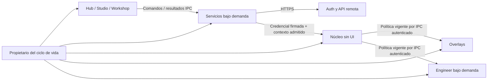

# Servicios remotos nativos — arquitectura para decidir (ISA-1430)

**Estado: propuesta; implementación detenida por Isaac el 2026-09-30.**
Este documento sustituye el microplan anterior. No autoriza código, dependencias,
cambios del ADR, despliegues ni llamadas a producción. El WIP permanece en el
stash «WIP servicios previo a rediseño» y no se recupera. La siguiente acción
es decidir con Isaac y revisar con Claude Opus 5.5.

Referencia: [GitHub #1430](https://github.com/isaacalbala12/Vantare-Simracing-Suite/issues/1430).
Rama asignada: `vantareapp/isa-1430-w-servicios`; base recibida:
`e8b0927a3e8f63b8e89d2043b18c57ac1753c0fd`. Solo commit local del documento.
Notion no está disponible: Isaac autorizó trabajar solo con GitHub; su
seguimiento no se declara actualizado. Sin push, PR, merge ni subagentes.

## 1. Objetivo y relación con el ADR aprobado

Diseñar una app ampliable sin convertir UI, adquisición ni un gestor genérico
en propietarios de toda la red. Cuenta, licencias, roadmap e informes son el
primer alcance. Perfiles/layouts, nube, push, Discord/calendario, pagos,
actualizaciones y remoto comprueban las fronteras; no se implementan ahora.

[ADR 0099](../../adr/0099-arquitectura-rust-nativa.md) y su
[plan](2026-09-29-arquitectura-rust-nativa.md) fijan núcleo sin UI, overlays
separados, Engineer bajo demanda, Hub cerrado al entrar al juego, un propietario
del ciclo de vida y named pipes con ACL, identidad, límites y DTO versionados.
El ADR ya coloca la **validación local de licencia en el núcleo**. Su apartado 7
coloca cuenta/renovación/calendario/Discord en el Hub.

**Proponer un proceso de servicios cambia esa última propiedad:** requiere
decisión expresa y actualización del ADR antes de implementar. No cambia la
topología de telemetría ni lleva HTTP/GPUI a su camino crítico. Se aplica
`ponytail`: módulos concretos, sin plugins, microservicios, interfaces
especulativas ni demonio universal.

## 2. Inventario de hoy: evidencia y problemas, no diseño destino

| Área y fuentes | Qué hace hoy | Problema/frontera |
|---|---|---|
| `frontend/src/lib/supabase-auth.ts`, `hub/auth`, `internal/authsession/` | Supabase: contraseña, registro, recuperación y OAuth externo. Sesión web en memoria; backend valida `/auth/v1/user` antes de admitirla. Access/refresh protegidos; rotación de sesión previamente admitida. | Auth repartida entre frontend/backend y tokens en callbacks. Refresh/logout requieren un propietario que evite carreras. |
| `internal/protectedstore/` | Windows Credential Manager, no fichero DPAPI directo. | Protección SO no resuelve aislamiento entre procesos ni replay del conjunto protegido; no importar por defecto sesión Go. |
| `internal/license/{credential,service,supabase_client,cache,clock_store}.go` | Envelope JSON v1 Ed25519, issuer `vantare-license`, clave por `key_id`; firma sobre reconstrucción compacta con orden/omisiones específicos. Sujeto, fingerprint, emisión y capabilities con deadlines/scope; caché/reloj protegidos. | Canonicalización sensible a diferencias entre lenguajes; reloj/caché requieren un escritor. Login y permiso comercial son distintos. |
| `internal/license/fingerprint*.go` | SHA-256 de MachineGuid, fallback basado en home. | Identificador suplantable, no prueba de posesión. Reinstalación/reset necesitan política de producto. |
| `internal/roadmap/service.go`, `frontend/src/hub/roadmap-orbit/` | Publicación compartida vía RPC `visual_roadmap_current`; schemaVersion 1, hasta 40 items UUID únicos, now/next/done, es/en/pt/it. | Copia almacenada no es actualidad ni autoridad editorial. |
| `internal/app/testing_center_report_bridge.go`, `internal/testingcenter/reportdraft/`, `frontend/src/hub/testing-center/` y `testing-center-orbit` | Go guarda borrador; frontend envía RPC `testing_center_submit_report`, consentimiento separado, clave idempotente y recibo. | Borrador no autoriza envío; timeout puede suceder después de aceptar el servidor. |
| `frontend/src/hub/settings-orbit/` | Identidad, plan, renovación, reset/logout. | UI muestra estado, no concede derechos a otros procesos. |

Contratos actuales para evaluar transición, sin adoptarlos como API futura:

- Licencia: POST `/functions/v1/license-credential`, `deviceFingerprint`, bearer
  de sesión y apikey pública; respuesta `credential`, `online_capabilities`.
  `409/device_limit` no es fallo de red. Reset: POST
  `/rest/v1/rpc/reset_active_device`, `device_fingerprint`, después renovar.
  Rechazo concluyente no se disfraza de offline; fallo transitorio no destruye
  por sí solo una credencial aún válida. Roles online no pasan a derechos offline.
- Parte firmada v1: `{version,algorithm,key_id,claims}`; el envelope añade firma. Claims
  `issuer,subject,device_fingerprint,issued_at,capabilities`. Grants ordenados
  únicos con `key,paid_through,perpetual,scope_version` según corresponda;
  firma base64url sin padding. Congelar vectores compatibles antes de migrar.
- Roadmap: POST `/rest/v1/rpc/visual_roadmap_current`, `{}`, acceso anon;
  cero/una publicación `{id,document,published_at}`. Documento 40 KB, títulos
  120 caracteres, cuerpos 600. Solo lectura, sin editor local.
- Informe: RPC `testing_center_submit_report`,
  `p_contract_version=testing-center.v1`, `p_channel` nightly/testers;
  `p_action_text`, `p_expected_text`, `p_observed_text`, `p_context_text`;
  `p_app_version`, `p_os_family=windows`, `p_os_version`, `p_module`;
  `p_include_diagnostic`, `p_include_logs`, `p_diagnostic_payload` y
  `p_diagnostic_digest` opcionales y
  `p_idempotency_key`. Obligatorios 3..2048 bytes UTF-8, contexto <=4096.
  Resultado: `reportId`, `reportState=submitted`, `idempotent`, `createdAt`.
  Roles/membership los valida servidor. Borrador schema 1, clave `draft_<64 hex>`;
  sin consentimiento, tokens, identidad ni logs. `native/hub/src/testing/`
  no existe en la base inventariada; no se crea aquí.

## 3. D1 — proceso propietario y vida durante el juego

| Alternativa | Ventajas | Costes/límites |
|---|---|---|
| A. Servicios dentro del Hub | Menos procesos/IPC, coincide con propiedad actual del ADR. | Cerrar Hub cancela red; sesión/jobs ligados a UI; sync/push exigiría mantenerla o mover propiedad. |
| B. Proceso de servicios de usuario bajo demanda | Un propietario de tokens, reinicios aislados, UI cerrable; permite tareas futuras explícitas. | Coste de proceso/IPC, supervisor e instancia única; cambia el ADR. |
| C. Servicio Windows/demonio permanente | Disponible sin UI para push/sync. | Privilegios/cuentas, instalación, consumo residente y cierre complejos; innecesario ahora. |

**Recomendación: B**, sesión de usuario sin elevación, supervisado por propietario
del ciclo de vida existente; instancia por producto/proyecto/canal, sin dos
escritores de sesión. `native/services/` agruparía cliente y módulos sin GPUI.
Ejecutable/wiring se asignan después con el orquestador, sin ampliar rutas aquí.

Al entrar al juego: cerrar Hub, cancelar lecturas y no iniciar mutaciones.
Mutación ya enviada se confirma o registra incierta con plazo; no bloquear
indefinidamente ni fingir que cancelar deshace POST. En el primer corte
**servicios también termina**, tras transferir derechos y guardar estado.
Núcleo/overlays/Engineer continúan sin red propia.

Futura actividad residente exige opt-in y presupuesto aprobados. Push/Discord/
calendario usarían servicios, no UI residente. Upload voluminoso usa spool
acotado de almacenamiento/exportación, sin bloquear adquisición. Actualizador
sigue temporal y fuera de carrera. No crear esos workers/colas por anticipado.

| Propietario | Responsabilidad/estado | No posee |
|---|---|---|
| Supervisor existente | Instancia, arranque/cierre, identidad de hijos, bootstrap IPC e invalidación pendiente. | Tokens, planes de pago, HTTP de negocio. |
| Servicios | Sesión, refresh serializado, HTTP, caché pública, intento/recibo pendiente. | Adquisición, GPUI, potestad de inventar derechos. |
| Núcleo | Verificador, binding de licencia, caché firmada/reloj protegidos, política/deadlines/época. | Contraseñas, access/refresh tokens, cliente HTTP. |
| Hub | Formularios, preview/consentimiento, estado visible, borrador local. | Autoridad comercial, lectura del fichero de sesión. |
| Overlays/Engineer | Política vigente; comprobar permisos en acciones protegidas. | Red de cuenta, tokens, modificar política. |
| Servidor | Identidad remota, emisión/revocación, dispositivos, facturación, publicación, idempotencia. | Confianza en permisos declarados por escritorio. |

Núcleo es único escritor de validación. Aplicar login/logout/renovación necesita
su plano de control sin activar adaptador; confirmar este modo en corte 0.
Servicios entrega resultados, no escribe reloj en paralelo. Hub puede mostrar
credencial pendiente, no activarla. Si hace falta un núcleo pesado abierto solo
para cuenta, medir/revisar D1/D3 antes de añadir otra autoridad.

## 4. D2 — cuenta/sesión y almacenamiento seguro

| Autenticación | Ventajas | Costes/límites |
|---|---|---|
| Contraseña en Hub | Compatibilidad inmediata. | Manejo de contraseñas, más UI/superficie para MFA/SSO/cambios del proveedor. |
| Navegador externo, code + PKCE | App no recibe contraseña; SSO/MFA; cliente público. | Callback/redirects registrados; verificar soporte real del proyecto. |
| Device authorization flow | Login desde otro dispositivo sin callback local. | Fricción/polling; no asumir soporte del proveedor. |

**Recomendación: navegador + PKCE** si soportado; contraseña solo transición
aprobada. Sin client secret; callback loopback efímero con `state`, PKCE y
correlación de intento; código, no tokens en URL. Registro/recuperación/compra
pueden abrir páginas alojadas. Agente externo y PKCE para clientes nativos:
[RFC 8252](https://www.rfc-editor.org/info/rfc8252/).

Servicios valida identidad antes de establecer cuenta; restaura contexto
protegido correcto. Estados: no configurado, sin sesión, autenticando, sesión
disponible, requiere reautenticación, almacenamiento fallido. Offline muestra
cuenta conocida; no autentica una nueva ni prueba aceptación actual del servidor.

Un propietario renueva/coalesce solicitudes y persiste pareja rotada atómicamente.
Generación de cuenta descarta respuestas anteriores a logout/cambio. Sin refresh
simultáneo ni retry HTTP genérico: Supabase tiene
[reglas de reutilización](https://supabase.com/docs/guides/auth/sessions).
Timeout requiere reconciliación específica; si irrecuperable, reautenticar.
Fallo de red no equivale a revocación.

Logout invalida generación/autoridad, cancela jobs y borra sesión. Núcleo
confirma/persiste signed-out antes de mostrar éxito. Si está ausente, supervisor
guarda un marcador propio de invalidación pendiente sin tokens y bloquea arranque
de consumidores hasta que el núcleo lo aplica/persiste. Solo núcleo modifica
binding/reloj; supervisor retira marcador tras confirmación. Revisar atomicidad
y fallos de este protocolo en corte 0. No basta cerrar UI.
Revocación remota puede quedar pendiente offline: no afirmar logout global sin
confirmación. Conservar marca anti-rollback del emisor; reinicio no reabre caché.

| Persistencia | Ventajas | Costes/límites |
|---|---|---|
| Credential Manager | API nativa/modelo conocido. | Límites de blobs; atomicidad multi-registro requiere diseño. |
| DPAPI de usuario + ficheros tipados/atómicos | Versión, contexto y recuperación controlados. | ACL, corrupción, disco lleno y escritores son responsabilidad propia. |
| Solo memoria | Sin secreto durable. | Reautenticación por cierre; no restauración/offline. |

**Recomendación: DPAPI de usuario**, sin `LOCAL_MACHINE`, ACL restringida,
versión/contexto dentro del blob, sin fallback plano. Sesión de servicios
separada del binding/caché/reloj del núcleo; no compartir un blob de tokens.
Reemplazo durable/atómico, última versión completa, error explícito si no se
persiste rotación. Borrador sin consentimiento/credenciales; intento pendiente
solo mínimo revisado. DPAPI vincula normalmente a usuario/máquina, no protege
contra malware del mismo usuario ni garantiza recuperación tras cambios de
cuenta del SO: [Microsoft DPAPI](https://learn.microsoft.com/en-us/windows/win32/seccrypto/example-c-program-using-cryptprotectdata).

## 5. D3 — licencias, derechos y consumidores

| Autoridad local | Ventajas | Costes/límites |
|---|---|---|
| Hub verifica y manda lista | Sencillo inicialmente. | Hub desaparece; lista/booleano suplantable no prueba licencia. |
| Núcleo verifica y publica política | Sigue ADR, disponible durante juego, reloj/deadlines con un escritor. | Consumidores necesitan canal y política vigente. |
| Cada proceso verifica | Autonomía y firma en cada recurso. | Duplica reloj/revocación/recuperación; reglas divergentes. |

**Recomendación: núcleo autoridad local**, verificador puro reutilizable sin
HTTP/GPUI, política tipada de hechos firmados. Servidor mantiene autoridad
comercial. Hub/servicios no conceden permisos con un plan textual. Engineer
comprueba antes de trabajo protegido; overlays aplican política. Consumidor
futuro autónomo requiere decisión de autoridad/reloj, no copiar estado mutable.

Núcleo recibe bytes firmados/contexto admitido; valida emisor, clave/algoritmo,
sujeto esperado, dispositivo, audiencia/producto/scope, emisión, deadlines y
versión según formato acordado. Sujeto esperado procede del binding protegido
tras autenticar, no del propio payload. Persistir envelope/binding/reloj tras
validar; offline restaura conjunto, no lista de capabilities. Cambiar cuenta
retira derechos anteriores.

| Prueba de derechos | Ventajas | Costes/límites |
|---|---|---|
| Access token de auth | Ya autoriza llamadas. | Sesión/TTL no define necesariamente plan ni licencia offline. |
| Credencial firmada separada | Sin red, deadlines del emisor, sin secreto de firma cliente. | Revocación online/al vencer; emisión/rotación/reloj. |
| Siempre comprobar servidor | Revocación actual por operación. | Offline imposible, latencia/disponibilidad en funciones locales. |

**Recomendación: credencial offline + servidor para acciones remotas sensibles**.
No revocación instantánea sin red. Isaac decide vigencia comercial/gracia/
renovación, sin TTL universal inventado. Canales actuales: Tester 14 días,
TesterNightly 72 horas y Owner 30 días en [branch-channels](../../branch-channels.md);
confirmar aplicabilidad separada de paid-through y edición perpetua.

Núcleo expira sin Hub/servicios: monotónico durante ejecución, marca protegida
entre ejecuciones. Reloj atrasado/estado ausente/rollback requieren revalidar
online, sin extensión offline. Mantener última emisión admitida; no prolongar
paid-through. Replay de TODO el estado DPAPI es límite real: resistencia fuerte
requiere servidor/hardware confiable, no otro hash. Recuperación de reloj
erróneo debe ser explícita.

Política IPC: versión, época/revisión, permisos tipados y plazo/frescura, sin
tokens/PII. Reconexión pide snapshot; rechazar revisión antigua. Sin autoridad
o al vencer, suspender funciones protegidas con estado recuperable; no conservar
booleano indefinidamente. Isaac decide funciones gratuitas/aviso durante juego.
Logout/revocación invalidan época; reconexión no prolonga permisos.

| Formato firmado | Ventajas | Costes/límites |
|---|---|---|
| JSON v1 exacto | Compatibilidad con emisor actual. | Canonicalización propia; claims insuficientes para contexto futuro. |
| JWS versionado, Ed25519 y claims de licencia | Firma bytes transportados, formato estándar, aud/scope/exp explícitos. | Backend/migración de caché/claves; biblioteca/parser revisados. |
| COSE/CBOR | Compacto y firmado. | Representación nueva y peor inspección; beneficio no medido. |

**Recomendación destino: JWS**, Ed25519/algoritmo fijado, si contrato servidor v2
aprobado. JWT de login no es licencia. Sin cambio backend, v1 puente explícito
con vectores compatibles. Claves públicas por `kid`, rotación/retirada definidas;
privadas solo servidor. Verificar bytes originales, no reconstruir JSON v2.
Rechazar algoritmo desconocido, firma/claims incoherentes; capability desconocida
nunca concede autoridad. Sin criptografía propia. Para un contrato nuevo,
preferir identificador JOSE `Ed25519` plenamente especificado y comprobar soporte
de biblioteca/emisor; la actualización está en
[RFC 9864](https://www.rfc-editor.org/info/rfc9864/). Si hace falta `EdDSA` por
compatibilidad, fijar explícitamente la curva Ed25519, sin negociación arbitraria.

## 6. D4 — dispositivo y seguridad del IPC

| Binding de dispositivo | Ventajas | Costes/límites |
|---|---|---|
| MachineGuid actual | Compatible y pequeño. | Suplantable; cambios SO/fallback alteran identidad. |
| Clave por instalación protegida + enrollment servidor | Prueba de posesión, reset explícito, sin rutas personales como identidad. | Nuevo protocolo/política de pérdida; DPAPI no impide extracción por mismo usuario. |
| Clave no exportable con TPM | Mayor resistencia a copia. | Hardware/recuperación/soporte complejos para primer corte. |

**Recomendación destino: enrollment con clave de instalación**, si servidor
lo admite; fingerprint solo transición declarada. No inventar identidad ante
fallo. Reset es comando servidor con intención/confirmación y nueva credencial;
borrar caché no libera plaza. Timeout de reset no admite repetición ciega.

| IPC | Ventajas | Costes/límites |
|---|---|---|
| Named pipes privados existentes | Sigue ADR, ACL/identidad Windows, sin puerto extra. | Bootstrap y comprobación de ambos pares deben ser correctos. |
| HTTP loopback | Herramientas conocidas, vía futura remoto. | Superficie ante procesos/navegadores locales; auth/origen/puerto extra. |
| Ficheros compartidos/polling | Poco transporte. | Carreras, replay, permisos y escritores; mal canal de autoridad/comandos. |

**Recomendación: pipes**, serde/JSON versionado/acotado, control separado de
telemetría. ACL explícita usuario/logon, rechazo de pares remotos, bootstrap
privado con handles heredados restringidos, comprobación contra el proceso
supervisado, no PID declarado por cliente. Evitar ocupación previa del nombre,
comprobar servidor arrancado por supervisor. Nonce por canal privado, nunca
argumentos/logs; sin protocolo criptográfico propio. ACL por defecto no basta:
[seguridad de named pipes](https://learn.microsoft.com/en-us/windows/win32/ipc/named-pipe-security-and-access-rights).

Sin tokens en snapshots ni comando genérico «ejecutar RPC». Comandos mínimos
por consumidor y límites tamaño/frecuencia/plazo; servidor remoto vuelve a
autorizar. Firma impide inventar licencia, no hace confiable transporte que
admite contexto/política suplantados. No aislamiento absoluto frente a malware/
admin del mismo usuario, capaz de leer memoria/alterar binarios. Proteger otros
usuarios, pares no admitidos y errores; antitamper/DRM fuerte fuera de alcance.

## 7. D5 — API remota y base común

| Backend | Ventajas | Costes/límites |
|---|---|---|
| Supabase Auth + RPC directos | Menor backend inicial, contratos existentes. | App acoplada a RPC/RLS/esquemas y cambios de proveedor/negocio. |
| API Vantare fina/versionada sobre Supabase | Contratos estables por dominio, autorización/idempotencia, integraciones sin secretos cliente. | Operación/mantenimiento servidor, otro alcance aprobado. |
| Backend/auth completamente nuevos | Control máximo. | Migración/coste/operación sin necesidad demostrada. |

**Recomendación destino: API Vantare fina**, sin sustituir Supabase Auth ni crear
malla de servicios. Auth estándar puede ir al proveedor; negocio por contratos
propios. Adaptador temporal RPC aceptable con autorización/versiones congeladas.
Sin URLs inventadas ni despliegue aquí. Facturación se confirma por servidor/
webhooks; retorno de compra/pantalla de plan no concede derechos.

Compartir HTTP/TLS y errores, módulos concretos cuenta/licencia/roadmap/informes.
Verificador utilizable sin compilar red/GPUI (módulo/paquete según aislamiento
real). Sin cliente universal de nombres de RPC ni repositorios abstractos para
features hipotéticas.

| Decisión común | Alternativas: pros/contras | Recomendación |
|---|---|---|
| HTTP | Bloqueante en worker: simple, streaming/cancelación limitados. Async: concurrencia/streaming, runtime/coordinación. WinHTTP: SO/TLS nativo, FFI mayor. | Bloqueante fuera de UI/adquisición inicialmente; async si necesidad/cancelación lo justifica. |
| Reintentos | Ninguno: frágil. Por operación: recuperación controlada. Global: duplica mutaciones/oculta incertidumbre. | Por operación, intentos/plazo finitos, backoff+jitter/Retry-After; no retry genérico de rotación/reset/envío/pago. |
| Caché | Ninguna: red obligatoria. Por dominio: offline explícito. Universal: mezcla información/autoridad. | Por dominio, tamaño/versión/contexto/fecha; permisos solo con firma. |
| Trabajos durables | Ficheros atómicos: suficientes para un intento. SQLite: transacciones/colas, dependencia. RAM: pierde reconciliación. | Ficheros inicialmente; DB si varias tareas/conflictos lo justifican. |

HTTPS/TLS validado fuera de tests locales; hosts de configuración pública de
build. Sin desactivar certificados ni reenviar bearer por redirects a otro
origen. Bytes/concurrencia/cola acotados; plazos conexión/lectura/operación y
apagado. Bloqueante no promete cancelación instantánea: probar timeouts acordes
al cierre. OAuth/navegador tienen redirects específicos.

Lecturas: red/429/5xx reintentables dentro del presupuesto. 401 puede pedir una
renovación coordinada si contrato lo permite; 403/rechazo concluyente no se
transforma en caché autorizada. Mutaciones solo reintentables con garantía
servidor de idempotencia para ese payload. Refresh/respuestas ambiguas siguen
su contrato. Sin poll continuo con Hub cerrado; jobs de fondo explícitos.
Budgets cuantitativos se acuerdan/miden en corte 0, no se inventan aquí.

Major de API explícito, schemas por dominio, compatibilidad mínima/negociación
IPC y actualización. Major desconocido en derechos/mutaciones falla cerrado.
Metadatos aditivos tolerables con límites; campos nuevos no conceden capacidades.
Futura sync usa revisión/conflictos, no «última escritura gana» silenciosa.
Push invalida y pide lectura autorizada, no concede derechos.

Errores tipados: no configurado, sin sesión/reautenticación, offline/transitorio,
denegado, límite de dispositivo, licencia inválida/vencida, almacenamiento,
conflicto, versión incompatible, cancelado, resultado incierto. Mensajes
localizados; no cuerpos/URLs arbitrarios del servidor. Observabilidad local
por allowlist: operación, clase/código, duración, retry, bytes, correlación
aleatoria. Sin tokens, contraseñas, identidad/fingerprint, payloads, rutas
privadas/query strings. Exportación de diagnóstico con preview/consentimiento,
sin telemetría remota oculta. Medir coste con Hub cerrado y procesos activos.

| Dominio offline | Comportamiento propuesto |
|---|---|
| Cuenta | Cuenta conocida visible; autenticar/rotar requiere red; logout local debe poder invalidar. |
| Derechos | Credencial admitida/vigente y estado protegido; sin extender deadlines. Revalidar si falta confianza. |
| Roadmap | Última publicación válida, fecha/obsolescencia; sin copia, estado vacío informativo. |
| Testing Center | Borrador editable, pendiente/incierto visible, sin envío automático. |
| Futura sync | Edición local/revisión/conflictos; cola/cuota cuando se implemente. |
| Nube/remoto/pagos | Opt-in/límites, sin bloquear adquisición; negocio autorizado por servidor. |
| Actualizaciones | Manifiesto/artefacto firmado; proceso temporal, sin instalar durante carrera. |

## 8. D6 — roadmap de solo lectura

| Alternativa | Ventajas | Costes/límites |
|---|---|---|
| Leer cada apertura sin caché | Fresco online y simple. | Vacío offline, peticiones repetidas. |
| Caché de última publicación válida | Útil offline/compartible sin duplicar autoridad. | Validación/contexto/antigüedad visibles. |
| Contenido embebido/editable local | Siempre visible. | Otra autoridad editorial/divergencias; no cumple publicación compartida. |

**Recomendación: última publicación válida**, guardada tras validar schema,
IDs/idiomas/límites. Leer al abrir, actualizar explícitamente y condicional con
ETag/revisión si servidor lo ofrece. Mostrar publicado/consultado/obsoleto;
sin inventar items. Publicación inválida no sustituye copia válida; comunicar
error. Sin editor/publisher en app.

## 9. D7 — Testing Center, consentimiento e incertidumbre

| Alternativa | Ventajas | Costes/límites |
|---|---|---|
| Enviar y olvidar intento | Poco estado. | Timeout/crash duplica/pierde; recibo/borrador divergen. |
| Intento durable explícito + idempotencia servidor | Recupera incertidumbre y recibo sin duplicar. | Pequeña máquina de estados/limpieza local. |
| Outbox automática al recuperar red | Comodidad offline. | Consentimiento/contexto caducan; envío inadvertido/bajo otra cuenta. |

**Recomendación: intento durable explícito**, sin cola automática. Hub posee
borrador/preview; servicios, intento/recibo. Estados: borrador, revisado,
enviando, confirmado/incierto. Clic final autoriza snapshot/cuenta/canal/
adjuntos concretos. Texto libre puede contener PII: revisar. Sin logs/diagnóstico
por defecto; permisos separados, saneado por allowlist, límites y preview.
No recopilar `.env*`, tokens, rutas privadas ni logs completos sin filtro.

Antes de red: payload inmutable/digest/clave idempotente. Tras timeout/crash,
reconciliar misma clave/payload por acción explícita; editar crea revisión/clave
nueva y pide consentimiento. Cambiar cuenta/canal invalida aprobación. Servidor
garantiza unicidad atómica, igualdad de payload y autorización actual; sin
contrato no prometer «una sola vez». Validar consulta de recibo/replay idempotente
para reconciliación en corte servidor.

Guardar recibo antes de retirar borrador. Cleanup local fallido tras aceptación
no es fallo de envío: conservar recibo/enviado, no reenviar con otra clave.
Cancelar/cerrar después de POST puede dejar incierto. Consentimiento del borrador
no se restaura al reiniciar; pendiente describe lo autorizado, no permiso para
nuevos datos. Retención/borrado local visibles. Sin corrección automática,
ramas, PRs ni workflows del Testing Center.

## 10. Dependencias/configuración propuestas, no incorporadas

| Necesidad | Candidata/justificación | Alternativa/riesgo |
|---|---|---|
| HTTP/TLS | [`ureq`](https://github.com/algesten/ureq) para pocos jobs bloqueantes; std no incluye HTTP/TLS. Revisar versión/licencia/features/backend TLS. | [`reqwest`](https://github.com/seanmonstar/reqwest) ofrece clientes async/bloqueante; WinHTTP amplía FFI/unsafe. Probar redirects, TLS/respuestas acotadas. |
| Firma | [`ed25519-dalek`](https://github.com/dalek-cryptography/curve25519-dalek/tree/main/ed25519-dalek) y parser revisado envelope/JWS según decisión; sin crypto propia. | Biblioteca JWS mantenida; CNG solo tras verificar Ed25519 en Windows objetivo. Riesgos algoritmo/rotación/canonicalización. |
| DPAPI/ACL/handles | Reusar bindings existentes `windows-sys` o `windows`, uno según workspace, wrappers pequeños. | Credential Manager si D2 lo elige; no sumar ambos por comodidad. Win32 unsafe con `SAFETY`. |
| JSON/codificación/buffers | Reusar serde/serde_json y base64/hash/entropía SO/zeroize existentes solo si contrato requiere. | No hashes/utilidades innecesarios. Transitiva no equivale a directa declarada; zeroize no elimina copias SO/librerías. |
| Cola futura | Ninguna nueva ahora; fichero tipado para intento. | SQLite si transacciones múltiples lo justifican; no DB/runtime/bus especulativos. |

Versiones/lockfile, licencias/avisos/features se revisan antes de implementar.
Arquitectura aprobada no autoriza automáticamente dependencias/rutas ajenas.
Tests: HTTP local, firmas con claves generadas en test; ninguna clave real.

Configuración pública inventariada sin valores/`.env*`:
`VANTARE_SUPABASE_URL`, `VANTARE_SUPABASE_ANON_KEY`,
`VANTARE_LICENSE_PUBLIC_KEYS`, `VANTARE_BUILD_CHANNEL`, en workflows de release
y `cmd/vantare/main.go`; nombres comprobados en `.github/workflows/release.yml`
(219–227) y `cmd/vantare/main.go` (1967–1983), sin valores. Frontend:
`VITE_SUPABASE_URL`/`VITE_SUPABASE_ANON_KEY`.
Con adaptador actual, mismos nombres nativos mediante `option_env!`, sin aliases
runtime. Isaac suministra URL, anon solo si pública, claves públicas de emisor
y canal. Con API propia, URL/versionado/nombres de build pendientes, sin
inventarlos ahora. Nunca service_role, token administrativo o clave privada en
desktop. Ausencia/configuración inválida: «servicio no configurado», UI utilizable
sin bypass de derechos.

## 11. Cortes posteriores a decisión

0. **Ratificar.** Isaac decide D1–D7; actualizar ADR si cambia propiedad.
   Acordar proveedor/PKCE, API, formato/vigencia, binding/reset, funciones
   gratuitas ante caída y budgets arranque/RSS/CPU/cierre. Confirmar control
   del núcleo sin adaptador, IPC/invalidación durable, ownership backend/
   manifests/launcher y rutas autorizadas.
1. **Propiedad/almacenamiento.** Supervisor/instancia/pipes, DPAPI con un
   escritor por fichero, versión/errores/no configurado. Probar corrupción,
   ACL/par falso, cierre/disco lleno/reinicio sin secretos en logs; sin red real.
2. **Cuenta vertical.** Flujo elegido, identidad/restauración, refresh
   serializado, cambio de cuenta/logout. HTTP local: 401/429/5xx, timeout
   ambiguo, crash tras rotar, respuesta tardía post-logout. OAuth con proyecto
   de prueba controlado; ninguna cuenta productiva del worker.
3. **Derechos extremo a extremo.** Contrato decidido, vectores generados,
   núcleo activa/persiste/expira. Overlays/Engineer rechazan política inventada/
   antigua. Probar sujeto/device/aud, claves/algoritmos, expiry/rollback/
   revocación, restart y juego sin Hub ni red de servicios.
4. **Roadmap.** Contrato acordado, validación/caché/contexto, publicación
   vacía/inválida/incompatible/offline visible; sin editor.
5. **Informe.** Borrador local si disponible, preview/consentimiento, intento
   durable/recibo. Probar timeout tras aceptar, cuenta/edición, cleanup fallido
   y cierre; sin logs automáticos ni efectos sobre repositorios.
6. **Runtime/ampliación.** Isaac configura build público y cuenta/proyecto de
   prueba sin entregar secretos al worker. Verificar login/reinicio/refresh,
   offline/expiry/reset/logout, roadmap publicado, informe con recibo/repetición
   idempotente. Medir juego con Hub cerrado, recursos/cierre. Elegir una función
   futura y aprobar si necesita residente, async, cola o worker.

Cada corte requiere ownership renovado, revisión de Opus, commit ISA-1430 y
evidencia honesta. Para Rust: `cargo fmt --check`,
`cargo clippy --workspace --all-targets -j 2 -- -D warnings`,
`cargo test --workspace -j 2`, nunca más de dos jobs. Fallos heredados registrados,
no ocultos/arreglados fuera de alcance. Tests locales no son runtime físico,
backend desplegado, CI ni promoción de canal.

**Este corte termina al commitear únicamente el documento.** Verificar
`git diff --check`, enlaces/alternativas/propiedades y una sola ruta en diff.
No gates Rust nuevos: no código cambiado e implementación parada.

## 12. Decisiones de Isaac antes de reanudar

1. ¿Servicios bajo demanda o Hub? Recomendación B/actualizar ADR; ambos
   cerrados durante juego inicialmente. Futuro residente con opt-in/budget.
2. ¿Núcleo autoridad disponible sin simulador? Recomendación sí, único reloj/
   binding y consumidores sin red/tokens; decidir caída/expiry durante juego.
3. ¿PKCE + DPAPI o transición contraseña/Credential Manager? Recomendación
   PKCE/DPAPI tipado tras verificar soporte/recuperación SO.
4. ¿API Vantare fina ahora o puente RPC? API destino, puente explícito para
   no ampliar primer corte; aprobar ownership/alcance servidor.
5. ¿JWS v2/enrollment o v1/fingerprint? Destino estándar/clave instalación;
   acordar transición, rotación/scopes, vigencias/gracia/límites offline.
6. ¿Roadmap cacheado/envío durable manual? Sí; acordar retención/adjuntos y
   reconciliación/idempotencia servidor, sin autoenvío.
7. ¿Qué ampliación primero y con qué budget? Una función concreta; sin
   plataforma, residentes ni dependencias por anticipado.

Hasta decidir, no recuperar WIP ni ejecutar los cortes.
