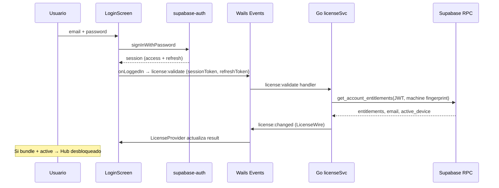
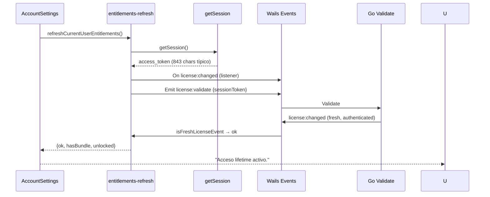
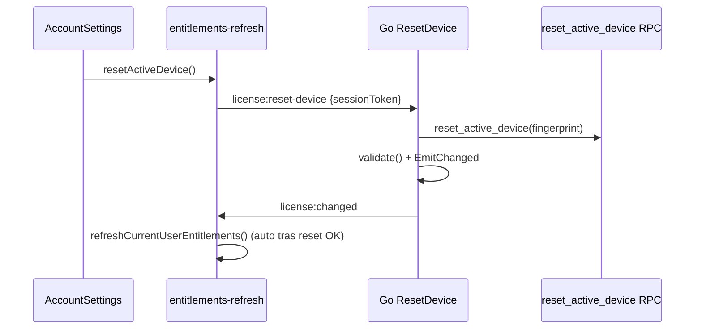

# Fase 2G — Licencia, revalidación post-pago y smoke GUI

> **Propósito:** Spec técnico definitivo del trabajo realizado el **2026-07-09** para cerrar Fase 2G: flujo post-pago Polar → revalidación en desktop → Hub desbloqueado, fixes de dev (`wails3 dev`), diagnóstico en UI y smoke GUI PASS.

**Última actualización:** 2026-07-09  
**Estado:** ✅ Fase 2G cerrada (smoke GUI PASS). Pendiente: Fase 2H (production readiness).  
**Relacionado:** `docs/superpowers/plans/2026-07-09-fase-2-polar-integration.md` §2G, `docs/current-plan.md` nota FASE-2G-SMOKE, `docs/license-service-contract.md`, `docs/auth-ui-flow.md`

---

## 1. Resumen ejecutivo

Tras un checkout Polar sandbox y el webhook `order.paid`, el usuario debe poder volver a Vantare, iniciar sesión y **revalidar** su licencia sin deep links ni polling agresivo. La UI expone:

- Paywall: “Ya he pagado, comprobar acceso”
- Ajustes → Cuenta: “Actualizar estado de licencia” y “Restablecer PC”

El **backend Go** es la fuente de verdad de entitlements (RPC Supabase `get_account_entitlements`). El frontend **no** simula premium; solo emite eventos Wails y muestra el resultado de `license:changed`.

**Smoke GUI PASS (2026-07-09):**

| Campo | Valor verificado |
|--------|------------------|
| Usuario | `fase2g.smoke.1783629293344@gmail.com` |
| Estado | `active` |
| Entitlements | `["bundle"]` |
| deviceOK | `true` |
| Runtime | `mock_runtime=false` (Go real, no mock Vite) |
| Sesión | `tokenLen=843` |
| UI | “Acceso lifetime activo.” |

Credenciales smoke guardadas en `%TEMP%\vantare-fase2g-state.json` (gitignored, solo local).

---

## 2. Arquitectura del flujo de licencia

```
┌─────────────────────────────────────────────────────────────────────────┐
│                         Frontend (React / WebView2)                      │
│                                                                          │
│  LoginScreen ──onLoggedIn──► Events.Emit("license:validate", {          │
│                                 sessionToken, refreshToken })              │
│                                                                          │
│  LicenseProvider ◄── Events.On("license:changed")                       │
│       │ emit license:validate {} @ 500ms (mount)                         │
│       │ clearLicense() on logout                                         │
│       └── useLicense() → LicenseGate / Paywall / Hub                     │
│                                                                          │
│  LicenseBridge (HubApp) ── getSession() ──► license:validate c/token    │
│                                                                          │
│  entitlements-refresh.ts                                                 │
│    refreshCurrentUserEntitlements()                                      │
│      → getSession() → Emit license:validate → await license:changed      │
│    resetActiveDevice()                                                   │
│      → getSession() → Emit license:reset-device → await license:changed  │
│                                                                          │
│  AccountSettings ── botones refresh / reset ──► entitlements-refresh     │
│  LicenseDiagnosticsPanel (solo DEV) ── ring buffer + copiar reporte        │
└───────────────────────────────┬─────────────────────────────────────────┘
                                │ Wails Events (IPC)
┌───────────────────────────────┴─────────────────────────────────────────┐
│                         Backend (Go / cmd/vantare)                         │
│                                                                          │
│  main.go handlers:                                                       │
│    license:validate  → licenseSvc.Validate() → EmitChanged internally    │
│    license:reset-device → licenseSvc.ResetDevice() → re-validate + emit  │
│    auth:session (opcional) → persiste tokens en WebView vía frontend     │
│                                                                          │
│  internal/license.Service                                                │
│    Validate(ctx, sessionToken) → RPC get_account_entitlements + fingerprint│
│    ResetDevice(ctx, sessionToken) → RPC reset_active_device + Validate   │
│    EmitChanged(res) → license:changed con LicenseWire (JSON-friendly)    │
└───────────────────────────────┬─────────────────────────────────────────┘
                                │ HTTPS + JWT (session token)
┌───────────────────────────────┴─────────────────────────────────────────┐
│              Supabase (proyecto oficial ombjshwzqgeisazijduq)            │
│                                                                          │
│  user_entitlements (bundle, active, Polar lifetime)                      │
│  RPC get_account_entitlements(session, fingerprint_hash)                 │
│  RPC reset_active_device(session, fingerprint_hash)                       │
│  billing-webhook (Polar order.paid) → escribe entitlements               │
└─────────────────────────────────────────────────────────────────────────┘
```

### 2.1 Secuencia: login email + primera validación



### 2.2 Secuencia: “Actualizar estado de licencia” (Fase 2G)



### 2.3 Secuencia: restablecer PC (device binding)



---

## 3. Contrato de eventos Wails

### 3.1 Eventos frontend → Go

| Evento | Payload | Handler |
|--------|---------|---------|
| `license:validate` | `{ sessionToken?: string, refreshToken?: string }` | `cmd/vantare/main.go` → `licenseSvc.Validate` |
| `license:reset-device` | `{ sessionToken: string }` | `main.go` → `licenseSvc.ResetDevice` |

**Importante:** `Validate()` ya emite `license:changed` internamente. El handler **no** debe re-emitir (evita carreras y duplicados).

### 3.2 Eventos Go → frontend

| Evento | Payload | Consumidores |
|--------|---------|--------------|
| `license:changed` | `LicenseWire` (ver §4) | `LicenseProvider`, `entitlements-refresh` listeners |
| `license:error` | `{ message: string }` | `entitlements-refresh`, loading timeout |
| `auth:session` | `{ access_token, refresh_token }` | `LoginScreen` / OAuth → `setSupabaseSession()` |

### 3.3 LicenseWire (Go → TypeScript)

Definido en `internal/license/types.go`, consumido como `LicenseResult` en `frontend/src/lib/license-types.ts`.

```go
type LicenseWire struct {
    State         string        `json:"state"`
    Entitlements  []Entitlement `json:"entitlements"`
    UserID        string        `json:"userId"`
    Email         string        `json:"email"`
    DeviceOK      bool          `json:"deviceOK"`
    GraceEndsAt   *time.Time    `json:"graceEndsAt,omitempty"`
    LastValidated string        `json:"lastValidated,omitempty"` // RFC3339Nano
    Error         string        `json:"error,omitempty"`
}
```

**Cambio 2026-07-09:** `lastValidated` pasó de `time.Time` a **string RFC3339**. Motivo: WebView2/Wails a veces serializaba `time.Time` como objeto opaco `{}`; el frontend no podía parsearlo y `entitlements-refresh` ignoraba el evento → timeout 15s.

`EmitChanged()` rellena `lastValidated` con `time.Now().UTC()` si el `Result` interno lo trae vacío.

### 3.4 Estados de licencia (`state`)

| State | Significado UI | Premium (`bundle`) |
|-------|----------------|-------------------|
| `anonymous` | LoginScreen | No |
| `authenticated-no-entitlement` | Hub free / paywall | No |
| `active` | Hub completo | Sí (si `bundle` ∈ entitlements) |
| `grace` | Hub con aviso grace | Sí |
| `expired` | Paywall blocker | No |
| `device-limit` | Paywall / mensaje device | No (aunque tenga bundle en BD) |
| `unconfigured` | UnconfiguredScreen | N/A (error config Supabase en Go) |

**Premium desbloqueado** (`isPremiumUnlocked`):

```typescript
entitlements includes "bundle"
AND state in ("active", "grace")
AND state !== "device-limit"
```

---

## 4. Módulos frontend (detalle)

### 4.1 `LicenseProvider` (`frontend/src/lib/license.tsx`)

- Monta listener `license:changed` / `license:error`.
- A los **500 ms** emite `license:validate {}` (sin token) para desbloquear loading si el bridge IPC tarda.
- A los **3000 ms** safety timeout: `loading=false` + retry `license:validate {}`.
- **Anti-regresión:** si `prev.state !== "anonymous"` y llega `anonymous`, **ignora** el evento (evita que el mount vacío pise un login OAuth/email exitoso).
- `clearLicense()`: fuerza estado anonymous en contexto (logout); usado tras `signOut()` en AccountSettings.

### 4.2 `LicenseBridge` (`frontend/src/hub/pages/HubApp.tsx`)

- Tras mount, `getSession()` del WebView.
- Si hay `access_token`, emite `license:validate { sessionToken }`.
- Si no hay sesión, **no** emite (evita carrera con OAuth callback).
- No bloquea el render del gate.

### 4.3 `entitlements-refresh.ts`

Funciones públicas para Fase 2G (paywall + ajustes):

| Función | Retorno ok | Retorno error |
|---------|------------|---------------|
| `refreshCurrentUserEntitlements()` | `{ ok, license, hasBundle, unlocked }` | `login_required`, `timeout`, `validation_error` |
| `resetActiveDevice()` | `{ ok: true }` | `login_required`, `rate_limit`, `error` |

**Correlación de eventos** (`isFreshLicenseEvent`):

1. Rechaza `anonymous` cuando `requireAuthenticated: true`.
2. Si `lastValidated` parseable (ISO string), rechaza eventos con timestamp **anterior** a `requestedAfterMs - 250ms` (anti-stale).
3. Si `lastValidated` ausente o no parseable, acepta con `requireTimestamp: false` (modo actual en refresh/reset).

**Timeouts:** 15 s por defecto (`DEFAULT_TIMEOUT_MS`).

**Dependencia crítica:** requiere **runtime Wails real**. Si Vite aliasa el mock, `license:validate` nunca llega a Go (ver §6).

### 4.4 `AccountSettings` (`frontend/src/hub/settings/AccountSettings.tsx`)

Botones:

- **Actualizar estado de licencia** → `refreshCurrentUserEntitlements()`
- **Restablecer PC** → `resetActiveDevice()` + refresh automático si OK
- **Cerrar sesión** → `signOut()` + `clearLicense()`

Mensajes de error incluyen **motivo técnico** en segunda línea (español, para depuración sin consola):

| Reason | Texto auxiliar |
|--------|----------------|
| `login_required` | Sin sesión Supabase en WebView |
| `timeout` | Backend Go no respondió con license:changed |
| `validation_error` | license:error desde Go/Supabase |
| reset `error` | Timeout o error tras license:reset-device |

### 4.5 Diagnóstico en UI (solo DEV)

| Archivo | Rol |
|---------|-----|
| `license-debug.ts` | `licenseDebug` / `licenseDebugWarn` → consola + ring buffer |
| `license-debug-log.ts` | Buffer 50 entradas, `isWailsRuntimeMockActive()`, `formatLicenseDebugReport()` |
| `LicenseDiagnosticsPanel.tsx` | Panel amarillo en Ajustes: runtime, sesión Supabase, licencia UI, log, copiar |

**Detección mock:** `wails-runtime-mock.ts` llama `setWailsRuntimeMockActive(true)` al cargar. Si el panel muestra `MOCK (test@example.com)`, el dev server **no** está usando Go.

**Reporte copiable** (ejemplo PASS):

```
=== Vantare license diagnóstico ===
mock_runtime=false
license={"state":"active","email":"fase2g.smoke....","entitlements":["bundle"],...}
--- eventos recientes ---
...
```

---

## 5. Backend Go (detalle)

### 5.1 Wiring (`cmd/vantare/main.go`)

- `licenseSvc` recibe Supabase URL/anon vía `generate_supabase_config.ps1` → `supabase_build.go` (ldflags/env compile-time).
- Sin URL/key: modo offline/unconfigured (log: `license: supabase env vars missing`).

Handlers loguean (2026-07-09):

```
license:validate request tokenLen=N refreshLen=M
license:validate result state=... email=... deviceOK=... entitlements=[...] err=...
license:reset-device request tokenLen=N
license:reset-device ok | license:reset-device error: ...
```

### 5.2 `internal/license/service.go`

- `Validate`: fingerprint máquina → RPC → `fromSupabase` → `EmitChanged`.
- `ResetDevice`: RPC `reset_active_device` → `validate` (sin doble emit en Validate) → `EmitChanged`.
- `fromSupabase`: si `active_device != fingerprint` → `state=device-limit`, `deviceOK=false`.
- Cache local solo en `state=active` en este dispositivo (device-limit no se cachea).

### 5.3 Fingerprint

Producción: `MachineFingerprint` (hash estable del PC).  
Diagnóstico: `tools/print-fingerprint/` (herramienta local, ignorada en watch de `build/config.yml`).

**Bug histórico smoke:** scripts de diagnóstico dejaron `fingerprint_hash = smoke-fp-test-2g` en BD en lugar de la huella real → Go devolvía `device-limit` con bundle en entitlements.

---

## 6. Bugs encontrados y fixes (2026-07-09)

### 6.1 CRÍTICO — Vite aliasaba mock en todo `dev`

**Síntoma:**

- Email `test@example.com` en Ajustes
- Entitlements `["overlays"]` sin `bundle`
- “Sin acceso premium por ahora.”
- Reset PC → timeout (mock no implementaba `license:reset-device` con respuesta)

**Causa:** `frontend/vite.config.ts` tenía:

```typescript
if (!isProduction) {
  alias["@wailsio/runtime"] = wailsMockPath; // SIEMPRE en dev
}
```

**Fix:**

```typescript
const runtimeMock = process.env.VITE_RUNTIME_MOCK;
if (!isProduction && (runtimeMock === "topbar" || runtimeMock === "mock" || runtimeMock === "calendar")) {
  alias["@wailsio/runtime"] = ...;
}
```

| Modo | Variable | Runtime |
|------|----------|---------|
| `wails3 dev` | (ninguna) | `@wailsio/runtime` real → Go |
| Topbar harness | `VITE_RUNTIME_MOCK=topbar` | `wails-runtime-topbar-mock.ts` |
| Calendar harness | `vite.calendar-harness.config.ts` | `wails-runtime-mock.ts` |

`pnpm build` (production) nunca usa mock.

### 6.2 `lastValidated` no parseable en frontend

**Síntoma:** refresh/reset timeout 15s aunque Go validaba bien.

**Causa:** `requireTimestamp: true` + `time.Time` como `{}` en WebView.

**Fix:** wire string RFC3339 + `parseLastValidatedMs()` + `requireTimestamp: false` en refresh/reset con filtro stale cuando sí hay timestamp.

### 6.3 Logout no deslogueaba visualmente

**Causa:** `LicenseProvider` ignoraba `anonymous` si ya había estado autenticado; `refresh()` tras `signOut()` revalidaba con token residual o estado pegado.

**Fix:** `clearLicense()` en `license.tsx`; `AccountSettings` llama `signOut()` + `clearLicense()`.

### 6.4 Bucle de rebuild en `wails3 dev`

**Causa:** `windows:build:native` crea/borra `cmd/vantare/supabase_build.go` y `wails_windows_amd64.syso` → watcher `.go` → rebuild ~5s en bucle.

**Fix:** `build/config.yml` ignora esos paths en `dev_mode.file`.

### 6.5 Procesos duplicados en puerto 9245

**Fix:** `tools/start-wails-dev.ps1` mata `vantare`/`wails3` previos antes de arrancar.

### 6.6 Login email sin `refreshToken` en validate

**Fix:** `LoginScreen` pasa `{ accessToken, refreshToken }`; `HubApp` emite ambos en `license:validate` para que `auth:session` persista sesión en WebView.

---

## 7. Herramientas de desarrollo

### 7.1 Arranque recomendado

```powershell
# Desde vantare-v2/
powershell -NoProfile -ExecutionPolicy Bypass -File tools\start-wails-dev.ps1
```

Hace:

1. Mata procesos `vantare`/`wails3` existentes
2. `VANTARE_SUPABASE_URL=https://ombjshwzqgeisazijduq.supabase.co`
3. Lee `VITE_SUPABASE_ANON_KEY` de `frontend/.env.local`
4. `generate_supabase_config.ps1` → `cmd/vantare/supabase_build.go`
5. `wails3 dev -config ./build/config.yml -port 9245`

### 7.2 Terminal visible (logs Go)

```powershell
powershell -File tools\start-wails-dev-visible.ps1
```

Abre PowerShell **en ventana nueva** que no se oculta tras Cursor.

### 7.3 Verificación sin consola ni terminal

1. Login con usuario smoke
2. Ajustes → Cuenta → panel **“Diagnóstico licencia (solo dev)”**
3. Confirmar `Runtime: Wails real (Go)`
4. Pulsar **Actualizar estado de licencia**
5. **Copiar diagnóstico** y pegar en chat/issue

---

## 8. Smoke test Fase 2G (procedimiento)

### 8.1 Prerrequisitos

- Supabase proyecto **ombjshwzqgeisazijduq** (no `olhwhfaczmrmooeaoqqf`)
- `frontend/.env.local` con `VITE_SUPABASE_URL` y `VITE_SUPABASE_ANON_KEY`
- Usuario con `user_entitlements`: `product_key=bundle`, `status=active`, provider Polar
- Webhook `order.paid` procesado para ese usuario
- `device binding`: fingerprint en BD = huella real del PC (o reset previo)

### 8.2 Pasos

1. `tools\start-wails-dev.ps1`
2. Login: `fase2g.smoke.1783629293344@gmail.com` / ver `%TEMP%\vantare-fase2g-state.json`
3. Hub accesible (no paywall permanente)
4. Ajustes → email correcto (no `test@example.com`)
5. **Actualizar estado de licencia** → “Acceso lifetime activo.”
6. Diagnóstico: `mock_runtime=false`, `unlocked=true`

### 8.3 Criterios PASS / FAIL

| Check | PASS |
|-------|------|
| Runtime | `Wails real (Go)` |
| Email UI | email smoke real |
| state | `active` |
| entitlements | incluye `bundle` |
| deviceOK | `true` |
| refresh | `hasBundle=true`, `unlocked=true` |
| Mensaje | lifetime activo o equivalente |

| FAIL típico | Causa probable |
|-------------|----------------|
| `test@example.com` | Mock Vite activo |
| `device-limit` + bundle | Fingerprint BD ≠ PC |
| `login_required` en refresh | `getSession()` vacío en WebView |
| timeout 15s | Go sin Supabase config o mock activo |
| `anonymous` tras login | token no llegó a `license:validate` |

---

## 9. Inventario de archivos tocados (2026-07-09)

### Frontend

| Archivo | Cambio |
|---------|--------|
| `frontend/vite.config.ts` | Mock solo con `VITE_RUNTIME_MOCK` |
| `frontend/src/lib/entitlements-refresh.ts` | Refresh/reset async, correlación, logs |
| `frontend/src/lib/entitlements-refresh.test.ts` | Tests correlación + parseLastValidatedMs |
| `frontend/src/lib/license.tsx` | `clearLicense`, logs, anti-regresión anonymous |
| `frontend/src/lib/license.test.tsx` | Tests clearLicense / standalone |
| `frontend/src/lib/license-debug.ts` | **Nuevo** — logging unificado |
| `frontend/src/lib/license-debug-log.ts` | **Nuevo** — ring buffer + mock flag |
| `frontend/src/lib/wails-runtime-mock.ts` | Warn mock, reset-device mock, flag |
| `frontend/src/hub/settings/AccountSettings.tsx` | Motivos error, diagnóstico |
| `frontend/src/hub/settings/AccountSettings.test.tsx` | Ajustes tests + getSession mock |
| `frontend/src/hub/settings/LicenseDiagnosticsPanel.tsx` | **Nuevo** — panel DEV |
| `frontend/src/hub/pages/HubApp.tsx` | LicenseBridge logs |
| `frontend/src/hub/auth/LoginScreen.tsx` | Tokens access+refresh en login |
| `frontend/src/i18n/locales/{es,en,it,pt}.ts` | Strings reset/refresh (corte previo) |

### Go

| Archivo | Cambio |
|---------|--------|
| `internal/license/types.go` | `LastValidated` string en wire |
| `internal/license/service.go` | `EmitChanged` rellena timestamp |
| `internal/license/wire_test.go` | Asserts string RFC3339 |
| `internal/license/emitter_test.go` | Assert lastValidated en wire |
| `cmd/vantare/main.go` | Logs ampliados validate/reset |

### Build / tools

| Archivo | Cambio |
|---------|--------|
| `build/config.yml` | Ignore `supabase_build.go`, `.syso`, print-fingerprint |
| `tools/start-wails-dev.ps1` | Kill previos + env Supabase |
| `tools/start-wails-dev-visible.ps1` | **Nuevo** — ventana visible |
| `tools/generate_supabase_config.ps1` | (existente) embed URL/anon en build |

### Docs

| Archivo | Cambio |
|---------|--------|
| `docs/current-plan.md` | Nota FASE-2G-SMOKE ✅ |
| `docs/superpowers/plans/2026-07-09-fase-2-polar-integration.md` | §2G PASS |
| `docs/superpowers/specs/2026-07-09-fase-2g-licensing-revalidation-spec.md` | **Este documento** |

---

## 10. Tests y verificación automatizada

```powershell
# Go — paquete licencia
go test ./internal/license/...

# Frontend — módulos Fase 2G
pnpm --dir frontend test -- entitlements-refresh AccountSettings license

# Build frontend (production no incluye panel diagnóstico en bundle crítico; panel gated por import.meta.env.DEV)
pnpm --dir frontend build
```

**Última ejecución documentada (2026-07-09):** ambos PASS.

---

## 11. Decisiones de diseño

1. **Go valida; React muestra.** Nunca calcular premium solo en frontend sin `license:changed`.
2. **Dos canales de validate:** mount vacío (500ms) + bridge con sesión persistida. El anti-regresión anonymous evita que el vacío pise login.
3. **Refresh/reset son operaciones “request-response” sobre eventos**, no llamadas HTTP desde React a Supabase para entitlements.
4. **Diagnóstico en UI solo DEV** — no ensucia producción; `import.meta.env.DEV` gate en panel.
5. **Mock Wails opt-in** — harnesses visuales no deben romper `wails3 dev`.
6. **`BILLING_ENABLED=false` en dev** por defecto; checkout Polar es Fase 2F; revalidación (2G) es independiente del flag billing.

---

## 12. Riesgos restantes y Fase 2H

| Riesgo | Mitigación |
|--------|------------|
| CI/release sin `VANTARE_SUPABASE_*` | Secrets GitHub + `generate_supabase_config.ps1` en pipeline |
| Latencia webhook Polar post-checkout | UX “comprobar acceso” + reintentar; no polling agresivo en v1 |
| Device limit en reinstall | Botón reset PC + rate limit 24h en RPC |
| DevTools/terminal inaccesibles en Wails | Panel diagnóstico + copiar reporte |
| `BILLING_ENABLED` prod | Solo tras 2H: secrets prod, monitor webhooks |

**Siguiente fase:** 2H Production readiness (`VITE_BILLING_ENABLED=true` en release, secrets prod, smoke compra real mínima).

---

## 13. Glosario rápido

| Término | Significado |
|---------|-------------|
| `bundle` | Entitlement suite completa (premium) |
| `license:validate` | Pedir a Go que reconsulte Supabase |
| `license:changed` | Resultado de validación hacia UI |
| `LicenseBridge` | Recupera sesión persistida al abrir Hub |
| `isFreshLicenseEvent` | Filtra eventos viejos en refresh/reset |
| `mock_runtime` | `true` = frontend no habla con Go |

---

## 14. Referencias cruzadas

- Contrato RPC y estados: `docs/license-service-contract.md`
- Flujo auth UI: `docs/auth-ui-flow.md`
- Arquitectura licensing: `docs/licensing-auth-architecture.md`
- Plan Polar completo: `docs/superpowers/plans/2026-07-09-fase-2-polar-integration.md`
- Estado vivo del proyecto: `docs/current-plan.md` → FASE-2G-SMOKE