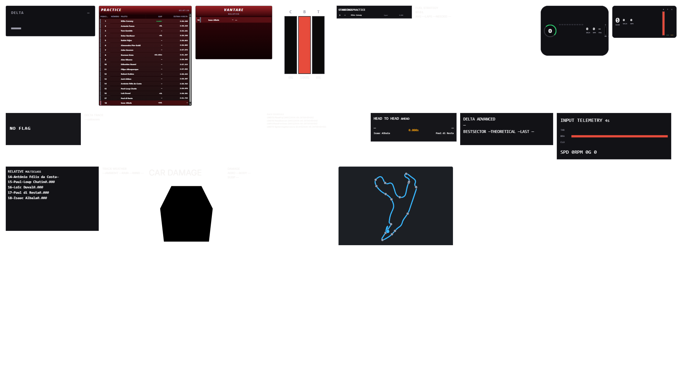

# ISA-893 — prueba Wails/LMU real del catálogo completo

## Resultado

La segunda revalidación física del HEAD corregido tras la review de PR #941
pasó el 2026-08-30 sobre `68580bac`. LMU permaneció abierto como PID 16792 en la escena
coordinada de Spa, práctica WEC 2026, con el jugador en el garaje y la IA
rodando. La prueba no interactuó con el juego ni sustituyó su telemetría por
fixtures, replay o datos sintéticos.

Antes de arrancar se esperó a que desapareciera `vantare-isa940.exe`. En el
hueco libre se lanzó únicamente esta build:

```text
binario  C:\tmp\vantare-isa893\vantare-v2\bin\vantare-isa893.exe
SHA-256  FF48984502D0A1E39A39F2B2594DA17A3EB62AD7761255FE8454A8E1A05D42A7
PID      10252
perfil   testdata/bench/huella-completo.json
CDP      127.0.0.1:9243
HTTP     127.0.0.1:29243
runtime  C:\tmp\vantare-isa893-runtime-review2-20260830
```

WebView2 confirmó `--webview-exe-name=vantare-isa893.exe`,
`--remote-debugging-port=9243` y el user-data propio
`C:\Users\isaac\AppData\Roaming\vantare-isa893.exe\EBWebView`.

## Evidencia CDP

`scripts/bench/huella-cdp.mjs` abrió el perfil por el evento productivo Wails
`overlay:start-active`. `wails-overlay-start.json` registra un target Hub y un
target Overlay, exactamente 20 frames, 0 long tasks durante la ventana de 10 s
y los renderer PID 22688 y 28068.

`capture-wails-v2.mjs` esperó el catálogo completo, exigió el selector
`[data-widget-renderer="<tipo>"]` y distinguió explícitamente frame montado,
renderer real y ocultación legítima por fuente. Falló cerrado ante frame sin
dimensiones, renderer ausente sin justificación, error de renderer,
diagnóstico de autoridad o ausencia de frames V2 live. El resultado versionado
es:

```text
frames esperados                20
frames montados                 20
renderers reales                19
ocultos por fuente               1 (engineer-radio)
montados sin renderer ni causa   0
errores de renderer              0
diagnósticos de autoridad        0
frames V2 live decodificados   246
parse p50                    0,4 ms
parse p99                    0,7 ms
```

No hubo una presentación de Engineer durante la ventana. `engineer-radio`
quedó correctamente `hidden-by-source`: frame montado, texto vacío, sin
renderer, error ni diagnóstico. No se generó ni inyectó un mensaje artificial.
Los otros 19 widgets sí expusieron su renderer productivo exacto.

Los 20 códigos observados, en el orden del perfil, fueron:

```text
delta
standings
relative
pedals
broadcast-tower
fuel-strategy
pedals-telemetry
pedals-telemetry-compact
racing-flags
delta-trace
race-schedule
head-to-head
delta-advanced
input-telemetry
multiclass-relative
track-weather
car-damage-visual
car-damage-numbers
engineer-radio
track-map
```

El diagnóstico conservó también 232 frames del comparador histórico y 685
diferencias shadow. Esas métricas no fueron fallback ni autoridad visual: la
sonda verificó que ningún widget presentó un diagnóstico de autoridad, que 19
renderizaron desde sus fuentes V2/auxiliares y que `engineer-radio` quedó
oculto por ausencia real de su fuente.

## Artefactos

| Archivo | SHA-256 | Contenido |
|---|---|---|
| `wails-overlay-start.json` | `806B340E5F9C876C7F162B1D5336187D98AC08ABE44691D4338D72349B682716` | Apertura Wails, targets y 20 frames. |
| `wails-v2-live.json` | `BB97654ECC5967CBCD3D241D97D2A84DCD650C0CAC1E83C014C7338ABA9E2A58` | Montaje, renderer real, ocultación por fuente y diagnóstico V2. |
| `wails-v2-live.png` | `F90BC23A4788F9067EA93DEA537FB927D529367E00BBD0D56C792A9E9D396DCF` | Captura del overlay con `engineer-radio` oculto. |
| `capture-wails-v2.mjs` | versionado junto a la evidencia | Sonda reproducible fail-closed por renderer. |



## Cierre e higiene

El helper CDP devolvió literalmente:

```json
{"schema":"vantare.huella.cdp.v1","action":"app-quit","requested":true}
```

Después del cierre, PID 10252 no existía y el puerto 9243 no tenía listener.
No quedó ningún proceso `vantare*`; LMU PID 16792 seguía vivo. No se esperó ni
se cerró `PresentMon-x64`, y no se tocó ningún proceso ajeno.
