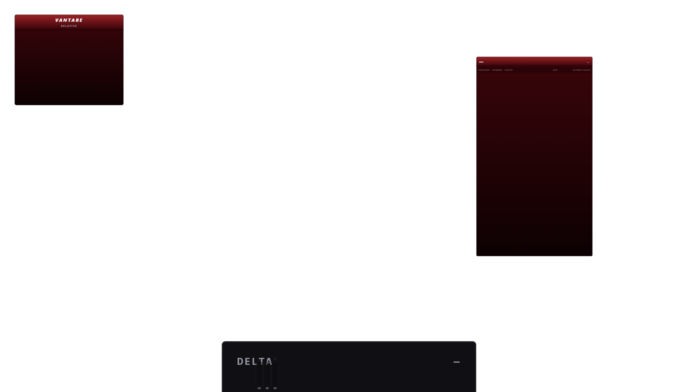

# ISA-896 — lifecycle seguro ante StrictMode y remount

## Antes y después

Antes, `CompositeApp`, `ObsOverlayApp` y `StudioRoute` construían recursos con
vida de montaje mediante `useMemo`, pero sus efectos los disponían en cleanup.
El segundo setup de StrictMode reutilizaba esa misma instancia ya dispuesta.

Ahora cada efecto crea una generación completa y destruye únicamente esa
generación. Desktop y OBS renuevan store V2, coordinador, shadow runtime,
presentaciones, adapters y transporte. Studio renueva su coordinador/store
derivado, store V2, pull y adapters internos. Los recursos inyectados en Studio
siguen siendo propiedad externa y no se disponen aquí.

## Regresión roja sobre Nightly

Commit `a0e4677e` antes de la corrección, con el fixture real
`internal/telemetry/projection/overlayv2/testdata/overlay_v2_1.golden.json`:

```text
FAIL frontend/src/overlay/CompositeApp.test.tsx
OverlayFrameV2ContractError: overlay-frame-v2:invalid-contract:disposed
at OverlayFrameV2Store.subscribe (overlay-frame-v2-store.ts:90)

FAIL frontend/src/overlay/ObsOverlayApp.test.tsx
OverlayFrameV2ContractError: overlay-frame-v2:invalid-contract:disposed
at OverlayFrameV2Store.subscribe (overlay-frame-v2-store.ts:90)

FAIL frontend/src/hub/overlay-studio/StudioRoute.test.tsx
AssertionError: expected 0 to be greater than 0
```

Después del corte, los tres ficheros focales pasan: `3 passed`, `32 passed`.
Las pruebas comprueban frame pintado y ausencia del error disposed; Desktop
mantiene una sesión pull activa, OBS tres streams SSE activos y Studio acepta
un publish posterior al doble setup y ejecuta el callback de repintado.

## Wails real y remount

Build ejecutada:

```text
go build -o bin/vantare-isa896.exe ./cmd/vantare
Process exited with code 0
```

Se lanzó esa build con `VANTARE_WEBVIEW_DEBUG_PORT=9240`. El nombre propio del
ejecutable creó el user-data WebView2 separado
`vantare-isa896.exe/EBWebView`. El hub aislado no tenía sesión de usuario, así
que desde su propia página Wails se emitió por CDP el mismo evento backend
`overlay:start-active` que usa la UI. No se leyó ni copió ninguna credencial.

La primera ventana de overlay tuvo target CDP
`4C0EB119A648DD4C03180A02C8EE3D86` y cuatro
`[data-testid="runtime-widget-frame"]`. Tras `overlay:stop`, `/json/list`
dejó de mostrar ese target. El segundo `overlay:start-active` creó el target
`1F2DCD1C1B06FFF22DA02A51EB49B9BE`; `Runtime.evaluate` devolvió:

```json
{
  "url": "http://wails.localhost/",
  "widgets": 4,
  "disposed": false
}
```

La captura se obtuvo con `Page.captureScreenshot`:



La prueba demuestra build Wails/WebView2 propia, apertura, cierre, ventana
nueva y repintado tras remount. No demuestra telemetría LMU live: LMU permaneció
intacto y los widgets mostraron placeholders por ausencia de datos activos. No
se necesitó mock ni replay. Al terminar se cerró el PID exacto de la build y el
puerto `9240` dejó de escuchar.

## Gates

```text
corepack pnpm --dir frontend test
Test Files  421 passed (421)
Tests       3194 passed (3194)
Duration    86.12s

corepack pnpm --dir frontend typecheck
> tsc -b --noEmit
Process exited with code 0

corepack pnpm --dir frontend build
> tsc -b && vite build
✓ 1091 modules transformed.
✓ built in 1.22s
Process exited with code 0

go build ./...
Process exited with code 0
```

El lint global conserva una deuda anterior y ajena al diff:

```text
corepack pnpm --dir frontend lint
frontend/src/overlay/widget-types/car-damage-numbers/car-damage-numbers-view-model-v2.ts
  93:39  error  '_damage' is defined but never used  @typescript-eslint/no-unused-vars
✖ 1 problem (1 error, 0 warnings)
```

El lint focal de `CompositeApp.tsx`, `ObsOverlayApp.tsx` y `StudioRoute.tsx`
termina con código `0`. La primera repetición global de tests encontró la flake
ajena `use-fonts-ready.test.tsx` (1 fallo y 3.193 éxitos); aislada pasó 3/3 y la
repetición completa posterior produjo los 3.194/3.194 anteriores. No se tocó ni
debilitó ese test.
