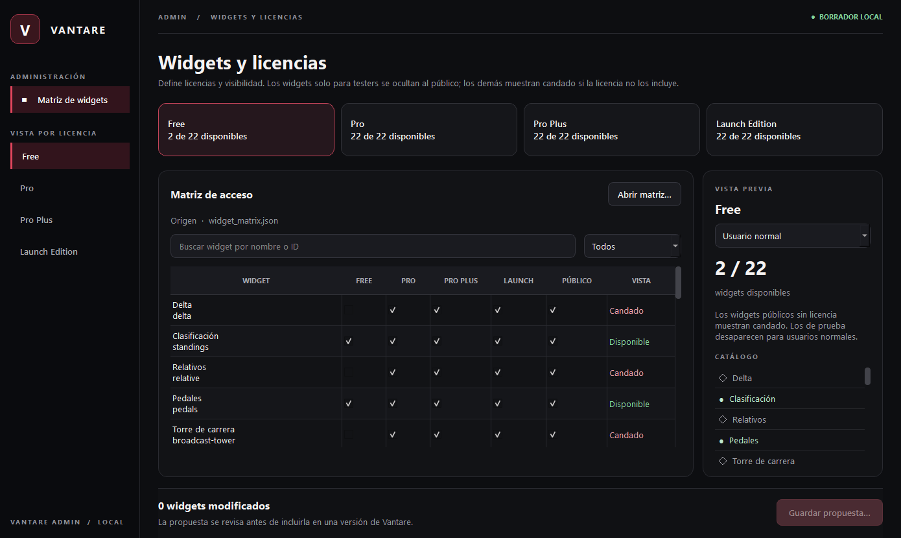

# Vantare Widget Admin

Aplicación de escritorio en C++ y Qt Widgets para preparar la matriz de widgets por licencia. No usa WebView2, no se conecta a Billing y no publica cambios remotos.



## Uso

1. Abre `internal/license/widget_matrix.json` desde la aplicación o pásalo como primer argumento.
2. Elige Free, Pro, Pro Plus o Launch Edition en la barra lateral o en sus tarjetas. La tabla permite marcar derechos y la columna «PÚBLICO»: desmarcarla deja el widget solo para testers y Owner, independientemente de su licencia. Busca y filtra widgets; el panel derecho permite comparar la vista de usuario normal con la de tester.
3. Pulsa «Guardar propuesta…». Se genera otro JSON; el archivo de origen queda intacto.
4. Revisa la propuesta en una issue/PR, reemplaza la matriz versionada con el contenido aprobado y ejecuta las pruebas de Go y frontend. Solo una versión posterior de Vantare aplica el cambio.

La matriz exige que Standings y Pedals sigan disponibles en Free, que Free sea un subconjunto de todas las licencias y que Pro sea un subconjunto de Pro Plus. Launch Edition se configura por separado. La visibilidad «Solo testers» oculta el widget del catálogo público y bloquea su uso nativamente para cuentas sin rol operativo verificado. Los widgets públicos sin derecho siguen visibles con candado. Las capacidades, roles y vencimientos los verifica el servicio de licencias; esta herramienta prepara una propuesta para la siguiente versión. La matriz incluida deja todos los widgets públicos hasta que Isaac señale cuáles son de prueba.

## Compilación en Windows

Requiere CMake 3.21+, Qt 6.8 con Widgets y Test, y el compilador C++ compatible con ese paquete de Qt. Ejemplo con Qt/MinGW:

```powershell
cmake -S tools/widget-admin -B C:\tmp\vantare-widget-admin-build -G 'MinGW Makefiles' -DCMAKE_PREFIX_PATH=C:\ruta\a\Qt\6.8.3\mingw_64 -DCMAKE_CXX_COMPILER=C:\ruta\a\mingw\bin\g++.exe -DCMAKE_MAKE_PROGRAM=C:\ruta\a\mingw\bin\mingw32-make.exe
cmake --build C:\tmp\vantare-widget-admin-build --parallel 4
ctest --test-dir C:\tmp\vantare-widget-admin-build --output-on-failure
```

Ejecuta `vantare-widget-admin.exe` desde el directorio de build con Qt y MinGW en `PATH`, o distribúyelo con los DLL y plugins requeridos mediante `windeployqt`. Este repositorio no empaqueta Qt ni distribuye esta herramienta. Antes de distribuir un binario, revisar las obligaciones de licencia de Qt aplicables a esa distribución.
